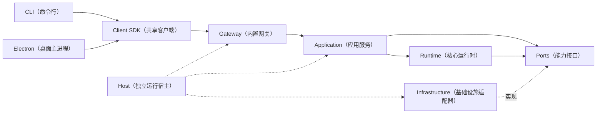
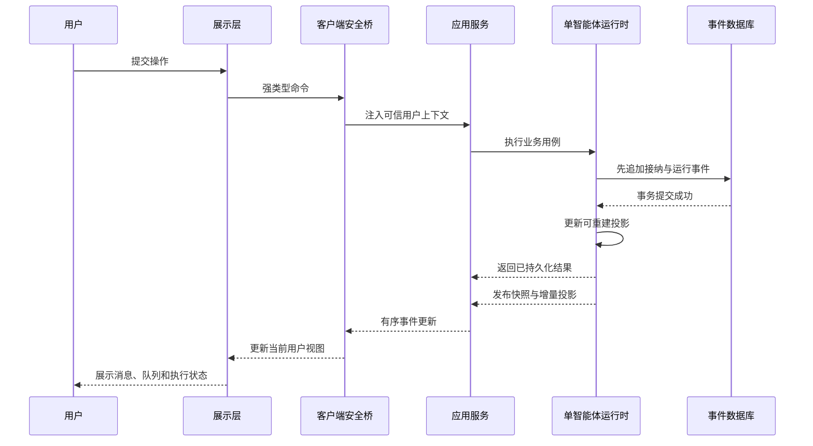
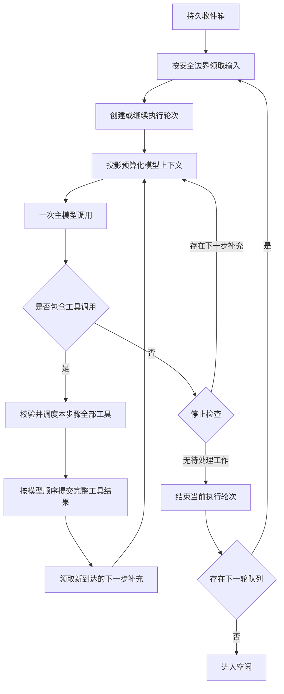
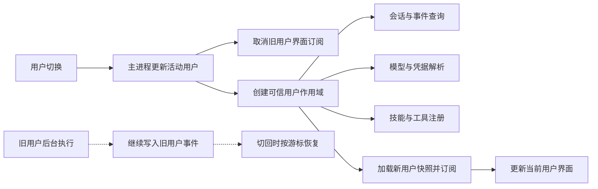
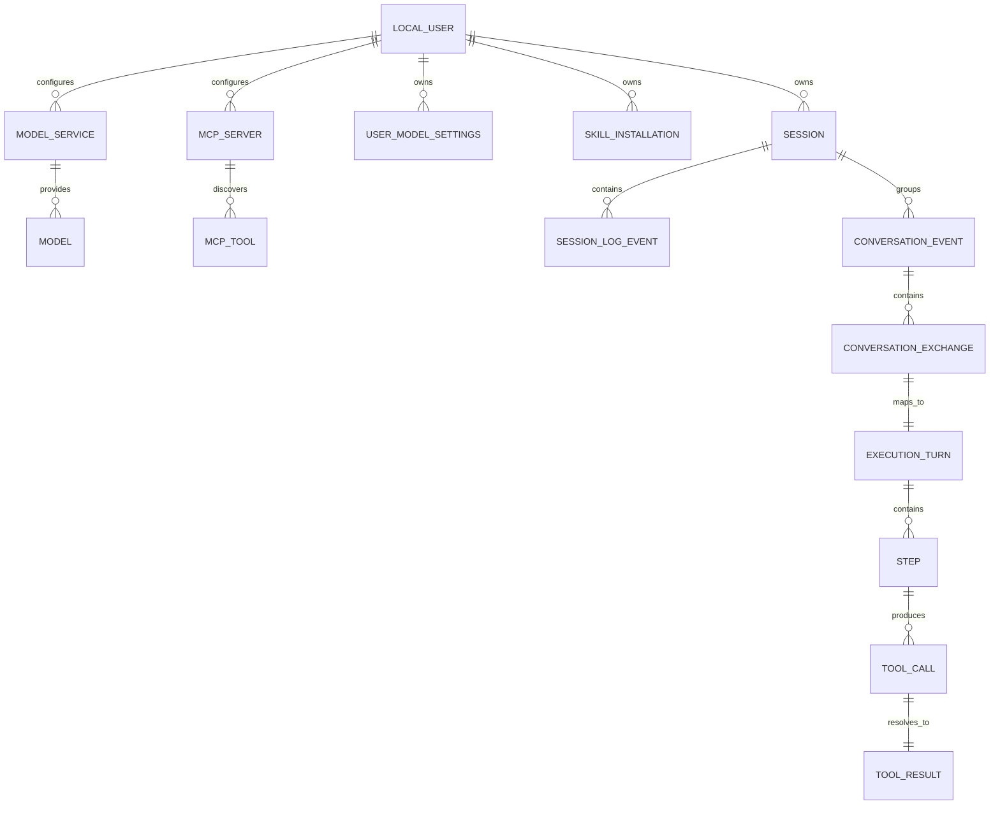
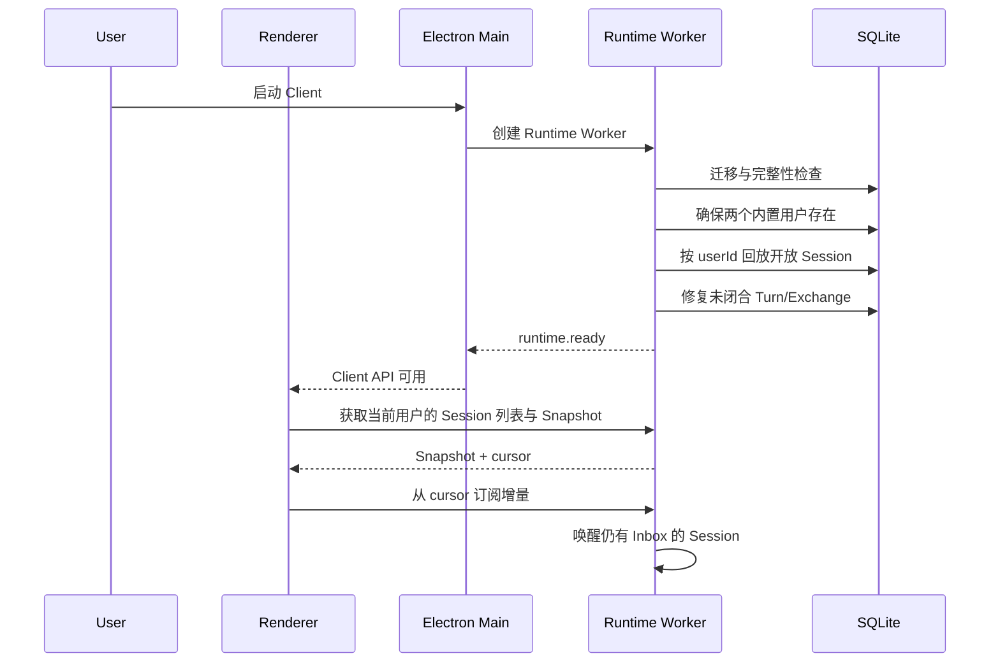
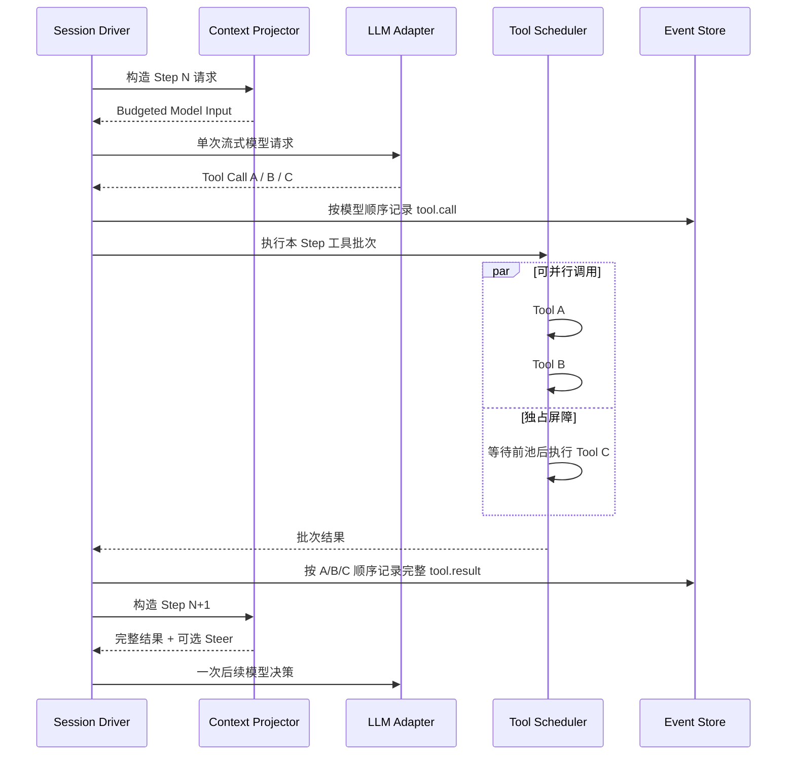

# Agent Client 完整技术解决方案

## 1. 文档定位

阶段 4.7.0 已定为 **Runtime（运行时）独立化**，首批交付 CLI（命令行）与 Electron（桌面）双客户端；Web（浏览器）和手机后续接入。详细设计见[4.7.0 开发架构设计](阶段方案/阶段4.7.0-Runtime独立化开发架构设计.md)。该阶段仍待实施。本文保留的桌面内 Worker（工作线程）、全局活动用户与 Main（主进程）直连流程是阶段 1～4.5.5 的历史实现基线；4.7.0 的目标启动、连接身份、服务生命周期与交付方式以本文第 6.0 节及阶段方案为准。

阶段 4.6.0 已实现补充见[思考模式重构设计方案](阶段方案/阶段4.6.0-思考模式重构设计方案.md)：将执行说明与 reasoning、工具状态分开；原生 phase 完整传递，缺失时保留兼容流式展示，消息用途与执行生命周期分别处理。复用已有推理开关，不引入自动纠正请求；连续沉默时仅在下一次已有主请求中临时提醒，并展示真实运行状态（详见 4.6.0 第 11 节）。核心实现及本地 HTTP/SSE 桌面回归已完成，真实模型体验待验证。

本文档定义 Agent Base Harness Client 的产品级技术解决方案，覆盖客户端技术路线、总体架构、进程边界、核心模块、数据与通信、关键业务流程、质量保障和开发阶段。

本文档负责回答“整个 Client 如何实现”；[`单Agent低上下文Runtime打造设计.md`](单Agent低上下文Runtime打造设计.md) 负责回答“单 Agent Runtime 的精确运行语义”。两者的关系如下：

```text
Client 技术解决方案
  ├─ 应用形态、技术栈和进程架构
  ├─ UI、Runtime、存储和系统能力如何连接
  ├─ 产品级业务流程和阶段交付
  └─ 引用 Runtime 设计中的核心不变量

单 Agent Runtime 设计
  ├─ Inbox、Turn、Step 和 Tool Call 语义
  ├─ Queue、Steer、队列项立刻介入、Inject 和 Cancel
  ├─ Event、Exchange、ExecutionTurn 和 Surface
  ├─ Context Budget、Compaction 和完整 Tool Result
  └─ 恢复、并发、usage 与属性测试
```

如果两份文档在 Runtime 细节上出现差异，以 Runtime 设计文档为准，并应同步修订本文档中的产品流程描述。

## 2. 项目背景

本项目从 4.7.0 起交付可独立安装的 Agent 服务、CLI（命令行客户端）与 Electron（桌面客户端）。服务内置网关、应用服务、核心 Runtime（运行时）与基础设施适配器；用户可以不启动桌面而运行任务。

Client 内部包含一个单 Agent Runtime，并内置两个可切换的本地用户。每个用户拥有独立的会话、模型配置、模型凭据、Skill、工具注册表、附件和运行统计。Runtime 需要在本地长期管理模型调用、工具执行、用户追加、软打断、取消、历史压缩、事件回放和崩溃恢复，同时为界面提供可重建的聊天、执行过程、队列和统计数据。

两个内置用户属于同一操作系统账号下的应用级身份，不是云端账号或强认证安全边界。数据采用单个 SQLite 数据库、同库同表的 `user_id` 字段隔离；敏感凭据继续使用操作系统 Credential Store，并按用户命名空间隔离。

项目主要借鉴三个来源：

- `reference_ui/`：只参考视觉设计、布局比例、组件形态和交互入口。
- DeepSeek Harness：参考 Agent Loop、Inbox、Turn/Step、工具并行、取消、事件日志和恢复机制。
- Agent Base：参考上下文去重、Session/Event 历史组织、压缩 Hook、Schema 校验和结果归一化。

参考项目不决定本项目最终形态。本项目必须以单 Agent、低上下文、少模型调用和 Client 产品体验为中心重新实现。

## 3. 建设目的

### 3.1 产品目的

- 提供完整的本地 Agent 对话和任务执行体验。
- 提供两个内置本地用户及清晰的用户切换入口。
- 切换用户后，会话、模型和 Agent 可使用的 Skill 完全按用户隔离。
- 让用户能够查看模型回答、工具步骤、排队任务和明确的停止状态。
- 支持模型服务配置、模型选择、工具或技能能力管理。
- 在应用刷新、关闭或异常退出后恢复会话与运行事实。
- 将复杂 Runtime 语义转化为清晰、可预测的客户端交互。

### 3.2 技术目的

- 用一次原生模型响应同时完成决策和表达，避免额外 Decider、Harness 和 Answer Generator。
- 用仅追加事件日志统一运行事实、UI 数据、恢复和审计。
- 用预算化 Context Projector 控制多轮会话的上下文增长。
- 用确定性的工具校验、调度和错误分类降低额外模型调用。
- 在同一 Session 内保持严格串行，同时允许不同 Session 和安全工具并行。
- 将 UI 与 Runtime 通过稳定契约隔离，避免 React 临时状态成为业务事实。
- 将 `userId` 作为所有用户私有数据和 Runtime 操作的必选作用域，阻止跨用户检索、配置引用和事件投影。

### 3.3 成功标准

- 纯文本问题只进行一次主模型调用。
- 工具任务遵守一次模型响应对应一个 Step 的规则。
- Queue、Steer、队列项立刻介入、Cancel 和恢复行为稳定且有自动化测试。
- 所有模型可见信息都能追溯到持久事件。
- UI 可从持久化 Snapshot 和增量事件完整重建。
- 当前 Turn 的工具结果在日志和模型 Surface 中逐字段一致。
- 长 ConversationEvent 经压缩后，单 Turn 上下文趋于稳定。
- Client 重启不会自动重放结果不确定的外部副作用。
- 任一用户无法通过 Session、历史工具、模型或 Skill 引用读取另一用户的数据和配置。
- 用户可以完成模型服务配置、连接测试、模型维护和默认模型选择，且新 Step 使用明确的模型配置快照。
- 用户可以完成 Skill 安装、校验、授权、启停和卸载，且只有当前用户已启用并满足权限的工具进入 Agent 上下文。

## 4. 方案边界

### 4.1 第一稳定版包含

- Electron 桌面应用壳，以及 4.7.0 独立服务与 CLI（命令行客户端）。
- 会话创建、切换、重命名和删除。
- 两个内置本地用户的切换和用户级数据隔离。
- 流式聊天和 Markdown 内容展示。
- 执行过程、Step、Tool Call/Result 和结束原因展示。
- Queue、Steer、队列项立刻介入、Cancel 以及队列项管理。
- 模型服务、模型和基础 Runtime 参数配置。
- 每个用户独立的模型服务、默认模型、Skill 安装/启用状态和授权引用。
- 单 Agent Tool Call Loop 与工具注册机制。
- 本地事件日志、Projection、崩溃修复和数据迁移。
- ConversationEvent/Exchange、历史检索和两级上下文压缩。
- 用户级通用 MCP Tool Bridge：stdio/Streamable HTTP、工具发现与审核、动态刷新、Credential、结果投影和有界重连。
- 可插拔长期记忆由外部 MCP 提供；阶段 4.5 先交付通用 MCP Tool Bridge，并以一个外部记忆 MCP 作为首个业务接入案例。
- usage、Context Breakdown、运行耗时和错误诊断。
- 基础工具权限、结构化用户交互和敏感配置保护。

### 4.2 第一稳定版不包含

- Worker、Subagent、多 Agent 路由和多 Agent 结果合并。
- 云端账号、登录注册、组织、计费和服务端会话同步。
- 工作流编排器或独立任务调度平台。
- 任意插件修改 Agent Loop 的能力。
- 外部副作用的无条件 exactly-once 承诺。
- Tool Result 自动截断、摘要或 Artifact 外溢。
- 在每次用户输入前调用额外模型做意图或历史相关性分类。

## 5. 技术选型

### 5.1 初始技术栈

| 层级         | 选择                                        | 作用与原因                                                                                                      |
| ------------ | ------------------------------------------- | --------------------------------------------------------------------------------------------------------------- |
| 客户端外壳   | Electron                                    | Runtime 原生使用 Node.js/TypeScript，可直接访问文件、进程、网络和本地数据库，避免引入 Rust 侧实现或额外 Sidecar |
| UI           | React + TypeScript                          | 与参考 UI 技术方向一致，适合流式聊天、执行轨迹和设置页组件化                                                    |
| 构建开发     | Vite                                        | 提供快速 Renderer 开发、资源构建和 TypeScript 前端集成                                                          |
| 样式         | Tailwind CSS + 少量语义化 CSS               | 便于按 `reference_ui` 复刻比例、间距和视觉状态，同时保留主题 token                                              |
| Runtime      | Node.js + TypeScript                        | 实现 Session Driver、Agent Loop、LLM Adapter、Tool Scheduler 和 Context Projector                               |
| Runtime 隔离 | Node Worker Thread                          | 让模型流、工具调度和同步 SQLite 短事务不阻塞 Electron 主进程与 Renderer                                         |
| 本地数据库   | 单个 SQLite                                 | 适合单机 Client、事务型事件追加、离线启动和低运维成本；用户私有表统一使用 `user_id`、复合约束和索引进行隔离     |
| Schema       | JSON Schema + Ajv                           | 统一校验 IPC、工具输入输出、配置和结构化模型结果                                                                |
| 测试         | Vitest + React Testing Library + Playwright | 分别覆盖单元/集成、UI 组件和桌面端关键流程                                                                      |
| 日志         | 结构化日志                                  | 使用稳定字段关联 Session、Turn、Step、Tool Call 和模型请求，支持本地诊断导出                                    |

具体依赖及版本在工程初始化时锁定。技术方案不依赖某个库的非标准私有能力，关键领域接口必须由项目自身定义。

### 5.2 为什么选择 Electron

本项目的核心能力依赖 Node.js：模型流式请求、工具执行、子进程、文件系统、本地 SQLite 和持久恢复。Electron 可以让这些能力与 React UI 在一个 TypeScript 工程中交付，并通过安全 IPC 明确隔离。

Electron 的主要成本是安装包体积、内存和安全面。方案通过以下方式控制：

- Renderer 禁止直接访问 Node.js。
- 开启 `contextIsolation`，关闭 `nodeIntegration`。
- Preload 只暴露白名单、强类型、可校验的 Client API。
- Runtime 放入 Worker，Electron Main 不承载长时间 Agent Loop。
- 使用严格 CSP，限制外部页面和任意脚本加载。
- 工具权限、文件范围和外部副作用在 Runtime 层再次校验。

如果后续部署约束证明 Electron 不适合，可以保留 Runtime 和领域契约，替换 Client Shell；该替换属于独立技术决策，不在第一阶段并行建设两套壳。

## 6. 总体技术架构

### 6.0 阶段 4.7.0 目标架构（待实施）



- 服务为独立 Node.js 进程，宿主主线程承载网关，服务工作线程承载应用服务、核心和数据库。Electron 不再创建 Runtime 工作线程或加载数据库原生模块。
- 首版提供本机 HTTP（超文本传输协议）命令/查询与 SSE（服务端事件流），桌面仍通过 Preload（安全桥）保护渲染进程。
- 身份按连接绑定；两个本地用户仍是同一操作系统账号的应用档案。取消全局活动用户，单个客户端切换不影响其他连接。
- 服务拥有任务，客户端断开不取消；关闭服务、取消指定轮次与退出客户端是三个不同操作。
- 保持既有事件日志、收件箱、工具调度、审批和恢复语义。接口独立不表示具备远程执行或云端多用户能力。
- 保留单源码包，通过独立构建清单产生服务 npm（Node 包分发）包和桌面产物；内部模块不强制分别发布。
- 第 6.1～6.5、7、8.1～8.3、10.1～10.2 中的桌面启动/全局身份流程保留作迁移依据；实现 4.7.0 时由阶段方案的新流程替代，其他领域不变量继续适用。

### 6.1 总体技术架构图

总体架构按“展示与交互、客户端接入、应用服务、单 Agent Runtime、数据与基础设施、外部能力”六个部分组织。进程边界只是这些职责的部署方式，不代替架构分层本身。


#### 6.1.1 图示内容说明

总体架构图首先表达系统由哪些层和组件组成，再表达它们之间的依赖关系：

1. **展示与交互层**面向用户，包含双用户切换、会话与聊天、执行过程与队列、模型、技能、MCP 与长期记忆设置。它只处理界面展示和交互意图，不直接访问 Runtime、数据库或密钥。
2. **客户端接入层**包含视图状态与事件订阅、预加载安全桥、主进程与应用生命周期。它负责把 Renderer 与本地 Node 能力隔离，并把用户操作转化为白名单、强类型的命令和查询。
3. **应用服务层**是 Client 用例入口，包含命令服务、查询与订阅服务、本地用户上下文、模型、Skill 和 MCP 管理服务。它负责用户切换、会话提交、取消、各类能力配置和订阅管理，并把可信 `userId` 注入所有 Runtime 操作。
4. **单 Agent Runtime 核心层**包含输入接纳与持久 Inbox、Session Driver 与 Turn/Step Loop、Context Projector 与 LLM Adapter、Tool Registry/Scheduler/Interaction、事件 Projection 与崩溃恢复。这一层实现设计文档定义的核心运行语义。
5. **数据与基础设施层**提供单一 SQLite Event Store、模型/Skill/MCP 配置 Repository、操作系统 Credential Store、Agent Skills 目录、MCP Client/Supervisor、附件目录、宿主机命令执行、日志、迁移和诊断。外部 MCP 自己持有的业务数据不进入 Client 核心模型。两个内置用户共享 SQLite 文件和表结构，但所有私有数据按 `user_id` 隔离。
6. **外部能力**包括大模型服务、本地与远程工具以及操作系统能力。它们只能通过 Runtime 中的适配器和权限边界被调用，不能被 Renderer 直接访问。

进程部署与上述职责对应：展示层运行在 Renderer；预加载桥和主进程承担客户端接入；应用服务、Runtime 核心和 SQLite 访问运行在独立 Node Worker；模型、工具和系统资源位于 Client 边界之外。图中的命令服务、查询与订阅服务是统一用例入口，模型管理和 Skill 管理是其内部独立业务组件，具体职责见 8.13 和 8.14。

### 6.2 架构组成与职责

| 架构部分         | 核心组件                                                                               | 主要职责                                                                         | 明确边界                                                              |
| ---------------- | -------------------------------------------------------------------------------------- | -------------------------------------------------------------------------------- | --------------------------------------------------------------------- |
| 展示与交互层     | 用户切换、会话聊天、执行过程、队列、设置                                               | 展示 Projection、收集用户意图、维护输入草稿等临时 UI 状态                        | 不访问数据库、密钥、模型或工具，不定义 Runtime 状态机                 |
| 客户端接入层     | View State、Preload、Electron Main                                                     | 安全 IPC、窗口与 Worker 生命周期、当前用户上下文、消息路由                       | 不执行 Agent Loop，不保存会话事实                                     |
| 应用服务层       | Command、Query、Subscription、Local User Context、Model/Skill/MCP Management     | 编排 Client 用例、校验 User Scope、管理各类能力生命周期、连接 UI 与 Runtime | 不在 Renderer 保存配置事实，不允许管理模块绕过 Provider/Tool 安全边界 |
| Runtime 核心层   | Admission、Inbox、Driver、Turn/Step、Context、LLM、Tool、Projection、Repair            | 执行单 Agent Runtime 的全部领域语义                                              | 不依赖 React，不直接处理窗口和视图组件                                |
| 数据与基础设施层 | SQLite、配置 Repository、Credential Store、Skill/附件目录、MCP、日志、Provider Adapter | 持久化、凭据、受管文件、外部协议、动态工具和诊断实现                          | 不决定 Agent 行为，不成为第二业务事实源                               |
| 外部能力         | 大模型、工具、操作系统能力                                                             | 提供模型推理和实际动作能力                                                       | 必须经过 Adapter、权限、Schema、超时和取消边界                        |

进程职责映射如下：

| 运行位置       | 承载职责                                            | 设计原因                                 |
| -------------- | --------------------------------------------------- | ---------------------------------------- |
| Renderer       | 展示与交互、临时视图状态                            | 保证界面响应，不授予 Node 和本地资源权限 |
| Preload        | 白名单强类型桥接                                    | 隔离 Renderer 与 Electron/Node 能力      |
| Electron Main  | 窗口、应用生命周期、活动用户、Worker 管理和消息转发 | 保持主进程轻量，不运行长时间 Agent 任务  |
| Runtime Worker | 应用服务、单 Agent Runtime、SQLite 和 Projection    | 模型流、工具和数据库工作不阻塞 UI/Main   |
| 外部环境       | Provider、工具、操作系统资源                        | 通过适配器与权限边界接入                 |

架构依赖原则是：上层可以依赖下层接口，下层不能反向依赖具体 UI；事件和 Projection 可以向上流动，但领域代码依赖不能向上穿透。

源码层同步建立物理依赖边界：React Renderer 独立放在顶层 `ui/`，Main、Preload、Worker、Runtime 和 Infrastructure 放在 `src/`。`ui/` 不得直接导入上述宿主实现，只能静态依赖 `src/client-contracts/` 中的 DTO、运行时 Schema 和纯投影逻辑；所有实际能力调用仍必须经过 `window.agentClient`、Preload 白名单桥和 Main/Worker 校验链。独立 UI TypeScript 配置不加载 Node 类型，构建前执行依赖边界扫描。

### 6.3 总体数据流

系统存在七条主要数据流：

1. **用户命令流**：用户操作 → 展示层 → Preload → Electron Main → Command Service → Local User Context → Runtime。该链路承载提交、Queue、Steer、Queue Item 提升、Cancel、用户切换和设置保存。
2. **Agent 执行流**：Input Admission 先持久化输入 → Session Driver 开启 Turn/Step → Context Projector 组装模型请求 → LLM Adapter 获得文本或 Tool Call → Tool Scheduler 执行 → 结果写入 Event Store → 进入下一 Step 或结束 Turn。
3. **事件投影流**：Runtime 事实写入 SQLite → Projection Service 按 seq 更新 Chat、Trajectory、Inbox 和 usage → Query/Subscription Service 发送 Snapshot 与增量 → Renderer 更新界面。
4. **用户隔离流**：Main 注入可信 `userId` → Local User Context 生成 `(userId, sessionId)` Scope → Repository、Model Registry、Tool Registry、Credential Reference 和历史检索都使用相同 Scope。
5. **模型配置流**：用户维护模型服务 → Credential Service 分离保存密钥 → Model Management 校验、测试连接并发现或手工维护模型 → 事务更新用户配置版本 → Model Registry 在下一个安全边界加载新快照。
6. **Skill 生命周期流**：用户导入或安装标准 Agent Skill → Skill Management 校验 `SKILL.md` 和目录边界并登记来源 → 当前用户确认后启用 → Runtime 在下一个安全边界更新 Skill Catalog → `capability_search` 与 MCP Catalog 同级返回轻量候选 → 模型选中后按需加载正文与资源；若指令要求执行脚本，则通过宿主机命令执行能力运行。
7. **MCP 能力流**：用户配置并测试 Server → MCP Client 分页发现工具 → 管理目录保存 Schema 与 digest → 用户逐项审核启用 → `capability_search` 与 Skill Catalog 同级返回 Server/工具轻量候选 → 模型选中后调用 `mcp_load`，下一 Step ToolCatalogSnapshot 暴露稳定完整 Tool Schema → 调用结果作为事件事实保存并有界投影。
8. **外部能力流**：Context/LLM Adapter 调用大模型；Tool Scheduler 调用当前用户已启用的本地、远程或 MCP 工具；审批、选择和表单通过 Interaction Event 返回展示层。

数据流的核心闭环是：

```text
用户意图
→ 强类型命令
→ 先持久化接纳
→ 单 Agent Runtime 决策与执行
→ 追加运行事件
→ 重建 Projection
→ 更新用户界面
```

### 6.4 核心技术难点与架构决策

| 核心难点                                   | 架构决策                                                                            | 解决的问题                                                 |
| ------------------------------------------ | ----------------------------------------------------------------------------------- | ---------------------------------------------------------- |
| Renderer 既要流畅又不能直接拥有本地权限    | Electron Main + Preload 白名单桥 + Runtime Worker                                   | 隔离 Node 能力，避免模型、工具和 SQLite 阻塞 UI            |
| 两个用户共享一个 SQLite 但不能串数据       | 所有私有表带 `user_id`，复合外键、作用域 Repository、负向测试                       | 隔离 Session、模型、Skill、附件、历史和 Projection         |
| 运行中追加、介入、软打断和取消容易产生竞态 | Durable Inbox + Session 单 Driver + 原子 Queue 提升 + 安全 Step 边界 + AbortSignal  | 保证 Queue、Promote、Steer、Cancel 的确定语义              |
| UI、恢复和模型历史容易形成多套事实         | Append-only Event Log + 可重建 Projection + Surface                                 | 统一运行事实，支持刷新和崩溃恢复                           |
| 长会话上下文持续增长                       | ConversationEvent/Exchange + Context Budget + Summary/raw tail                      | 降低重复上下文，保持历史可审计                             |
| Tool Result 可能很大但不能篡改             | 工具协议分页/范围控制，Runtime 完整保存和完整进入当前 Turn                          | 保证事实一致性并暴露协议设计问题                           |
| 多工具并发容易冲突和乱序                   | fail-closed 并发分类 + 有界并行池 + 独占屏障 + 顺序 commit                          | 降低延迟并维持确定事件顺序                                 |
| Worker 或应用崩溃后副作用状态不确定        | Event Repair + interrupted 终止事实 + 非 replay-safe 工具不自动重放                 | 防止重复发送、删除或其他外部副作用                         |
| Provider 流、Tool Call 和 usage 不统一     | LLM Adapter Contract + Provider Contract Test                                       | 保持 Agent Loop 与具体 Provider 解耦                       |
| 模型或 Skill 配置在执行中变化              | 用户级配置 revision + Step 启动快照 + 安全边界刷新 Registry                         | 防止同一 Step 前后使用不同模型、提示词或 Tool Schema       |
| 社区 Skill 可能携带脚本或危险指令          | 标准目录校验、来源提示、首次执行确认、宿主机命令权限、超时/取消、受控环境变量和审计 | 在保持 ModelScope/ClawHub 兼容性的同时明确“不构成安全沙箱” |

### 6.5 核心技术流程设计

#### 6.5.1 命令与事件投影闭环



Command 成功只表示持久事实已经接纳，不表示整个 Turn 已完成。UI 的最终状态来自 Event/Projection，而不是 Command 返回后自行推测。

#### 6.5.2 单 Agent Turn/Step 执行循环



一个 Step 等于一次模型请求及该响应产生的全部 Tool Call；同一批工具全部收敛后只产生一个后续 Step。

#### 6.5.3 双用户隔离与切换



切换用户不等于 Cancel。已经接纳的命令保留原 `userId`；旧用户可以继续后台运行，但其事件不能进入新用户当前视图。

#### 6.5.4 崩溃恢复

```text
Worker 异常退出
→ Electron Main 拉起新 Worker
→ SQLite 迁移与完整性检查
→ 按 (userId, sessionId) 回放开放运行
→ 未闭合 Turn/Exchange 标记 interrupted
→ 不自动重放结果不确定的副作用工具
→ 重建 Projection 与订阅 cursor
→ 继续合法的 next-turn Queue
```

本节只定义架构级关键闭环；Queue、Steer、Cancel、Interaction、Compaction 和配置变更的完整业务语义见第 10 章。

## 7. Client 与 Runtime 通信设计

### 7.1 通信类型

Client Bridge 只暴露三类操作：

1. Command：改变状态，例如提交消息、取消、删除队列项和保存配置。
2. Query：读取 Snapshot 或分页数据，例如会话列表、聊天历史和执行轨迹。
3. Subscription：订阅有序事件或 Projection 增量。

概念接口如下：

```ts
export interface AgentClientApi {
  command<TName extends CommandName>(
    name: TName,
    input: CommandInput<TName>,
  ): Promise<CommandResult<TName>>;

  query<TName extends QueryName>(
    name: TName,
    input: QueryInput<TName>,
  ): Promise<QueryResult<TName>>;

  subscribe(input: SubscribeInput, onEvent: (event: ClientProjectionEvent) => void): () => void;
}
```

模型与 Skill 管理同样使用上述固定 Contract，不通过 Renderer 直接读写数据库、密钥或 Skill 目录。V1 至少提供以下概念操作：

| 类型         | 模型管理                                                               | Skill 管理                                                           |
| ------------ | ---------------------------------------------------------------------- | -------------------------------------------------------------------- |
| Command      | 保存/启停/删除模型服务、测试连接、同步模型、手工维护模型、设置默认模型 | 安装/升级、启停、保存配置与授权、导出、卸载 Skill                    |
| Query        | 模型管理 Snapshot、服务详情、模型列表、连接测试结果                    | Skill 列表、安装状态、详情、`SKILL.md`、资源预览、运行环境与授权状态 |
| Subscription | `configuration.changed(model)`                                         | `configuration.changed(skill)`、安装进度与 Registry 刷新结果         |

文件选择由 Electron Main 调用系统选择器并返回一次性受控引用；Renderer 不向 Bridge 传入任意本地路径。API Key、Token 等已保存密钥只能查询“是否已配置”和脱敏状态，不能从 Credential Store 回读明文到 Renderer。

### 7.2 IPC 安全与一致性

- 所有 IPC 输入和输出必须通过 Schema 校验。
- Renderer 不能传入任意事件名、文件路径或可执行命令。
- Electron Main 维护当前活动 `userId`。除显式用户切换命令外，Renderer 不直接决定业务 Command 的用户作用域；Main/Bridge 将可信 User Context 注入 Worker 请求。
- 用户切换命令只能选择两个已注册的内置用户，不能通过任意 `userId` 构造隐藏用户或越权读取。
- 每个 Command 带 `requestId`；接纳用户输入的命令额外带 `idempotencyKey`。
- Command 返回“已接纳的持久事实”，不能只返回前端临时成功状态。
- 所有增量事件都带 `userId` 和递增 cursor/revision；Session 相关 Projection Event 额外带 `sessionId` 与 seq，配置事件额外带配置域与 revision。Renderer 只消费当前用户订阅的事件。
- Renderer 首次加载先读取 Snapshot，再从 Snapshot cursor 之后订阅增量。
- 如果检测到 cursor 断档，Renderer 丢弃局部 Projection 并重新获取 Snapshot，而不是猜测缺失状态。
- Worker 重启或 Renderer 刷新不改变 Command 和 Event 契约。
- 所有 Session、Event、模型、Skill 和附件 Query 都必须显式落入当前 User Context；不提供无用户作用域的业务查询。

## 8. 关键模块设计

### 8.1 Client Shell

职责：

- 管理窗口、应用单实例、系统托盘或菜单等客户端生命周期。
- 创建安全 BrowserWindow 和 Preload Bridge。
- 启动、监测和重启 Runtime Worker。
- 转发白名单 Command/Query 与 Projection Event。
- 维护当前活动用户，并在 Bridge 请求中注入可信 `userId`。
- 管理应用数据目录、日志目录和版本迁移入口。

不承担：Agent 决策、模型请求、工具调度或聊天状态计算。

### 8.2 React UI

主要功能区：

- 会话侧栏：新建、搜索、分组、切换、重命名和删除。
- 用户切换：展示当前本地用户，在两个内置用户之间切换并重新加载各自的会话与设置。
- 聊天区：用户消息、流式助手回答、工具卡片和回答操作。
- 执行过程：Turn/Step、工具调用、状态、耗时和结束原因。
- 输入区：普通发送、Queue、队列项“立刻介入”、Steer、Cancel 和附件入口。
- 等待队列：顺序、内容、移除和明确的“停止后执行”操作。
- 设置页：模型服务、模型、Runtime 参数、技能/工具和授权状态。
- Interaction：审批、选择、缺参表单和等待用户状态。

UI 状态分两类：

- Application/Runtime State：Session、Message、Queue、Trajectory、usage、模型与 Skill 配置等，只从正式 Query、Snapshot/Projection 得到。
- Ephemeral UI State：弹窗开关、输入草稿、选中 Tab、滚动位置等，可以保存在 Renderer。

参考 UI 仅决定视觉与比例，正式行为必须映射到 Runtime Command。

### 8.3 Local User Context

Client 首次初始化时创建两个稳定 ID 的内置本地用户。用户可修改显示名称和头像，但第一稳定版不支持创建、删除或远程登录用户。

Local User Context 负责：

- 解析并校验当前活动 `userId`。
- 为 Session、Event、Projection、附件、模型和 Skill Repository 提供强制用户作用域。
- 按用户构建 Model Registry、Skill/Tool Registry、Runtime Settings 和 prompt epoch。
- 维护 `(userId, sessionId)` Driver Key，允许两个用户的不同 Session 在后台独立运行。
- 在用户切换时停止旧用户的 UI 订阅并建立新用户的 Snapshot/Subscription，不默认取消旧用户正在执行的 Turn。

用户隔离是应用级数据边界。因为两个用户运行在同一操作系统账号和同一应用进程内，本方案不宣称它能够抵御本机文件读取或进程调试；需要更强隔离时再引入口令、数据库加密或操作系统账号绑定。

### 8.4 Input Admission

职责：

- 校验 User Context、Session 所有权、消息、附件引用、mode 和幂等键。
- 将输入持久化为 Inbox splice 事实。
- 在事件事务提交后唤醒 Session Driver。
- 对重复幂等键返回原接纳结果。

这是“用户操作已被系统接受”的唯一入口。UI 不得先自行插入永久消息再等待 Runtime 补齐。

### 8.5 Session Driver

职责：

- 以 `(userId, sessionId)` 为作用域，保证一个 Session 同时只有一个活动 Driver。
- 从 Inbox 在正确边界领取 `next-turn` 和 `next-step`。
- 创建并驱动 ExecutionTurn 和 Step。
- 协调模型请求、工具调度、stopping check、终止原因和后续 Queue。
- 传播取消并在 Inbox 排空后释放执行权。

Driver 的 `running` 表示正在排空该 Session 的工作，不等同于某一个 Turn 未结束。

### 8.6 LLM Adapter

职责：

- 屏蔽 OpenAI-compatible、Anthropic Messages-compatible 等 Provider 差异。
- 统一文本增量、Tool Call 增量、usage 和 finish reason。
- 处理超时、网络失败、限流和取消。
- 保存 provider 原始终止事实，不能把截断响应当作 completed。
- 为每次请求记录模型、参数、prompt epoch、上下文组成和调用用途。
- 只能解析当前用户拥有的模型服务、模型和凭据引用；跨用户 model ID 视为无权限或不存在。

第一版优先支持与参考设置页一致的 OpenAI-compatible 和 Anthropic-compatible 服务。其他 Provider 通过 Adapter 增加，不修改 Agent Loop。

### 8.7 Context Projector

职责：

- 构造稳定 System Prompt 和确定排序的 Tool Schema。
- 加载 Session Summary、当前 ConversationEvent Context 和少量相关 Event 候选。
- 加载当前 ExecutionTurn 的 Surface，保持 Tool Call/Result 配对和当前工具循环必需 reasoning replay。
- 去重当前用户输入、当前开放 Exchange 和 Summary 已覆盖内容。
- 根据上下文窗口、预留输出和安全余量执行硬预算检查。
- 新问题第一 Step 前先确定 Event ID；达到 80% 时将“旧 Session Summary + 最近几轮问答”更新为整体历史摘要，并将“旧 Event Summary + 当前 Event QA”更新为当前事项详细摘要。
- 业务摘要后及 Turn 内后续 pre-step 完整执行 DeepSeek Harness Surface Guard：先确定性裁剪超大 Tool Result，再压缩头部工具配对平衡区域。
- Event 候选、Session Summary 和显式历史读取始终限制在当前 `userId`，不允许跨用户召回。

Context Projector 只做投影，不维护隐藏的第二套对话历史。

### 8.8 Tool Registry 与 Tool Scheduler

Tool Registry 保存：

- 工具名称与描述。
- 输入、输出 JSON Schema。
- 权限和资源范围。
- 超时配置。
- 并发安全分类函数。
- 是否可恢复重放、幂等要求和可选 Interaction 能力。

每个用户拥有独立的 Skill 安装/启用状态、执行授权和 SkillCatalogSnapshot。Skill 通过指令指导模型使用 Runtime 已有工具，不因安装而自动注册新的原生 Tool Schema；MCP 管理目录保存审核后的完整 Schema，但不默认全部进入 Prompt。常驻 `capability_search` 一次返回全部可用 Skill/MCP 的名称和完整 description 并显式标记同级；MCP 按 Server 分组列出其全部已审核启用工具的名称和 description。目录不按关键词筛选、相关性打分、限制数量或截断描述，由当前模型根据任务选择后分别通过 `skill_load` 或 `mcp_load` 展开，不增加独立选择模型。Tool Registry 由 Client 内置工具与当前 Turn 已加载的 MCP Tools 构建，并在 Step 开始时冻结为不可变 ToolCatalogSnapshot。

Tool Scheduler 负责：

- 名称、参数、权限和 Schema 的确定性 pre-check。
- fail-closed 并发分类。
- 有界并行池与独占屏障。
- AbortSignal、超时和未启动调用取消。
- 将结果归一化为 `success`、`needs_input`、`retryable_error`、`fatal_error` 或 `cancelled`。
- 即使工具乱序完成，也按模型 Tool Call 顺序持久化完整结果。

工具结果不进入 Inbox；它直接进入 Event Log 和当前 Turn Surface。

### 8.9 Event Store

Event Store 是运行事实来源，第一版使用一个 SQLite 数据库。两个内置用户共享数据库文件和表结构，通过 `user_id` 行级作用域隔离，不为每个用户创建独立数据库。

核心能力：

- 按 Session 原子追加一个或一组事件。
- 在每个用户私有表和查询中强制 `user_id`，并通过复合唯一键、复合外键和索引保证所有权一致。
- 检查 Session version 和有效执行所有权。
- 保证 Session 内 `seq` 唯一、连续、递增。
- 按范围读取、订阅新事件和重建 Projection。
- 支持迁移、备份和完整性检查。

核心表保持精简：

```text
local_users
  id, display_name, avatar, created_at, updated_at

sessions
  id, user_id, status, next_seq, version,
  lease_owner, lease_expires_at,
  created_at, updated_at
  UNIQUE(user_id, id)
  FOREIGN KEY(user_id) -> local_users(id)

session_events
  user_id, session_id, seq, event_id, type, schema_version,
  time, request_id, payload_json
  PRIMARY KEY(user_id, session_id, seq)
  UNIQUE(user_id, event_id)
  FOREIGN KEY(user_id, session_id) -> sessions(user_id, id)
```

模型和 Skill 相关表同样按用户隔离：

```text
model_services
  id, user_id, name, provider_type, endpoint, provider_endpoint,
  credential_ref, enabled, config_version, created_at, updated_at
  UNIQUE(user_id, id)

models
  id, user_id, service_id, remote_model_id, display_name,
  context_window, max_output_tokens, capabilities_json,
  default_params_json, enabled, archived_at, config_version
  UNIQUE(user_id, id)
  FOREIGN KEY(user_id, service_id) -> model_services(user_id, id)

user_model_settings
  user_id, default_model_id, revision, updated_at
  PRIMARY KEY(user_id)
  FOREIGN KEY(user_id, default_model_id) -> models(user_id, id)

skill_installations
  id, user_id, skill_name, description, source_type, source_ref,
  root_path, metadata_json, content_digest, enabled, status,
  compatibility_status, installed_at, updated_at
  UNIQUE(user_id, id)
  UNIQUE(user_id, skill_name)

skill_settings
  user_id, installation_id, config_json, execution_grants_json, revision
  UNIQUE(user_id, installation_id)
  FOREIGN KEY(user_id, installation_id) -> skill_installations(user_id, id)

skill_secret_bindings
  user_id, installation_id, secret_name, credential_ref
  PRIMARY KEY(user_id, installation_id, secret_name)
  FOREIGN KEY(user_id, installation_id) -> skill_installations(user_id, id)

user_config_revisions
  user_id, model_revision, skill_revision, runtime_revision, updated_at
  PRIMARY KEY(user_id)
```

`skill_installations` 记录当前用户能发现和启用的 Skill、安装来源、标准 Skill 根目录及内容摘要。是否采用共享只读文件缓存、用户独立副本或外部目录引用，由 Skill 所在阶段的技术落地方案确定；无论物理文件是否共享，列表、启用状态、执行授权和 Runtime Skill 快照都必须从当前用户作用域解析。

ConversationEvent、Exchange、附件索引、搜索索引和 UI Snapshot 可以建立可重建 Projection 表，但所有用户私有表都必须包含 `user_id`，并使用 `(user_id, owner_id)` 复合外键防止跨用户关联。SQLite 连接必须启用 foreign keys；常用查询建立以 `user_id` 开头的复合索引。模型或 Skill 的配置事务必须同时更新对应 revision，避免数据库已保存而 Runtime Registry 仍长期使用旧状态。

Repository API 不提供无作用域的业务读取。即使 `session_id` 或其他 ID 全局唯一，也必须显式接收 `userId`：

```ts
export interface SessionScope {
  userId: string;
  sessionId: string;
}

eventStore.readSessionEvents({ userId, sessionId, afterSeq });
sessionRepository.listByUser(userId);
modelRegistry.resolveForUser(userId, modelId);
toolRegistry.loadForUser(userId);
```

### 8.10 Projection Service

从 Session Event 构建运行态 Projection：

- Session 列表和最后活动时间。
- Chat Message 列表。
- ConversationEvent/Exchange 分组。
- 当前 Turn、Step 和工具轨迹。
- `next-turn`/`next-step` Inbox 状态。
- usage、Context Breakdown 和耗时统计。
- Interaction 等待状态。

Projection 更新必须满足：实时消费事件的结果与从 seq 1 完整回放的结果一致。

模型、Skill 和 Runtime 设置不属于 Session Event Projection。它们由对应配置表和 `user_config_revisions` 生成用户级 Configuration Snapshot，并通过 `configuration.changed` 增量同步；相同 revision 必须产生相同 Snapshot。

### 8.11 Memory 与 Compaction

记忆明确分为运行时业务记忆与用户长期记忆：

- Session Summary：当前 Session 的整体历史、时间线、长期用户信息和全局约束，可高层提及当前 Event。
- ConversationEvent Context：同一事项的原始问答，或 Summary 加未覆盖 raw tail。
- Current ExecutionTurn Surface：本 Turn 用户消息、助手消息、Tool Call/Result、当前必需 reasoning replay，以及压力下对已闭合旧区域的可追溯投影。
- Explicit History Read：通过 `event_read` 或 `turn_read` 显式读取的原始历史证据。
- User Memory Profile：每个用户工作区根目录中的 `memory-profile.md`，保存称呼、稳定偏好和浅层约束，每次模型请求动态拼入 System Message。
- User Long-term Memory：复杂、详细或需要检索的跨 Session 记忆，默认由随包固定版本的官方 Memory MCP 持久化，也可替换为其他外部记忆 MCP。

业务记忆只在新问题第一 Step 前检查，不在上一轮输出完成后调用摘要模型。达到 80% 时按需生成新的 Session 历史摘要和当前 Event 摘要，首 Step 使用“Session Summary + Event Summary + 最新问题”；允许全局背景与当前事项细节存在受控语义重叠，冲突优先级为“最新问题 > Event Summary > Session Summary”。

首 Step 业务记忆重投影后及 Turn 内后续 pre-step 完整执行 DeepSeek Harness Surface Compaction：压力下按 8192/4096/1024 默认字符策略裁剪 Tool Result，重新测量，必要时选择头部工具配对平衡区域生成 Runtime Checkpoint，并执行 Provider 溢出恢复。Runtime Checkpoint 不反向覆盖两个业务摘要。

所有 Summary、ConversationEvent 关系、相关历史搜索和按需读取都必须携带 `userId`。任何自动候选或历史工具都不能把另一个用户的数据带入模型上下文。

浅层 `memory-profile.md` 不属于 Session Event、Session Summary 或核心 SQLite 内容模型，由现有文件工具与三档权限管理。复杂长期记忆仍不在 Runtime 内建立 Memory Provider、记忆 Skill 或记忆专用 Tool Contract；默认 Memory MCP 通过通用 MCP Bridge 运行，其 JSONL 正文位于用户级 MCP 数据目录。Client 核心 SQLite 只保存通用 MCP 配置、工具审核和运行事实。

### 8.12 Configuration 与 Credential Service

配置分为：

- 普通配置：模型服务元数据、模型参数、上下文窗口、工具开关、并行度和 UI 偏好。
- 敏感配置：API Key、Token 和私有服务凭据。

普通配置按 `user_id` 写入 SQLite；敏感配置必须写入操作系统 Credential Store，并使用 `userId + providerId/skillId` 命名空间隔离，SQLite 只保存不可逆引用 ID。配置变更只生成该用户的新 prompt epoch，运行中的 Step 不被静默改变。

模型与 Skill 配置是用户级 CRUD 事实，不写入某个 Session 的 Event Log。相关表是配置事实来源，每次变更在同一事务中递增用户配置 revision，并发布带 `userId`、配置域和 revision 的 `configuration.changed` 增量。Runtime 事件只记录一次模型请求或工具执行实际使用的配置快照 ID、版本和摘要，保证历史可审计。

### 8.13 Model Management Service

Model Management 是正式 Client 业务模块，不只是 LLM Adapter 内部的一张模型列表。它负责：

- 按当前用户创建、编辑、启用、停用和删除模型服务。
- 管理服务名称、Provider 类型、标准 API 地址、Provider 专用地址和非敏感连接参数。
- 通过 Credential Service 设置、替换或清除 API Key；数据库和 Renderer 只看到凭据引用及“已配置”状态。
- 使用待保存配置执行连接测试，并把认证失败、地址错误、协议不兼容、超时和能力不足显示为不同结果。
- 从支持的 Provider 拉取模型列表，与本地模型记录做可预览的新增、更新和失效对比，不静默覆盖用户手工参数。
- 支持手工添加和编辑模型 ID、显示名称、上下文窗口、最大输出、Tool Call 能力、视觉能力和默认请求参数。
- 设置当前用户的默认 Agent 模型；Session 需要固定模型时只保存同用户模型引用。
- 维护配置 revision、Model Registry 和 prompt epoch；新的 Step 获取不可变 ModelConfigSnapshot。

删除采用引用保护：默认模型必须先切换；被 Session 配置或历史请求引用的模型只允许归档，不能破坏事件回放；运行中的 Step 继续使用启动时快照。模型服务停用后不得创建新请求，但已有运行事实仍可展示。

### 8.14 Skill Management Service

Skill Management 负责兼容通用 Agent Skills，并管理 Skill 对当前用户的可见性和启用状态：

- 识别以 `SKILL.md` 为入口的 Skill 目录，并允许可选的 `scripts/`、`references/`、`assets/` 及其他辅助文件。
- 解析 `name`、`description`、`compatibility` 等通用元数据；未知扩展字段保留但不擅自赋予权限。
- 展示当前用户的 Skill 列表、搜索、启用状态、来源、兼容性、正文和受控资源预览。
- 初始上下文不常驻投影完整 Skill 列表；模型需要专门流程或外部能力时调用统一 `capability_search`，一次获得 Skill/MCP 两类同级轻量候选，命中 Skill 后再按需加载完整 `SKILL.md` 并按正文显式引用读取资源。
- Skill 本身不动态注册一块常驻 Runtime。指令需要执行 `scripts/` 时，模型通过 Runtime 已有的通用命令能力调用 Client 内置优先的 Node.js/Python 或宿主 Shell。
- macOS arm64 首个发行目标随 `.app` 固定交付经摘要校验的 Node/Python Runtime Pack；它们是 `bash` 背后的 Host Capability，不增加模型可见 `node`/`python` Tool。开发模式在 Runtime Pack 未准备时可以回退宿主解释器，正式包缺失或目标架构不匹配则启动失败。
- 客户端负责版本锁、解释器检测、首次执行确认、命令超时与取消、stdout/stderr/退出码采集、受控工作目录、环境变量收敛和审计；不把第三方依赖预装进全局 Runtime，也不静默执行 npm/pip 安装。
- Skill 的安装来源、启用状态、执行授权和依赖工作区按 `user_id` 隔离；共享应用内解释器不等于操作系统级用户隔离。

V1 不自定义强制 `skill.json`，也不要求 Skill 作者把脚本另行发布为 Tool Plugin。ModelScope、ClawHub 或本地来源的标准 Skill 可以进入同一目录与加载流程。需要提供模型可调用的外部工具时优先接入阶段 4.5 MCP Tool Bridge；需要修改 Agent Loop、应用生命周期或访问未开放宿主内部服务的代码仍不属于普通 Skill/MCP，应进入未来单独评审的 Plugin 扩展机制。

社区 Skill 和其中脚本均视为不受信任内容。宿主机执行方案不是安全沙箱：脚本以当前操作系统用户权限运行，因此执行前必须向当前本地用户说明来源和风险，且不得默认继承模型密钥、Credential Store 内容或主进程的全部环境变量。

### 8.15 MCP Management 与 Tool Bridge

MCP 是外部工具接入机制，不与 Skill 混为同一概念：Skill 提供按需加载的规则、流程和资源说明；MCP Server 提供模型可调用的动态 Tool；第一方内置 Tool 则由 Client 核心直接拥有。

第一稳定版完整交付 MCP Tool Bridge V1：

- 支持 stdio 与 Streamable HTTP，完成初始化协商、分页工具发现、`tools/list_changed`、工具调用、结构化结果、超时、取消、关闭和有界重连。
- MCP Server、Credential 引用、Tool Catalog、启用状态和审批策略全部按 `userId` 隔离；不共享连接或运行 Registry。
- 发现到的全部工具保存在管理目录，新工具默认关闭；只有当前用户已启用、Schema 已审核的工具进入下一 Step `ToolCatalogSnapshot`。
- 公开名称使用确定性 `mcp__<serverName>__<rawName>` 映射，Tool 定义、Schema digest 与 raw route 按 generation 原子发布，运行中的 Step 不热切换。
- Tool 原始结果作为 Event 事实完整保存，模型只获得通过 Schema 校验后的有界 Surface 投影；MCP Server 故障只降级其自身。
- Client 不自动下载 Server、不自动执行 npm/pip 安装、不实现 OAuth；秘密值只进入 OS Credential Store。

MCP V1 只桥接 Tools，不把 Resources、Prompts、Sampling、Roots、Elicitation、Completions、Tasks 或 Apps 投影给 Agent。阶段 4.5 的记忆 MCP 是普通外部 MCP：其真实工具由 `tools/list` 发现，经用户审核后以 `mcp__<serverName>__<rawName>` 暴露，不由 Client 包装成 `memory_*`。

### 8.16 MCP 与 Pi 参考依据

阶段 4.5 的实现与评审按以下顺序使用参考资料：

1. **协议规范**：以 [Model Context Protocol Specification](https://modelcontextprotocol.io/specification) 确认生命周期、`tools/list`、`tools/call`、通知、取消、错误和 Transport 边界；[MCP TypeScript SDK](https://github.com/modelcontextprotocol/typescript-sdk) 只作为实现依赖参考。
2. **dp-harness 行为**：以本机 `/Users/codedan/local/project/deepseek-harness/deepseek-harness/packages/mcp/mcp-client/` 的 README、源码和测试复刻通用 MCP Tool Bridge；以 `docs/subsystems/` 和 `packages/*/README*` 补充 Tool Registry、文件、Shell、子进程和结果投影语义。
3. **Pi Agent 工具体验**：以 [Pi Agent / pi-mono](https://github.com/badlogic/pi-mono) 的 `read`、`write`、`edit`、`bash` 作为第一方工具形态参考；实现前固定上游 commit，不直接复制其宿主权限或运行时抽象。
4. **本项目不变量**：以本方案、Runtime 设计、阶段 2/4 方案和 `AGENT.md` 决定用户隔离、审批、事件持久化、Snapshot、上下文预算、取消和恢复。

每项实现都要在设计记录或测试 Fixture 中写明“参考来源、固定版本、与本项目的改写点、对应验收证据”。外部记忆 MCP 仅作为真实接入样例，其工具名、Schema、存储格式和业务语义不得从示例反推为 Client Contract。

## 9. 核心数据和事件模型

### 9.1 核心关系



- LocalUser 是两个内置本地用户之一，是所有用户私有数据的顶层作用域。
- Session 是属于一个 LocalUser 的持久会话容器。
- SessionLogEvent 是技术事实，不可原地修改。
- ConversationEvent 是围绕同一事项的用户可见问答集合。
- ConversationExchange 是一次用户问题与用户可见助手回答。
- ExecutionTurn 保存对应 Exchange 的内部执行过程。
- Step 是一次模型请求及其全部 Tool Call。
- ModelService 与 Model 是用户维护的模型配置事实，ModelConfigSnapshot 是某次 Step 实际使用的不可变快照。
- SkillInstallation 是用户对标准 Agent Skill 的安装来源、启用状态、兼容性和执行授权记录；`SKILL.md` 及其资源目录构成 SkillDefinition。
- McpServer 与 McpTool 是用户级外部能力配置和发现目录；Step 使用其审核后的不可变 ToolCatalogSnapshot。

### 9.2 最小事件分类

| 分类         | 事件示例                                             | 用途                                  |
| ------------ | ---------------------------------------------------- | ------------------------------------- |
| Session      | `session.created`                                    | 会话生命周期                          |
| Inbox        | `agent.inbox.spliced`                                | Queue/Promote/Steer/Inject 的持久事实 |
| Conversation | `conversation-event.*`、`conversation-exchange.*`    | 同一事项及用户可见问答关系            |
| Execution    | `turn.*`、`step.*`                                   | 运行边界和明确结束原因                |
| Model        | `request.context`、`assistant.chunk/message`         | 请求组成、流回放、结果和 usage        |
| Tool         | `tool.call`、`tool.result`                           | 完整工具调用事实                      |
| Interaction  | `interaction.requested/resolved`                     | 审批和结构化输入                      |
| Compaction   | `compaction.*`、`conversation-event.summary-updated` | 压缩输入、结果、版本和 usage          |

模型与 Skill 的 CRUD 不属于某个 Session，因此 `configuration.changed` 是 Client 配置订阅事件，不写入 `session_events`。Session 事件只记录执行时实际采用的 model/skill revision 与快照摘要。

### 9.3 数据目录

客户端数据目录至少区分：

```text
app-data/
  database/       # 单个 SQLite 数据库和 WAL
  attachments/    # 实际文件按 userId 分目录，元数据保存在 SQLite
    user-a/
    user-b/
  skills/         # 标准 Agent Skills 目录或其受管副本；Renderer 仅能通过受控接口预览
  mcp/            # 随包 MCP 资源与可重建缓存；用户配置元数据保存在 SQLite
  staging/        # 来源下载或导入时的可清理暂存区（需要复制/解包时使用）
  logs/           # 可轮转的结构化诊断日志
  cache/          # 可删除重建的缓存
```

密钥不存放在上述目录的明文文件中。附件事件只保存受控引用、元数据和完整性信息，不把大二进制直接放入事件 JSON。

### 9.4 用户隔离范围

| 数据或能力                  | 作用域                 | 说明                                                 |
| --------------------------- | ---------------------- | ---------------------------------------------------- |
| 内置用户目录                | 应用级                 | 固定两个用户，保存显示信息和状态                     |
| 当前活动用户                | 4.7.0 起为连接级       | 每个 CLI/桌面连接独立选择；最近选择仅为客户端偏好     |
| 窗口、主题、更新设置        | 应用级                 | 可由两个用户共享；若未来需要用户偏好再单独下沉       |
| Session、Event、Projection  | 用户级                 | 同表 `user_id` 隔离，所有读取和写入强制 User Context |
| 模型服务、模型与默认模型    | 用户级                 | 模型 ID 只能在所属用户内解析                         |
| Skill、Tool Registry 与授权 | 用户级                 | Agent 只获得当前用户启用的 Tool Schema               |
| MCP Server、Catalog 与连接  | 用户级                 | 配置同表隔离；连接、Credential、重连和 Tool Snapshot 不跨用户共享 |
| API Key 与 Skill Credential | 用户级                 | 存在 OS Credential Store，以用户命名空间隔离         |
| 外部记忆 MCP 与其正文       | 用户级                 | 配置、审核和连接在 Client 隔离；正文由外部 Server 自己管理 |
| 附件与文件引用              | 用户级                 | SQLite 元数据带 `user_id`，实际文件按用户目录分区    |
| Runtime 日志                | 应用级文件、用户级字段 | 日志必须带 `userId` 且默认不记录会话敏感正文         |

隔离不变量：任何用户私有实体都必须能沿复合外键追溯到唯一 LocalUser；任何 Runtime Command、Query、Projection Event、历史检索和工具解析都必须携带同一个 User Context。

## 10. 核心业务流程

### 10.1 应用启动与恢复



恢复规则：

- 未闭合 Turn 追加 `interrupted` 结束事实。
- 开放 Exchange 标记为 interrupted，不触发完成后的摘要 Hook。
- 已领取但未正式进入 Turn 的输入根据 claim 事实恢复或显式中断。
- 有 `tool.call` 无 `tool.result` 的副作用工具不自动重放。
- Inbox 中合法的 `next-turn` 在修复完成后继续执行。
- 修复、唤醒和 Projection 重建都以 `(userId, sessionId)` 为边界，不能把一个用户的开放运行归入另一个用户。

### 10.2 内置用户切换

1. UI 触发 `user.switch`，目标只能是两个已注册内置用户之一。
2. Electron Main 校验目标用户并更新当前活动 User Context。
3. Renderer 取消旧用户的 Session/Projection 订阅，清除旧用户的 Runtime View State；输入草稿是否按用户保留由 UI 配置决定。
4. Runtime 返回新用户的会话、模型、Skill 和设置 Snapshot，并建立带 `userId` 的增量订阅。
5. 旧用户已经开始的 Turn 默认继续在 Worker 后台执行；切换用户不等于 Cancel。
6. 用户切回后，从持久 cursor 恢复该用户的最新流式回答、队列和执行状态。

切换期间所有普通 Command 都由 Main 注入当前活动 `userId`。用户切换前已经接纳的 Command 保留原 User Context，不因活动用户改变而转移所有权。

### 10.3 空闲状态提交消息

1. UI 生成 `messageId` 和 `idempotencyKey`，发送 `session.submit` Command；Main 注入当前 `userId`。
2. Input Admission 校验 Session、模型、附件都属于该用户后，在事务中追加 Inbox splice。
3. Command 返回已持久化接纳结果，UI 由 Projection 显示消息/运行状态。
4. Driver 获得 Session 执行权，创建 ConversationEvent（或续接已有 Event）、Exchange 和 ExecutionTurn。
5. 第一个 Step 领取全部已到达 `next-step` 和 FIFO 第一条 `next-turn`。
6. Context Projector 构造请求，LLM Adapter 开始流式模型调用。
7. 模型直接回答则进入 stopping check；没有新 `next-step` 时结束 Turn。

### 10.4 Tool Call 执行



同一模型响应中的多个 Tool Call 只产生一个后续 Step，而不是每个工具各开一次模型调用。

### 10.5 Queue

当 Session 正在运行时，普通“加入队列”写入 `next-turn`：

- 不影响当前已发出的模型请求和工具。
- 在当前 Turn 完整结束后按 FIFO 创建新的 Exchange 和 ExecutionTurn。
- 当前 Driver 可以连续处理多个 Queue Item，Inbox 为空后才进入 idle。
- UI 显示持久队列，不以 Renderer 内存数组模拟。
- 每条仍处于 pending 的 Queue Item 可以显示“立刻介入”，但该操作必须由 Runtime 原子改变 target，不能由 UI 删除后重新发送。

### 10.6 Steer

“补充或纠正当前任务”写入 `next-step`：

- 不改写已发出的模型请求。
- 工具运行期间到达时，在工具结果提交后的下一 Step 注入。
- 最终文本流期间到达时，stopping check 阻止 Turn 结束并开启新 Step。
- Steer 归属当前 ConversationEvent 和开放 Exchange。

UI 必须把“加入队列”和“补充当前任务”做成语义明确的操作，不能只通过输入框占位文案含糊区分。

### 10.7 已排队消息“立刻介入”

用户在 Agent 回答过程中普通发送的新消息默认进入 `next-turn`。如果用户对该持久 Queue Item 点击“立刻介入”，UI 调用：

```text
inbox.promote(sessionId, inboxItemId, expectedTurnId)
```

Runtime 在一个事务中确认 Item 仍属于 `next-turn`、尚未被 claim，且当前活动 Turn 仍是 `expectedTurnId`；随后保持同一 InboxItem ID，将其原子移动到 `next-step` 并绑定当前 ConversationEvent/Exchange。

- 不取消或重启当前 Turn。
- 不 Abort 已发出的模型请求或正在运行的工具。
- 工具执行期间介入时，在工具结果提交后的下一 Step 注入。
- 最终文本流期间介入时，stopping check 阻止 Turn 结束并开启下一 Step。
- 如果 Turn 已结束或 Item 已被领取，返回明确冲突，Item 保持 `next-turn`，UI 刷新 Projection。
- “立刻”指最近安全 Step 边界；UI 应显示“将在下一步介入”，不得暗示当前模型或工具已经停止。

### 10.8 Cancel 与“停止后执行”

默认 Stop Command：

```text
cancel current Turn
  keepNextTurn = true
  keepNextStep = false
  reason = user_stop
```

处理过程：

1. Runtime 标记取消意图并触发活动 AbortController。
2. LLM 流、工具、网络、子进程和交互等待收到 AbortSignal。
3. Scheduler 不再启动尚未开始的工具，为其记录 cancelled/aborted 结果。
4. 已开始工具收敛后，写入明确的 `turn.ended(cancelled)`。
5. 属于被取消 Turn 的 `next-step` 默认清除，已排队 `next-turn` 保留。
6. Driver 继续处理下一条 Queue Item。

只有用户明确选择“停止当前任务并执行新请求”时，才使用组合 Command：取消当前 Turn，再将新内容以 `next-turn` 放到队首。它与不停止当前 Turn 的“立刻介入”必须使用不同命令和 UI 文案。

### 10.9 request_user_input 与结构化 Interaction

- 模型缺少必要业务信息时可以调用白名单 `request_user_input` 工具。
- 工具写入 `interaction.requested` 并返回 `needs_input`/`concludesTurn`。
- UI 根据 Interaction Schema 展示审批、选择或表单。
- 用户提交通过 `interaction.resolve` 返回等待中的工具或创建确定的后续 Exchange。
- ConversationEvent 进入 `awaiting_user`，下一次补充继续同一事项。
- 普通聊天补充与工具 Interaction 使用不同 Command，不互相伪装。
- Interaction 回答作为内部续接输入持久化，不在聊天区渲染成新的用户气泡；UI 将回答前后的 ExecutionTurn 合并为同一执行过程，并把回答显示为其中的“用户回答”步骤。

### 10.10 Event Compaction

1. completed Exchange 关闭后只持久化事实，不测压、不调用摘要模型。
2. 新问题进入第一 Step 前先确定 Event ID，再测量完整候选上下文。
3. 达到 80% 时，Session 摘要输入“旧 Session Summary + 最近几轮已闭合问答”，Event 摘要输入“旧 Event Summary + 当前 Event 持久化 QA”。
4. 两项都有可压缩输入时可以并行；没有新增输入的层不调用模型。
5. Event Summary 成功后替换该 Event Context 已覆盖的 QA 默认视图，并原子推进覆盖位置、token、version 和 usage。
6. Session Summary 成功后替换旧整体历史摘要并推进 Session 覆盖位置和版本。
7. 最新用户问题不进入摘要；首 Step 重新构造为“新 Session Summary + 新 Event Summary + 最新问题”。
8. 版本冲突或单层失败时保留该层旧摘要和未覆盖内容，另一层成功结果仍可提交。
9. 原始用户/助手 SessionLogEvent 和 Tool Result 不因业务记忆替换而删除。

### 10.11 模型配置变更

1. UI 读取当前用户的 ModelManagementSnapshot，展示模型服务列表、服务详情、模型列表、默认模型和凭据配置状态。
2. 用户新增或编辑服务名称、Provider 类型、地址和普通参数；API Key 通过独立敏感字段提交给 Credential Service，已保存值不回显。
3. Model Management 规范化地址并校验 Schema，可以使用尚未正式保存的草稿执行连接测试。
4. 用户选择“获取模型”时，Provider Adapter 拉取远端列表并返回差异预览；用户确认后才新增或更新本地模型记录，手工参数不被静默覆盖。
5. 对不支持模型发现的服务，用户手工维护模型 ID、上下文窗口、最大输出、Tool Call/视觉能力和默认参数。
6. 用户选择一个已启用且连接有效的模型作为默认 Agent 模型；不能把另一用户的模型 ID 设置为默认值。
7. 保存操作在一个 SQLite 事务中更新模型配置和 `model_revision`，成功后发布 `configuration.changed(model)` 并使该用户 Model Registry 缓存失效。
8. 新 Step 在开始时解析并固定不可变 ModelConfigSnapshot、凭据引用和 prompt epoch；运行中的 Step 不被配置变更静默替换。
9. 删除前检查默认模型、Session 配置和运行引用；仍被引用的模型或服务转为停用/归档，历史模型请求继续按原快照展示。
10. 配置错误不能破坏已有会话和事件回放，也不能回退使用另一用户的模型或凭据。

### 10.12 Skill 安装、加载与脚本执行

1. UI 读取当前用户的 SkillManagementSnapshot，展示搜索、启用状态、来源、兼容性、环境提示和详情入口。
2. Skill 来源适配器把本地目录或后续 ModelScope/ClawHub 下载结果转换为标准 Agent Skill 目录；目录必须包含合法 `SKILL.md`，可选包含 `scripts/`、`references/` 和 `assets/`。
3. Skill Management 校验目录边界、文件基本安全和必填 frontmatter，计算内容摘要并创建当前用户的安装记录；安装阶段不执行脚本、不自动安装依赖。
4. 启用后更新该用户的 `skill_revision`。新 Step 获取不可变 SkillCatalogSnapshot；常驻 Prompt 不展开 Skill 列表或正文，`capability_search` 返回 Skill/MCP 两类完整轻量目录（名称与完整 description），由当前模型选择后再 load；query 仅用于表达任务上下文，不筛选目录，也不设置数量上限。
5. 模型在同一份能力搜索结果中判断使用 Skill、MCP、两者或都不使用；选择 Skill 后调用统一 Skill loader 加载完整 `SKILL.md`，其中显式引用的资料和资源再按需读取。
6. 当 Skill 指令要求运行脚本时，模型调用已有 `bash` 工具。Runtime Worker 先解析应用内固定版本的 `node`、`python3`、`python`，开发模式才回退宿主解释器；第三方依赖缺失时返回明确错误，不静默安装。
7. 首次执行脚本前按当前用户和 Skill 内容摘要确认风险；执行统一经过超时、取消、输出限制、工作目录、环境变量收敛和日志审计。敏感凭据只有经明确授权才按名称注入。
8. 新 Step 固定 SkillCatalogSnapshot；运行中的 Step 不因启停、升级或目录变化而静默替换已加载内容。
9. 停用后新的 Step 不再看到该 Skill。卸载或更新不得中途删除仍在执行的脚本文件，具体文件保留策略在 Skill 阶段技术落地方案中确定。
10. 安装、启停、执行授权和环境检测结果只影响当前用户，不能修改另一用户的 Skill 状态或运行上下文。

当前 Skill 管理补充：列表和详情页提供“编辑描述”和“删除”。`skill.description.update` 校验非空、最多 4000 字符的 description 及 `expectedRevision`，仅改写受管 `SKILL.md` 的 description，同步内容摘要与安装记录；正文、资源、分类及启用状态不变，刷新后仍使用新描述。`skill.delete` 经用户确认后永久删除当前用户受管目录和安装记录，不建立应用备份或恢复功能，不触碰原始导入目录。两项操作都保护内置 Skill，拒绝越界路径与符号链接；成功后递增 `skill_revision`。已加载的会话资源副本和历史内容不随删除清除，后续能力目录与 `skill_load` 不再提供已删除项。

### 10.13 配置快照与 Runtime 一致性

1. 每个用户分别维护 `model_revision`、`skill_revision` 和 `runtime_revision`。
2. Session Driver 在每个 Step 开始前读取一致的用户配置 revision，并生成 ModelConfigSnapshot 与 SkillCatalogSnapshot；Tool Registry 使用同一用户作用域解析已有工具快照。
3. `request.context`、模型请求和工具调用事实记录所用快照 ID/摘要，使历史执行可解释但不复制密钥。
4. 配置变更只使对应用户的 Registry 缓存失效，不取消后台 Turn；下一个 Step 边界再加载新 revision。
5. 如果默认模型在新 Step 前失效，Driver 明确进入配置错误或等待用户修复，禁止跨用户或静默选择其他服务兜底。
6. Renderer 收到 `configuration.changed` 后按 revision 更新管理 Snapshot；检测 revision 断档时重新查询完整 Snapshot。

### 10.14 记忆 MCP 的写入、纠错与召回

1. 首次启动为每个本地用户预置并连接固定版本的官方 Memory MCP；它仍按普通 MCP 完成发现、逐项审核和启用，不创建记忆专用 Provider 或 Skill。
2. Agent 只在当前用户的 `ToolCatalogSnapshot` 中看到已启用且审核通过的记忆 MCP 工具，工具名使用 `mcp__<serverName>__<rawName>`。
3. 用户要求记住、保存或召回信息，或任务可能依赖用户过往的偏好、事实或约束时，最小系统提示词引导 Agent 先通过 `capability_search` 查找长期记忆能力；明确仅限当前会话时除外。
4. 写入、纠错、删除和检索的具体语义由外部记忆 MCP 的真实 Tool Schema 和工具描述决定，Client 不假设 `memory_*` 名称或固定参数。
5. 新 Session 通过同一用户的 MCP Tool 召回数据，不复制旧 Session，也不把 Session Summary 自动当作长期记忆事实源。
6. 外部 MCP 不可用、调用失败或结果未知时，Agent 必须明确说明，不得声称已经写入或召回成功。
7. 记忆正文和索引由 MCP Server 持有，不进入 Client 核心 SQLite；默认 Server 的 JSONL 文件位于当前用户的受管 MCP 数据目录，Client 只保存 MCP 配置、审核状态和 Tool Event 事实。

## 11. UI 与交互方案

### 11.1 视觉原则

- 复刻 `reference_ui` 的双栏比例、最大聊天宽度、输入框高度、圆角、灰白层级和紧凑设置页。
- 在侧栏用户区域提供明确的当前用户标识和双用户切换入口；切换后整个会话、模型和 Skill 视图同步更新。
- 保持执行过程卡片可折叠，并能展示 running、success、error、cancelled 和 interrupted。
- 使用统一设计 token 管理颜色、间距、字号、圆角和阴影，避免散落魔法值。
- 支持窗口缩放后的最小可用宽度和侧栏收起。

### 11.2 模型、Skill 与长期记忆管理界面

设置区复刻 `reference_ui` 的全屏设置结构、左侧分类导航和紧凑内容比例，但使用正式 Command/Query 和持久状态实现。

模型管理页面包含：

- 左侧模型服务搜索、服务列表、模型数量、启用状态和“Agent 可用”状态。
- 右侧服务名称、Provider 类型、标准 API 地址、Provider 专用地址、凭据状态、启停、保存和删除。
- 连接测试与模型获取的 loading、success、partial 和 error 状态，错误要区分认证、网络、协议和能力问题。
- 模型列表的远端同步差异、手工添加、编辑、启停/归档、上下文窗口、能力标签和默认模型选择。
- 删除被引用配置时展示阻断原因或归档影响，不用前端级联删除模拟成功。

Skill 管理页面包含：

- Skill 搜索、仅显示已启用、安装来源、兼容性、执行授权、启停开关和“添加技能”入口。
- 安装弹层展示目录校验、`SKILL.md` 元数据、脚本存在情况、来源和风险提示；不使用定时器伪造安装结果。
- Skill 详情提供 `SKILL.md`、`scripts/`、`references/`、`assets/` 的受控预览，以及 Node/Python/Shell 的版本、来源与架构检测结果。
- 脚本首次执行确认和执行记录；正式包内置解释器异常或依赖缺失时给出明确提示，第三方依赖安装仍需显式审批。
- 启用失败时明确展示格式错误、环境缺失、执行未授权或来源不可用等原因。
- 切换用户后立即加载该用户的模型与 Skill Snapshot，清除旧用户的筛选结果、选中详情和未提交敏感草稿。

MCP 服务页面包含：

- 当前用户的 Server 列表、stdio/Streamable HTTP 配置、启停、连接测试、健康状态、最近错误、重连和删除。
- 连接测试只生成发现预览，不自动保存或启用；保存后新 Server 和新 Tool 均默认关闭。
- Tool 列表显示稳定名称、说明、Schema 摘要、上下文 token 估算、审批策略和启用状态。
- Tool Schema 变化后进入“需要重新审核”，确认前不进入下一 Step；运行中 Step 继续使用旧 Snapshot。
- env/header Credential 只支持设置、替换和清除，不允许读取已保存明文；Client 不提供自动依赖安装按钮。
- 切换用户后清除上一用户的 Server 详情、Tool diff、Credential 草稿和订阅。

长期记忆不单独建设 Client 专用设置页。阶段 4.5 在“设置 → MCP 服务”中管理记忆 MCP：

- 展示当前用户配置的记忆 MCP Server、transport、连接状态、工具数量和最近错误。
- 展示记忆 MCP 实际发现的工具名称、描述、Schema 摘要、上下文成本、审核状态和启用状态。
- 通过通用连接测试、逐工具审核、启停、重连和删除流程操作，不提供记忆专用 `memory_*` API。
- 不展示或编辑外部 Server 的真实文件路径、内部数据库、索引、Provider revision 或专用数据模型。
- 切换用户后清除旧用户的 Server 详情、工具结果和 Credential 草稿，重新加载当前用户的 MCP Snapshot。

已保存密钥只能显示“已配置/未配置”和可选末尾脱敏信息；眼睛按钮只可切换用户当前正在输入但尚未保存的值，不能取回 Credential Store 中的明文。

### 11.3 Runtime 状态映射

| Runtime 事实                     | UI 表现                                         |
| -------------------------------- | ----------------------------------------------- |
| 当前 `LocalUser`                 | 侧栏用户身份和用户切换菜单                      |
| `agent.inbox.spliced(next-turn)` | 输入区上方的持久等待队列                        |
| `agent.inbox.spliced(promote)`   | Queue Item 转为“将在当前任务下一步介入”         |
| `conversation-event.*`           | 同一事项的聊天分组和状态                        |
| `turn.started/ended`             | 当前执行开始、停止、错误或完成                  |
| `step.started/ended`             | 执行过程中的模型步骤                            |
| `assistant.chunk`                | 流式回答                                        |
| `tool.call/result`               | 工具卡片和执行轨迹                              |
| `interaction.requested`          | 审批、选择或表单弹层                            |
| `request.context`/usage          | 调试或统计视图中的上下文与 token                |
| `configuration.changed(model)`   | 刷新当前用户的模型服务、模型和默认模型状态      |
| `configuration.changed(skill)`   | 刷新当前用户的 Skill、授权和 Tool Registry 状态 |
| `configuration.changed(mcp)`     | 刷新当前用户 MCP Server、Tool Catalog 与健康状态 |

### 11.4 UI 数据一致性

- UI 使用 `userId + sessionId + seq/cursor` 识别增量顺序。
- 流式 chunk 可以短暂缓存在 Renderer，但 assembled assistant message 以持久事件为准。
- 切换 Session 不取消原 Session 的后台执行。
- 切换用户不取消旧用户的后台执行，但必须立即停止旧用户事件向当前页面渲染。
- 删除 Session 是高影响操作，需要确认并由 Runtime 执行持久策略。
- UI 断线重连后先同步缺失事件；无法证明连续时重新获取 Snapshot。

## 12. 安全方案

### 12.1 Electron 安全

- `nodeIntegration: false`。
- `contextIsolation: true`。
- 启用 Renderer sandbox；确需例外时形成独立决策记录。
- Preload 只暴露固定函数，不暴露原始 `ipcRenderer`。
- Main 注入可信活动 `userId`，不允许 Renderer 通过任意 IPC 参数绕过用户作用域。
- 禁止任意 URL 导航、新窗口和不受控外部协议。
- 设置严格 CSP，不执行远程脚本。

### 12.2 Runtime 与工具安全

- API、IPC、Tool Args、Tool Result 和配置全部边界校验。
- Session、Event、History Tool、模型、Skill 和附件访问都校验 `user_id` 所有权。
- 工具声明最小权限、资源范围、超时和并发安全性。
- 修改、发送、删除和执行类工具默认独占，并根据风险要求用户确认。
- 文件工具使用规范化路径和允许范围，拒绝路径穿越。
- 子进程工具不拼接未经验证的 Shell 字符串。
- MCP stdio command/args 分字段启动，不经 Shell 插值；新工具默认关闭并按用户审核，Schema 变化使旧审核失效。
- MCP Streamable HTTP 配置允许 HTTP 或 HTTPS，header/env secret 只从当前用户 Credential 引用注入。
- 日志、事件和错误信息不记录 API Key、Cookie 和授权头。

### 12.3 数据安全

- API Key 使用 OS Credential Store。
- API Key 和 Skill Credential 使用 `userId + providerId/skillId` 命名空间，禁止跨用户回退或复用，除非用户分别显式配置相同凭据。
- SQLite 文件和附件根目录权限限制为当前操作系统用户，附件在应用目录内再按 `userId` 分区。
- 外部 MCP 的工作目录、数据范围和 Credential 按 `userId/serverId` 隔离；MCP 子进程不继承模型凭据。
- 诊断导出前对敏感字段执行明确脱敏。
- 长期记忆正文和摘要默认不进入普通日志或诊断包，只有用户显式选择时才能导出。
- 两个内置用户属于应用级隔离，不构成对同一操作系统账号的强安全边界。
- 第一版不声称数据库静态加密；如产品需要两个用户之间的强隐私边界，应单独评估登录口令、SQLCipher、密钥生命周期和迁移方案。

## 13. 可观测性与诊断

### 13.1 结构化关联字段

日志和指标至少支持：

```text
appVersion
userId
sessionId
conversationEventId
exchangeId
turnId
stepId
modelRequestId
toolCallId
promptEpoch
```

### 13.2 核心指标

- 每 completed Turn 的模型调用数和输入/输出 token。
- Provider cache read/write 和 reasoning token。
- 每 Session 最大上下文、队列等待和结束原因。
- 每用户 Session 数、模型调用、Skill 调用和后台运行数；统计查询不得跨用户混合展示，除非明确属于应用级诊断。
- Tool Schema token、结果 token 分布、超时和预算失败。
- Event Compaction 次数、失败率和节省 token。
- Worker 崩溃、修复 Turn 和副作用不确定调用数。
- Projection cursor 断档和全量重建次数。

### 13.3 用户诊断能力

设置页提供受控诊断导出：

- 应用版本和运行环境。
- 脱敏后的配置摘要。
- 指定时间范围内的结构化日志。
- 选定 Session 的事件元数据或完整事件（需要明确提示隐私风险）。
- 诊断导出必须明确选择用户，默认不把两个用户的会话内容合并进同一个诊断包。
- 数据库完整性检查结果。

## 14. 测试与质量保障

### 14.1 测试金字塔

| 层级          | 重点                                                                                                                         | 是否使用真实外部服务                     |
| ------------- | ---------------------------------------------------------------------------------------------------------------------------- | ---------------------------------------- |
| 单元测试      | Inbox、Driver、Projector、Scheduler、Model/Skill 状态机、Reducer、Schema                                                     | 否                                       |
| 集成测试      | SQLite Event Store、用户隔离、配置 revision、Skill 发现/加载、宿主机命令执行、Worker 通信、Provider Adapter、Projection 回放 | 默认否，使用本地 Fake Server             |
| Contract 测试 | IPC、Command/Query、Provider 流与模型发现、`SKILL.md` 加载、命令结果和 Tool Result                                           | 否或使用录制脱敏样本                     |
| UI 测试       | 组件状态、队列、执行过程、Interaction、模型管理、Skill 管理                                                                  | 否                                       |
| E2E           | 启动、会话、流式回答、工具、取消、重启恢复、模型服务与 Skill 生命周期                                                        | 使用 Mock LLM/Tool 和标准测试 Skill 目录 |
| 手工兼容测试  | 真实模型服务、操作系统打包和升级                                                                                             | 发布候选阶段执行                         |

### 14.2 必须长期成立的属性

- 一个 Session 最多一个开放 Turn。
- 每个用户私有实体恰好属于一个 `userId`，复合外键不能建立跨用户关系。
- 任一用户的 Session、Projection、历史工具、模型解析和 Tool Registry 都不能返回另一用户的数据。
- 已完成 Step 的每个 Tool Call 恰好有一个 Tool Result。
- `tool.result` 事件与模型 Surface 中的对应结果完全一致。
- Event seq 严格递增，实时 Projection 与回放 Projection 相同。
- Inbox Item 不会同时位于 `next-turn` 和 `next-step`。
- Queue Item 的“立刻介入”保持同一 ID，promote/claim 竞态至多一个成功；失败时消息仍完整保留在确定 target。
- 自动 Context Projection 不展开已闭合 Turn 的内部工具轨迹。
- Summary 覆盖范围与自动投影 raw Exchange 不重叠。
- UI Snapshot 加增量事件的结果等于最新完整 Snapshot。
- 用户切换后，旧用户的后续流式事件不能进入新用户的当前视图。
- 模型请求不超过 Projector 给出的硬预算。
- 同一 Step 的模型、凭据引用、prompt epoch 和 Tool Schema 必须来自同一组用户配置 revision。
- 模型或 Skill 配置变更不能影响已启动 Step，只能在下一个安全边界生效。
- 未通过校验、未启用或属于另一用户的 Skill 永远不能进入该用户 SkillCatalogSnapshot。
- Skill 脚本不能在安装或预览阶段执行；执行时不能默认继承模型密钥、Credential Store 内容或主进程全部环境变量。

### 14.3 质量门禁

每个阶段合并前至少通过：

- TypeScript strict typecheck。
- ESLint 和格式检查。
- 受影响模块单元/集成测试。
- Event Schema 兼容性检查。
- Model/Skill 配置 Schema、`SKILL.md` 兼容性与数据库迁移检查。
- 桌面 Client 开发构建与生产构建。
- 涉及 UI 时提供关键状态截图或 E2E 结果。

## 15. 开发方式与阶段划分

本项目不采用“先做最小 Runtime，再逐阶段重构为完整能力”的演进方式。Inbox、Turn/Step、事件模型、用户隔离、工具协议、Context、Projection 和恢复机制相互耦合，如果先省略后补，会反复修改数据库 Schema、Driver、IPC 和 UI Contract。

实施采用以下原则：

- **不设置阶段 0**：不在正式开发前一次性生成和评审全部子系统详细设计，也不设置 D0 文档门禁。
- **总体方案确定稳定边界**：产品形态、进程架构、单 Agent 原则、双用户隔离、SQLite、事件事实源和安全桥等跨阶段约束由本文确定。
- **逐阶段完整设计和落地**：每个阶段开始后，先输出该阶段完整的技术落地方案并完成评审，再进行该阶段编码与验收；不提前展开尚未进入的阶段。
- **阶段拆范围，不拆最终语义**：阶段内实现直接面向该阶段应交付的正式形态，不提交明知下一阶段必须推翻的临时 Event、Repository、IPC 或 Driver。
- **契约驱动并行**：同一阶段的 Runtime、UI 和基础设施使用该阶段方案中同一套 Contract 与 Fixture，不复制参考 UI 的 Mock 业务逻辑。
- **验证贯穿阶段**：技术方案、代码、测试和阶段验收在同一阶段闭环；只有无法通过设计判断的风险才使用受控 Spike。

每份阶段技术落地方案至少包含：

1. 背景、目标、范围和明确不做事项。
2. 该阶段技术架构图、组件组成和分层职责。
3. 关键模块详细设计及模块间数据流。
4. 核心业务流程、状态变化、失败与恢复流程。
5. 数据模型、接口/IPC Contract、配置和迁移影响。
6. 用户隔离、权限、凭据、进程和脚本执行边界。
7. 测试策略、交付物、验收标准、风险和必要 ADR。

`docs/设计文档/` 中现有内容是前期分析素材，不再作为独立阶段或开工门槛。编写阶段方案时可以按需吸收，但必须依据当时已经确认的总体决策重新校验。

### 阶段 1：Client 基础运行平台落地

目标：一次建立符合 V1 最终架构的运行底座，不实现临时业务路径。

阶段 1 不开发产品 UI。Renderer 只保留 React Root、Preload Bridge 和自动化 Smoke Test 所需的空壳入口；所有用户可见页面、用户切换交互、状态展示和 `reference_ui` 复刻从阶段 3 开始。

阶段实施文档：

- `docs/阶段方案/阶段1-Client基础运行平台开发架构设计.md`
- `docs/阶段方案/阶段1-Client基础运行平台测试用例.md`

主要工作：

- 初始化 Electron、React、Vite、TypeScript strict、测试、构建和打包工程。
- 建立正式 Main、Preload、Renderer、Runtime Worker 入口和 Worker 监护机制。
- 实现最终形态的强类型 Bridge、IPC Schema、可信 User Context 和 cursor 订阅通道。
- 实现 SQLite EventStore、模型与 Skill 配置 Repository、用户配置 revision、迁移、事务追加、单库双用户隔离和 Projection 基础框架。
- 实现 OS Credential Store、应用数据目录、标准 Agent Skills 目录发现、内置优先解释器检测、附件引用、结构化日志和诊断基础设施；macOS arm64 包含固定 Node/Python Runtime Pack。
- 建立 Mock LLM、Fake Provider、Scripted Tool、Clock、ID、事件断言和 Headless Runtime Harness。
- 建立 CI、类型检查、Lint、Contract Test、数据库迁移测试和基础打包验证。

阶段验收：

- 四个运行入口及安全边界与目标架构一致，不存在后续需要替换的临时通信路径。
- 单 SQLite 能初始化两个用户，复合外键和负向测试能阻止跨用户访问。
- EventStore 的追加、回放、版本冲突和 Projection 重建通过确定性测试。
- 模型/Skill Repository、用户配置 revision、凭据命名空间和配置 Snapshot 通过双用户隔离测试。
- Bridge、Worker 重启、Credential、Skill 发现/加载、宿主机命令执行和数据目录均通过 Contract/Integration Test。

### 阶段 2：单 Agent Runtime V1 完整实现

目标：在 Headless Harness 中一次完成 Runtime V1 全部核心语义，再接入正式 UI。

阶段实施文档：

- `docs/阶段方案/阶段2-单AgentRuntime-V1开发架构设计.md`
- `docs/阶段方案/阶段2-单AgentRuntime-V1测试用例.md`

主要工作按子系统组织，并全部遵循阶段 2 技术落地方案确认的正式 Contract：

- **执行子系统**：Input Admission、Durable Inbox、Session Driver、Turn/Step Loop、stopping check、Queue、Queue Item Promote、Steer、Inject、Cancel、跨 Session 并行。
- **模型与上下文子系统**：流式 LLM Adapter、Model Registry、不可变 ModelConfigSnapshot、usage、prompt epoch、Surface、Context Budget、ConversationEvent/Exchange、相关历史、Summary/raw tail 和 Session Summary。
- **工具与 Skill 子系统**：用户级 SkillCatalogSnapshot、按需 Skill loader、Tool Registry、宿主机命令执行、输入输出校验、统一 ToolResult、有界并行池、独占屏障、顺序 commit、Interaction 和完整结果预算规则。
- **记忆与历史子系统**：`event_search`、`event_read`、`turn_list`、`turn_read`、首 Step Session/Event Memory Guard 和 Harness Surface 兜底。
- **投影与恢复子系统**：Chat、Trajectory、Inbox、usage Projection、Worker 修复、interrupted 终止和不确定副作用处理。
- **用户隔离子系统**：按 `userId` 构建模型、Skill/Tool Registry、Credential、历史读取和所有 Repository Scope。

阶段验收：

- Runtime 设计文档中的单元、并发、端到端和属性测试全部在 Headless Harness 中通过。
- 纯文本、单工具、多工具、Queue、立刻介入、Steer、Cancel、Interaction、Compaction 和恢复场景均使用同一套最终 Driver/EventStore 实现。
- 当前 Turn Tool Result 在 Event Log 与 Surface 中完全一致，历史和模型/Skill 不可能跨用户读取。
- 不存在仅支持“当前阶段能力”的临时事件、简化 Driver 或待替换 Repository。

### 阶段 3：Client 产品功能完整实现

目标：基于正式 Command/Query/Projection Contract 一次完成 Client V1 产品功能。

阶段实施文档：

- `docs/阶段方案/阶段3-Client产品功能开发架构设计.md`
- `docs/阶段方案/阶段3-Client产品功能测试用例.md`

主要工作：

- 按 `reference_ui` 完成应用壳、侧栏、双用户切换、会话聊天、输入区和响应式布局。
- 完成流式回答、执行过程、工具卡片、Queue、立刻介入、Steer、Cancel 和结束原因展示。
- 完成用户审批、选择、结构化表单和等待用户状态。
- 完成 Model Management 的服务 CRUD、凭据设置、连接测试、模型发现/手工维护、默认模型、归档保护和对应页面。
- 完成 Skill Management 的标准目录安装/导入、详情与资源预览、启停、脚本执行授权、环境检测、更新/卸载、Catalog 刷新和对应页面。
- 完成 Runtime 参数和附件管理页面。
- 完成 Snapshot + cursor 重连、用户切换退订/重订、Renderer 刷新和后台 Session 恢复。
- 完成无障碍、键盘交互、空状态、错误状态和客户端级错误处理。

开发约束：

- UI 使用阶段 3 技术落地方案定义的正式 Projection Fixture 开发，但不得复制 `reference_ui` 的 Mock 执行逻辑。
- UI 不自行实现 Runtime 状态机，不为尚未接通的能力定义临时消息或队列结构。

阶段验收：

- 所有界面能力通过正式 Bridge 与 Runtime 集成，不存在生产环境 Mock 分支。
- 双用户的 Session、模型、Skill、凭据引用和实时事件完全隔离。
- 刷新、切换用户、切换 Session 和后台运行时，界面均可从 Snapshot/Projection 恢复。
- 模型服务维护、默认模型切换、Skill 安装—启用—按需加载—脚本确认执行—停用—卸载等核心管理流程 E2E 通过。
- 核心用户流程 E2E 通过，视觉与参考 UI 的关键比例和状态一致。

### 阶段 4：模型能力与上下文管理

目标：完成模型能力目录、DeepSeek/百炼供应商预制和以 DeepSeek Harness 为主的完整上下文管理，并完成相关数据迁移与定向联合验证，不改变单 Agent Runtime 主循环。

阶段实施文档：

- `docs/阶段方案/阶段4-模型能力与上下文管理开发架构设计.md`
- `docs/阶段方案/阶段4-模型能力与上下文管理测试用例.md`

主要工作：

- 构建并内置 models.dev 精简模型目录，将调用服务预制与模型能力来源解耦；提供 DeepSeek 官方与阿里云百炼预制、思考开关和经能力校验的思考强度，同时允许自定义 OpenAI-compatible 在无法识别 Provider 时继续使用并安全回退容量。
- 新问题第一 Step 前在 80% 压力下生成 Session 整体历史摘要和当前 Event 详细摘要；随后及 Turn 内后续 pre-step 完整执行 DeepSeek Harness Pruner、平衡区域 Checkpoint、Surface 替换和 Provider 溢出恢复。
- 完成模型能力字段、思考配置、Compaction Event 和可重建 Projection 的向前 migration。
- 使用长 ConversationEvent、长 Turn、大 Tool Result、多 Session 和双用户后台执行做定向正确性验证。

阶段验收：

- catalog 可重复生成、离线解析；预制服务可精确匹配，自定义 OpenAI-compatible 不以 Provider 识别作为门禁，容量来源、冲突、回退和输出预算均可解释。
- DeepSeek/百炼思考配置的 UI、Snapshot 和 Adapter HTTP JSON 一致。
- 上一轮输出后不调用摘要模型；首 Step 可稳定形成“Session Summary + Event Summary + 最新问题”，Event Context 替换、版本提交和冲突优先级正确。
- 长 Turn 可在 Step 边界压缩已闭合执行区域后继续，原始 Tool Result 不被删改，工具配对、Compaction 恢复和双用户隔离通过。
- 阶段 1～3 数据库可向前升级，Compaction Projection 可由 Event Log 重建。

### 阶段 4.5：通用 MCP 接入、默认记忆 MCP 与 Pi 基础工具

目标：先完整复刻 DeepSeek Harness 的 MCP Tool Bridge 业务链路，再以一个外部记忆 MCP 作为第一个可插拔业务接入完成工具发现、使用和跨 Session 召回验证；同时参考 Pi Agent 形成 `read`、`write`、`edit`、`bash` 四个第一方基础工具。

阶段实施文档：

- `docs/阶段方案/阶段4.5-可插拔长期记忆开发架构设计.md`
- `docs/阶段方案/阶段4.5-可插拔长期记忆测试用例.md`

主要工作：

- 实现 stdio 与 Streamable HTTP MCP Client、初始化协商、分页工具发现、`tools/list_changed`、结构化结果、超时取消和有界重连。
- 建立用户级 MCP Server/Tool Catalog、稳定名称、Schema digest、两阶段 generation 和不可变 Step `ToolCatalogSnapshot`。
- 新工具默认关闭；完成连接预览、逐工具审核/启停、审批策略、Schema 变化重审、上下文成本展示和 Credential 引用。
- MCP V1 只桥接 Tools；除随 Runtime Pack 固定打包的默认 Memory MCP 外，不自动安装 Server/依赖，不实现 OAuth，不把其他 MCP primitive 投影进 Runtime。
- 参考 Pi Agent 的 `read`、`write`、`edit`、`bash`，完成第一方工具的 Schema、权限、路径/环境、取消、输出和事件接线。
- 固定打包官方 Memory MCP，按用户预置普通 MCP 配置，并完成发现、逐工具审核、调用和跨 Session 流程。
- 验证外部记忆 MCP 的真实工具名、Schema、数据模型和更新/删除语义不被 Client 核心写死。
- 不在 Client 内建立 `MemoryProvider`、`memory_*` 包装工具或 `user-memory` Skill；随包 Memory MCP 仍是独立 stdio Server。
- 验证外部记忆 MCP 与阶段 4 Session/Event Summary、Surface Guard、Worker 恢复和多 Session 并发不冲突。

阶段验收：

- 两种 transport、动态发现、Tool 审核、generation 切换、结果投影和重连均有确定行为；Server 故障不结束无关会话。
- 只有当前用户启用且审核通过的 Tool Schema 进入下一 Step，运行中 Step 的定义和路由不漂移。
- 两个用户的 MCP 配置、Credential、Catalog、连接、进程和 UI 完全隔离。
- 默认记忆 MCP 可离线启动，并通过普通 MCP 配置、审核和调用流程完成跨 Session 召回，同一用户之外不可见。
- 外部记忆正文由外部 Server 独立持久化，主 SQLite 不成为记忆内容事实源。
- Client 不把外部记忆 MCP 包装成 `MemoryProvider`、`memory_*` 或 `user-memory` Skill。
- MCP/Worker 重启、外部 Server 故障、调用结果未知和动态 Schema 变化有确定结果。
- 外部记忆 MCP 的写入失败不产生“已经记住”的虚假确认，秘密和凭据被阻止写入。
- 阶段 1～4 基线继续通过，阶段 5 已纳入 MCP 配置/Credential 清单和 Provider 数据的打包、备份、诊断和卸载策略。

### 阶段 4.5.5：权限系统与执行沙箱

目标：在阶段 4.5 已有的工作区文件约束、Skill/MCP 加入链路和 Credential 隔离之上，建立可执行、可审计、可恢复的运行权限体系；明确区分执行沙箱、单次调用审批和模型业务问答，不新增重复的能力授权层。

阶段实施文档：

- `docs/阶段方案/阶段4.5.5-权限系统与执行沙箱开发架构设计.md`

主要工作：

- 用户只看到“请求批准 / 受控自动 / 完全访问”三档统一信任模式，新 Session 默认受控自动；Runtime 再解析文件沙箱、网络和 MCP 审批策略。
- 在 Runtime ToolScheduler 执行前建立统一权限门；工作区内自动读写，工作区外写入按精确路径审批，MCP Tool 根据当前信任模式与工具策略进入审批。
- 为 Bash 和 stdio MCP 子进程建立操作系统级文件沙箱、最小环境和临时 HOME；受限 Bash 默认禁网，声明联网并批准后仅放行当前 Tool Call；取消/超时时终止整个进程组。
- Skill/MCP 点击加入后即进入能力目录；MCP 工具行只保留加入/移除，调用审批由三档信任模式与 Runtime 的 `never / always` 风险结果统一决定；Schema digest 变化后旧身份自然失效。
- 实现同一 Tool Call 原地等待和恢复的执行审批、当前 Session Grant，以及崩溃后不自动重放。
- 将系统审批与模型 User Question 分离，建立独立事件、Projection、Bridge Contract 和可信 UI。
- 完成 SQLite V8、事件审计、脱敏以及普通 Popover、危险模式 Modal、审批卡和输入焦点规范。

阶段验收：

- 受限模式下 Bash 和 stdio MCP 不再仅依赖 cwd，而由真实平台沙箱约束；提供器不可用时不静默退化。
- 未审核、已变化、跨用户、参数/Schema 不一致的 Tool Call 不能被用户审批绕过。
- 审批事实必须先提交再执行；取消、拒绝、不可用、重复响应和 Worker 崩溃均有确定结果。
- Session Grant 不跨 Session，沙箱拒绝不自动提升权限，具有副作用的未知调用不会自动重放。
- 用户问答不产生系统权限；权限预设、调用审批和既有 Skill/MCP 加入状态在领域、事件和 UI 中保持独立。
- 阶段 1～4.5 基线继续通过，阶段 5 纳入权限迁移、沙箱限制、诊断、隐私和发布检查。

### 阶段 4.7.0：Runtime（运行时）独立化

目标：将当前桌面内 Runtime 提取为可独立安装和启动的服务，首批支持 CLI（命令行）与 Electron（桌面）同时接入；Web（浏览器）和手机端后续交付。

阶段实施文档：[4.7.0 开发架构设计](阶段方案/阶段4.7.0-Runtime独立化开发架构设计.md)。4.6.0 的思考模式与展示工作独立验收，本阶段不增加模型调用或更改执行结束规则。

主要工作：

- 拆分领域、能力端口、公开协议、应用服务、网关与运行宿主，继续使用 TypeScript/Node.js。
- 将工作线程监护和资源装配迁入独立服务，建立目录独占、服务发现、协议协商与关闭语义。
- 消除全局活动用户，建立按连接绑定的可信用户上下文与资源授权。
- 实现 HTTP/SSE（请求与事件流）、持久命令回执、快照与序号追赶、有界缓冲及跨端审批。
- 交付共享客户端和 CLI，Electron 主进程改为连接服务，平台文件选择与安装业务分离。
- 生成可实际安装的服务 npm 包，复用到桌面，完成 Node 原生依赖、旧目录接管与迁移验证。

阶段验收：

- 不安装 Electron 也能通过 CLI 配置模型、运行任务、处理审批并查询历史。
- CLI 与桌面共享同一服务，两端状态一致；关闭桌面不终止已接纳任务。
- 用户隔离、输入去重、事件追赶、未知副作用恢复、安装包和原生依赖验证全部通过。
- 不保留同目录双后端写入路径，客户端不直接访问数据库；Web、手机和远程执行仅预留边界。

### 阶段 5：发布工程与交付

目标：在 4.7.0 双客户端独立服务验收后，形成桌面与服务 npm 包均可安装、升级、诊断和回退的第一稳定版。

阶段实施文档：

- `docs/阶段方案/阶段5-发布工程与交付开发架构设计.md`
- `docs/阶段方案/阶段5-发布工程与交付测试用例.md`

主要工作：

- 完成目标操作系统打包、签名、公证、安装和卸载。
- 完成版本策略、自动更新或受控升级、数据库迁移和回滚预案。
- 完成应用资源、许可证、隐私提示、诊断说明和用户文档。
- 执行全新安装、覆盖升级、异常升级和真实环境发布检查。

阶段验收：

- 安装包可在目标系统完成全新安装、升级、启动和卸载。
- 用户数据、密钥和数据库迁移满足发布安全要求。
- 发布检查表、已知问题、回滚方案和最终交付文档齐全。

## 16. 里程碑与交付物

| 里程碑                 | 可演示能力                             | 关键交付物                                                                                           |
| ---------------------- | -------------------------------------- | ---------------------------------------------------------------------------------------------------- |
| M1 Client 运行底座完成 | 最终进程、数据和安全基础设施可验证     | 阶段 1 技术落地方案、工程骨架、Bridge、Worker、EventStore、User Scope、测试 Harness                  |
| M2 Runtime 完成        | Headless 环境完整执行所有 Agent 场景   | 阶段 2 技术落地方案、完整 Driver、Context、Model/Skill Snapshot、Tools、Projection、Recovery |
| M3 Client 完成         | 用户可通过正式 UI 使用全部 V1 能力     | 阶段 3 技术落地方案、参考 UI 复刻、双用户、会话、运行控制、模型管理、Skill 管理和 Interaction        |
| M4 模型与上下文完成    | 模型能力可解析，长任务上下文可有界收敛 | 阶段 4 技术落地方案、模型目录、供应商预制、Compaction、迁移和定向测试                                |
| M4.5 MCP 与首个记忆 MCP 完成 | 外部 MCP Tool 可受控接入，记忆 MCP 可跨 Session 召回并完成实际工具调用 | 阶段 4.5 技术落地方案、MCP Tool Bridge/管理 UI、Pi 四个第一方工具、外部记忆 MCP 和隔离/恢复测试 |
| M4.5.5 权限边界完成    | Tool 能力、单次审批和执行沙箱可解释、可审计且可恢复 | 阶段 4.5.5 技术落地方案、统一权限门、平台沙箱、审批 UI、V8 migration 与安全测试                    |
| M5 可发布              | 安装、升级、诊断和回滚就绪             | 阶段 5 技术落地方案、签名安装包、发布检查表、用户与运维文档                                          |

每个里程碑都同时交付该阶段评审通过的技术落地方案、正式实现和验收结果。阶段 1–2 不要求用临时 UI 包装成“可演示 MVP”；阶段 3 形成完整 Client 产品。

## 17. 主要风险与应对

| 风险                     | 影响                                             | 应对                                                                                                  |
| ------------------------ | ------------------------------------------------ | ----------------------------------------------------------------------------------------------------- |
| Electron 安全面扩大      | Renderer 漏洞可能访问本地能力                    | 安全 Preload、禁用 Node integration、CSP、IPC Schema 和工具二次授权                                   |
| Worker 与 UI 状态断档    | 界面显示与持久事实不一致                         | Snapshot + cursor、断档重载、Projection 回放测试                                                      |
| SQLite 写入竞争          | 不同 Session 并行时延迟或版本冲突                | 单 Worker 写入口、短事务、WAL、Session version 和有界并行                                             |
| SQLite 无原生行级安全    | Repository 漏写 `user_id` 可能造成跨用户数据泄漏 | 用户私有表强制 `user_id`、复合外键、作用域 API、无 scope 查询禁用和负向隔离测试                       |
| 用户切换时事件串流污染   | 旧用户 chunk 出现在新用户界面                    | 订阅携带 `userId`、切换先退订、Reducer 校验 User Context、cursor 重同步                               |
| 大 Tool Result 超预算    | 当前 Turn 无法继续                               | 工具分页/范围协议、完整记录、明确预算失败和指标反馈                                                   |
| 摘要遗漏关键信息         | 后续回答失去约束                                 | 结构化摘要、版本覆盖位置、保留 raw tail、原始事件永久可读                                             |
| Cancel 无法停止外部操作  | UI 显示停止但副作用继续                          | AbortSignal、工具超时、幂等键、明确“取消已请求/已停止”状态                                            |
| 崩溃后副作用重复         | 重复发送、删除或支付                             | 修改类不自动重放、记录不确定结果、查询核验与人工确认                                                  |
| Provider 差异            | 流、Tool Call、usage 语义不一致                  | Adapter Contract、Provider fixture 和 contract test                                                   |
| 模型配置与执行快照漂移   | 执行中途切换模型、密钥或参数导致行为不可解释     | 用户配置 revision、Step 不可变快照、请求事件记录快照摘要                                              |
| Skill 来源和脚本风险     | 社区 Skill 可能包含危险指令、脚本或依赖          | 来源提示、目录校验、内容摘要、首次执行确认、受控环境变量、超时/取消和审计；明确宿主机执行不是安全沙箱 |
| Skill 启停与活动调用竞态 | 脚本执行中目录被更新或新 Step 仍看到已停用 Skill | Skill revision、Step 快照和执行期间文件保留；具体策略在对应阶段方案确认                               |
| 长期记忆错误或串用户     | 新 Session 使用过时/错误偏好或泄露另一用户信息   | 外部 MCP 按用户/Server 独立作用域、工具审核、结果未知核验、双用户负向测试和可见 MCP 管理 UI            |
| MCP Server 或连接失效    | 外部工具/记忆不可用或结果不确定                  | 独立故障域、有界指数重连、可靠 dispose、原子 generation、结果未知后核验和禁止假成功                   |
| MCP Schema 挤占上下文    | 每轮固定输入增大、历史容量下降                   | 全量管理目录与运行目录分离、新工具默认关闭、逐工具启用、token 估算、Step Snapshot 硬预算              |
| 第三方 MCP 权限过大      | 本地命令、网络或 Credential 泄漏                 | command 数组启动、Credential 隔离、默认关闭/独占/审批、URL/DNS/IP 校验、禁止隐式依赖安装            |
| 参考 UI Mock 逻辑被误用  | 产品行为偏离 Runtime 设计                        | 参考 UI 只读，正式 UI 只调用 typed Command/Projection                                                 |
| 阶段核心契约遗漏         | 阶段内反复修改 Event、DB、Driver、IPC 和 UI      | 在对应阶段技术落地方案中确认该阶段状态图、Schema、Contract 与测试，不提前铺开后续阶段                 |
| 详细设计变成过度平台化   | 延迟产品交付并增加无用抽象                       | 每次只设计当前阶段交付范围，保持单包和单 Agent，不设计 Worker/Subagent/通用插件平台                   |

## 18. 待后续技术决策确认

以下事项不阻塞总体方案，但应在对应阶段开始前形成 ADR 或阶段说明：

- 目标操作系统范围以及签名、自动更新和发布渠道。
- SQLite 驱动、迁移工具和可选 ORM/Query Builder。
- Runtime Worker 的具体构建、热重载和崩溃隔离实现。
- OS Credential Store 的跨平台库选择。
- 首批内置工具、权限等级和文件访问根目录。
- 附件格式、大小上限、清理和导出策略。
- 是否需要全库加密和用户可配置的数据目录。
- 两个内置用户的默认名称、头像、是否允许重命名，以及未来是否允许新增用户。
- Skill 来源接入顺序（本地目录、ModelScope、ClawHub）和安装更新方式；基础格式已确定兼容通用 Agent Skills，以 `SKILL.md` 为入口并允许 `scripts/`、`references/`、`assets/`。
- 第三方记忆 MCP 的选型、数据迁移与 OAuth 方式；阶段 4.5 只通过通用 MCP Tool Bridge 接入一个外部记忆 MCP，不建立 Client 内部 Memory Provider。
- UI 状态库是否必要；在 Projection 复杂度证明前优先使用简单订阅层。

## 19. 实施原则总结

1. Client 是最终产品，Runtime 是 Client 内核。
2. 两个内置用户共享单个 SQLite，但所有私有数据、模型、Skill 和运行上下文按 `userId` 严格隔离。
3. 视觉复刻 `reference_ui`，业务语义重新实现。
4. Session Event Log 是运行事实来源；模型、Skill 与 MCP 配置表是用户配置事实来源；外部 MCP 数据和长期记忆正文由各外部 Server 持有，UI 与模型上下文只通过正式 Contract 访问。
5. 一个 Step 只有一次主模型调用，不建立隐式第二 Agent Loop。
6. 同 Session 串行、跨 Session 并行、工具显式安全才并行。
7. 工具结果完整保存、完整进入当前 Turn，不做 Runtime 事后裁剪。
8. Queue、立刻介入、直接 Steer、Cancel 和 Interaction 使用明确不同的命令与 UI 表达。
9. 模型管理和 Skill 管理是用户可操作、可持久化、可测试的 Client 业务模块，不只是 Runtime Registry 或静态设置页面。
10. 配置变化通过用户级 revision 和 Step 不可变快照进入 Runtime，不能在执行中静默改变模型或工具集合。
11. 不设置阶段 0；每个阶段先完成该阶段完整技术落地方案，再完成实现和验收。
12. 阶段拆工作范围，不拆该阶段应交付的正式语义，也不提前展开后续阶段全部细节。
13. 阶段 1–2 以正式基础设施、Contract Test 和 Headless Harness 为交付，不为了演示建立临时 Client 或简化 Runtime。
14. 技术复杂度必须服务于稳定、低上下文和可恢复，而不是追求平台化。
