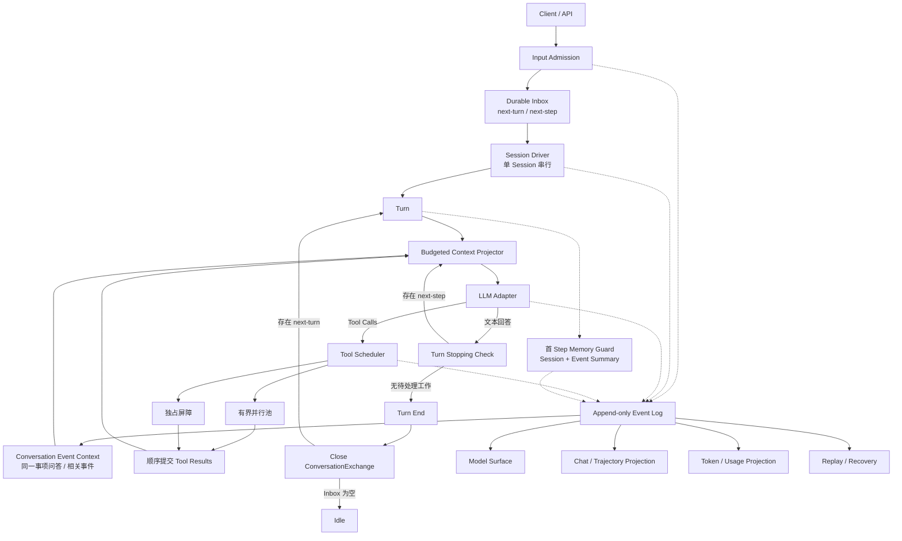
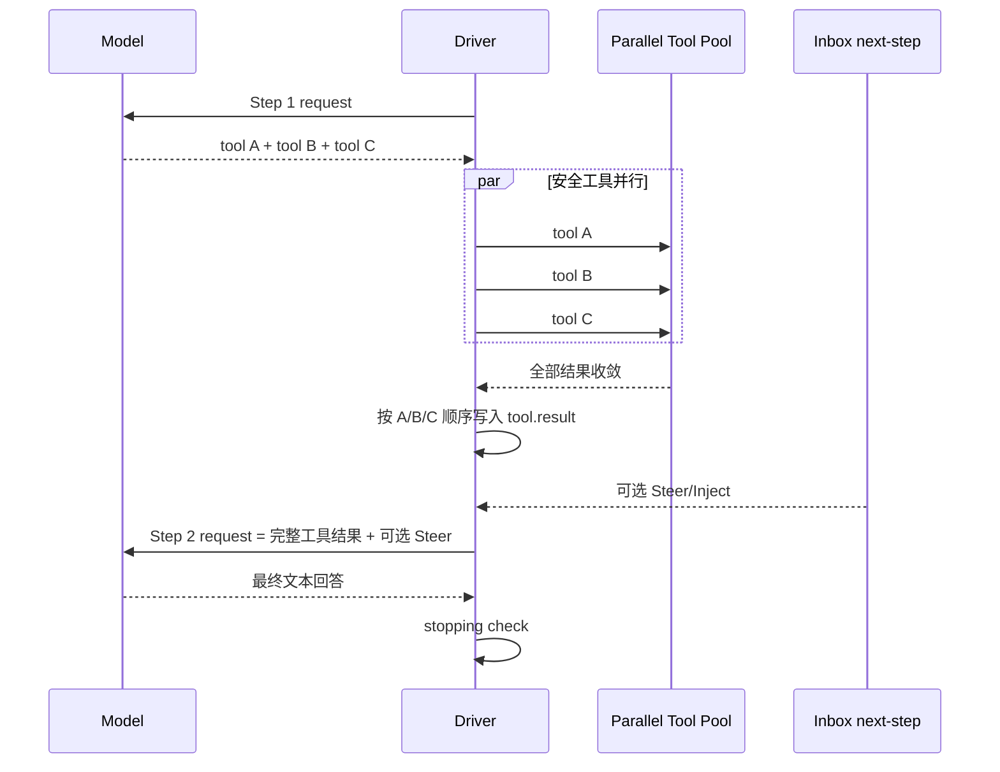
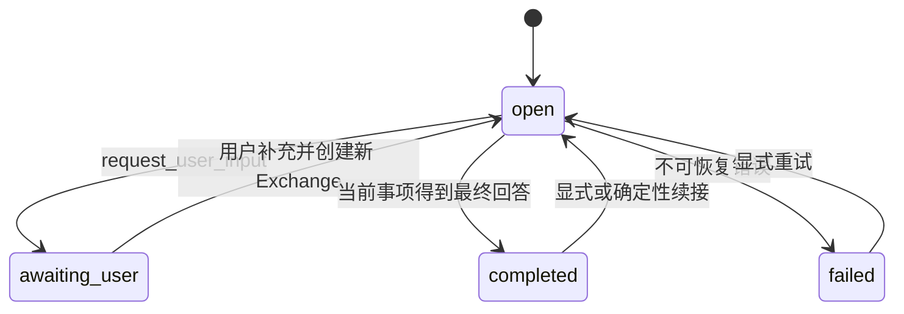

# 单 Agent 低上下文 Runtime 打造设计

## 1. 文档目标

本文档定义一个使用 Node.js、TypeScript 实现的单 Agent Runtime。它借鉴 DeepSeek Harness 的 Agent Loop、持久化 Inbox、Turn/Step、工具并行、取消与事件日志，同时吸收 Agent Base 在上下文去重、历史压缩、Schema 校验和业务结果归一化方面的经验。

项目的首要目标不是功能数量，而是：

> 用尽可能少的提示词、工具 Schema 和历史上下文，让一个 Agent 在多轮会话、工具调用、用户追加、打断、取消和崩溃恢复中稳定运行。

本文档是目标架构，不是对 DeepSeek Harness 或 Agent Base 的复制方案。文中引用的代码位置用于说明可借鉴的机制，目标项目仍应按自身更小的范围重新建模。

## 2. 设计边界

### 2.1 必须具备

- 单 Agent，不存在 Worker、Subagent、Agent 路由、任务委派或多 Agent 结果合并。
- 模型原生 Tool Call 驱动的 React Loop，不在前面增加独立的意图识别模型调用。
- 一个持久化 Inbox，包含 `next-turn` 和 `next-step` 两种投递时机。
- Queue 追加、已排队消息立刻介入下一 Step、Steer 软打断、Cancel 硬终止，以及取消后继续处理排队任务。
- 同一 Session 的模型决策串行，不同 Session 可并行。
- 一个 Step 中的多个无冲突工具可有界并行，具有副作用或未声明安全性的工具默认独占。
- 仅追加的事件日志，用于恢复 Inbox、Turn/Step、模型上下文、UI 和 token 统计。
- 精确的 provider usage 采集，并记录每次模型调用的上下文组成。
- 工具参数、工具结果和外部输入的边界校验。
- 工具结果作为事实完整持久化；Surface 在压力阈值以下使用完整结果，达到阈值后可使用不改写原 Event 的可追溯预裁剪投影。
- 会话历史同时按 Session 和 ConversationEvent 组织；当前 Event 保存同一件事的用户可见问答，上下文可包含原始问答或 Summary/raw tail、当前用户输入和少量相关 Event 候选。

### 2.2 明确不做

- 不做 Worker 或子 Agent。
- 不做 `Decider → Executor → Harness → Decider → Answer Generator` 多模型链路。
- 不为每个用户请求额外调用模型进行意图分类或历史相关性判断。
- 不在每个 Step 同时携带全量事件、全量会话、另一份动作历史和重复摘要。
- 不在压力阈值以下为缩短上下文主动裁剪工具结果，也不用不可追溯的 Artifact 自动外溢替代原始事实。
- 不让 UI 临时状态成为运行事实。
- 不承诺外部副作用的无条件 exactly-once；通过幂等键、不自动重放修改类工具和人工确认降低风险。

## 3. 总体结论

目标 Runtime 应可概括为：

> 一个以持久事件日志为事实来源、以预算化 Context Projector 为模型入口、以原生 Tool Call 为能力扩展方式的单 Agent TypeScript Runtime。

其核心不变量是：

1. 先持久化接纳输入，再唤醒运行器。
2. 同一 Session 同时只有一个 Driver。
3. 一个 Step 等于一次模型请求加该响应中的所有工具调用。
4. 一个 Turn 包含零个或多个 Step，直到模型不再调用工具且没有新的 `next-step` 输入。
5. 所有模型可见信息都能从持久事件重建。
6. 日志保存完整事实，模型只接收经过预算选择的 Surface。
7. 工具执行结果依模型调用顺序提交，即使它们实际并行完成。
8. 停止、错误、崩溃恢复和超预算都是明确的终止事实，不是 UI 猜测。
9. 技术日志事件与 ConversationEvent 是两个不同概念：前者记录运行事实，后者保存当前聊天中同一件事的用户可见问答集合。

## 4. 核心架构



### 4.1 核心模块

| 模块                   | 职责                                                         | 不承担                               |
| ---------------------- | ------------------------------------------------------------ | ------------------------------------ |
| Input Admission        | 校验输入、生成幂等键、写入 Inbox                             | 不做 LLM 意图识别                    |
| Session Driver         | 保证单 Session 单 Driver，驱动 Turn/Step                     | 不理解业务意图                       |
| Context Projector      | 从事件 Surface 中构造最小可用模型请求                        | 不保存另一套事实                     |
| Event Context Resolver | 解析当前问答所属的 ConversationEvent、检索少量相关事件并去重 | 不为每轮额外调用聊天模型做相关性分类 |
| LLM Adapter            | 统一流式响应、Tool Call、usage、终止原因                     | 不修改 Session 业务状态              |
| Tool Registry          | 注册、Schema、权限、并发安全声明                             | 不做 Agent 角色分工                  |
| Tool Scheduler         | 参数校验、并行调度、独占屏障、超时、取消、结果归一化         | 不再调用 LLM 评估结果                |
| Event Store            | 保存可回放事实                                               | 不直接作为每次 Prompt                |
| Surface Projector      | 从日志派生当前模型可见节点                                   | 不删除原始事件                       |
| Projection Layer       | 从事件构建 UI、队列、统计和运行轨迹                          | 不影响 Agent 决策                    |

## 5. 核心概念和边界

| 概念                 | 定义                                                       | 关键约束                                                          |
| -------------------- | ---------------------------------------------------------- | ----------------------------------------------------------------- |
| Session              | 一段可持久化会话；集成到 Client 时恰好属于一个 LocalUser   | 同时只有一个活动 Driver，执行作用域为 `(userId, sessionId)`       |
| Inbox                | 已接纳、尚未被 Step 领取的输入                             | 只有一个 Inbox，内含两种投递时机                                  |
| Turn / ExecutionTurn | Agent 对一条排队请求的完整执行过程                         | 可包含零个或多个 Step，包含内部工具轨迹                           |
| Step                 | 一次模型请求及该响应的全部 Tool Call                       | 工具不被移入第二个队列                                            |
| Event Log            | Session 的持久事实                                         | 仅追加，带严格序号                                                |
| ConversationEvent    | 当前聊天中围绕同一件事形成的完整用户可见问答集合           | 可跨多个 ExecutionTurn，不是摘要卡片、子 Agent 或第二执行队列     |
| ConversationExchange | ConversationEvent 中的一次用户问题及对应的用户可见助手回答 | 关联一个 ExecutionTurn，不包含内部 Tool Call/Result               |
| Surface              | 当前 Step 允许进入模型的事件投影                           | 默认包含当前 ExecutionTurn、当前 Event Context 和显式历史读取结果 |
| Projection           | 从事件派生的读模型                                         | 可随时重建，不是第二事实源                                        |

`running` 只表示 Driver 正在排空待处理工作，不等于某一个 Turn 未结束。一个 Driver 可以连续执行多个 `next-turn` 请求，中间不回到 idle。

为避免“Event”重名，代码中使用 `SessionLogEvent` 表示 `turn.started`、`tool.result` 等技术日志事实，使用 `ConversationEvent` 表示同一件事的用户可见问答集合。一个 `ConversationExchange` 关联一个 Runtime `Turn`（下文也称 `ExecutionTurn`）：前者只投影用户问题和用户可见助手回答，后者保存对应的 Step、Tool Call 和完整 Tool Result。`ConversationEvent` 不会创建新 Agent、新 Driver 或新工具队列。

## 6. 完整运行流程

### 6.1 输入接纳

1. API 校验 `sessionId`、`messageId`、内容类型、附件引用和幂等键。
2. Runtime 把输入以 Inbox splice 事件写入持久层。
3. 只有事件提交成功后才唤醒 Session Driver。
4. 重复的幂等键返回已有接纳结果，不创建第二条消息。

输入 API 建议保持简单：

```ts
export interface SubmitInput {
  sessionId: string;
  message: UserMessage;
  mode: 'queue' | 'steer';
  idempotencyKey: string;
  eventId?: string;
  startNewEvent?: boolean;
}
```

在 Client 集成中，`userId` 由可信的 Main/Bridge User Context 注入，不作为 Renderer 可任意填写的 `SubmitInput` 字段。Input Admission 必须先验证目标 Session、附件、模型和 Skill 均属于该用户。

### 6.2 开启 Turn 与领取 Inbox

当 Driver 从 idle 被唤醒时：

1. 对 Session 获取逻辑 lease，保证仅一个 Driver 拥有执行权。
2. 写入 `turn.started`。
3. 在 Turn 边界原子领取全部 `next-step` 和 FIFO 的一条 `next-turn`。
4. 在已开启 Turn 的 Step 边界，只领取全部 `next-step`。
5. 领取通过删除 splice 事件持久化，被领取的消息不再是待处理队列项。
6. 第一个 Step 开始前解析本 Turn 所属 `ConversationEvent`，创建对应 `ConversationExchange`，并持久化 `Event ↔ Exchange ↔ ExecutionTurn` 关联。

领取顺序为 `next-step` 在前、`next-turn` 在后。这使已存在的插话能与新 Turn 的主请求一起进入第一个 Step，且保留它们的到达顺序。

### 6.3 构造最小模型请求

Context Projector 在每个 Step 前执行：

1. 加载稳定且简短的 System Prompt。
2. 加载当前会话配置中可见的 Tool Schema。
3. 加载 Session 压缩摘要中仍有效的跨事件约束与用户信息。
4. 加载当前 `ConversationEvent` 的 Event Context：阈值内使用同一事项的原始用户可见问答，超过阈值后使用 Summary 加未覆盖的新 Exchange。
5. 按预算加载少量相关 `ConversationEvent` 候选记录。
6. 从 Surface 中取得当前 Turn 必须保留的完整消息链与当前用户输入。
7. Event Context 不内联历史 ExecutionTurn 的 Step、Tool Call 或 Tool Result；只有模型显式调用 `turn_read` 后，所选执行证据才作为完整 Tool Result 进入当前 Turn。
8. 当前 Turn 中的 Tool Result 必须使用工具返回的完整内容写入 Event；模型视图只能在压力触发后以新 Surface replacement 表达。
9. 如果请求超过硬预算，依次移除低分可选上下文、预裁剪超大 Tool Result 模型视图、压缩最旧工具配对平衡区域；仍无法收敛时必须明确失败。

### 6.4 模型决策

每个 Step 只有一次主模型调用。模型可以：

- 直接输出回答。
- 输出一个 Tool Call。
- 在 provider 支持时输出多个 Tool Call。

不允许 Runtime 在该请求前先让另一次 LLM 决定 `answer_user`、`ask_user` 或 `call_tool`。原生模型响应已经同时承担“决策与表达”，避免重复传入相同历史。

### 6.5 工具执行

1. 对工具名称、JSON 参数、Schema、权限、资源范围和超时配置做确定性校验。
2. 根据工具声明的并发安全性进入并行池或独占屏障。
3. 工具实现获得当前 Step 的 `AbortSignal`、调用 ID 和幂等键。
4. 工具输出被归一化为统一 `ToolResult`。
5. 工具输出 Schema 校验通过后，完整结果写入 `tool.result` 并进入 Surface。
6. 即使并行调用的完成时间不同，`tool.result` 仍按模型输出 Tool Call 的顺序提交。
7. 只要本 Step 产生过 Tool Call，原则上就欠模型一次后续决策，因此进入下一个 Step。

#### 6.5.1 工具结果如何进入下一个 Step

`Step N + 1` 和 Inbox 中名为 `next-step` 的待处理列表是两个不同概念：

- `Step N + 1` 是 Agent Loop 的下一次模型请求。
- Inbox `next-step` 只保存应在最近未来 Step 注入的 Steer、Inject 或 Runtime 上下文。
- `tool.result` 不进入 Inbox `next-step`；它直接写入 Session Event Log 并成为 Surface 的一部分。
- 工具批次完成后，Driver 直接结束当前 Step 并开启 `Step N + 1`，不需先向 Inbox 插入一条消息。
- `Step N + 1` 构造请求时，从 Surface 读取上一 Step 的全部 Tool Call/Result，同时领取此时已到达的 Inbox `next-step` 输入。



并行工具不是每完成一个就各自开一个新 Step。同一次模型响应中的所有 Tool Call 都属于同一 Step；它们全部收敛并按模型顺序提交后，只开启一个后续 Step，让模型同时看到整批结果。

唯一常规例外是某个工具结果显式声明 `concludesTurn = true`。这类工具用于 `request_user_input`、终止任务或已经自身产生完整用户结果的操作。Runtime 在结束该工具批次后可以不再请求模型，直接进入 Turn stopping 边界。初版应对允许返回此标记的内置工具使用白名单，普通工具不得随意绕过模型的结果消化 Step。

### 6.6 结束 Turn

模型返回不含 Tool Call 的文本时，Runtime 进入 stopping check：

1. 检查是否在流式输出或 stopping 窗口中到达了 `next-step`。
2. 如果存在，不结束 Turn，领取输入并开启新 Step。
3. 如果没有，写入 `turn.ended`。
4. 关闭关联的 ConversationExchange，确认该问答包含的用户可见消息范围；取消或崩溃则标记 Exchange 为 `interrupted`。
5. completed Exchange 只持久化用户可见范围，不触发 token 检查或摘要模型。
6. 如果仍有 `next-turn`，同一 Driver 立即开启下一 Turn；新问题的第一 Step 在 Event ID 确定后执行 Memory Guard。
7. 只有 Inbox 完全为空后 Driver 才释放 lease 并进入 idle。

### 6.7 什么时候才进入 `next-turn`

`next-turn` 不是工具执行后的默认去向。它保存的是“当前 Turn 完成之后，再作为新 Turn 处理”的用户请求。当前 Turn 必须同时满足以下条件才能结束：

1. 最近一个 Step 的模型响应不再产生 Tool Call，或白名单工具显式 `concludesTurn`。
2. 已发起的工具都已收敛并持久化结果。
3. Inbox `next-step` 中没有待注入的 Steer/Inject。
4. 没有待重试的模型请求或 Runtime continuation。

条件满足后写入 `turn.ended`，Driver 才从 Inbox `next-turn` FIFO 领取下一条用户请求并创建新 Turn。

```text
Turn 1 / Step 1: 模型返回 3 个 Tool Call
Turn 1 / Step 1: 3 个工具可并行执行，结果顺序提交
Turn 1 / Step 2: 模型一次性读取 3 个结果并回答
Turn 1:          stopping check 后结束
Turn 2 / Step 1: 此时才领取已排队的 next-turn 请求
```

## 7. Queue、Steer、立刻介入、Inject 与 Cancel

### 7.1 一个 Inbox，两种时机

```ts
export type InboxTarget = 'next-turn' | 'next-step';

export interface InboxItem {
  id: string;
  sessionId: string;
  target: InboxTarget;
  message: UserMessage;
  source: 'user' | 'runtime' | 'tool';
  createdAt: string;
  idempotencyKey: string;
  eventId?: string;
  startNewEvent?: boolean;
}
```

| 操作                           | 目标                      | 是否唤醒 idle Driver   | 进入位置                    | 业务含义                         |
| ------------------------------ | ------------------------- | ---------------------- | --------------------------- | -------------------------------- |
| `queue()`                      | 新建 `next-turn`          | 是                     | 当前 Turn 结束后的独立 Turn | 追加任务                         |
| `steer()`                      | 新建 `next-step`          | 是                     | 最近的未来 Step             | 直接纠正或补充当前任务           |
| `promote(inboxItemId, turnId)` | `next-turn` → `next-step` | 否；当前 Driver 已运行 | 最近的未来 Step             | 让已经排队的消息立刻介入当前任务 |
| `inject()`                     | 新建 `next-step`          | 否                     | 下次被其他输入唤醒时        | Runtime 或工具注入的上下文       |
| `cancel()`                     | 活动 Turn                 | 不适用                 | 通过 AbortSignal 终止       | 停止当前执行                     |

`next-turn` 和 `next-step` 不是两个 Worker 队列。它们只表示同一 Agent Driver 在哪个安全边界接收输入。

### 7.2 Steer 的精确语义

- Steer 不改写已经发出的模型请求。
- Steer 不强制破坏已经运行的工具。
- Steer 在最近的安全 Step 边界被领取。
- Steer 如果在工具执行期间到达，将在工具结果提交后进入下一次模型请求。
- Steer 如果在模型最终文本输出期间到达，stopping check 会阻止 Turn 结束并开启新 Step。

### 7.3 “立刻介入”的精确语义

参考 UI 中，用户在 Agent 回答期间普通发送的新消息先作为 Queue Item 持久化到 `next-turn`。用户随后点击该队列项的“立刻介入”时，Runtime 执行一次目标转换，而不是再次提交相同消息：

```ts
promote({
  sessionId,
  inboxItemId,
  expectedTurnId,
});
```

- 同一事务确认 Queue Item 仍在 `next-turn`、没有被 claim，且当前活动 Turn 等于 `expectedTurnId`。
- 使用一个原子 Inbox splice 将同一 Item ID 从 `next-turn` 移到 `next-step`，按提升发生顺序追加。
- 提升后的消息绑定当前 ConversationEvent 和开放 Exchange；原先“新事项”意图失效。
- 不 Abort 已发出的模型请求，不停止正在运行的工具。
- 工具执行期间提升时，消息在工具结果提交后的下一 Step 被领取。
- 最终文本流期间提升时，stopping check 发现 `next-step` 后阻止 Turn 结束。
- Turn 已变化或 Item 已被领取时返回冲突，Item 保持原状态；禁止把它静默介入后来的 Turn。

因此，“立刻”指最近的安全 Step 边界，不是立刻中止当前工作。Projection 应将 Queue 行更新为“已介入下一步”，而不是创建重复消息。

### 7.4 Cancel 的默认语义

建议用户点击 Stop 时使用：

```ts
cancel({
  keepNextTurn: true,
  keepNextStep: false,
  reason: 'user_stop',
});
```

- 保留已排队的 `next-turn`，避免用户已接纳的后续任务丢失。
- 默认丢弃属于已取消 Turn 的 `next-step`，因为这些纠正语义可能已经失效。
- 将 AbortSignal 传播给模型流、工具、终端子进程、网络请求和用户交互等待。
- 写入 `turn.ended { reason: "cancelled" }`，不依赖 SSE 断开来推断停止。
- 取消之后到达的唤醒输入强制归入 `next-turn`，避免加入一个已终止 Turn。

“立即停止并按新要求重新做”是两个明确操作：取消当前 Turn，然后把新请求加入 `next-turn`。

## 8. 并行与串行模型

### 8.1 三层并发语义

| 层级         | 策略               | 原因                                    |
| ------------ | ------------------ | --------------------------------------- |
| 同一 Session | 同时仅一个 Driver  | 避免日志、Inbox、Surface 和模型历史分叉 |
| 同一 Step    | 无冲突工具有界并行 | 减少延迟，同时保留决策顺序              |
| 不同 Session | 完全并行           | 会话事实互不共享                        |

### 8.2 工具并发声明

```ts
export interface ToolDefinition<TArgs, TResult> {
  name: string;
  description: string;
  inputSchema: JsonSchema;
  execute(args: TArgs, context: ToolRunContext): Promise<TResult>;
  isConcurrencySafe?: (args: TArgs) => true | false;
}
```

只有 `isConcurrencySafe(args)` 明确返回 `true` 才可并行。未声明、参数无效、分类函数异常或返回非 `true` 时均按独占执行。这是 fail-closed 策略。

并行调度器应实现：

- 按模型输出顺序扫描 Tool Call。
- 连续的 parallel-safe 调用进入有界滚动池。
- 独占调用先等待当前并行池排空，自己单独运行，再允许后续调用开始。
- 执行可以乱序完成，但 pre-check、持久结果和追加上下文依模型顺序提交。
- 取消后停止启动尚未开始的调用，等待已开始调用收敛，并为未执行调用记录可识别的 aborted 结果。

默认 `maxParallelToolCalls = 4`，配置为 `1` 可获得完全串行语义。初版不建议默认设置过高，避免外部 API 、本地进程和日志持久层同时承受峰值压力。

## 9. 低上下文设计

### 9.1 先定义“少”

上下文成本不能只看单次 Prompt 长度，应同时计算：

```text
总成本
= 每次请求输入 token 之和
+ 每次请求输出 token 之和
+ 额外决策 / 评估 / 摘要调用成本
- provider 前缀缓存节省
```

因此优化顺序应是：

1. 减少模型调用次数。
2. 减少每个 Step 重复携带的前缀。
3. 减少 Tool Schema 总量。
4. 减少历史的重复，但不缩写工具结果。
5. 保持 Prompt 前缀稳定，提高 provider cache hit。
6. 只在真正需要时运行摘要模型。

### 9.2 存全，发少

完整事件日志解决审计、恢复、UI 和调试；Surface 解决模型需要看什么。两者不能混合。

```text
Event Log:  完整输入 + 模型流 + Tool Call + 完整 Tool Result + usage + 状态
Event Context: 同一件事的用户可见问答原文，或 Summary + 未覆盖的新问答
Surface:    当前 ExecutionTurn 的用户/助手/工具消息 + 可追溯压力投影 + 显式历史读取结果
LLM Input:  稳定前缀 + 工具 Schema + Session Summary + Event Context + 当前 Surface
```

“存全，发少”适用于压力下的单个大工具结果，但必须分离事实与模型视图：原始 Tool Result 在事件日志中永久完整保留；预裁剪投影必须显式标注并可通过 `turn_read` 或有界深读取回原始证据。已闭合 ExecutionTurn 的内部工具轨迹不自动进入新 Turn；ConversationEvent 仍提供对应的用户可见问答。

不建议在每个 Step 额外注入一份模型生成的 `WorkingState`，再同时保留原始对话。只有新问题首 Step 的完整候选上下文达到压力线时，才按需更新 Event Summary 并替代它已覆盖的旧问答原文；未覆盖的新 Exchange 继续原样进入，已闭合 ExecutionTurn 继续作为按需证据。

### 9.3 上下文层级

| 层级 | 内容                                                               | 纳入策略                                                                 |
| ---- | ------------------------------------------------------------------ | ------------------------------------------------------------------------ |
| L0   | 稳定 System Prompt 与必要安全约束                                  | 每次固定，尽可能短且字节稳定                                             |
| L1   | 当前可见 Tool Schema                                               | 按 session profile 确定，排序稳定                                        |
| L2   | Session Summary                                                    | 整个 Session 的高层时间线、长期偏好、跨事项约束和近期事项结论            |
| L3   | 当前 ConversationEvent Context                                     | 阈值内使用完整用户可见问答；超阈值后使用 Summary 加尚未覆盖的新 Exchange |
| L4   | 相关 ConversationEvent 候选                                        | 按相关度和预算最多加入 K 个紧凑候选，选中后再读取其 Event Context        |
| L5   | 当前 ExecutionTurn 的用户输入、助手响应、Tool Call/Result 和 Steer | 必须保留工具配对和顺序；压力下已闭合旧结果可用可追溯预裁剪投影           |
| L6   | `event_search/event_read/turn_list/turn_read` 结果                 | 事实按选定分页/范围完整返回；压力下模型视图仍遵循统一预裁剪规则          |

### 9.4 预算算法

```ts
export interface ContextBudget {
  contextWindow: number;
  reservedOutputTokens: number;
  safetyMarginTokens: number;
}
```

请求输入硬预算：

```text
inputBudget
= contextWindow
- reservedOutputTokens
- safetyMarginTokens
```

投影算法建议：

1. 估算 System Prompt 和 Tool Schema；它们超预算时在启动或配置变更时直接拒绝，不到运行期静默裁剪。
2. 新问题第一 Step 前先确定 ConversationEvent ID，再以旧 Session Summary、最近几轮已闭合问答、当前 Event Context 和最新问题构造业务候选。
3. 首 Step 候选达到 80% 时，分别将“旧 Session Summary + 最近问答”压成新的整体历史摘要，将“旧 Event Summary + 当前 Event QA”压成新的事项详细摘要；最新问题不进入摘要。
4. Event Summary 成功后替换 Event Context 中已覆盖 QA 的默认业务记忆视图；后续新 QA 追加在摘要之后，原始 SessionLogEvent 不变。
5. 首 Step 重新投影为 Session Summary、当前 Event Summary、最新问题和必要前缀；两级摘要允许全局/细节语义重叠，冲突优先级为最新问题、Event、Session。
6. 首 Step 重投影后及 Turn 内后续每个 pre-step 执行 DeepSeek Harness Surface Guard；达到压力后按 Harness 语义先裁剪 Tool Result，再选择头部工具配对平衡区域生成 Checkpoint。
7. Harness pre-step 失败时记录诊断并继续原请求；Provider 明确 overflow 时，只有 Surface 确实变小才自动重试一次。

### 9.5 稳定 Prompt 前缀

为利用 provider prompt cache：

- System Prompt 不加时间戳、请求 ID、Session ID 和变动统计。
- Tool Schema 使用稳定排序和确定性 JSON 序列化。
- 稳定内容放前，本轮变化内容放后。
- 配置修改产生新的 prompt epoch，不在相同 epoch 内偷偷变更工具定义。
- 不把 UI 展示字段、运行轨迹、token 计数或内部理由注入 Prompt。

初版 System Prompt 应只包含：Agent 身份与边界、工具使用原则、不编造工具结果、缺少必要信息时向用户询问、回答应优先直接完成任务。具体业务规则应放在工具 Schema、确定性校验和工具结果中，不断堆入通用 Prompt。

### 9.6 Tool Schema 管理

工具数量较少时，全部稳定注册往往比动态路由更省 token，因为不需要额外的能力发现 Step。

只有当 Tool Schema 已成为上下文主要成本时，才引入两级能力加载：

```text
常驻工具：tool_catalog、tool_load、必要通用工具
领域工具：通过 tool_load 在后续 Step 加入当前 prompt epoch
```

`tool_catalog` 只返回短 ID、一句话描述和分类；不返回全量 Schema。该方案的收益必须通过真实 token 统计证明，不应仅因为“动态更灵活”就在第一版引入。

### 9.7 Session 历史与 ConversationEvent 上下文

Agent Base 中值得保留的不只是会话压缩，还有“Session 是容器，Event 是同一件事的问答集合”的历史组织方式。`ConversationEvent` 的核心是按顺序关联的用户可见问答，不是只有标题、状态和摘要的业务卡片：

```ts
export type ConversationEventStatus = 'open' | 'awaiting_user' | 'completed' | 'failed';

export interface ConversationEvent {
  id: string;
  sessionId: string;
  status: ConversationEventStatus;
  title: string;
  summary: string | null;
  summaryThroughExchangeSeq: number | null;
  summaryTokens: number | null;
  summaryVersion: number;
  exchangeCount: number;
  relatedEventIds: string[];
  createdAt: string;
  updatedAt: string;
  completedAt?: string;
}

export interface ConversationExchange {
  id: string;
  eventId: string;
  seq: number;
  executionTurnId: string;
  status: 'open' | 'completed' | 'interrupted';
  createdAt: string;
  completedAt?: string;
}
```

一个 Session 可以包含多个 `ConversationEvent`，一个 Event 可以关联多个 `ConversationExchange`。每个 Exchange 对应一次用户问题及这次 ExecutionTurn 产生的用户可见助手回答；用户消息、最终回答和中间可见回答仍由 SessionLogEvent 保存，Exchange 只是可重建的分组关系。Step、Tool Call、完整 Tool Result 和内部终止事实属于 `ExecutionTurn`，不复制进 Exchange。

例如“实现登录”“改成手机号登录”“验证码失败，继续检查”可以是同一个 Event 中的三个 Exchange 和三个 ExecutionTurn。Event 默认恢复这三轮用户可见问答；需要查看某轮执行过哪些工具或原始结果时，再按需读取对应 ExecutionTurn。

#### 9.7.1 ConversationEvent 解析规则

Event 所属关系优先用确定性规则解析：

1. 输入显式携带 `eventId` 时，关联指定 Event。
2. Steer 继承当前活动 ExecutionTurn 的 Event，并追加到同一个开放 Exchange。
3. 当前 Session 只有一个 `awaiting_user` Event 时，用户的下一条普通输入默认续接该 Event，并创建新的 Exchange/ExecutionTurn。
4. 用户明确选择当前事项，或确定性检索命中足够可信的 Event 时，继续该 Event。
5. `startNewEvent = true` 或没有可续接 Event 时，创建新的 ConversationEvent。

标题默认从首条用户输入确定性生成，不额外调用 LLM。初版相关性检索使用 title、summary、未压缩 Exchange 的关键词、结构化标签和近期性；没有可信匹配就创建新 Event，不在每轮前增加一次相关性模型调用。未来可增加 embedding 索引，但它仍是检索能力，不是第二个 Agent Loop。

#### 9.7.2 Event、Exchange 与 ExecutionTurn 生命周期



一个 `next-turn` 用户请求开始执行时创建 Exchange 和 ExecutionTurn。Queue 产生新 Exchange；Steer 只补充当前开放 Exchange。ExecutionTurn 结束后，Exchange 记录其用户可见问答并关闭；工具轨迹仍只属于 ExecutionTurn。如果模型使用 `request_user_input` 等待补充，Event 标记为 `awaiting_user`，下一次用户输入在同一 Event 下创建新 Exchange。

#### 9.7.3 Event Context 的原文与 Summary

完整问答始终保存在 SessionLogEvent 和 ConversationExchange 投影中。`summary` 只保存真正的压缩结果，不在阈值内复制一份原始对话：

```text
summary == null
  Event Context = 该 Event 全部已闭合 Exchange 的用户可见问答原文

summary != null
  Event Context = Summary
                + seq > summaryThroughExchangeSeq 的已闭合 Exchange 原文
```

首 Step 业务记忆压缩后，`summary` 会替换其覆盖范围内全部 Event QA 在 Event Context 持久投影中的默认内容，不强制保留一个已闭合 Exchange 原文。摘要覆盖位置之后新产生的已闭合 QA 仍以原文追加，直到下一次业务记忆压缩再次被纳入 Event Summary。当前开放 Exchange 的用户输入和助手/工具消息由 Current ExecutionTurn Surface 承担，不能又从 Event Context 重复加入。原始 QA 继续保存在仅追加的 `SessionLogEvent` 和可重建的 `ConversationExchange` 中，可通过 `event_read` 深读和审计。

`summary`、`summaryThroughExchangeSeq` 和 `summaryTokens` 必须在同一事务中同时为空或同时有效；`summaryVersion` 从 0 单调递增。覆盖位置只能指向已闭合 Exchange，且不得越过本次首 Step 测量时看到的稳定版本。

#### 9.7.4 每次模型请求的上下文组成

```text
稳定 System Prompt
+ 当前 Tool Schema
+ Session Summary（当前 Session 的整体历史与全局约束）
+ Current ConversationEvent Context（原始问答，或 Summary + raw tail）
+ Related ConversationEvent Candidates（预算内最多 K 个）
+ Current ExecutionTurn Surface
+ Current User Input / Steer
```

`Session Summary` 表达当前 Session 的整体历史、时间线和全局约束，可以高层提及当前 Event；`Event Summary` 保存与最新问题最相关的当前事项细节。两者允许受控语义重叠，不做机械去重；发生冲突时按“最新问题 > 当前 Event Summary > Session Summary”解释。历史 ExecutionTurn 只在事实冲突、结果核验或审计时提供 Step、Tool Call 和完整 Tool Result。

#### 9.7.5 Event 与 ExecutionTurn 的按需读取

1. `event_search` 返回紧凑候选：`id + title + status + summary/近期关键词 + updatedAt`。
2. `event_read(eventId, cursor, limit)` 按范围返回该 Event 的原始 ConversationExchange 问答；调用所选范围完整返回。
3. `turn_list(eventId, cursor, limit)` 返回各 Exchange 对应的 ExecutionTurn 元数据。
4. `turn_read(turnId, range)` 返回明确选定的 Step、Tool Call 和完整 Tool Result。

当前 Event 的预算内 Event Context 由 Context Projector 自动加载。相关 Event 默认只加载紧凑候选；明确选中后加载其 Event Context，仍不自动展开内部工具轨迹。`event_read` 和 `turn_read` 都必须在调用前通过游标、Exchange 范围或日志序号范围约束读取量，Runtime 不在结果生成后截断、总结或用 Artifact 替换。

#### 9.7.6 首 Step 业务记忆压缩

上一轮 ExecutionTurn 结束和 ConversationExchange 关闭后只提交事实，不运行 token 检查或摘要 Hook。业务摘要统一在下一条用户问题开始、Event ID 已确定、第一 Step 请求之前执行：

```text
最新问题持久化并确定 Event ID
  → 测量完整首 Step 候选
  → 未达到 80%：沿用现有 Session/Event Context
  → 达到 80%：按需运行 Session Summary 与 Event Summary 两个任务
  → 分别校验覆盖位置和 summaryVersion
  → Event Summary 替换当前 Event Context 已覆盖 QA
  → 重投影为 Session Summary + Event Summary + 最新问题
  → 进入 DeepSeek Harness Surface Guard
```

Session 摘要输入是旧 Session Summary 加最近若干轮已闭合问答，输出整个 Session 的高层时间线和长期信息。Event 摘要输入是该 Event 的旧 Summary 加当前持久化 QA，输出当前事项的详细目标、参数、动作、结论和待办。两项都有可压缩输入时可并行；没有新增输入的层不调用模型。

Event Summary 的提交会真实替换 ConversationEvent Context 中已覆盖 QA 的默认内容并推进 `summaryThroughExchangeSeq`，后续 QA 追加在摘要之后。替换不改写仅追加 SessionLogEvent，因此 Chat、恢复和显式深读仍可取得原始问答。

#### 9.7.7 去重和预算

上下文机械去重顺序：

1. 用 `eventId` 排除相关候选中的当前 Event。
2. Event Summary 覆盖范围内的 Exchange 不再作为 Event Context 原文自动投影，覆盖位置之后的 Exchange 仍原样进入。
3. 当前开放 Exchange 不从 Event Context 加载，由 Current ExecutionTurn Surface 唯一承担。
4. 当前用户输入已经存在于 Current ExecutionTurn Surface 时不再单独序列化一份。
5. 对从外部导入且没有稳定 ID 的历史，最后才使用内容哈希。

Session Summary 对当前事项的高层提及与 Event Summary 的详细内容属于受控语义重叠，不执行字符串去重；冲突时固定以最新问题、Event Summary、Session Summary 的顺序解释。当前用户输入、当前 ExecutionTurn、完整 Tool Result、当前 Event Context 和必要系统约束不得静默删减。

## 10. 完整 Tool Result 协议

### 10.1 统一结果

```ts
export type ToolResultStatus =
  'success' | 'needs_input' | 'retryable_error' | 'fatal_error' | 'cancelled';

export interface ToolResult {
  status: ToolResultStatus;
  content: JsonValue;
  missing?: string[];
  error?: {
    code: string;
    message: string;
  };
  concludesTurn?: boolean;
}
```

Runtime 对可确定的结果直接归一化，不再调用独立 Harness LLM：

- JSON Schema 缺少 required 字段 → `needs_input` 并列出 `missing`。
- 超时、限流、临时网络错误 → `retryable_error`。
- 权限拒绝、不存在的资源、非法输入 → 按工具定义映射为 `needs_input` 或 `fatal_error`。
- AbortSignal 中止 → `cancelled`。
- 工具成功且输出 Schema 通过 → `success`。

模型在下一 Step 根据结构化状态决定是重试、改参数、调用其他工具、询问用户还是回答。

### 10.2 完整事实与模型视图不变量

- `tool.result` 完整持久化工具返回的规范化 `content`，原始 Event 永久不被压缩事务改写。
- 阈值以下 Surface 使用完整 `content`；达到压力阈值后可产生可追溯的模型视图，保留头尾、状态、分页/深读索引、digest 和原 seq。
- 模型视图是新的 Surface replacement，不是对 `tool.result` payload 的原地截断、摘要或字段丢弃。
- 如果某个工具原生就返回文件 ID、URL 或其他资源引用，该引用属于工具完整结果；这不是 Runtime 对结果的简化。

### 10.3 大结果的责任边界

保留完整结果意味着产生大结果的工具必须在协议层控制单次请求范围，而不是由 Runtime 事后裁剪。例如：

- 列表、数据库和搜索工具必须提供 `limit`、`cursor` 或分页参数。
- 文件、网页和日志读取工具必须提供 `offset/range/lineStart/lineEnd` 等范围参数。
- 工具返回的一页、一段范围或一个查询结果必须完整保留，并明确给出 `hasMore/nextCursor/total` 等语义。
- 工具 Schema 应给出保守的默认页大小，但不能用业务上不正确的静默默认值替代缺失的必要参数。

如果工具违反其声明的输出上限，Runtime 仍完整记录已收到的结果，然后在压力下先生成有界模型视图；只有当最新不可分割尾部在预裁剪后仍无法进入硬预算时，Turn 才以 `context_budget_exceeded` 结束。这种失败仍应被统计为工具协议设计问题。

## 11. 事件模型

### 11.1 基础 envelope

```ts
export interface SessionLogEvent<TType extends string, TPayload> {
  id: string;
  sessionId: string;
  seq: number;
  type: TType;
  schemaVersion: number;
  time: string;
  requestId?: string;
  payload: TPayload;
}
```

该 envelope 表示单个 Session 内的 Runtime 事件。`schemaVersion` 是事件 payload 版本，`requestId` 用于关联触发该事件的 Client 请求。Client 的物理 EventStore 行额外保存 `user_id`，所有追加、读取、订阅和回放都使用 `(userId, sessionId)` 作用域；`user_id` 不重复写入每个事件 payload。

`seq` 必须在 Session 内单调连续。每次写入应使用带 Session 乐观版本的事务，防止第二个 Driver 或过期 lease 继续写入。

### 11.2 最小事件集

| 事件                                 | 用途                                          | 是否进入 Surface                                |
| ------------------------------------ | --------------------------------------------- | ----------------------------------------------- |
| `session.created`                    | Session 初始信息                              | 否                                              |
| `agent.inbox.spliced`                | Inbox 插入、删除、替换、原子 target 提升      | 否                                              |
| `conversation-event.created`         | 创建同一事项的问答集合                        | 否，由 Event Context 投影选择                   |
| `conversation-event.status-changed`  | `open/awaiting_user/completed/failed` 转换    | 否                                              |
| `conversation-event.summary-updated` | 提交摘要、Exchange 覆盖位置、token 和版本     | 按 Context Projector 选择                       |
| `conversation-event.related`         | 记录显式相关 Event 关系                       | 否                                              |
| `conversation-exchange.started`      | 建立 Event、Exchange 与 ExecutionTurn 关联    | 否                                              |
| `conversation-exchange.completed`    | 关闭一问一答并确认用户可见消息范围            | Event Context 按覆盖规则选择                    |
| `turn.started`                       | Turn 边界                                     | 否                                              |
| `turn.ended`                         | 持久终止原因                                  | 否                                              |
| `step.started`                       | Step 边界                                     | 否                                              |
| `step.ended`                         | Step 结果和耗时                               | 否                                              |
| `request.context`                    | 本次模型、参数、预算、工具集和 prompt epoch   | 否                                              |
| `user.message`                       | 已被 Step 接纳的用户或注入消息                | 当前 Turn 是；已闭合问答可由 Event Context 投影 |
| `assistant.chunk`                    | 流式回放                                      | 否                                              |
| `assistant.message`                  | 组装后的模型响应和 usage                      | 当前 Turn 是，空响应除外                        |
| `tool.call`                          | 工具调用                                      | 当前 Turn 是                                    |
| `tool.result`                        | 顺序提交的完整 Tool Result                    | 按 Surface 选择；原 Event 内容不改写            |
| `compaction.started`                 | 压缩事务开始                                  | 否                                              |
| `compaction.summary`                 | Event 或 Session Compaction 的候选输出        | 成功提交后由对应 summary-updated 事件投影       |
| `surface.replaced`                   | 用 Checkpoint/预裁剪投影替换连续 Surface 范围 | 是，按 generation 和 seq 重建                   |
| `compaction.ended`                   | 压缩事务结果                                  | 否                                              |
| `interaction.requested`              | 审批或结构化询问审计                          | 否                                              |
| `interaction.resolved`               | 人工决定审计                                  | 否                                              |

`tool.result` 在事件日志中始终保存完整内容。Surface 在压力阈值以下使用同一内容，阈值以上可由 `surface.replaced` 投影头尾预裁剪视图；`turn_read` 读取工具结果时仍逐字段返回原内容。任何 Compaction 只改变后续模型投影，不能改写或删除原始 Tool Result。

### 11.3 Turn 结束原因

```ts
export type TurnEndReason =
  | 'completed'
  | 'cancelled'
  | 'blocked'
  | 'error'
  | 'max_output_tokens'
  | 'context_budget_exceeded'
  | 'max_steps'
  | 'interrupted';
```

- `interrupted` 只由崩溃恢复关闭遗留的开放 Turn。
- `cancelled` 表示运行期收到显式取消。
- `max_steps` 是防止工具循环的硬上限，不应将其包装成 `completed`。
- `max_output_tokens` 应保留 provider 的截断事实，不能把不完整输出当成正常完成。

## 12. 持久化、恢复与幂等

### 12.1 最小存储模型

Runtime 逻辑上只需要 Session 与 Session Event 两类核心持久事实。集成到本项目 Agent Client 时，使用单个 SQLite 数据库承载两个内置本地用户，并在所有用户私有表中增加 `user_id` 作用域；完整用户隔离方案见 [`Agent Client完整技术解决方案.md`](Agent%20Client完整技术解决方案.md)。

```text
local_users
  id, display_name, avatar, created_at, updated_at

sessions
  id, user_id, status, next_seq, version,
  lease_owner, lease_expires_at, created_at, updated_at
  UNIQUE(user_id, id)

session_events
  user_id, session_id, seq, event_id, type, schema_version,
  time, request_id, payload_json
  PRIMARY KEY(user_id, session_id, seq)
  UNIQUE(user_id, event_id)
  FOREIGN KEY(user_id, session_id) REFERENCES sessions(user_id, id)
```

即使 `session_id` 全局唯一，Client 的 EventStore、Repository、Projection 和历史读取 API 仍必须显式接收 `userId`。SQLite 没有原生行级安全，隔离依赖 `user_id` 非空约束、复合外键、以 `user_id` 开头的索引、禁止无 scope 业务查询以及跨用户负向测试共同保证。

Inbox、Turn、Step、UI 历史和 token 统计首先从事件投影，不急于为每一项再建一张业务表。当查询性能证明需要时，再增加可重建的 projection table。

`ConversationEvent` 是可从 `conversation-event.*`、`conversation-exchange.*`、`turn.*` 和消息事件重建的读模型：

```text
conversation_events
  id, user_id, session_id, status, title,
  summary, summary_through_exchange_seq, summary_tokens, summary_version,
  exchange_count, created_at, updated_at, completed_at

conversation_exchanges
  id, user_id, event_id, exchange_seq, execution_turn_id, status, created_at, completed_at
  UNIQUE(user_id, event_id, exchange_seq)
  UNIQUE(user_id, execution_turn_id)

conversation_event_relations
  user_id, source_event_id, target_event_id, relation, created_at
```

这些表用于检索和加速，不取代 Session Event Log 的事实源地位。投影失败后可从日志重建。

### 12.2 Session 串行化

进程内 `Map<userId:sessionId, Promise>` 只能解决单进程并发。如果可能多进程部署，存储层必须提供 lease 或乐观版本：

1. Driver 获取 `userId + sessionId + leaseOwner + expiresAt`。
2. 每次追加事件时校验 leaseOwner 和 Session version。
3. 长模型或工具调用期间定期续租。
4. 过期 Driver 不能继续写入。
5. Driver 在 Inbox 为空且所有持久化写入完成后释放 lease。

### 12.3 崩溃恢复

加载 Session 时：

- 回放所有 Inbox splice，恢复待处理输入。
- 如果最后一个 Turn 已开始但没有终止事件，追加 `turn.ended { reason: "interrupted" }`，并把关联的开放 ConversationExchange 标记为 `interrupted`；该 Exchange 不触发摘要 Hook。
- 已领取但尚未进入 `user.message` 的输入不能静默丢失；需通过 claim 事件的所有权信息判定是恢复为 `next-turn` 还是标记 interrupted。
- 已记录 `tool.call` 但没有 `tool.result` 的副作用工具不自动重放。Runtime 写入不确定结果，并让新 Turn 向用户确认或通过幂等查询工具核对。
- 只有明确声明 `replaySafe` 且带幂等键的工具才可在恢复时重试。

## 13. Compaction 设计

### 13.1 触发时机

- 上一 Turn 输出完成后不调用摘要模型；业务记忆只在下一问题已确定 Event ID、第一 Step 请求前测量。
- 首 Step 候选达到总上下文 80% 或更早硬输入保护时，按需更新 Session 历史摘要和当前 Event 摘要，再重投影最新问题。
- 首 Step 业务记忆重投影后，以及 Turn 内每个后续 Step 请求前，执行 DeepSeek Harness Surface Guard。
- 长 Turn 内已闭合旧 Step 可在后续 pre-step 被 Harness 压缩；流式生成或工具执行中不压缩。
- Provider 明确返回规范化 context overflow 时，越过软阈值执行一次有界恢复。
- Session idle 时用户可主动触发。

阈值以下不调用摘要模型。容量来源按手工覆盖、Provider 端点、models.dev 目录、保守 fallback 的顺序解析；80% 总窗口软线与扣除输出预留、安全量后的硬输入上限取更早者。所有摘要调用都记录用途和 provider usage。

### 13.2 压缩优先级

1. 首 Step 达到压力时先运行业务记忆压缩：Session 层处理旧整体摘要和最近几轮问答，Event 层处理旧事项摘要和当前 Event QA。
2. Event Summary 替换已覆盖 Event Context，Session Summary 替换旧历史摘要；最新用户问题独立保留。
3. 重投影后进入 Harness Guard。压力下扫描所有 Tool Result，默认超过 8192 code point 时保留头 4096、尾 1024 和固定标记；非文本 Block 顺序不变。
4. Pruner 后重新测量；已低于压力线则不调用 Runtime Checkpoint 摘要。
5. 仍超限时，从 Surface 头部选择连续区域，保留约 16% 近期尾部，并调整 Tool Call/Result 平衡边界。
6. DeepSeek 当前工具循环的 `reasoning_content + tool_calls + results` 整体保留；已闭合旧 reasoning 可进入 Checkpoint。
7. Runtime Checkpoint 使用稳定 System、Tools 和消息前缀直接生成；结果必须更小且 Surface generation 未变化。
8. 提交后重新测量，默认最多再收敛一次；pre-step 失败时记录并继续原请求，Provider overflow 只在 Surface 变小后重试一次。
9. Runtime Checkpoint 不反向覆盖业务摘要；原始 SessionLogEvent、ExecutionTurn 和 Tool Result 始终不变。

### 13.3 摘要必须保留

- 用户当前目标。
- 已确认参数和约束。
- 已完成动作和可验证结果。
- 待回答问题和未解决阻塞。
- 仍有效的文件 ID、URL 或其他工具原生资源引用。
- 用户明确否定、更正或撤回的内容。

摘要不保留：内部 Prompt、推理过程、UI 展示文案、重复的工具原始输出、请求 ID 和无业务含义的运行元数据。

### 13.4 两级压缩职责

| 压缩层级                   | 输入                                                     | 输出                                           | 权威范围                               |
| -------------------------- | -------------------------------------------------------- | ---------------------------------------------- | -------------------------------------- |
| Session 历史摘要           | 旧 Session Summary + 最近几轮已闭合问答                  | 整体时间线、长期偏好、跨事项约束和近期事项结论 | 全局背景，可高层提及当前 Event         |
| ConversationEvent 摘要     | 当前 Event 的旧 Summary + 当前 Event 持久化 QA           | 当前事项目标、精确参数、动作、结论和待办       | 当前问题相关细节，可替换 Event Context |
| Harness Surface Compaction | 当前 Surface 头部平衡区域，可包含双层摘要和已闭合旧 Step | Runtime Checkpoint + 近期 raw tail             | 当前执行继续，不回写业务摘要           |

Session 与 Event 两层允许有意的全局/细节语义重叠；模型解释优先级为最新用户问题、Event Summary、Session Summary。Harness Checkpoint 可以再次压缩两层业务记忆，但不改变其持久版本和覆盖位置。所有摘要调用都属于可观测的额外模型成本。

## 14. Token 与上下文可观测性

### 14.1 每次模型调用必须记录

```ts
export interface ModelUsage {
  inputTokens: number;
  outputTokens: number;
  cacheReadTokens?: number;
  cacheWriteTokens?: number;
  reasoningTokens?: number;
}

export interface ContextBreakdown {
  systemTokensEstimate: number;
  toolSchemaTokensEstimate: number;
  sessionSummaryTokensEstimate: number;
  currentEventSummaryTokensEstimate: number;
  currentEventRawExchangeTokensEstimate: number;
  relatedEventCandidateTokensEstimate: number;
  currentExecutionTurnTokensEstimate: number;
  toolResultTokensEstimate: number;
  explicitHistoryReadTokensEstimate: number;
  projectedInputTokensEstimate: number;
}
```

provider usage 是计费与真实输入的依据，上下文 breakdown 是用于定位什么内容在增长的估算。两者必须分开展示，不能把字符估算包装成 provider 精确 usage。

### 14.2 统计维度

- 每 Step：输入、输出、cache read/write、reasoning、工具数、延迟。
- 每 Turn：模型调用数、总 token、最大上下文、结束原因。
- 每 Session：总 token、压缩次数、压缩前后差值、队列等待时间。
- 每 ConversationEvent：Exchange 数、原始问答 token、Summary/token 覆盖位置、raw tail token、Hook 检查/压缩/失败次数、相关检索命中次数和按需深读次数。
- 每 Tool：Schema token 占用、调用次数、完整输出 token 分布、分页参数使用率和超预算失败数。
- 每 prompt epoch：缓存命中率和稳定前缀长度。

### 14.3 核心指标

| 指标                              | 意义                                        | 期望趋势                   |
| --------------------------------- | ------------------------------------------- | -------------------------- |
| `model_calls_per_completed_turn`  | 完成一个 Turn 的模型调用数                  | 无工具时接近 1             |
| `input_tokens_per_completed_turn` | 完成一轮的总输入                            | 随历史增长后应趋于平稳     |
| `repeated_prefix_ratio`           | 可缓存稳定前缀比例                          | 稳定且 cache read 增加     |
| `tool_result_tokens`              | 完整工具结果的 token 分布                   | 用于反推工具分页和范围参数 |
| `tool_result_budget_failures`     | 当前 Turn 因完整工具结果超预算而失败        | 应接近 0                   |
| `event_context_tokens`            | 当前 Event 的 Summary 与 raw Exchange tail  | 压缩后应回落到目标水位     |
| `event_compaction_calls`          | 首 Step Event Summary 的模型调用数          | 只在首 Step 超过阈值时增长 |
| `session_compaction_calls`        | 首 Step Session Summary 的模型调用数        | 只在首 Step 超过阈值时增长 |
| `event_compaction_savings_tokens` | Event 压缩前后减少的 token                  | 每次成功压缩必须为正       |
| `related_event_injected_tokens`   | 相关 ConversationEvent 候选带来的输入 token | 应受候选数和预算硬限制     |
| `event_search_calls`              | 主 Agent 按需深读历史的次数                 | 用于评估自动候选质量       |
| `compaction_savings_tokens`       | 压缩减少的预计输入                          | 每次压缩必须为正           |
| `context_budget_failures`         | 上下文仍无法缩减的次数                      | 应接近 0                   |
| `recovery_ambiguous_tool_calls`   | 崩溃后副作用不确定的调用                    | 用于推动幂等改造           |

## 15. 用户交互与 UI 投影

### 15.1 两种用户输入

普通聊天输入通过 Queue 或 Steer 进入 Inbox。工具执行中的审批、选择和表单填写属于结构化 Interaction，它们回到正在等待的工具，不伪装成一条 `next-turn` 聊天消息。

```text
聊天补充：进入 Inbox，改变后续 Agent 决策
工具交互：当前 Step 保持开放，结果返回工具调用
```

### 15.2 UI 只是事件投影

| 运行事实                                    | Chat                         | Trajectory / 步骤视图            |
| ------------------------------------------- | ---------------------------- | -------------------------------- |
| `agent.inbox.spliced` 中的 `next-turn`      | 待处理队列行                 | 队列活动                         |
| `agent.inbox.spliced(reason='promote')`     | 同一队列项转入当前 Turn      | “将在下一步介入”的轨迹节点       |
| `conversation-event.created/status-changed` | 同一事项的问答分组标题和状态 | ConversationEvent 分组和状态轨迹 |
| `conversation-exchange.started/completed`   | Event 中的一问一答           | Event 分组下关联 ExecutionTurn   |
| `user.message`                              | 用户气泡                     | Turn/Step 下的输入节点           |
| `assistant.chunk/message`                   | 流式回答                     | 模型请求与响应节点               |
| `tool.call/result`                          | 工具卡片                     | 所属 Step 中的工具记录           |
| 被接纳的 Steer                              | 当前 Turn 中的用户补充       | 下一 Step 前的 steering 节点     |
| `turn.ended`                                | 回答完成或错误标识           | 明确的结束原因                   |

页面刷新后应能从事件重建 Chat、ConversationEvent/Exchange 分组、工具步骤、队列和结束状态。不采用“实时步骤只存前端内存，历史只存最终对话”的分裂模式。

## 16. TypeScript 模块建议

```text
src/
  api/
    submit.ts
    cancel.ts
    stream.ts
  runtime/
    runtime.ts
    session-driver.ts
    session-lease.ts
  agent/
    agent.ts
    inbox.ts
    turn-loop.ts
    step-loop.ts
    end-reason.ts
  context/
    projector.ts
    budget.ts
    surface.ts
    compaction.ts
  memory/
    conversation-event.ts
    conversation-exchange.ts
    event-resolver.ts
    event-index.ts
    event-context.ts
    event-compaction-hook.ts
    session-summary.ts
  events/
    event-types.ts
    event-store.ts
    replay.ts
    repair.ts
  llm/
    adapter.ts
    stream.ts
    usage.ts
    provider-types.ts
  tools/
    registry.ts
    definition.ts
    validator.ts
    scheduler.ts
    result.ts
    interaction.ts
    event-search-tool.ts
    event-read-tool.ts
    turn-list-tool.ts
    turn-read-tool.ts
  projections/
    conversation.ts
    trajectory.ts
    inbox.ts
    token-usage.ts
    context-breakdown.ts
    conversation-events.ts
  persistence/
    sqlite-event-store.ts
    migrations.ts
  testing/
    mock-llm.ts
    scripted-tool.ts
    event-assertions.ts
```

初版不需复制 DeepSeek Harness 的完整插件树。使用小型显式接口和依赖注入即可：

```ts
export interface RuntimeDependencies {
  eventStore: EventStore;
  llm: LlmAdapter;
  tools: ToolRegistry;
  clock: Clock;
  ids: IdGenerator;
}
```

扩展点优先放在 Tool Registry、LLM Adapter、Event Projection 和 Input Policy，不建议让普通插件任意改写 Turn/Step 主循环。主循环越小，取消、恢复和上下文不变量越容易证明。

## 17. 可借鉴的 DeepSeek Harness 代码

下表中的相对链接从本文档所在的 `agent-base-harness/docs/` 出发。

| 目标能力           | 可借鉴位置                                                                                                                                                                 | 值得借鉴的逻辑                                                                                       | 目标项目的取舍                                                       |
| ------------------ | -------------------------------------------------------------------------------------------------------------------------------------------------------------------------- | ---------------------------------------------------------------------------------------------------- | -------------------------------------------------------------------- |
| 持久 Inbox         | [`packages/core/agent/src/inbox.ts`](../../deepseek-harness/deepseek-harness/packages/core/agent/src/inbox.ts)                                                             | `Inbox` 通过 `agent/inbox/spliced` 回放 `next-turn`/`next-step`，支持 append、replace、remove、claim | 保留数据模型与原子 claim，简化 Cordis 通知机制                       |
| Turn/Step Driver   | [`packages/core/agent-loop/src/agent.ts`](../../deepseek-harness/deepseek-harness/packages/core/agent-loop/src/agent.ts)                                                   | `ReactLoopAgent`、`followup`、`steer`、`inject`、`cancel`、`turn()` 和 Step 边界                     | 这是主要参考；保留循环语义，用普通 TS 服务重写                       |
| 工具并行           | [`packages/core/agent-loop/src/tool-calls.ts`](../../deepseek-harness/deepseek-harness/packages/core/agent-loop/src/tool-calls.ts)                                         | parallel rolling pool、exclusive barrier、模型顺序 commit、abort drain                               | 保留 fail-closed 和顺序提交，初版可减少 hook 层级                    |
| 工具并发分类       | [`packages/core/tools/src/index.ts`](../../deepseek-harness/deepseek-harness/packages/core/tools/src/index.ts)                                                             | `executionMode()` 只在分类结果严格为 `true` 时并行                                                   | 直接采用这一安全策略                                                 |
| 会话 Surface       | [`packages/core/session/src/index.ts`](../../deepseek-harness/deepseek-harness/packages/core/session/src/index.ts)                                                         | `deriveMessages()` 从消息产生事件派生模型历史，压缩 replace 后重建                                   | 保留“模型可见即可从日志重建”                                         |
| 事件类型           | [`packages/core/session/src/types.ts`](../../deepseek-harness/deepseek-harness/packages/core/session/src/types.ts)                                                         | Turn、Step、Message、Tool、usage 和 Surface 标记                                                     | 缩减为本文档定义的最小事件集                                         |
| Session 持久化串行 | [`packages/session/session-persistence/src/coordinator.ts`](../../deepseek-harness/deepseek-harness/packages/session/session-persistence/src/coordinator.ts)               | per-id promise chain、持久化 barrier、并发读写协调                                                   | 借鉴 per-session serialization，多进程版需另加 DB lease              |
| 崩溃修复           | [`packages/core/session/src/repair.ts`](../../deepseek-harness/deepseek-harness/packages/core/session/src/repair.ts)                                                       | 识别未闭合 Turn/Step 并修复终止状态                                                                  | 保留开放 Turn 转 `interrupted`，不自动重放副作用                     |
| Token usage 翻译   | [`packages/llm/llm-deepseek/src/translate.ts`](../../deepseek-harness/deepseek-harness/packages/llm/llm-deepseek/src/translate.ts)                                         | 把 provider usage 归一化为互斥的 input、cache read、output、reasoning                                | 保留互斥计数，避免 cache token 重复累加                              |
| Token Meter        | [`packages/llm/token-meter/src/index.ts`](../../deepseek-harness/deepseek-harness/packages/llm/token-meter/src/index.ts)                                                   | provider usage 锚点加 Surface delta 估算，同时提供 Surface 组成                                      | 可用更小的 projection 实现相同思路                                   |
| 上下文压缩         | [`packages/compaction/compaction-basic/src/region.ts`](../../deepseek-harness/deepseek-harness/packages/compaction/compaction-basic/src/region.ts)                         | pre-step 压力检查、工具配对平衡连续区域、近期尾部、持久压缩事务和 Surface generation 校验            | 作为阶段 4 主实现基线；补充有效输入预算、models.dev 容量和双用户隔离 |
| 工具结果预裁剪     | [`packages/compaction/compaction-tool-result-pruner/src/index.ts`](../../deepseek-harness/deepseek-harness/packages/compaction/compaction-tool-result-pruner/src/index.ts) | 只在压力下保留超大文本头尾、原始 Event 仍在仅追加日志中                                              | 借鉴确定性预裁剪；额外保留 digest、seq、结构化分页与受控深读引用     |
| 工具 Schema 组装   | [`packages/core/system-prompt/src/index.ts`](../../deepseek-harness/deepseek-harness/packages/core/system-prompt/src/index.ts)                                             | System section 和 Tool Schema 统一组装                                                               | 保留确定性排序，不复制全插件系统                                     |

DeepSeek Harness 中不纳入目标项目的部分包括 Subagent、Workflow Worker、自修改插件、完整 Cordis 组合层和与单 Agent 核心无关的大量 capability seam。它们的价值不会被否定，但会增加第一版实现和验证面积。

阶段 4 对“完整保留”的语义做出明确分层：原始 Tool Result Event 和受管证据永久完整；模型 Surface 在压力下可使用可追溯的预裁剪投影。因此借鉴 DeepSeek Harness Tool Result Pruner 的触发和头尾保留机制，但不允许原地改写事实 payload。

## 18. 可借鉴的 Agent Base 代码

| 目标能力             | 可借鉴位置                                                                                                                      | 值得借鉴的逻辑                                                     | 目标项目的取舍                                                                                                          |
| -------------------- | ------------------------------------------------------------------------------------------------------------------------------- | ------------------------------------------------------------------ | ----------------------------------------------------------------------------------------------------------------------- |
| 上下文组装职责       | [`runtime/context/assembler.py`](../../private-learn/agent-base/runtime/context/assembler.py)                                   | 把上下文组装从 Loop 中拆出                                         | 保留独立 Projector，不携带 Worker Catalog、Harness Feedback 和重复 action history                                       |
| 对话去重             | [`runtime/context/context_deduplicator.py`](../../private-learn/agent-base/runtime/context/context_deduplicator.py)             | 优先使用 turn/run ID，再用内容哈希去重                             | 事件 Surface 主要依靠 seq/ID 天然去重，内容哈希仅用于导入外部历史                                                       |
| 历史预算与当前轮保护 | [`runtime/context/session_context_manager.py`](../../private-learn/agent-base/runtime/context/session_context_manager.py)       | 压缩阈值、目标水位、保护最近 Turn                                  | Event Context 阈值内投影原始问答，超阈值保留 Summary 与至少一个最近 Exchange；内部工具轨迹按需读取                      |
| 摘要保留项           | [`runtime/context/session_context_compressor.py`](../../private-learn/agent-base/runtime/context/session_context_compressor.py) | 保留目标、参数、已完成动作、待补充问题和约束                       | 保留摘要内容要求，但仅超阈值时运行                                                                                      |
| 业务事件生命周期     | [`runtime/events/manager.py`](../../private-learn/agent-base/runtime/events/manager.py)                                         | 显式 event ID、复用 `open/awaiting_user` 事件、关联 Run 和更新状态 | 收敛为单 Agent `ConversationEvent ↔ ConversationExchange ↔ ExecutionTurn`，不保留 main/worker 所有权                    |
| 事件数据模型         | [`schema/db/agent_event.py`](../../private-learn/agent-base/schema/db/agent_event.py)                                           | `AgentEvent`、Event/Run 关联和 Event Context Summary 分层          | Event 定义为同一事项的完整用户可见问答集合，并从 `conversation-event.*` SessionLogEvent 重建投影                        |
| 当前与相关事件上下文 | [`runtime/context/event_preloader.py`](../../private-learn/agent-base/runtime/context/event_preloader.py)                       | 当前/显式事件优先；相关检索先取有界候选摘要                        | 当前 Event 默认加载原始问答或 Summary + raw tail；相关 Event 先给紧凑候选，ExecutionTurn 工具轨迹按需读取               |
| Turn 与事件关联      | [`schema/db/conversation_turn.py`](../../private-learn/agent-base/schema/db/conversation_turn.py)                               | 用 `event_id` 把用户可见 Turn 归入业务事项                         | 保留用户可见问答分组，但显式拆成 ConversationExchange 和内部 ExecutionTurn                                              |
| JSON Schema 缺参分类 | [`runtime/tools/schema_validator.py`](../../private-learn/agent-base/runtime/tools/schema_validator.py)                         | 区分 required 字段缺失与其他非法输入                               | 直接映射为 `needs_input` 或 `fatal_error`，不经 LLM Harness                                                             |
| 工具输入/输出校验    | [`runtime/tools/skill_executor.py`](../../private-learn/agent-base/runtime/tools/skill_executor.py)                             | 执行前校验输入，执行后校验统一输出                                 | 保留双向校验，将 Skill 概念收敛为 Tool                                                                                  |
| UI 事件适配          | [`runtime/ag_ui/adapter.py`](../../private-learn/agent-base/runtime/ag_ui/adapter.py)                                           | 运行事件与 UI 协议解耦                                             | 保留 adapter 层，改为可从持久日志重放                                                                                   |
| 压缩不阻断事实提交   | [`runtime/hooks/runtime_hook.py`](../../private-learn/agent-base/runtime/hooks/runtime_hook.py)                                 | 非核心投影失败不影响 Agent 主链路                                  | 不采用 after-Exchange 摘要 Hook；首 Step Memory Guard 独立提交摘要，原始问答、Inbox 和完整 Tool Result 必须同步持久成功 |

### 18.1 明确不借鉴的 Agent Base 主链路

| 位置                                                                                                                                                 | 不采用原因                                                                                                                                |
| ---------------------------------------------------------------------------------------------------------------------------------------------------- | ----------------------------------------------------------------------------------------------------------------------------------------- |
| [`runtime/loop/decider.py`](../../private-learn/agent-base/runtime/loop/decider.py)                                                                  | 独立 Decider 让同一份上下文额外进入模型，而原生 Tool Call 已能完成决策                                                                    |
| [`runtime/harness/evaluator.py`](../../private-learn/agent-base/runtime/harness/evaluator.py)                                                        | 大部分执行结果可用 Schema、错误类型和工具状态确定，不需每次再调 LLM                                                                       |
| [`runtime/actions/executor.py`](../../private-learn/agent-base/runtime/actions/executor.py) 中的独立 `answer_user` 生成                              | Decider 之后再调一次模型生成回答会重复上下文；目标 Loop 直接使用模型文本响应                                                              |
| [`runtime/workers/`](../../private-learn/agent-base/runtime/workers/)                                                                                | 目标是单 Agent，不引入任务包、递归 Runtime、独立 Worker Session 和结果所有权                                                              |
| [`runtime/context/event_preloader.py`](../../private-learn/agent-base/runtime/context/event_preloader.py) 的 `_match_related_event()` LLM 相关性判定 | 每次请求的额外相关性调用增加 token 与延迟；初版使用确定性 ConversationEvent 索引和显式 `event_search/event_read/turn_list/turn_read` 工具 |

## 19. 两个参考 Runtime 与目标 Runtime 的关系

| 维度         | DeepSeek Harness                | Agent Base                                               | 目标 Runtime                                                                                             |
| ------------ | ------------------------------- | -------------------------------------------------------- | -------------------------------------------------------------------------------------------------------- |
| Agent 形态   | 可插件组合，支持 Subagent       | main + Worker                                            | 只有一个 Agent                                                                                           |
| 核心循环     | 原生 Tool Call 的 Turn/Step     | State/Action + Decider + Harness                         | 保留精简 Turn/Step                                                                                       |
| 用户排队     | 持久 Inbox，Queue/Steer         | 无运行中排队                                             | 保留 Inbox、Queue、Steer                                                                                 |
| 并行         | 有界工具池 + 独占屏障           | 每 Step 单 Action                                        | 保留安全工具并行                                                                                         |
| 事实源       | 仅追加 Session Event            | 多张业务状态表                                           | 事件日志为主，投影表为辅                                                                                 |
| 上下文       | 事件 Surface + Compaction       | 资产、Session 摘要、近期轮次、AgentEvent、Action History | Session Summary + ConversationEvent 问答原文或 Summary/raw tail + 当前 ExecutionTurn；旧工具轨迹按需读取 |
| 工具结果评估 | 确定性 pipeline + 模型后续 Step | 独立 Harness LLM                                         | 结构化结果 + 模型后续 Step                                                                               |
| Token        | provider usage + meter          | 主要为字符估算                                           | provider usage 为准，估算只做组成                                                                        |
| 项目复杂度   | 通用插件平台                    | 业务编排脚手架                                           | 小型、明确、单 Agent Runtime                                                                             |

## 20. Runtime V1 实现工作包

本章不是“先做最小版本、再逐步重构”的阶段路线，而是《Agent Client 完整技术解决方案》中“单 Agent Runtime V1 完整实现”阶段内部的工作分解。开始生产代码前，必须先冻结 Runtime V1 的领域模型、事件协议、数据库 Schema、Driver 状态机、工具协议、上下文语义、恢复语义以及对 Client 暴露的 Contract。

各工作包可以根据依赖关系安排开发顺序，也可以在 Contract 稳定后并行推进；拆分的目的只是控制实现和验收边界。任何工作包都不得引入计划在后续被替换的临时 Event、临时 Repository、简化 Driver 或仅供演示的执行链路。只有全部工作包完成联合验证后，Runtime V1 才视为可交付。

### 工作包 A：可测量基础与测试 Harness

- 建立 TypeScript 严格模式工程和 Runtime 最终目录边界。
- 按冻结的 V1 Contract 实现事件类型、EventStore 接口、SQLite Repository 与测试用内存实现。
- 实现正式 LLM Adapter 接口和可脚本化 Mock LLM。
- 从第一次模型调用开始记录 usage 与 Context Breakdown。
- 建立状态机、事件顺序、属性测试和故障注入所需的 Headless Harness。

模块验收：单轮纯文本回答只有一次模型调用，可查看精确 provider usage；SQLite 与内存实现通过同一组 Repository Contract Test。

### 工作包 B：执行循环与持久 Inbox

- 按最终状态机实现持久 Inbox、Turn、Step 和 Session Driver。
- 实现模型原生 Tool Call、最终 Tool Scheduler 接口和确定性结果提交协议；安全并发能力由工作包 C 补齐，但不得改变接口和事件语义。
- 实现 `completed`、`error`、`max_steps`、`max_output_tokens` 等完整结束原因。
- 从一开始使用正式事件类型和 SQLite Schema，不建立仅供核心循环演示的临时存储路径。

模块验收：脚本化模型可完成“用户 → 工具 → 模型回答”的两 Step 闭环，进程重启后事件顺序一致，状态机与事件协议无需在后续工作包中改型。

### 工作包 C：运行控制与安全并发

- 实现 Queue、Steer、Queue Item 立刻介入、Inject 和 stopping check。
- 实现 AbortSignal 全链路传播和持久取消语义。
- 在既定 Tool Scheduler Contract 下实现工具并行池、独占屏障与顺序 commit。
- 实现 Session lease、同 Session 串行和不同 Session 并行。
- 覆盖用户切换、应用退出和进程崩溃时的运行控制边界。

模块验收：Steer 和被提升的 Queue Item 能在工具后进入下一 Step，Queue 只在当前 Turn 完成后开始，取消不丢失已排队 Turn；并发实现不改变工作包 B 冻结的 Driver、Event 和 Tool Contract。

### 工作包 D：上下文、记忆与完整工具结果

- 实现 Surface Projector 和 token budget。
- 实现 `ConversationEvent`、`ConversationExchange`、`ExecutionTurn` 关联、状态和可重建事件索引。
- 实现当前 Event 的原始用户可见问答投影、最多 K 个相关 Event 候选与 ID 去重；历史 ExecutionTurn 的工具轨迹不自动投影。
- 实现 `event_search`、`event_read`、`turn_list`、`turn_read` 和 `request_user_input` 内置工具。
- 实现完整 Tool Result 持久化、Surface 投影和输出 Schema 校验。
- 为可能产生大结果的工具设计分页、游标或范围参数；Runtime 只在 Surface 压力达标后做可追溯预裁剪。
- 实现 prompt epoch、稳定 Schema 排序和缓存统计。
- 用多轮长会话测量上下文增长曲线。

模块验收：工具结果在日志和 Surface 中逐字段一致，当前问题能带上正确 ConversationEvent 的用户可见问答；未显式调用 `turn_read` 时不含历史工具轨迹，上下文无重复，相同 prompt epoch 的前缀保持稳定。

### 工作包 E：压缩、Projection 与恢复

- 实现首 Step Memory Guard、Session 历史摘要、Event Context 持久替换和基于版本的独立提交。
- 完整接入 DeepSeek Harness Pruner、平衡区域 Checkpoint、Surface Replace 和 overflow recovery。
- 实现崩溃修复、开放 Turn 关闭和不确定 Tool Call 处理。
- 实现 Chat、Trajectory、Inbox 和 Token 的可重建 Projection。
- 对完整 Runtime 执行断电、进程终止、事件回放和 Projection 重建测试。

模块验收：长会话压缩后输入 token 下降，原始事件仍可审计，终止进程后重启不会自动重复外部副作用，全部 Projection 均可由事件事实源重建。

### 20.1 Runtime V1 联合交付门槛

工作包的模块验收只表示局部实现满足冻结 Contract，不代表形成了一个可独立发布的“阶段版本”。Runtime V1 只有同时满足以下条件，才能进入 Client 产品功能的完整集成：

- A～E 五个工作包全部完成，未遗留计划性临时实现。
- Event、SQLite Schema、Driver、Tool、Context 和 Projection Contract 通过联合测试。
- Queue、Steer、Queue Item 立刻介入、Cancel、工具并发、低上下文、双用户隔离和崩溃恢复形成完整闭环。
- Headless Harness、故障注入、长会话和恢复测试全部通过。
- Client 集成只依赖正式 Contract，不需要为不完整 Runtime 增加兼容分支。

## 21. 测试策略

### 21.1 确定性单元测试

- Inbox append、prepend、replace、remove、promote、claim 和回放。
- `promote` 原子保持同一 Item ID，过期 `expectedTurnId` 不改变 Queue，promote/claim 竞态至多一个成功。
- Turn 边界领取全部 `next-step` 加一条 `next-turn`。
- Step 边界不领取 `next-turn`。
- Tool Result 直接进入 Event Log/Surface，不向 Inbox `next-step` 插入内部消息。
- 一个 Step 中的多个并行 Tool Call 全部收敛后只开启一个后续 Step。
- 当前 Turn 仍欠工具结果消化 Step 时，Inbox `next-turn` 不得被提前领取。
- Surface 消息顺序和 Tool Call/Result 配对。
- Schema required 缺失映射 `needs_input`，其他无效输入映射稳定错误。
- Context Projector 不超预算，不拆散工具配对。
- 显式 `eventId`、Steer、`awaiting_user` 续接和 `startNewEvent` 产生符合规则的 ConversationEvent/Exchange 所属关系。
- Summary 为空时，当前 Event 的全部已闭合用户可见问答按顺序原样投影。
- Summary 存在时，只投影 Summary 与 `summaryThroughExchangeSeq` 之后的已闭合 Exchange；当前开放 Exchange 只来自 Current ExecutionTurn Surface。
- `event_read` 所选范围逐条完整返回用户可见问答，`turn_read` 所选范围逐项完整返回内部执行证据。
- 相关 ConversationEvent 候选受数量和 token 预算限制，默认候选生成不调用 LLM。
- 上一轮完成后不调用摘要模型；首 Step 只在超过阈值时按需更新 Session/Event Summary，版本冲突不丢失新问答。
- Event Summary 可替换 Event Context 已覆盖 QA 的默认内容，原始 SessionLogEvent 仍可回放。
- Harness Pruner、平衡区域、pre-step 失败继续和 overflow 单次重试与参考实现一致。
- provider usage 中 cache read 不与 uncached input 重复统计。

### 21.2 并发与生命周期测试

- 多个 parallel-safe 工具真正重叠运行。
- 独占工具等待前池排空，并阻止后续工具提前开始。
- 工具乱序完成，事件仍依模型顺序 commit。
- 三个并行工具完成后，后续模型请求同时看到三个完整结果，模型调用数只增加一次。
- 取消期间停止新工具，已开始工具能收敛。
- 同 Session 两个并发 Submit 只有一个 Driver，不同 Session 可同时运行。
- Driver 持有 lease 时进程崩溃，新 Driver 过期接管后能修复开放 Turn。

### 21.3 端到端场景

1. 纯文本问题：一次模型调用完成。
2. 单工具：模型调用工具，读取结果后回答。
3. 多工具：两个只读工具并行，一个修改工具独占。
4. 缺少参数：工具返回 `needs_input`，模型在后续 Step 向用户询问。
5. Queue：当前 Turn 完成后为追加消息开新 Turn。
6. Steer：工具执行中追加限制，下一 Step 能看到。
7. 立刻介入：已排队 next-turn 原子提升到当前 Turn 的 next-step，不取消模型或工具。
8. Stop：取消当前 Turn，保留已排队 Turn。
9. 大结果：使用工具分页或范围参数请求一个有界结果，Runtime 完整保留该次结果，不生成缩减版本。
10. 事件续接：模型通过 `request_user_input` 等待用户，下一 Turn 续接同一 ConversationEvent，并加载此前用户可见问答。
11. 相关事件：用户新问题命中历史 ConversationEvent，主 Agent 获得其 Event Context；需要工具执行证据时再通过 `turn_list/turn_read` 深读。
12. 长事件：阈值内原样加载 Event 问答；超阈值后 Hook 生成 Summary，后续只加载 Summary、未覆盖 Exchange 和当前 ExecutionTurn。
13. Hook 竞态：新 Turn 在异步摘要完成前到达，预算内使用原文，预算外同步压缩，版本提交不覆盖新 Exchange。
14. 崩溃恢复：未完成 Turn 转 `interrupted`，队列消息不丢失，副作用不重放。

### 21.4 属性测试不变量

- 任何时刻一个 Session 最多一个开放 Turn。
- 任何已完成 Step 中，每个 Tool Call 恰好对应一个 Tool Result。
- 每个 `tool.result` 事件的内容与输入 Surface 的对应 Tool Result 完全一致。
- 事件 `seq` 严格递增，回放与实时投影结果一致。
- Inbox 项不会同时存在于 `next-turn` 和 `next-step`。
- Queue Item 提升保持同一 ID，`promote` 与 `claim` 竞态至多一个成功，失败后 Item 不丢失。
- 模型可见的每个消息均有持久事件来源。
- 每个由用户请求开始的 ExecutionTurn 恰好关联一个 ConversationExchange 和一个 ConversationEvent；一个 Event 可关联多个 Exchange。
- 相关 ConversationEvent 候选不包含当前 Event，且数量不超过配置上限。
- Event Summary 覆盖范围和自动投影的原始 Exchange 不重叠；原始问答和 ExecutionTurn 事件始终可回放。
- 自动 Context Projection 不展开已闭合 ExecutionTurn 的工具轨迹；显式 `turn_read` 结果可以与 Event Summary 同时存在，并作为原始执行证据。
- 模型请求不超过 Context Projector 给出的硬预算。

## 22. 默认配置建议

```ts
export const DEFAULT_RUNTIME_CONFIG = {
  maxStepsPerTurn: 12,
  maxParallelToolCalls: 4,
  toolTimeoutMs: 60_000,
  contextSafetyMarginTokens: 2_048,
  reservedOutputTokens: 4_096,
  memoryCompactionTriggerRatio: 0.8,
  compactionTriggerRatio: 0.8,
  compactionRecentTailRatio: 0.16,
  compactionRetries: 1,
  maxOverflowRetries: 1,
  toolResultPruneThresholdChars: 8_192,
  toolResultPruneHeadChars: 4_096,
  toolResultPruneTailChars: 1_024,
  relatedEventLimit: 3,
  turnListPageSize: 10,
  sessionLeaseMs: 30_000,
  sessionLeaseRenewMs: 10_000,
} as const;
```

默认语义是：新问题第一 Step 前先确定 Event ID，达到 80% 后按需生成 Session 整体摘要和当前 Event 详细摘要；重投影后及 Turn 内后续 pre-step 完整执行 DeepSeek Harness，使用 8192/4096/1024 Tool Result 裁剪、约 16% 尾部、一次额外收敛和一次 overflow retry。不保留独立的 Event token 阈值、摘要目标长度或 recent Exchange floor，也不在上一轮结束后单独触发摘要。

这些值是启动建议，不是业务不变量。它们应经过不同模型上下文窗口、工具延迟和真实 token 分布的压测后调整。工具缺失必需参数时要向模型返回 `needs_input`，而不是 Runtime 猜测。

## 23. 主要风险与应对

| 风险                           | 表现                          | 应对                                                                                             |
| ------------------------------ | ----------------------------- | ------------------------------------------------------------------------------------------------ |
| Prompt 过短导致行为不稳定      | 模型忘记工具规则或缺参原则    | 只保留经测试证明必要的稳定规则，其余放 Schema 和确定性代码                                       |
| Event Summary 丢信息           | 后续问答忽略用户约束          | 结构化摘要要求，原始 Exchange 永久保留，可用 `event_read` 回查用户问答、`turn_read` 回查执行证据 |
| Summary 与 raw tail 重复       | 同一问答重复进入 Prompt       | 使用 `summaryThroughExchangeSeq` 做不重叠投影，当前开放 Exchange 只来自 Current ExecutionTurn    |
| 首 Step 压缩与新写入竞争       | 摘要覆盖位置落后或误覆盖新 QA | 基于 Session/Event 独立版本与稳定覆盖位置提交；冲突时重读并重试，不覆盖测量后的新增事实          |
| Session 与 Event 摘要重叠失控  | 同一细节大量重复或出现矛盾    | 允许高层/细节受控重叠，摘要模板限制粒度，并固定最新问题、Event、Session 的冲突优先级             |
| 相关 ConversationEvent 误召回  | 无关问答污染当前决策          | 限制在同 Session、限制候选数与 token，低分候选优先删除，详细历史按需读取                         |
| 完整工具结果过大               | 当前 Turn 无法进入下一 Step   | 完整事实入库；压力下预裁剪模型视图，保留头尾、digest、seq 和深读索引；工具仍应优先分页           |
| 并行工具产生冲突               | 同一资源被同时修改            | 只有显式 `true` 允许并行，修改类默认独占                                                         |
| Steer/立刻介入被误解为立即中止 | 用户以为当前模型或工具已停止  | UI 明确说明“将在下一步介入”，并与 Stop 分离                                                      |
| 多进程重复 Driver              | 同 Session 日志分叉           | DB lease + version 检查，过期 owner 拒绝写入                                                     |
| 崩溃后重放副作用               | 重复付款、发送或修改          | 修改类不自动重放，传幂等键，提供查询确认工具                                                     |
| 动态工具加载增加 Step          | 省了 Schema 却多了模型调用    | 工具少时全量常驻，用真实 usage 证明后再引入动态加载                                              |

## 24. 最终验收标准

这个 Runtime 可以认为达到第一个稳定版，必须同时满足：

1. 纯文本问题只需一次主模型调用。
2. 工具任务每个 Step 只有一次主模型调用，无独立 Decider、Harness 和 Answer Generator。
3. 上下文可从事件 Surface 完整重建，不依赖内存中的隐式 Action History。
4. ConversationEvent 是同一件事的用户可见问答集合；阈值内原样进入，超阈值后按 `Summary + 未覆盖 Exchange` 进入，当前开放 Exchange 不重复。
5. 相关事件候选默认不依赖额外 LLM 相关性调用，深读通过主 Agent 的原生工具循环完成。
6. Queue、Steer、Cancel 和取消后续跑的语义有确定性测试。
7. 同 Session 串行，不同 Session 并行，Step 内工具安全并行。
8. 工具结果在事件日志中完整且可回查；Surface 只在达到压力阈值后使用可追溯的预裁剪投影，不改写原始 Event。
9. 每次模型调用均有 provider usage、Context Breakdown、prompt epoch 和调用用途。
10. 长 Event 和长 Turn 的输入 token 在 pre-step Compaction 后趋于稳定；已闭合旧 Step 可被压缩，当前工具配对和必需 reasoning replay 始终完整。
11. 重启后能恢复 Inbox、ConversationEvent/Exchange、Chat、Trajectory 和 token 统计，且不自动重放不确定副作用。
12. 没有 Worker、Subagent、多 Agent 路由或隐式第二个 Agent Loop。

## 25. 一句话的实现取向

DeepSeek Harness 提供稳定的执行骨架，Agent Base 提供会话摘要、同一事项问答分组和减少无效上下文的经验；目标项目保留前者的 Loop、Inbox、并行、取消和技术事实源，吸收后者的 Session Summary、ConversationEvent/Exchange、首 Step Memory Guard、预算、压缩与 Schema 校验，但删除会增加模型调用和重复上下文的 Worker、Decider 和 Harness 链路。
