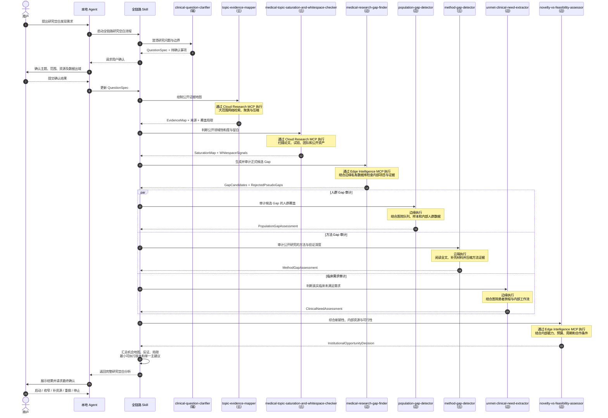

# 研究空白发现 Agent 端—边—云协同设计

> 文档目的：说明研究空白发现全链路中每个 Skill 的职责、部署位置与放置理由，并给出本地 Agent、云端 Skill 和边缘 Skill 之间的完整时序。  
> 适用范围：医院、药企或研发机构内的研究方向探索、候选 Gap 审计和 POC 立项前评估。  
> 日期：2026-09-07

---

## 1. 设计结论

整体采用“本地全链路 Skill + 云端研究 MCP + 边缘智能 MCP”的架构。

- **本地 Agent** 负责理解用户需求、加载全链路 Skill、调用各个专业 Skill、维护任务状态、检查数据边界并展示结果。
- **全链路 Skill** 只保留在本地，它规定 Skill 的调用顺序、输入输出契约、质量门、数据出域规则和降级策略。
- **云端 Skill** 通过 Cloud Research MCP 对本地 Agent 暴露，处理公开证据的大规模检索、长上下文阅读、聚类、比较和压缩。
- **边缘 Skill** 通过 Edge Intelligence MCP 对本地 Agent 暴露，访问医院或公司的私有数据库，完成内部证据融合和机构级机会判断。
- **用户** 在端侧确认研究范围、数据出域和最终决策。

云端只回答“公开世界中研究到了哪里”；边缘回答“这个 Gap 对本机构是否仍然成立、是否值得做”；本地 Agent 负责把两者组织成用户可确认的结论。

---

## 2. Skill 是业务步骤，MCP 是部署边界

本设计的业务时序以 Skill 为主体，不把 MCP 或数据库画成与 Skill 并列的业务步骤。

- Skill 说明“专业上要做什么、如何判断、应该输出什么”。
- MCP 说明“这个 Skill 的能力在哪里运行、如何被本地 Agent 调用”。
- 数据库是边缘 Skill 的内部依赖，不直接对本地 Agent 或云端开放。

如果 MCP 只暴露 `search_database` 一类低层查询工具，专业 Skill 仍需要保留在本地执行；本方案假设云端和边缘 MCP 暴露的是完整专业能力，因此对应 Skill 的完整实现跟随各自服务部署，本地不再复制。

---

## 3. Skill 归属总览

| Skill                                             | 执行位置 | 暴露方式              | 核心原因                                              |
| ------------------------------------------------- | -------- | --------------------- | ----------------------------------------------------- |
| `clinical-question-clarifier`                     | 端       | 本地 Skill            | 需要高频用户交互、范围确认和出域授权                  |
| `topic-evidence-mapper`                           | 云       | Cloud Research MCP    | 公开文献量大，需要高并发检索、聚类和长上下文压缩      |
| `medical-topic-saturation-and-whitespace-checker` | 云       | Cloud Research MCP    | 需要同时扫描论文、试验、团队、指南和公开资产          |
| `medical-research-gap-finder`                     | 边       | Edge Intelligence MCP | 正式 Gap 要同时考虑公开证据、内部项目和未公开结果     |
| `population-gap-detector`                         | 边       | Edge Intelligence MCP | 可执行的人群 Gap 取决于内部队列、样本、随访和伦理条件 |
| `method-gap-detector`                             | 云       | Cloud Research MCP    | 多篇全文、补充材料和方法比较会大量消耗网络与上下文    |
| `unmet-clinical-need-extractor`                   | 边       | Edge Intelligence MCP | 真实临床需求要结合本院患者旅程、工作流程和内部痛点    |
| `novelty-vs-feasibility-assessor`                 | 边       | Edge Intelligence MCP | 可行性依赖内部数据、样本、设备、预算、周期和合作能力  |

其中，“端”指用户本机上的 Agent Runtime 与交互界面；“边”指医院或公司内网中的受控服务；“云”指可访问公开网络并承担大规模研究计算的服务。

---

## 4. 本地全链路 Skill

### 4.1 做什么

全链路 Skill 是研究空白发现 Agent 的编排契约，它不重复实现各个专业 Skill 的内部算法，只负责：

1. 启动研究空白任务并维护 `ResearchCase` 状态。
2. 调用 `clinical-question-clarifier`，生成经用户确认的 `QuestionSpec`。
3. 判断数据敏感度，生成允许出域的 `PublicQuestionSpec`。
4. 按顺序调用云端和边缘 Skill。
5. 验证每个结果的 Schema、来源、日期、版本和覆盖局限。
6. 在工具不可用时执行降级或阻断，不得把不完整结果包装为正式结论。
7. 向用户展示公开证据、内部重叠、反证、伪空白、候选机会和最小可执行版本。
8. 等待用户对“启动、收窄、补资源、重做或停止”作出最终确认。

### 4.2 为什么放在本地

- 全链路中含有用户原始意图、内部项目上下文和数据出域决策。
- 本地 Agent 是两个 MCP 的唯一编排者，云端与边缘服务不直接互相授权。
- 最终结果要回到用户端进行审批，不应由云端或边缘服务自动立项。

### 4.3 建议状态机

```text
question_drafting
→ awaiting_question_confirmation
→ public_research_running
→ public_gap_candidates_ready
→ institutional_audits_running
→ institutional_opportunity_ready
→ awaiting_human_decision
→ completed
```

---

## 5. 端侧 Skill

### 5.1 `clinical-question-clarifier`（端）

#### 做什么

- 从宽泛想法中提取疾病、人群、靶点、干预或暴露、结局、时间窗和研究用途。
- 判断问题是治疗、诊断、预后、预测、机制、因果、实施还是转化问题。
- 只追问会改变后续路线的关键问题。
- 明确范围内、范围外、资源限制和用户允许出域的字段。
- 输出通俗版、研究版和可检索版问题。

#### 为什么放在端

这个 Skill 的核心是人机交互与权限确认，而不是大规模计算。原始问题可能包含未公开靶点、项目代号和内部资源线索，必须先在本地完成确认和脱敏，再进入云端流程。

#### 主要输出

```text
QuestionSpec
PublicQuestionSpec
OutOfScope
DataBoundaryDecision
```

---

## 6. 云端 Skill

云端 Skill 使用公开或经脱敏的问题，不得访问内部项目、患者、样本、预算、未公开实验和企业资产数据。

### 6.1 `topic-evidence-mapper`（云）

#### 做什么

- 根据 `PublicQuestionSpec` 构建多轮公开检索。
- 获取论文、指南、系统综述、试验注册和公开数据集信息。
- 去重并按机制、诊断、预测、治疗、人群、终点和方法类型聚类。
- 识别高、中、稀疏和很稀疏的证据区域。
- 生成可供后续饱和度分析和 Gap 审计使用的证据地图。

#### 为什么放在云

- 证据制图可能涉及几十到几百篇公开材料，网络请求和上下文消耗最高。
- 云端更适合执行并发检索、批量文本处理、向量聚类和跨文献对比。
- 输入可限定为公开主题，不需要上传内部资料。

#### 主要输出

```text
PublicEvidenceMap
EvidenceClusters
SourceRecords
CoverageLimitations
SearchRunMetadata
```

### 6.2 `medical-topic-saturation-and-whitespace-checker`（云）

#### 做什么

- 检索论文数量与时间趋势、关键团队、临床试验、指南位置和公开管线。
- 判断领域是真正饱和、表面拥挤、战略占位还是仍有有效留白。
- 识别重复研究模板、声明拥挤、验证深度不足和转化断点。
- 为每个 Whitespace Signal 保留支持证据和反证。

#### 为什么放在云

饱和度不能只数论文，需要跨类型、跨来源、跨时间检索论文、试验、团队、指南和资产。这是公开网络访问量最大、时间序列比较最多的节点，适合云端运行。

#### 主要输出

```text
PublicSaturationMap
WhitespaceSignals
SupportingEvidence
CounterEvidence
PublicCompetitionSignals
```

### 6.3 `method-gap-detector`（云）

#### 做什么

- 阅读候选方向的代表性论文全文、补充材料、协议、代码和数据说明。
- 分开审计研究设计、偏倚控制、分析严谨度、验证深度、复现完整度和可迁移性。
- 区分内部验证、外部验证、正交验证和前瞻性验证。
- 找出真正限制现有结论的主要方法弱点，而不是简单追加更复杂技术。

#### 为什么放在云

- 全文、补充材料和代码仓库会快速扩大上下文。
- 方法审计需要跨文献比较大量步骤、参数和验证关系。
- 输入主要是公开文献和公开仓库，可与内部方法材料隔离。

#### 主要输出

```text
PublicMethodGapAssessment
ValidationDepth
ReproducibilityIssues
HighestImpactWeaknesses
SourceLocations
```

---

## 7. 边缘 Skill

边缘 Skill 位于医院或公司内网，通过受控身份访问内部证据。它们可接收云端返回的公开证据摘要，但不应将内部原始数据反向传给云端。

### 7.1 `medical-research-gap-finder`（边）

#### 做什么

- 接收云端的证据地图和留白信号。
- 查询内部历史项目、在研项目、未公开结果、内部决策和专利状态。
- 按知识、证据、一致性、人群、阶段、方法、验证、转化和实施类型生成候选 Gap。
- 拒绝“只是论文少”、“本单位没发表过”、“只是换算法”等伪空白。
- 判断公开 Gap 是否被内部研究覆盖、部分覆盖或被内部反证否定。

#### 为什么放在边

一个公开 Gap 可能已经被内部部门研究过，也可能存在未发表的阴性结果。只有访问边缘私有数据，才能把“公开留白”转化为“本机构仍然有效的研究机会”。

#### 主要输出

```text
InstitutionalGapCandidates
InternalOverlapStatus
InternalCounterEvidence
RejectedPseudoGaps
GapConfidence
```

### 7.2 `population-gap-detector`（边）

#### 做什么

- 审计年龄、性别、疾病阶段、治疗线次、合并症、地区和其他有意义的人群轴。
- 将公开文献的人群覆盖与内部队列、样本、随访和数据资产匹配。
- 区分缺失人群、低代表人群、被总体平均掩盖的亚组、冲突亚组和无独立验证亚组。
- 拒绝没有生物学、临床或实施意义的装饰性分层。
- 判断本机构是否真正具有研究该人群的条件。

#### 为什么放在边

公开文献只能说明外部人群覆盖情况，无法知道本院是否有足够病例、样本、纵向随访、特定测定或伦理许可。这些数据敏感且直接影响 Gap 是否可执行，因此主判断必须留在边缘。

#### 主要输出

```text
InternalPopulationCoverage
PriorityPopulationGaps
SampleAvailability
EthicsConstraints
PopulationFeasibility
```

### 7.3 `unmet-clinical-need-extractor`（边）

#### 做什么

- 将公开指南和共识中的临床需求与本院的患者旅程和真实工作流程对照。
- 定位痛点发生在早筛、诊断、分层、选药、疗效预测、监测、复发、耐药、安全性还是实施环节。
- 结合内部科室流程、转诊、检测可及性和现实失败点判断需求强度。
- 拒绝“疾病负担大，所以需要更多研究”一类无具体决策点的结论。

#### 为什么放在边

临床需求不只存在于指南文字中，还存在于本院真实流程、患者构成、检测条件和部门协作中。这些信息多为非公开运营数据，应在边缘处理。

#### 主要输出

```text
InstitutionalPatientJourney
ClinicalFailurePoints
SpecificUnmetNeeds
DecisionImpact
MeasurableEndpoints
```

### 7.4 `novelty-vs-feasibility-assessor`（边）

#### 做什么

- 结合云端的公开新颖性信号和边缘的内部资源。
- 分开评估问题、情境、方法、整合和转化新颖性。
- 审计数据、样本、算力、实验、验证、预算、周期和合作依赖。
- 为候选机会构造最小可执行版本、成功标准和失败条件。
- 在五档决策中只选择一个主建议：按原方案启动、收窄后启动、补资源后启动、大幅重做或不按当前形式启动。

#### 为什么放在边

“公开上新”不等于“本机构值得现在做”。启动判断要使用内部资源、预算、设备、样本、项目组能力和战略优先级，因此必须在边缘运行。边缘 Skill 只生成建议，最终批准仍在端侧完成。

#### 主要输出

```text
InstitutionalOpportunityDecision
MinimumExecutableVersion
ResourceDependencies
FailureConditions
DecisionRationale
```

---

## 8. 边缘私有数据库

### 8.1 应保存的内部信息

| 数据类型     | 例子                                       | 对 Gap 判断的影响                  |
| ------------ | ------------------------------------------ | ---------------------------------- |
| 内部项目     | 某部门已做、正在做或计划做的研究           | 识别内部重复和战略占位             |
| 未公开证据   | 阳性、阴性、冲突或无法复现的实验结果       | 支持、收窄或否定公开 Gap           |
| 内部数据资产 | 患者队列、样本、组学、影像、随访和临床数据 | 判断是否能回答候选问题             |
| 内部能力     | 实验平台、检测、算法、设备和合作单位       | 判断实验与验证路径是否可行         |
| 临床流程     | 科室转诊、检测、用药、监测和随访痛点       | 判断是否存在本机构的真实未满足需求 |
| 内部约束     | 预算、周期、伦理、合规、专利和合作条件     | 决定启动、收窄、补资源或停止       |
| 决策历史     | 立项、暂缓、否决、终止及原因               | 避免重复论证并保留审计上下文       |

### 8.2 建议的核心对象

```text
InternalProject
InternalEvidence
InternalDataAsset
InternalPopulationAsset
InternalCapability
InternalClinicalWorkflow
InternalConstraint
InternalDecision
PublicEvidenceDigest
ResearchCase
```

数据库优先保存结构化摘要、稳定 ID、权限、来源、时间和原始材料引用。患者明细、原始组学数据、大型 PDF 或实验文件应保留在原业务系统或受控对象存储中，边缘数据库只保存受控引用，不建议复制建设新的患者主数据库。

### 8.3 访问原则

- 边缘数据库不直接暴露给本地 Agent，所有访问都经过 Edge Intelligence MCP。
- MCP 必须在查询前执行用户、部门、项目和数据类别权限检查。
- 默认返回最小化摘要，只有在权限和任务目的都允许时才返回更详细内容。
- 每次查询和结论都保留调用人、时间、用途、访问字段、结果范围和版本日志。
- 云端 MCP 不能直接访问边缘数据库，也不能从边缘获得内部原文。

---

## 9. MCP 能力契约

### 9.1 Cloud Research MCP

建议暴露的高层能力：

```text
start_topic_evidence_mapping
start_saturation_whitespace_analysis
start_public_method_gap_audit
get_cloud_research_job
```

长任务使用异步 Job 模式。返回结果至少包含：

```json
{
  "job_id": "cloud-job-001",
  "service_version": "1.0.0",
  "skill_version": "1.0.0",
  "searched_at": "2026-09-07T10:00:00+08:00",
  "search_run_id": "search-run-001",
  "source_ids": ["PMID:...", "NCT:...", "DOI:..."],
  "supporting_evidence": [],
  "counter_evidence": [],
  "coverage_limitations": [],
  "digest": {},
  "artifact_ref": "artifact-001"
}
```

`digest` 用于进入本地 Agent 上下文；大型全量结果使用 `artifact_ref` 传递和落库，避免再次挤占本地 Agent 的上下文。

### 9.2 Edge Intelligence MCP

建议暴露的高层能力：

```text
create_research_case
find_institutional_research_gaps
analyze_internal_population_gaps
extract_institutional_clinical_needs
assess_institutional_novelty_feasibility
save_final_research_decision
```

边缘 MCP 返回的是经权限过滤后的机构级结论，例如：

```json
{
  "research_case_id": "case-001",
  "internal_overlap": "partial",
  "unpublished_evidence": "conflicting",
  "population_available": true,
  "clinical_need": "specific",
  "feasibility": "conditional",
  "blocking_reasons": ["缺少独立验证队列"],
  "recommended_decision": "narrow_and_start",
  "access_scope": "department-summary-only",
  "skill_version": "1.0.0"
}
```

---

## 10. Skill 级时序图

下图以每个 Skill 为业务泳道。Skill 名称后的“端、云、边”表示实际执行位置；Cloud Research MCP 和 Edge Intelligence MCP 是这些远程 Skill 的技术承载方式，不另外作为业务泳道。



---

## 11. 结果传递与上下文控制

云端不应把几百篇原文全部返回给本地 Agent。云端压缩必须是“可追溯的证据压缩”，而不是丢失来源的普通摘要。

建议将结果分成两层：

1. **Digest**：进入本地 Agent 上下文的结构化摘要，包含聚类、候选信号、支持证据、反证和覆盖局限。
2. **Artifact**：保存全量记录、详细抽取和原始来源索引，通过受控引用按需读取或导入边缘。

每个候选 Gap 都应保留以下反链：

```text
GapCandidate
→ SupportingClaim / CounterClaim
→ EvidenceRecord ID
→ PMID / DOI / NCT / URL
→ SearchRun
```

如果只有结论而没有可回查的证据 ID，该结果不得进入正式机构级 Gap 判断。

---

## 12. 隐私边界

本地 Agent 在任何云端 Skill 调用前，必须检查并移除：

- 患者和样本可识别信息；
- 内部项目名、项目代号和未公开靶点优先级；
- 未公开实验的原始结果；
- 合作方保密资料；
- 内部预算、资源缺口和人员信息；
- 不允许出域的原始文件或文件片段。

另外，“Agent Runtime 在本地”不自动等于“所有数据均不出域”。如果本地 Agent 使用远程模型 API，那么工具返回内容仍可能进入远程模型上下文。对高敏感内部证据，应使用本地/边缘模型完成融合，或由 Edge Intelligence MCP 只返回经权限过滤和最小化的判断。

---

## 13. 失败与降级

| 情况                                    | 处理方式                                                    |
| --------------------------------------- | ----------------------------------------------------------- |
| Cloud Research MCP 不可用               | 可降级为本地 Agent 的 Web Search 探索模式，并明确降低置信度 |
| 云端结果缺少来源 ID、检索日期或覆盖范围 | 不得进入正式 Gap 判断，需补检索或标记为探索性结果           |
| Edge Intelligence MCP 不可用            | 只能输出“公开候选 Gap”，不得声称为“本机构研究机会”          |
| 内部数据权限不足                        | 返回 `internal_status = unknown`，不得推断“内部无重复项目”  |
| 用户不允许问题出域                      | 跳过云端 Skill，或将问题抽象化后重新请求用户确认            |
| 公开证据与内部证据冲突                  | 同时展示支持与反证，降低置信度，不允许任一方自动覆盖另一方  |

---

## 14. POC 验收标准

1. 本地全链路 Skill 能按固定顺序调用端、云、边 Skill。
2. 云端 Skill 只接收 `PublicQuestionSpec`，不包含内部敏感字段。
3. 云端返回可追溯的来源 ID、检索日期、支持证据、反证和覆盖局限。
4. 边缘 `medical-research-gap-finder` 能识别已被内部项目覆盖的公开 Gap。
5. 内部数据权限不足时，结果显示“未知”而不是“不存在”。
6. `population-gap-detector` 能把公开人群空白与内部队列和样本可得性对照。
7. `unmet-clinical-need-extractor` 能将需求落到具体患者旅程和决策点。
8. `novelty-vs-feasibility-assessor` 只输出一个主建议，并附最小可执行版本和失败条件。
9. 最终报告区分“公开 Gap”和“本机构研究机会”。
10. 最终决策在端侧等待人工确认，任何 Skill 或 MCP 都不得自动完成立项。

---

## 15. 一句话总结

> 本地全链路 Skill 编排整个任务；云端 Skill 从公开世界中检索、阅读和压缩证据；边缘 Skill 结合私有数据判断这个公开 Gap 对本医院或公司是否仍然成立并值得执行；最终决策回到用户端。
