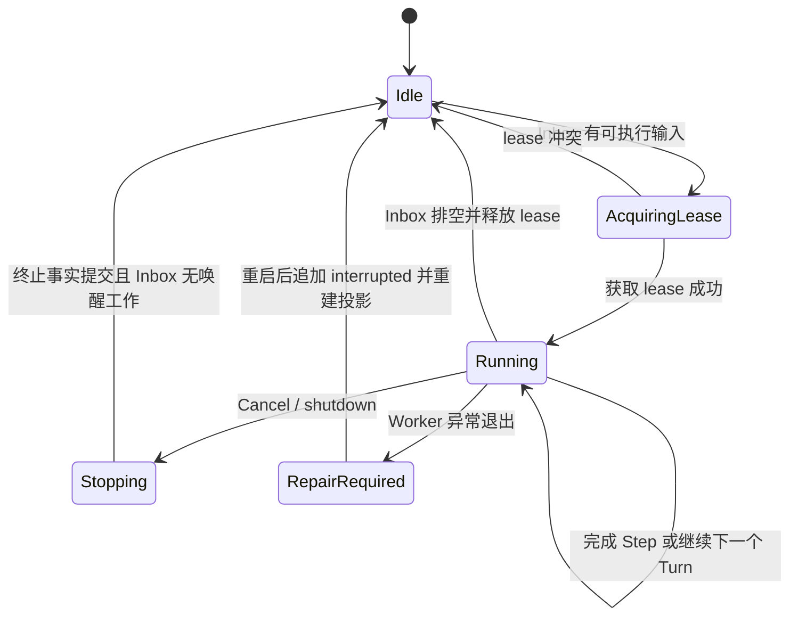
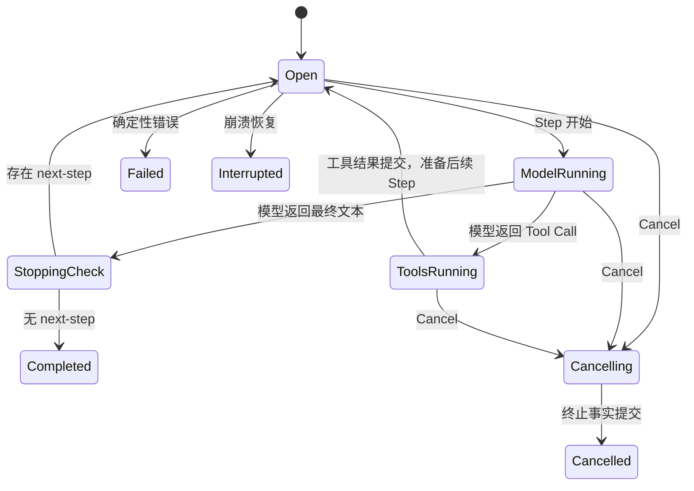
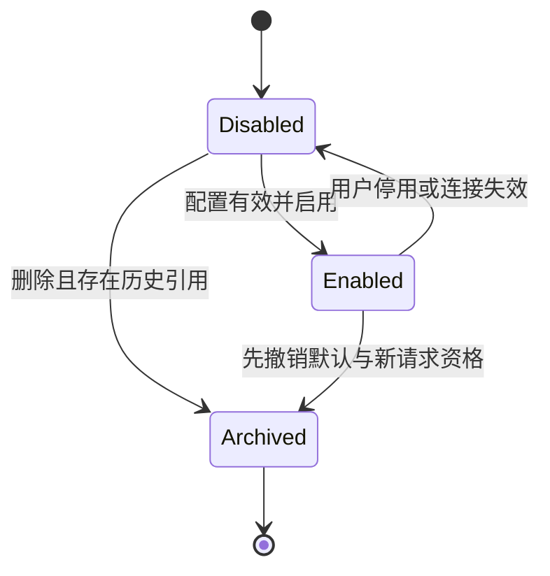
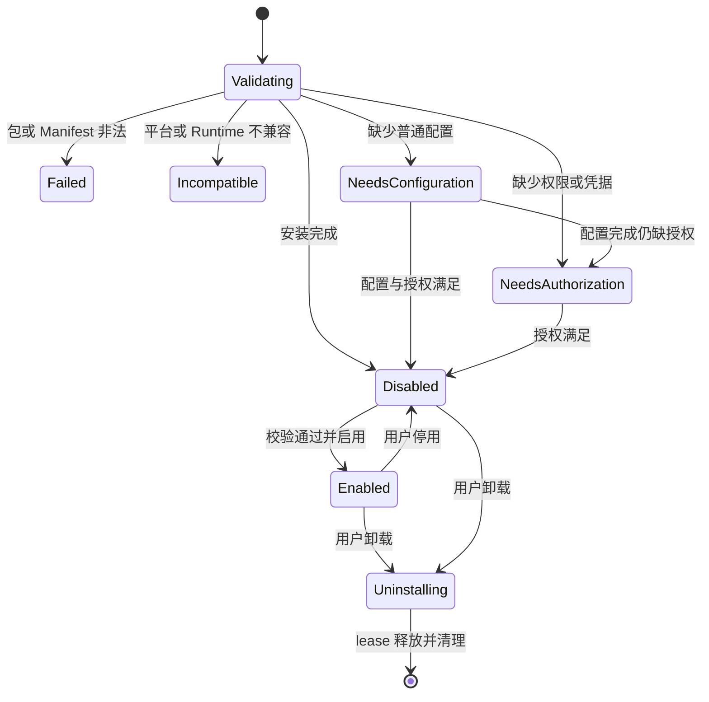

# 领域模型与状态机

## 1. 文档状态

- 状态：V1 待联合评审
- 范围：Client 应用领域、单 Agent Runtime、模型管理和 Skill 管理
- 不包含：具体 TypeScript 文件、ORM 模型和 UI 组件实现

## 2. 聚合与所有权

### 2.1 LocalUser

`LocalUser` 是所有用户私有数据的顶层作用域。V1 启动时确保两个稳定 ID 的内置用户存在。

```ts
interface LocalUser {
  id: LocalUserId;
  displayName: string;
  avatar?: string;
  status: 'active';
  createdAt: Timestamp;
  updatedAt: Timestamp;
}
```

不变量：

- V1 不能通过业务 API 创建或删除 LocalUser。
- Renderer 只能请求切换到 Main 已知的两个用户之一。
- Session、Model、SkillInstallation、Attachment 和配置引用恰好属于一个 LocalUser。

### 2.2 Session

`Session` 是 Runtime 事件流和用户会话的持久容器。

```ts
type SessionStatus = 'active' | 'archived' | 'deleted';

interface Session {
  id: SessionId;
  userId: LocalUserId;
  title: string;
  status: SessionStatus;
  nextSeq: number;
  version: number;
  lease?: SessionLease;
}
```

不变量：

- 所有 Session 操作使用 `(userId, sessionId)` 作用域。
- 一个 Session 同时最多存在一个活动 Driver 和一个开放 ExecutionTurn。
- `deleted` 第一版采用可恢复软删除；物理清理由后续数据保留策略决定。

### 2.3 Inbox

Inbox 保存已持久化接纳但尚未在安全边界领取的输入。

```ts
type InboxTarget = 'next-turn' | 'next-step';
type InboxSource = 'user' | 'runtime' | 'tool';

interface InboxItem {
  id: InboxItemId;
  sessionId: SessionId;
  target: InboxTarget;
  source: InboxSource;
  message: UserMessage;
  idempotencyKey: string;
  conversationEventId?: ConversationEventId;
  startNewEvent?: boolean;
  createdAt: Timestamp;
}
```

不变量：

- 同一 InboxItem 不能同时存在于两个 target。
- `queue` 写入 `next-turn`；`steer` 和内部 `inject` 写入 `next-step`。
- `promote` 保持同一 InboxItem ID，在单个原子 splice 中将已排队项从 `next-turn` 移至当前 `expectedTurnId` 的 `next-step`；它不 Cancel 当前模型或工具。
- Tool Result 不进入 Inbox。
- 重复 `idempotencyKey` 返回原接纳结果，不创建第二个 InboxItem。

### 2.4 ConversationEvent 与 ConversationExchange

`ConversationEvent` 表示同一事项的用户可见问答集合；`ConversationExchange` 表示其中一问一答。它们是从 Session Event 重建的读模型，不创建第二 Agent。

```ts
type ConversationEventStatus = 'open' | 'awaiting_user' | 'completed' | 'failed';
type ExchangeStatus = 'open' | 'completed' | 'interrupted' | 'failed';
```

不变量：

- 一个 Exchange 恰好关联一个 ExecutionTurn。
- Queue 默认创建新 Exchange；Steer 和被提升的 Queue Item 只补充当前开放 Exchange。
- `request_user_input` 恢复时在同一 ConversationEvent 下创建后续 Exchange。
- Summary 只能覆盖连续、已闭合 Exchange，不能改写原始问答。

### 2.5 ExecutionTurn 与 Step

```ts
type TurnEndReason =
  | 'completed'
  | 'cancelled'
  | 'blocked'
  | 'error'
  | 'max_output_tokens'
  | 'context_budget_exceeded'
  | 'max_steps'
  | 'interrupted';

type StepStatus = 'running' | 'completed' | 'cancelled' | 'error';
```

不变量：

- 一个 Turn 包含零个或多个顺序 Step。
- 一个 Step 只有一次主模型请求。
- 一个模型响应中的多个 Tool Call 全部收敛后，最多开启一个后续 Step。
- `interrupted` 只由恢复过程关闭遗留开放 Turn；运行期用户停止使用 `cancelled`。
- `max_output_tokens` 和 `max_steps` 不能伪装成 `completed`。

### 2.6 ModelService、Model 与 ModelConfigSnapshot

`ModelService`、`Model` 和 `UserModelSettings` 是用户配置事实；`ModelConfigSnapshot` 是 Step 使用的不可变解析结果。

```ts
type ModelServiceStatus = 'enabled' | 'disabled' | 'archived';
type ModelStatus = 'enabled' | 'disabled' | 'archived';

interface ModelConfigSnapshot {
  id: string;
  userId: LocalUserId;
  modelRevision: number;
  serviceId: ModelServiceId;
  modelId: ModelId;
  providerType: ProviderType;
  endpoint: string;
  credentialRef?: CredentialRef;
  parameters: ModelRequestParameters;
  capabilities: ModelCapabilities;
  promptEpoch: string;
}
```

不变量：

- defaultModelId 必须指向同用户、已启用且未归档的 Model。
- 已启动 Step 的 Snapshot 不因配置保存、用户切换或服务停用而改变。
- 凭据明文不进入 Snapshot、Session Event 或 Renderer。
- 被历史请求引用的 Model 只能归档，不能破坏审计展示。

### 2.7 SkillPackage、SkillInstallation 与 SkillRegistrySnapshot

`SkillPackage` 是内容寻址、不可变的受管包；`SkillInstallation` 是用户级安装和授权状态。

```ts
type SkillInstallationStatus =
  | 'validating'
  | 'needs_configuration'
  | 'needs_authorization'
  | 'disabled'
  | 'enabled'
  | 'incompatible'
  | 'failed'
  | 'uninstalling';

interface SkillRegistrySnapshot {
  id: string;
  userId: LocalUserId;
  skillRevision: number;
  tools: ResolvedToolDefinition[];
  packageLeases: PackageLease[];
  promptEpoch: string;
}
```

不变量：

- 只有 `enabled`、兼容、配置完整且授权满足的 Skill 才能贡献 Tool Schema。
- Tool 名称冲突时 fail closed，不允许后安装的 Skill 静默覆盖。
- 安装包校验阶段不得执行包代码。
- 停用阻止新的 Step 获取工具；卸载等待活动 package lease 释放后再删物理文件。
- 一个用户的安装、配置和凭据不能影响另一用户。

## 3. Runtime 状态机

### 3.1 Session Driver



### 3.2 ExecutionTurn



### 3.3 ModelService 与 Model



### 3.4 SkillInstallation



## 4. 跨聚合不变量

1. 所有用户私有实体必须能通过复合外键追溯到唯一 LocalUser。
2. Main 注入可信 User Context；Renderer 不能通过 payload 改写业务 `userId`。
3. 一个 Step 的 ModelConfigSnapshot 和 SkillRegistrySnapshot 必须来自同一时点可接受的用户配置 revision 集合。
4. Session Event Log 是运行事实来源，Configuration 表是设置事实来源；两者不能互相伪装。
5. UI 的永久状态只能来自正式 Query、Snapshot、Projection 或已持久化 Command 结果。
6. 运行中用户切换不取消旧用户后台 Turn，但旧用户事件不得进入新用户视图。
7. 任何恢复逻辑都不得自动重放结果不确定且非 replay-safe 的外部副作用。

## 5. 明确错误状态

跨模块统一使用稳定错误码，不依赖中文 message 做程序判断：

- `NOT_FOUND`：实体在当前用户作用域内不存在。
- `FORBIDDEN_SCOPE`：检测到跨用户或不可信作用域；外部 API 可按安全策略映射为 NOT_FOUND。
- `CONFLICT`：version、revision、lease 或当前状态冲突。
- `VALIDATION_FAILED`：输入或 Schema 无效。
- `CREDENTIAL_REQUIRED`：缺少所需凭据。
- `AUTHORIZATION_REQUIRED`：缺少 Skill/Tool 权限。
- `PROVIDER_UNAVAILABLE`：模型服务不可达或协议不兼容。
- `SKILL_INVALID`：Skill 包、Manifest 或 Tool Schema 无效。
- `SKILL_INCOMPATIBLE`：平台或 Runtime 版本不兼容。
- `CONFIGURATION_INVALID`：默认模型或 Runtime 配置不能用于新 Step。
- `RUNTIME_BUSY`：操作不允许在当前运行边界执行。
