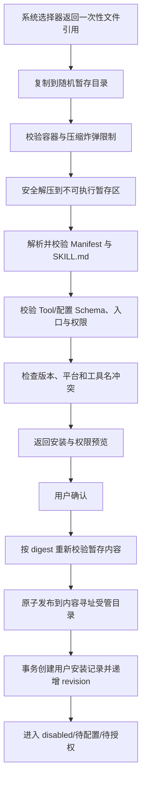

# Skill 管理详细设计

> 状态：早期草案，已部分过时，不得直接用于实现。当前总体方向已经改为兼容通用 Agent Skills（`SKILL.md`，可选 `scripts/`、`references/`、`assets/`），脚本通过 Runtime 的通用命令能力交给宿主机 Node/Python/Shell 执行，不强制自定义 `skill.json`，也不建设独立 Skill Runner、自动运行时安装或依赖管理。本文件将在进入 Skill 管理开发阶段时由该阶段完整技术落地方案替代。

## 1. 产品范围

V1 Skill 管理支持当前用户从本地包完成：

- 选择、静态检查和安装预览。
- 安装、普通配置、凭据绑定和权限授权。
- 搜索、详情、受控文件预览、启停和 Tool Registry 注册。
- 本地包升级、导出和卸载。

V1 不包含在线市场、远程自动更新、任意插件修改 Agent Loop、安装期间执行脚本或未经声明的动态工具注册。

## 2. V1 包格式

V1 正式容器选择单个 `.zip` 文件。压缩包解开后只有一个 Skill 根目录，必须包含：

```text
<skill_id>/
  SKILL.md
  skill.json
  scripts/          # 可选，仅允许 Manifest 声明的入口
  references/       # 可选，只读资料
  assets/           # 可选，只读资源
  LICENSE           # 可选
  README.md         # 可选
```

V1 不接受 `.tar.gz`、单独 `.json` 或任意目录作为正式安装输入。参考 UI 的可选格式需要据此调整；未来增加格式时必须复用同一逻辑 Manifest 和安全校验。

包限制：

- zip 文件最大 50 MiB。
- 解压后总大小最大 200 MiB。
- 文件数最大 2,000。
- 目录深度最大 20，单个相对路径最大 240 字符。
- 禁止绝对路径、`..`、NUL、设备文件、硬链接和符号链接。
- 文件名按目标平台规范化后不能重复；大小写不敏感平台也必须检查冲突。
- `skill.json`、`SKILL.md` 和所有文本 Schema 使用 UTF-8。

## 3. Manifest

`skill.json` V1 逻辑结构：

```json
{
  "schemaVersion": 1,
  "id": "example_search",
  "name": "示例搜索",
  "description": "在指定服务中搜索信息",
  "version": "1.0.0",
  "runtime": {
    "minVersion": "1.0.0",
    "platforms": ["darwin-arm64", "darwin-x64", "win32-x64"]
  },
  "permissions": [{ "id": "network", "hosts": ["api.example.com"], "reason": "调用搜索服务" }],
  "secrets": [{ "name": "API_KEY", "required": true, "description": "示例服务密钥" }],
  "configurationSchema": {
    "type": "object",
    "properties": {},
    "additionalProperties": false
  },
  "tools": [
    {
      "name": "example_search",
      "description": "搜索指定关键词",
      "entry": "scripts/example-search.js",
      "inputSchema": { "type": "object" },
      "outputSchema": { "type": "object" },
      "timeoutMs": 30000,
      "replaySafe": true,
      "concurrency": "parallel-safe"
    }
  ]
}
```

规则：

- `id` 使用小写字母、数字和连字符/下划线的受限格式，目录名必须与 id 一致。
- version 使用 SemVer。
- tool name 在当前用户最终 Registry 内唯一。
- entry 必须是包内相对路径，并位于允许的 `scripts/` 根下。
- input/output 是有效 JSON Schema object；禁止远程 `$ref`。
- configurationSchema 禁止把 secret 当普通字段。
- permissions 与 secrets 必须完整声明，运行时不得追加隐藏权限。
- `SKILL.md` 用于向 Agent 描述用途、适用/不适用场景和调用注意事项，不得包含密钥。

## 4. 权限模型

V1 权限类别：

| 权限                  | 默认         | 约束                                                                 |
| --------------------- | ------------ | -------------------------------------------------------------------- |
| `network`             | 拒绝         | 必须声明 host allowlist；IP、重定向和 DNS 策略由 Tool Adapter 再校验 |
| `filesystem.read`     | 拒绝         | 只能通过用户授权的受控根或文件引用                                   |
| `filesystem.write`    | 拒绝         | 独立授权，默认 exclusive                                             |
| `process.spawn`       | 拒绝         | V1 默认不对第三方 Skill 开放；若开放需独立 ADR                       |
| `credential.use`      | 拒绝         | 只注入 Manifest 声明且当前用户已绑定的 secret                        |
| `interaction.request` | 允许受控调用 | 只能使用正式 Interaction Schema                                      |

授权对象包含 permission id、收窄后的资源范围、Manifest 版本和用户确认时间。Skill 升级扩大权限、增加 secret 或改变 Tool Schema 时必须重新确认；权限收窄可以保留兼容授权。

## 5. 安装管线



安装检查期间不得：

- import/require Skill 入口。
- 执行 `postinstall`、shell、Node 或其他脚本。
- 从网络下载依赖或资源。
- 读取压缩包声明范围之外的文件。
- 将文件写入最终受管目录。

## 6. 包存储与摘要

受管路径按内容摘要组织：

```text
app-data/skills/packages/sha256/<digest>/
```

摘要覆盖规范化文件路径、类型、长度和内容，不能只对 zip 原始字节计算后忽略解压差异。发布后 package 只读；升级产生新 digest，不原地覆盖旧包。

共享不可变包缓存不等于共享用户安装：

- 用户列表从 skill_installations 开始查询。
- 用户 B 不因用户 A 安装而看到包元数据。
- secret、配置、授权和启用状态永不进入 skill_packages。

## 7. 配置与 Secret

普通配置：

- 根据 configurationSchema 校验。
- 保存在 `skill_settings.config_json`。
- 保存时拒绝未知字段和疑似 secret 字段。

Secret：

- 以 Manifest secret name 建立 `skill_secret_bindings`。
- OS Credential namespace：`<app>/user/<userId>/skill/<installationId>/<secretName>`。
- Tool 执行时由受信 Tool Adapter 按名称注入，不进入模型参数、Tool Args、Event Log 或 Renderer。
- Query 只返回 required/configured/optional mask。

## 8. 启用与 Tool Registry

启用前检查：

1. installation 属于当前用户且 package digest 有效。
2. Runtime 和平台兼容。
3. 普通配置 Schema 合法。
4. required secret 均已绑定。
5. permission grants 覆盖 Manifest 要求且未过期。
6. Tool name 不与内置工具或其他启用 Skill 冲突。
7. 每个 Tool 的 input/output Schema、timeout、replaySafe 和并发分类有效。

Registry 解析：

```ts
interface ResolvedToolDefinition {
  name: string;
  description: string;
  inputSchema: JsonSchema;
  outputSchema: JsonSchema;
  timeoutMs: number;
  replaySafe: boolean;
  isConcurrencySafe(args: JsonValue): boolean;
  permissionScope: ResolvedPermissionScope;
  executorRef: { packageDigest: string; entry: string };
}
```

Manifest 的 `parallel-safe` 只是候选声明。Runtime 对参数相关资源无法证明安全时仍返回 exclusive；分类函数异常时 fail closed。

## 9. Tool 执行边界

- Tool Scheduler 只执行 SkillRegistrySnapshot 中已解析定义。
- 执行前再次验证 userId、安装状态快照、权限范围和 Args Schema。
- 执行环境不能直接访问 Credential Store；只能接收当前调用明确允许的 secret handle/value。
- 输出先校验 outputSchema，再归一化为统一 ToolResult。
- AbortSignal、timeout 和日志关联字段贯穿 Adapter。
- Tool 不得自行向 Session EventStore 追加任意事件，只能返回结果或受控 Interaction。
- 第三方代码隔离等级是阶段 1 必须通过 Spike/ADR 确认的实现问题；在没有可靠隔离前，不得宣传安装未知 Skill 是安全沙箱。

## 10. 停用、升级与卸载

### 10.1 停用

- 事务将 installation 设为 disabled，skill_revision + 1。
- 新 Step 不再获得对应工具。
- 已启动 Tool Call 使用原 SkillRegistrySnapshot 和 package lease，按 Cancel/timeout 策略结束。

### 10.2 升级

- 对新包完整执行 inspect 管线。
- 展示 version、Tool Schema、权限、secret 和文件摘要差异。
- 扩权必须重新授权。
- commit 原子切换 installation 的 package_digest 与 configVersion。
- 旧包保留到所有 lease 释放且无其他安装引用。
- 配置迁移不能执行包内任意脚本；V1 仅支持声明式兼容或要求用户重新配置。

### 10.3 卸载

```text
enabled/disabled
→ uninstalling
→ Registry 撤销并 revision + 1
→ 等待活动 lease
→ 删除用户设置和 secret binding
→ 删除 installation
→ 无引用时清理 package
```

Credential Store 删除失败时记录可重试清理任务和诊断，不应重新启用 Skill。

## 11. 详情与文件预览

- UI 文件树来自安装时记录的规范化清单，不直接递归用户文件系统。
- preview 只允许 package 内普通文件和 allowlisted 文本类型。
- 二进制显示元数据，不直接渲染执行内容。
- 单次预览有字节上限和分页/范围参数。
- HTML/SVG 等主动内容以文本或安全 sandbox 方式展示，不能注入 Renderer DOM。
- 导出从受管包重新生成，不包含用户配置、permission grants 或 secrets。

## 12. 安装修复

应用启动检查：

- 清理超过 TTL 且没有活动 inspectToken 的 staging 目录。
- 数据库引用但 managed path 缺失：installation 标记 failed，Registry 拒绝加载。
- managed package 无数据库引用：超过保留期后清理。
- package digest 不匹配：标记 failed 并安全告警，不执行。
- uninstalling 且无 lease：继续完成删除。

## 13. UI Snapshot

```ts
interface SkillManagementSnapshot {
  userId: LocalUserId;
  revision: number;
  installations: Array<{
    id: string;
    skillId: string;
    name: string;
    description: string;
    version: string;
    status: SkillInstallationStatus;
    enabled: boolean;
    requiresAuthorization: boolean;
    requiresConfiguration: boolean;
    toolCount: number;
    compatibility: 'compatible' | 'incompatible' | 'unknown';
  }>;
}
```

切换用户时清除旧用户的搜索结果、选中详情、installToken、未提交配置和 secret 输入。

## 14. Skill 管理验收

- zip slip、压缩炸弹、符号链接、重复规范化路径和超限包全部在执行前拒绝。
- 安装检查不会执行包代码或访问网络。
- Tool 名称冲突、缺少配置、缺少授权和不兼容均 fail closed。
- 用户 A 的安装、文件树、secret 状态和 Registry 对用户 B 不可见。
- 安装失败不留下可注册半安装状态。
- 停用后新 Step 不含工具，旧 Step 行为遵守快照与 lease。
- 升级扩权必须重新确认，不能静默沿用旧授权。
- 卸载不会删除活动 Tool Call 仍使用的包。
- 导出包不包含用户配置或凭据。
