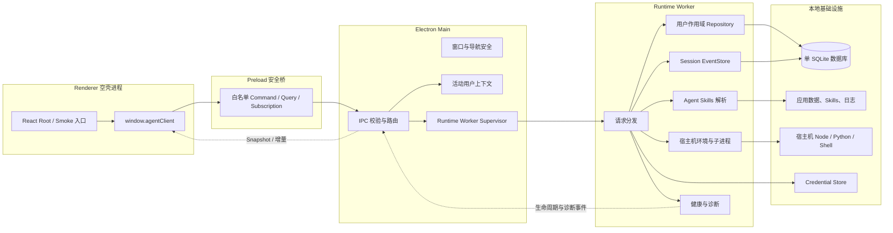
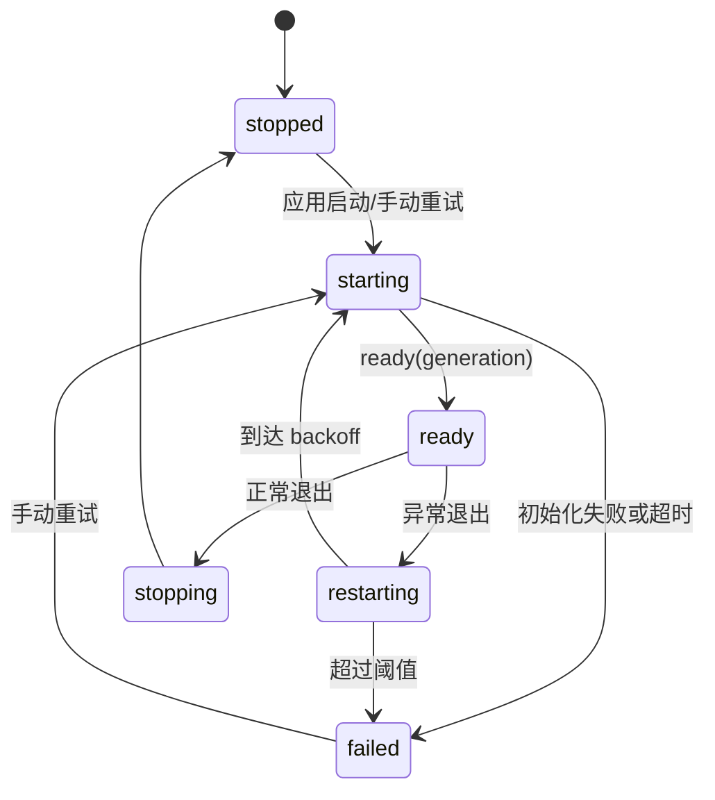
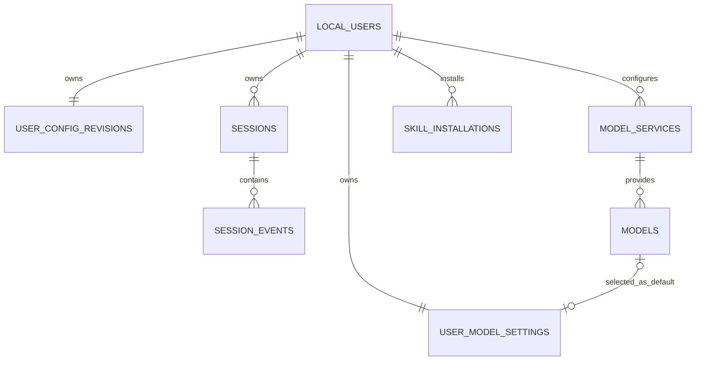

# 阶段 1：Client 基础运行平台开发架构设计

- 文档状态：待评审
- 所属阶段：阶段 1（Client 基础运行平台落地）
- 更新日期：2026-08-18
- 上位方案：`docs/Agent Client完整技术解决方案.md`
- 配套测试：`docs/阶段方案/阶段1-Client基础运行平台测试用例.md`

## 1. 文档目的

本文档定义阶段 1 的正式开发范围、技术架构、功能模块、业务流程、SQLite 表结构、模块实现程度和验收边界。评审通过后，阶段 1 的工程实现和测试以本文档为依据。

阶段 1 只建设完整 Client 后续开发所需的运行底座，不实现单 Agent Runtime 的 Turn/Step Loop，也不制作临时聊天业务逻辑。本文中的 `Runtime Worker` 是 Electron 内部承载本地 Node 能力的 Worker Thread，不是 Agent Worker、Subagent 或多 Agent 执行单元。

阶段 1 不开发产品 UI。Renderer 只保留能成功挂载 React、调用 Preload 和完成自动化 Smoke Test 的空壳入口，不实现启动状态页、诊断页、用户切换界面或任何 `reference_ui` 复刻。

## 2. 阶段目标与边界

### 2.1 阶段目标

1. 建立 Electron + React + Vite + TypeScript strict 单包工程。
2. 建立 Renderer、Preload、Electron Main、Runtime Worker 四个正式入口。
3. 建立 Worker 创建、就绪、异常退出检测、重新创建和 IPC 重连。
4. 建立强类型 Command、Query、Subscription Bridge 基础协议。
5. 初始化两个内置本地用户，并建立可信活动用户上下文。
6. 建立单 SQLite、migration、用户隔离 Repository、Session EventStore 和配置 Repository。
7. 建立模型与 Skill 配置持久化基础，但不完成其正式产品页面和外部调用。
8. 建立标准 Agent Skills 目录解析、宿主机 Node/Python/Shell 探测和受控子进程基础能力。
9. 建立 Credential Store 抽象、日志、诊断、测试 Harness 和 CI 门禁。

### 2.2 阶段交付物

- 正式工程脚手架和构建配置。
- 四个运行入口及通信实现。
- Runtime Worker Supervisor。
- Stage 1 Bridge Contract 与 Schema。
- SQLite 基础 migration 和 Repository。
- 两个内置用户及切换能力。
- EventStore 基础实现。
- Model/Skill 配置 Repository 基础实现。
- Skill 目录解析器和宿主机环境探测器。
- Credential Store、结构化日志、健康检查和诊断 Snapshot。
- Headless Platform Harness 和阶段 1 自动化测试。

### 2.3 本阶段明确不实现

- Agent Turn、Step、Inbox、Queue、Steer、Inject、Cancel 状态机。
- 模型请求、流式响应、Tool Call Loop 和 Context Projector。
- Worker 重启后的运行中 Turn 修复、Tool 副作用判定和任务续跑。
- 完整聊天、模型管理、Skill 管理产品 UI。
- 启动状态、诊断信息、用户切换等阶段性临时 UI。
- ModelScope、ClawHub 在线搜索、下载、更新和账号能力。
- Skill 专用 Runner、独立虚拟环境、容器或自动安装依赖。
- 将 Skill 脚本动态注册成原生 Tool Plugin。
- 正式发布签名、公证和自动更新。

### 2.4 实现程度定义

| 等级     | 含义                                                 |
| -------- | ---------------------------------------------------- |
| 完整实现 | 完成生产代码、错误处理、测试和验收，后续直接复用     |
| 基础实现 | 完成本阶段需要的正式能力和扩展接口，后续接入完整业务 |
| 接口预留 | 只定义稳定端口，不实现尚未进入本阶段的业务行为       |
| 不实现   | 明确排除，不允许用临时代码或 Mock 伪装完成           |

## 3. 技术架构

### 3.1 阶段架构图



### 3.2 进程职责

| 运行位置       | 阶段 1 职责                                                       | 禁止事项                                              |
| -------------- | ----------------------------------------------------------------- | ----------------------------------------------------- |
| Renderer       | 挂载空 React Root，供 Bridge 和安全边界 Smoke Test 使用           | 产品 UI、Node、SQLite、Credential、绝对路径、任意 IPC |
| Preload        | 暴露固定 API，固定 channel，轻量结构检查                          | Repository、活动用户事实、原始 `ipcRenderer`          |
| Electron Main  | 窗口、安全策略、活动用户、IPC 权威校验、Worker 监护               | Agent Loop、SQLite 业务写入、模型调用、Skill 脚本执行 |
| Runtime Worker | migration、Repository、EventStore、Skill 解析、环境探测、健康服务 | DOM、窗口操作、运行中 Agent 任务恢复                  |

### 3.3 主数据流

```text
Renderer 发起固定 Query/Command
→ Preload 使用固定 channel 转发
→ Main 校验 sender、Schema 和活动用户
→ Main 注入 TrustedRequestContext
→ Runtime Worker 执行 Service/Repository
→ Worker 返回结构化结果
→ Main 校验 generation 和响应 Schema
→ Renderer Smoke Harness 验证返回结果
```

Worker 生命周期事件不进入 SQLite 业务表：

```text
Main 创建 Worker
→ Worker migration、seed、初始化基础服务
→ Worker ready(generation)
→ Main 开放请求
→ Worker 异常退出
→ Main 使旧 generation 失效并发布 restarting
→ Main 创建新 Worker
→ 新 Worker ready
→ Renderer 重新查询 app.bootstrap
```

## 4. 功能模块总览

| 编号 | 功能模块                  | 阶段 1 交付                                        | 相关表                                                                     | 实现程度                      |
| ---- | ------------------------- | -------------------------------------------------- | -------------------------------------------------------------------------- | ----------------------------- |
| M01  | 工程脚手架与构建          | 单包工程、四入口构建、开发/测试/打包配置           | 无                                                                         | 完整实现                      |
| M02  | Electron Client Shell     | BrowserWindow、CSP、导航和权限基线                 | `app_settings`（仅活动用户）                                               | 完整实现                      |
| M03  | Runtime Worker Supervisor | 创建、ready、异常检测、重建、generation、重连      | 无；状态仅在内存/日志                                                      | 完整基础设施；不含 Agent 恢复 |
| M04  | Client Bridge 与 IPC      | Stage 1 Command/Query/Subscription、Schema、错误码 | 不直接读表                                                                 | 完整实现 Stage 1 契约         |
| M05  | 双用户与 User Context     | 两个用户初始化、活动用户切换、隔离                 | `local_users`、`app_settings`、`user_config_revisions`                     | 完整实现                      |
| M06  | SQLite 与 migration       | 单库、PRAGMA、migration、事务                      | `schema_migrations` 及全部阶段 1 表                                        | 完整实现                      |
| M07  | Session 与 EventStore     | Session、仅追加事件、回放和版本冲突                | `sessions`、`session_events`                                               | 基础实现；无 Agent 事件生产者 |
| M08  | Model 配置基础            | 服务、模型、默认模型、revision Repository          | `model_services`、`models`、`user_model_settings`、`user_config_revisions` | 基础实现；无 Provider/UI      |
| M09  | Skill 配置基础            | 标准目录解析、安装记录、Catalog 摘要               | `skill_installations`、`user_config_revisions`                             | 基础实现；无市场/脚本业务流程 |
| M10  | Credential Store          | 用户命名空间、读写删除端口、脱敏状态               | SQLite 只在业务表保存 `credential_ref`                                     | 基础实现；无设置 UI           |
| M11  | 宿主环境与子进程          | Node/Python/Shell 探测、spawn、取消和输出采集      | 无                                                                         | 基础实现；不暴露模型工具      |
| M12  | 日志与诊断                | 结构化日志、脱敏、健康 Snapshot                    | 无独立业务表                                                               | 完整实现 Stage 1 范围         |
| M13  | 测试 Harness 与 CI        | 临时环境、Fixture、测试矩阵和门禁                  | 使用临时数据库                                                             | 完整实现                      |

## 5. 功能模块详细设计

### 5.1 M01 工程脚手架与构建

#### 业务设计

开发者使用统一命令启动 Electron/Renderer，执行类型检查、Lint、测试、生产构建和基础打包验证。工程保持单 `package.json`，阶段 1 不拆 monorepo。

#### 目标结构

```text
src/
  main/                 Electron Main 与 Worker Supervisor
  preload/              contextBridge 与固定 IPC 客户端
  client-contracts/     Renderer-safe DTO、Schema 与纯投影
  worker/               Runtime Worker 入口与应用服务
  runtime/              后续 Agent Runtime；本阶段只放端口
  infrastructure/       SQLite、Credential、文件、进程、日志
  shared/contracts/     IPC、Schema、错误码、DTO
  shared/domain/        用户、Session、配置基础类型
ui/
  index.html             Vite Renderer 入口
  src/                   React 入口与 UI 代码
tests/
  unit/
  integration/
  e2e/
  fixtures/
resources/
scripts/
```

#### 实现要求

- TypeScript strict；禁止用隐式 `any` 绕过 Contract。
- Main、Preload、Renderer、Worker 分别构建，Node 依赖不能进入 Renderer。
- UI 使用独立 `tsconfig.ui.json`，且只能静态依赖 `src/client-contracts`；核心调用必须经过 Preload 白名单桥。
- 开发模式支持 Renderer 热更新；Main/Worker 变更受控重启应用。
- 生产构建不包含 `reference_ui`。
- 真实密钥不进入 `.env.example` 或构建产物。

#### 表结构与实现程度

无表。脚手架和构建在本阶段完整实现。

### 5.2 M02 Electron Client Shell 与安全基线

#### 业务设计

应用创建主窗口，Renderer 只能加载本地空壳入口并访问 Preload 固定 API。阶段 1 不渲染 Runtime 状态、用户切换、版本、数据库状态或解释器结果；这些数据只通过 Contract/Headless/Smoke Test 验证。

#### 安全要求

- `nodeIntegration: false`、`contextIsolation: true`、Renderer sandbox 开启。
- 禁止不受控导航、新窗口、远程脚本和任意外部协议。
- 配置严格 CSP；Main 校验全部 IPC sender。
- DevTools 只在开发配置开放。

#### 表结构与实现程度

窗口状态不进业务数据库。活动用户写入 `app_settings`。安全基线和空壳入口完整实现；全部产品 UI 不实现。

### 5.3 M03 Runtime Worker Supervisor

#### 业务设计

Runtime Worker 承载 SQLite 和本地 Node 能力，避免阻塞 Electron Main。Main 是其生命周期唯一所有者。

#### 状态机



#### 内存字段

```ts
interface RuntimeWorkerState {
  status: 'stopped' | 'starting' | 'ready' | 'restarting' | 'failed' | 'stopping';
  generation: number;
  startedAt?: string;
  readyAt?: string;
  restartAttempt: number;
  lastExit?: { code?: number; reason: string; at: string };
  lastErrorCode?: string;
}
```

字段只存在于 Main 内存和日志，不建立 Worker SQLite 表。

#### 启动与重建

1. Main 创建新 generation Worker。
2. Worker 初始化日志、SQLite、migration 和两个用户 seed。
3. Worker 初始化 Repository、Skill parser、环境探测和健康服务。
4. Worker 返回 `runtime.ready`。
5. 异常退出时未完成请求返回 `RUNTIME_RESTARTED`，Main 有界退避重建。
6. 新 Worker ready 后 Renderer 重新查询 `app.bootstrap`。

不执行开放 Turn 修复、不写 `interrupted` 事件、不续跑工具。Worker 生命周期完整实现，Agent 业务恢复不实现。

### 5.4 M04 Client Bridge 与 IPC

#### 业务设计

Renderer 只通过 `window.agentClient` 使用固定 API，不暴露任意 channel、路径或命令。

#### Stage 1 API

| 类型         | 名称                    | 作用                                                          |
| ------------ | ----------------------- | ------------------------------------------------------------- |
| Query        | `app.bootstrap`         | 当前用户、两个用户、Runtime、Schema 版本、revisions、能力状态 |
| Query        | `system.health`         | Worker、SQLite、Credential、Skill 根和解释器脱敏状态          |
| Command      | `user.switch`           | 切换内置用户并返回新 bootstrap 起点                           |
| Subscription | `application.lifecycle` | Runtime 生命周期和活动用户变化                                |

Model、Skill、Session Repository 通过 Worker 内部服务和 Harness 验证，不提前暴露完整产品 API。

#### Envelope 与错误码

```ts
interface TrustedRequestContext {
  requestId: string;
  userId: LocalUserId;
  windowId: string;
  workerGeneration: number;
}
```

稳定错误码：`INVALID_REQUEST`、`UNAUTHORIZED_SENDER`、`USER_NOT_FOUND`、`RUNTIME_NOT_READY`、`RUNTIME_RESTARTED`、`RUNTIME_UNAVAILABLE`、`DATABASE_UNAVAILABLE`、`REVISION_CONFLICT`、`INTERNAL_ERROR`。

错误不得包含绝对路径、SQL、Credential 或完整堆栈。Stage 1 契约完整实现，后续仅扩展封闭目录。

### 5.5 M05 双用户与可信 User Context

#### 业务设计

应用固定两个本地用户，不支持创建、删除或登录。Main 保存活动用户，Worker Repository 只接受 Main 注入的 `userId`。

#### 初始化与切换

1. migration 后幂等创建 `user-a`、`user-b` 和 revision 行。
2. 非法或缺失的 `active_user_id` 回退为 `user-a`。
3. `user.switch` 是 Renderer 唯一可提交目标 userId 的操作。
4. Main 校验用户，Worker 持久化设置，Main 关闭旧用户订阅。
5. Renderer 清除旧 Snapshot 并重新 bootstrap。

#### 隔离与实现程度

用户私有表强制 `user_id`，主外键使用 `(user_id, id)`，Repository 不提供无 Scope 查询。完整实现并通过跨用户负向测试。

### 5.6 M06 SQLite 与 migration

#### 业务设计

两个用户共享一个 SQLite 文件，Runtime Worker 是唯一常规写入口。

```sql
PRAGMA foreign_keys = ON;
PRAGMA journal_mode = WAL;
PRAGMA synchronous = NORMAL;
PRAGMA busy_timeout = 5000;
```

#### 规则与实现程度

- migration 单调递增，记录 checksum，发布后不可改写。
- checksum 不一致时 Worker 不进入 ready。
- Event append 和配置保存使用短事务，外部调用期间不持有事务。
- SQLite 错误映射为稳定错误，不向 UI 暴露 SQL。
- 连接、PRAGMA、migration、事务和关闭完整实现。
- SQLite 驱动和 Electron 原生模块打包方式在编码前用阶段内 ADR 确认。

### 5.7 M07 Session 与 EventStore

#### 业务设计

建立 Session 容器和仅追加 EventStore，证明用户隔离、连续 seq、版本冲突和回放。Agent 事件目录和生产者属于阶段 2。

#### 追加流程

1. 校验 `(user_id, session_id)` 和 `expectedVersion`。
2. 从 `next_seq` 连续分配 seq。
3. 在一个事务内插入整批事件。
4. 更新 Session `next_seq`、`version` 和 `updated_at`。
5. 任一步失败整批回滚。

#### 实现程度

Session/EventStore Repository 和事件不可变保护完整实现；Chat/Trajectory/Inbox Projection 与 Agent 恢复不实现。

### 5.8 M08 Model 配置持久化

#### 业务设计

建立用户隔离的模型服务、模型和默认模型配置，供阶段 2 LLM Adapter 和阶段 3 UI 使用。

#### 能力与实现程度

- 服务、模型的 CRUD/归档 Repository。
- 设置默认模型并在同一事务递增 `model_revision`。
- 只保存 `credential_ref`，不保存密钥。
- 禁止跨用户设置默认模型。
- Repository 完整；Provider 连接、模型发现、请求适配和 UI 不实现。

### 5.9 M09 Skill 目录与配置持久化

#### 业务设计

使用通用 Agent Skills 目录：必需 `SKILL.md`，可选 `scripts/`、`references/`、`assets/`，不强制 `skill.json`。

#### 发现规则

- 只扫描显式配置或受管根的 `<root>/<name>/SKILL.md`。
- 解析 `name`、`description`，保留 `compatibility`、`metadata` 等扩展数据。
- 记录 Skill 目录作为 resource base。
- 目录名/frontmatter 名称非法或不一致时标记 invalid。
- 扫描、预览和安装阶段不执行脚本。
- 用户可见性和启用状态从当前用户 `skill_installations` 解析。

#### 实现程度

目录解析、用户安装记录和 SkillCatalogSnapshot 摘要基础实现；按需 loader、脚本产品执行、ModelScope/ClawHub 来源适配不实现。

### 5.10 M10 Credential Store

#### 业务设计

Credential 明文不进入 SQLite、Renderer、Event、普通日志或诊断。SQLite 只保存不可逆引用，namespace 包含应用、用户、用途和实体 ID。

#### 实现程度

- `set/get/delete/status` 端口、Scope 校验和内存 Fake 完整实现。
- 首发操作系统 Adapter 在阶段 1 完成并集成测试。
- 未确定目标平台只保留端口，不宣称支持。
- Credential 设置 UI 不实现。

### 5.11 M11 宿主环境与子进程

#### 业务设计

建立 Worker 内部 ProcessRunner，首先用于环境探测和进程管理验证，不直接暴露给 Renderer，也不注册为模型工具。

| Runtime | 探测顺序                      | 状态                              |
| ------- | ----------------------------- | --------------------------------- |
| Node.js | 配置路径、`node`              | available / missing / error       |
| Python  | 配置路径、`python3`、`python` | available / missing / error       |
| Shell   | 平台允许的默认 Shell          | available / missing / unsupported |

#### 执行约束

- 使用 executable + args，不拼接 Renderer shell 字符串。
- 支持 timeout、cancel、退出码、stdout/stderr 和截断标记。
- 使用环境变量 allowlist，不继承模型密钥。
- cwd 必须从 Worker 受控根解析。
- 阶段 1 只运行内置探测和测试 Fixture。

ProcessRunner 和环境探测基础实现；Skill 首次确认、结果进入 Agent、自动安装运行时/依赖不实现。

### 5.12 M12 日志、诊断与健康

#### 业务设计

系统异常时返回稳定健康状态，不暴露敏感信息。日志关联字段包括 requestId、userId、workerGeneration、sessionId、modelRevision、skillRevision、errorCode 和 durationMs。

健康 Snapshot 包含 Worker 状态/generation、数据库/schema 版本、Credential 状态、Skill 根状态和 Node/Python/Shell 可用性。

不记录 Credential、Authorization、完整 Prompt、消息正文、SQL或 UI 可见堆栈。Stage 1 日志、健康 Snapshot 和关键脱敏完整实现，正式诊断导出在后续阶段实现。

### 5.13 M13 测试 Harness 与 CI

Harness 包含临时 app-data、临时 SQLite、固定 Clock/ID、Fake Credential、Worker crash Fixture、Skill Fixture、解释器 Fixture 和 IPC sender/generation Fixture。

CI 执行 strict typecheck、Lint/格式、单元/集成/安全测试、空库 migration、重复启动、Renderer 无 Node builtin 检查，以及 Electron 启动和 Worker 重建 E2E。完整实现并供阶段 2 复用。

## 6. SQLite 表结构

### 6.1 Migration 与用户

```sql
CREATE TABLE schema_migrations (
  version       INTEGER PRIMARY KEY,
  name          TEXT NOT NULL,
  checksum      TEXT NOT NULL,
  applied_at    TEXT NOT NULL
);

CREATE TABLE local_users (
  id            TEXT PRIMARY KEY,
  display_name  TEXT NOT NULL,
  avatar_key    TEXT,
  sort_order    INTEGER NOT NULL,
  status        TEXT NOT NULL CHECK (status = 'active'),
  created_at    TEXT NOT NULL,
  updated_at    TEXT NOT NULL
);

CREATE TABLE app_settings (
  key           TEXT PRIMARY KEY,
  value_json    TEXT NOT NULL CHECK (json_valid(value_json)),
  revision      INTEGER NOT NULL DEFAULT 0,
  updated_at    TEXT NOT NULL
);

CREATE TABLE user_config_revisions (
  user_id           TEXT PRIMARY KEY,
  model_revision    INTEGER NOT NULL DEFAULT 0,
  skill_revision    INTEGER NOT NULL DEFAULT 0,
  runtime_revision  INTEGER NOT NULL DEFAULT 0,
  updated_at        TEXT NOT NULL,
  FOREIGN KEY (user_id) REFERENCES local_users(id)
);
```

`app_settings` 阶段 1 只保存 `active_user_id` 等非敏感应用设置。Worker 状态和 generation 不写入这些表。

### 6.2 Session 与事件

```sql
CREATE TABLE sessions (
  id          TEXT NOT NULL,
  user_id     TEXT NOT NULL,
  title       TEXT NOT NULL,
  status      TEXT NOT NULL CHECK (status IN ('active', 'archived')),
  next_seq    INTEGER NOT NULL DEFAULT 1 CHECK (next_seq > 0),
  version     INTEGER NOT NULL DEFAULT 0 CHECK (version >= 0),
  created_at  TEXT NOT NULL,
  updated_at  TEXT NOT NULL,
  PRIMARY KEY (user_id, id),
  FOREIGN KEY (user_id) REFERENCES local_users(id)
);

CREATE TABLE session_events (
  user_id         TEXT NOT NULL,
  session_id      TEXT NOT NULL,
  seq             INTEGER NOT NULL CHECK (seq > 0),
  event_id        TEXT NOT NULL,
  event_type      TEXT NOT NULL,
  schema_version  INTEGER NOT NULL CHECK (schema_version > 0),
  occurred_at     TEXT NOT NULL,
  request_id      TEXT,
  payload_json    TEXT NOT NULL CHECK (json_valid(payload_json)),
  PRIMARY KEY (user_id, session_id, seq),
  UNIQUE (user_id, event_id),
  FOREIGN KEY (user_id, session_id) REFERENCES sessions(user_id, id)
);

CREATE INDEX idx_sessions_user_status_updated
  ON sessions(user_id, status, updated_at DESC);

CREATE INDEX idx_session_events_user_event
  ON session_events(user_id, event_id);

CREATE INDEX idx_session_events_user_session_type_seq
  ON session_events(user_id, session_id, event_type, seq);
```

阶段 1 不加入 Session Driver lease 字段。Driver 所有权和崩溃修复属于阶段 2，根据实际状态机通过新 migration 增加字段。

### 6.3 模型配置

```sql
CREATE TABLE model_services (
  id              TEXT NOT NULL,
  user_id         TEXT NOT NULL,
  name            TEXT NOT NULL,
  provider_type   TEXT NOT NULL,
  endpoint        TEXT NOT NULL,
  credential_ref  TEXT,
  status          TEXT NOT NULL CHECK (status IN ('enabled', 'disabled', 'archived')),
  config_json     TEXT NOT NULL CHECK (json_valid(config_json)),
  created_at      TEXT NOT NULL,
  updated_at      TEXT NOT NULL,
  archived_at     TEXT,
  PRIMARY KEY (user_id, id),
  FOREIGN KEY (user_id) REFERENCES local_users(id)
);

CREATE TABLE models (
  id                   TEXT NOT NULL,
  user_id              TEXT NOT NULL,
  service_id           TEXT NOT NULL,
  remote_model_id      TEXT NOT NULL,
  display_name         TEXT NOT NULL,
  context_window       INTEGER CHECK (context_window IS NULL OR context_window > 0),
  max_output_tokens    INTEGER CHECK (max_output_tokens IS NULL OR max_output_tokens > 0),
  capabilities_json    TEXT NOT NULL CHECK (json_valid(capabilities_json)),
  default_params_json  TEXT NOT NULL CHECK (json_valid(default_params_json)),
  source               TEXT NOT NULL CHECK (source IN ('discovered', 'manual')),
  status               TEXT NOT NULL CHECK (status IN ('enabled', 'disabled', 'archived')),
  created_at           TEXT NOT NULL,
  updated_at           TEXT NOT NULL,
  archived_at          TEXT,
  PRIMARY KEY (user_id, id),
  UNIQUE (user_id, service_id, remote_model_id),
  FOREIGN KEY (user_id, service_id) REFERENCES model_services(user_id, id)
);

CREATE TABLE user_model_settings (
  user_id           TEXT PRIMARY KEY,
  default_model_id  TEXT,
  updated_at        TEXT NOT NULL,
  FOREIGN KEY (user_id) REFERENCES local_users(id),
  FOREIGN KEY (user_id, default_model_id) REFERENCES models(user_id, id)
);

CREATE INDEX idx_model_services_user_status
  ON model_services(user_id, status, updated_at DESC);

CREATE INDEX idx_models_user_service_status
  ON models(user_id, service_id, status, display_name);
```

默认模型和 `user_config_revisions.model_revision` 必须在同一事务中更新。

### 6.4 Skill 安装记录

```sql
CREATE TABLE skill_installations (
  id                    TEXT NOT NULL,
  user_id               TEXT NOT NULL,
  skill_name            TEXT NOT NULL,
  description           TEXT NOT NULL,
  source_type           TEXT NOT NULL CHECK (source_type IN ('local', 'modelscope', 'clawhub', 'bundled')),
  source_ref            TEXT,
  root_path             TEXT NOT NULL,
  metadata_json         TEXT NOT NULL CHECK (json_valid(metadata_json)),
  content_digest        TEXT NOT NULL,
  enabled               INTEGER NOT NULL DEFAULT 0 CHECK (enabled IN (0, 1)),
  status                TEXT NOT NULL CHECK (status IN ('valid', 'invalid', 'missing', 'incompatible')),
  compatibility_status  TEXT NOT NULL CHECK (compatibility_status IN ('compatible', 'incompatible', 'unknown')),
  created_at            TEXT NOT NULL,
  updated_at            TEXT NOT NULL,
  PRIMARY KEY (user_id, id),
  UNIQUE (user_id, skill_name),
  FOREIGN KEY (user_id) REFERENCES local_users(id)
);

CREATE INDEX idx_skill_installations_user_enabled
  ON skill_installations(user_id, enabled, updated_at DESC);
```

阶段 1 不建立自定义 Tool Manifest、Skill secret 表或自动依赖表。脚本执行授权的最终粒度在对应阶段通过 migration 增加，不提前放无法验证的预留字段。

### 6.5 表关系



## 7. 关键业务流程

### 7.1 首次启动

```text
Main 创建安全窗口和 generation=1 Worker
→ Worker 创建/打开 SQLite
→ 执行 migration 与 PRAGMA 校验
→ 幂等创建两个本地用户和 revision 行
→ 初始化 Repository、Skill parser、环境探测和健康服务
→ Worker 返回 ready
→ Smoke Harness 查询 app.bootstrap 并校验结果
```

### 7.2 Worker 异常退出

```text
Worker 异常退出
→ Main 标记 restarting，使旧 generation 失效
→ 未完成请求返回 RUNTIME_RESTARTED
→ 生命周期订阅收到 restarting
→ Main 有界退避后创建新 Worker
→ 新 Worker重新打开 SQLite并返回 ready
→ Renderer 重查 bootstrap/health
```

阶段 1 不续跑 Session、不补写 `interrupted`、不重放工具。

### 7.3 用户切换

```text
Bridge/测试 Harness 请求切换另一内置用户
→ Main 校验目标
→ Worker 持久化 active_user_id
→ Main 关闭旧用户订阅并切换可信 User Context
→ Renderer 清空旧 Snapshot
→ Renderer 查询新用户 bootstrap
```

### 7.4 EventStore 追加

```text
提交 Scope + expectedVersion + events
→ 校验用户作用域和 Session version
→ 事务内分配连续 seq、插入事件、更新 version
→ commit 后返回新 version 和 seq 范围
→ 冲突返回 REVISION_CONFLICT，不做部分追加
```

### 7.5 Skill 发现与环境探测

```text
读取当前用户已登记 Skill 根
→ 解析直属 SKILL.md
→ 校验名称、目录边界并计算摘要
→ 更新安装记录和 skill_revision
→ 生成 SkillCatalogSnapshot

Worker 按配置路径、node、python3、python 和平台 Shell 探测
→ ProcessRunner 执行版本命令
→ Health Snapshot 返回 available/missing/error
```

发现和探测阶段不会执行 Skill 脚本，也不会自动安装环境。

## 8. 安全设计

- Renderer 输入全部不可信；Preload 只减少暴露面，不承担最终授权。
- Main 权威校验 sender、活动用户和 Worker generation。
- Worker 二次校验 Repository Scope、Skill 根、cwd 和子进程参数。
- Skill 目录及脚本视为不受信任内容。
- SQLite 只存 Credential ref；日志、IPC 和健康信息不得包含明文密钥。
- ProcessRunner 没有 Renderer 任意命令入口，只服务内置探测和测试 Fixture。
- 宿主机脚本执行不能描述为安全沙箱或操作系统级双用户隔离。

## 9. 模块实施顺序

1. M01 工程脚手架与共享 Contract。
2. M02 Client Shell 与 M03 Worker Supervisor。
3. M06 SQLite/migration 与 M05 双用户初始化。
4. M04 Bridge，接通 bootstrap、health、user.switch。
5. M07 EventStore、M08 Model Repository、M09 Skill Repository。
6. M10 Credential、M11 ProcessRunner 与环境探测。
7. M12 日志诊断、M13 Harness/CI 和阶段验收。

顺序只表示依赖，不允许建立后续删除的临时 IPC、临时数据库或 Mock 业务路径。

## 10. 阶段验收标准

### 10.1 工程与进程

- 四个入口可独立构建并由正式组合根启动。
- Renderer 产物不包含 Node builtin 和数据库访问能力。
- Worker 创建、ready、异常退出、重建和 generation 重同步通过 E2E。
- Worker 重启不写伪造 Agent 业务事件。

### 10.2 数据与隔离

- 空库 migration、双用户 seed 和重复启动均通过。
- 用户私有 Repository 必须显式接收 userId。
- 负向测试阻止跨用户 Session、Model、Skill 关联。
- EventStore 追加全成或全败，seq 连续且历史不可修改。

### 10.3 Bridge 与安全

- Renderer 不能调用任意 IPC、指定普通业务 userId、读取绝对路径或执行命令。
- 旧 generation 响应/事件不会进入新状态。
- 用户切换主动关闭旧订阅。
- IPC、日志和健康 Snapshot 不泄漏 Credential、SQL、堆栈和敏感路径。

### 10.4 Model、Skill 与宿主环境

- Model/Skill Repository 通过用户隔离和 revision 事务测试。
- 标准 Skill 可解析；非法目录被标记且不执行脚本。
- Node/Python/Shell 缺失返回明确状态，不阻止其他基础能力启动。
- ProcessRunner timeout、cancel、输出限制和 env allowlist 通过测试。

### 10.5 质量门禁

- strict typecheck、Lint、格式和 Stage 1 测试全部通过。
- migration、Repository、Bridge、Worker Supervisor Contract Test 通过。
- Electron 开发构建、生产构建和基础打包验证通过。
- 不存在生产 Mock，不依赖 `reference_ui` 业务代码。

## 11. 阶段内需确认的 ADR

1. SQLite 驱动及 Electron 原生依赖构建方式。
2. 首发操作系统和 Credential Store Adapter。
3. Main/Worker 构建与开发热重载方式。
4. IPC Schema 的代码源和运行时校验库。
5. 结构化日志与轮转实现。

这些选择不得改变本文确认的进程边界、User Scope、单 SQLite 和宿主机 Skill 脚本方向。

## 12. 向后续阶段提供的能力

- 可监督、可重建的 Runtime Worker 容器。
- 强类型 Bridge 和可信 User Context。
- 单 SQLite、migration 和用户作用域 Repository。
- Session EventStore。
- Model/Skill 配置事实和 revision。
- SkillCatalogSnapshot 数据来源。
- Credential、ProcessRunner、日志和健康端口。
- Headless Platform Harness。

阶段 2 在此基础上实现单 Agent Runtime；阶段 3 接入完整 Client 产品 UI，不修改阶段 1 的安全边界和用户隔离原则。
