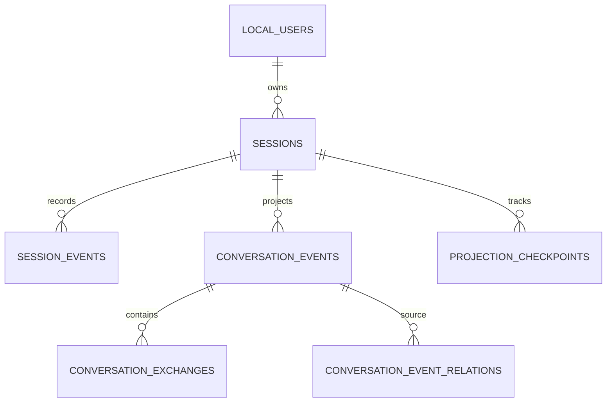
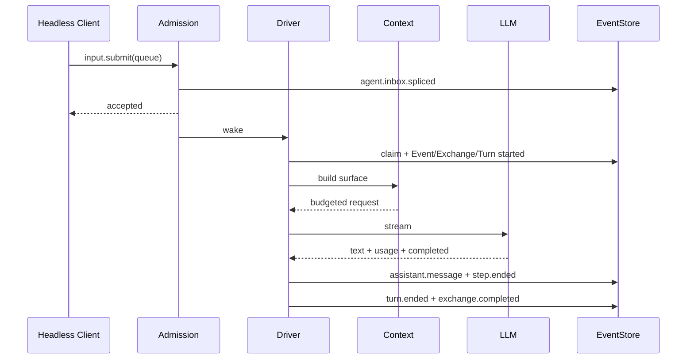

# 阶段 2：单 Agent Runtime V1 开发架构设计

- 文档状态：待评审
- 所属阶段：阶段 2（单 Agent Runtime V1 完整实现）
- 更新日期：2026-08-19
- 上位方案：`docs/Agent Client完整技术解决方案.md`
- Runtime 目标设计：`docs/单Agent低上下文Runtime打造设计.md`
- 前置阶段：`docs/阶段方案/阶段1-Client基础运行平台开发架构设计.md`
- 提示词清单：`docs/阶段方案/阶段2-提示词工程与Prompt清单.md`
- 配套测试：`docs/阶段方案/阶段2-单AgentRuntime-V1测试用例.md`

## 1. 文档目的

本文档定义阶段 2 的正式开发范围、Runtime 架构、功能模块、事件与数据模型、Command/Query Contract、核心执行流程、恢复策略和验收标准。评审通过后，阶段 2 的实现和测试以本文档为准。

阶段 2 在 Headless Runtime Harness 中一次完成单 Agent Runtime V1 的全部核心语义，不开发产品 UI，也不通过临时聊天页面包装阶段成果。阶段 3 的正式 Client UI 只能消费本阶段已经稳定的 Command、Query、Subscription 和 Projection，不得另建前端状态机。

本文中的 `Runtime Worker` 是 Electron 内承载 Runtime 的 Node Worker Thread；项目仍只有一个 Agent，不引入 Agent Worker、Subagent、多 Agent 路由、Decider、Evaluator 或 Answer Generator。

## 2. 阶段目标与边界

### 2.1 阶段目标

1. 完成 Input Admission、Durable Inbox、Session Driver、ExecutionTurn 和 Step 状态机。
2. 完成 Queue、Steer、队列项“立刻介入”、Inject、Cancel、Interaction 和跨 Session 并行。
3. 完成流式 LLM Adapter、不可变 ModelConfigSnapshot、usage 和稳定错误映射。
4. 完成 Context Projector、ConversationEvent/Exchange、相关历史、预算和压缩。
5. 完成用户级 SkillCatalogSnapshot、按需 Skill 加载、Tool Registry 与 Scheduler。
6. 完成 Tool Result 统一协议、有界并行、独占屏障、顺序提交和副作用恢复语义。
7. 完成 Chat、Trajectory、Inbox、Usage Projection 与 Snapshot + cursor 增量。
8. 完成 Worker 重启后的开放 Turn 修复、Projection 重建和合法 Queue 唤醒。
9. 在所有模型、Skill、工具、历史、Credential 和 Repository 入口保持双用户隔离。
10. 使用正式 EventStore 和 Driver 通过单元、并发、属性、崩溃与 Headless E2E 测试。

### 2.2 阶段交付物

- Runtime 领域对象、事件 Schema、状态机和错误码。
- Runtime Application Service 及阶段 2 Bridge Contract。
- Session Driver、Inbox、Turn/Step Loop 和 stopping check。
- OpenAI-compatible、Anthropic-compatible 标准 Adapter 端口与 Fake Provider 实现；首个真实 OpenAI-compatible 服务已验证，其他协议的真实服务按产品需要另行排期。
- Context Projector、Surface、History Tools 和 Event Compaction。
- Skill Catalog/Loader、Tool Registry/Scheduler、Interaction Service。
- Runtime V2 migration、Projection Service、恢复与 lease。
- Headless Runtime Harness、固定事件 Fixture 和完整阶段 2 自动化测试。

### 2.3 本阶段明确不实现

- 聊天、会话列表、运行过程、用户切换、模型管理或 Skill 管理产品 UI。
- `reference_ui` 页面复刻或任何临时演示 UI。
- 模型服务、模型、Skill 的完整产品 CRUD 流程；阶段 2 只消费阶段 1 Repository 中的配置事实。
- ModelScope、ClawHub 在线搜索、下载、账号和自动更新。
- 自定义 Agent Worker、Subagent、并行 Agent 或多模型评审链路。
- 普通 Skill 动态注入原生 Tool Plugin；Skill 只提供按需指令和受控资源，脚本通过 Runtime 已有宿主命令能力执行。
- Skill 独立沙箱、虚拟环境、容器、依赖自动安装或发布者信任链。
- 操作系统发布签名、公证、自动更新和安装器。

### 2.4 实现程度定义

| 等级         | 含义                                                                                                                   |
| ------------ | ---------------------------------------------------------------------------------------------------------------------- |
| 完整实现     | 正式代码、错误与恢复、Contract、测试全部完成，阶段 3 直接接入                                                          |
| Adapter 完成 | 统一端口、OpenAI-compatible HTTP/SSE Adapter、两类协议归一化和 Fake Contract 完成；不在阶段 4 建立通用真实服务兼容矩阵 |
| 不实现       | 明确排除，不得以临时分支或 Mock 冒充生产能力                                                                           |

## 3. 技术架构

### 3.1 阶段架构图

```mermaid
flowchart LR
  subgraph H["Headless Runtime Harness / 正式 Bridge"]
    CMD["Command"]
    QUERY["Query"]
    SUB["Subscription"]
  end

  subgraph A["Runtime Application"]
    ADMISSION["Input Admission"]
    DRIVER["Session Driver Registry"]
    RECOVERY["Recovery Coordinator"]
    PROJECTION["Projection Service"]
  end

  subgraph R["单 Agent Runtime Core"]
    INBOX["Durable Inbox"]
    LOOP["Turn / Step Loop"]
    CONTEXT["Context Projector"]
    MODEL["LLM Adapter"]
    TOOLS["Tool Registry / Scheduler"]
    MEMORY["Event Memory / Compaction"]
    INTERACTION["Interaction Service"]
  end

  subgraph C["用户配置快照"]
    MODELREG["Model Registry"]
    SKILLREG["Skill Catalog / Loader"]
    RUNTIMESET["Runtime Settings"]
  end

  subgraph I["阶段 1 基础设施"]
    EVENTSTORE["Session EventStore"]
    DB[("单 SQLite")]
    CREDENTIAL["Credential Store"]
    PROCESS["ProcessRunner / Files"]
  end

  CMD --> ADMISSION --> INBOX
  ADMISSION --> DRIVER --> LOOP
  LOOP --> CONTEXT --> MODEL
  LOOP --> TOOLS
  TOOLS --> INTERACTION
  CONTEXT --> MEMORY
  LOOP --> EVENTSTORE
  INBOX --> EVENTSTORE
  MEMORY --> EVENTSTORE
  EVENTSTORE --> DB
  MODEL --> MODELREG --> CREDENTIAL
  TOOLS --> SKILLREG --> PROCESS
  RUNTIMESET --> LOOP
  EVENTSTORE --> PROJECTION --> QUERY
  PROJECTION -."有序增量".-> SUB
  RECOVERY --> EVENTSTORE
  RECOVERY --> DRIVER
```



### 3.2 分层职责

| 层             | 主要职责                                         | 禁止事项             |
| -------------- | ------------------------------------------------ | -------------------- |
| Contract       | Command/Query/Subscription、事件和 Schema        | 业务执行、数据库访问 |
| Application    | 接纳、Driver 注册、恢复、事务编排、Snapshot      | 隐藏第二套对话历史   |
| Runtime Core   | Turn/Step、Context、工具、记忆、停止判定         | UI、任意跨用户查询   |
| Domain         | 状态机、不变量、值对象、确定性策略               | Provider/SQLite 细节 |
| Infrastructure | SQLite、Provider、Credential、文件与进程 Adapter | Agent 决策           |
| Harness        | Fake Clock/ID/LLM/Tool、崩溃注入、断言           | 生产分支中的特殊语义 |

### 3.3 核心不变量

1. 输入先持久接纳，再唤醒 Driver。
2. 同一 `(userId, sessionId)` 同时最多一个有效 Driver；不同 Session 可并行。
3. 一个 Step 等于一次模型请求及该响应中的全部 Tool Call。
4. 同一批 Tool Call 全部收敛后只产生一个后续 Step。
5. 当前 Turn 的模型 Surface 全部可从持久事件重建。
6. Tool Result 在 Event Log、Trajectory 和当前 Turn Surface 中逐字段一致。
7. 工具可以乱序结束，但必须按模型 `callIndex` 顺序提交。
8. Queue 只在 Turn 边界领取；Steer、立刻介入后的队列项和 Inject 只在 Step 安全边界领取。
9. Cancel、异常、截断、预算超限、最大步数和崩溃都有显式 Turn 结束事实。
10. SessionLogEvent 是运行技术事实；ConversationEvent 是用户可见事项，二者不可混用。

### 3.4 主数据流

```text
Command(input.submit)
→ Main 注入可信 userId
→ Input Admission 校验 Session、默认模型和幂等键
→ 原子追加 agent.inbox.spliced
→ 返回“已持久接纳”
→ 唤醒 Session Driver
→ 领取 Inbox 并创建 Event / Exchange / Turn
→ Context Projector 构造预算化请求
→ LLM 流式响应
→ 工具批次或 stopping check
→ 结束 Turn / Exchange
→ Projection 发布有序增量
→ completed Exchange 触发轻量压缩检查
```

## 4. 功能模块总览

| 编号 | 模块                             | 阶段 2 交付                                          | 实现程度     |
| ---- | -------------------------------- | ---------------------------------------------------- | ------------ |
| M01  | Runtime Contract 与领域模型      | 最终事件、状态、错误、Command/Query Schema           | 完整实现     |
| M02  | Input Admission 与 Durable Inbox | 幂等接纳、Queue/Steer/Promote/Inject、splice/claim   | 完整实现     |
| M03  | Session Driver 与 Turn/Step Loop | lease、串行决策、停止检查、跨 Session 并行           | 完整实现     |
| M04  | 模型与配置快照                   | LLM Adapter、流式归一化、ModelConfigSnapshot、usage  | Adapter 完成 |
| M05  | Context Projector                | Surface、预算、Event Context、相关历史、prompt epoch | 完整实现     |
| M06  | Skill、Tool 与 Interaction       | 按需 Skill、Registry、调度、完整结果、结构化交互     | 完整实现     |
| M07  | Event Memory 与 Compaction       | History Tools、Event Summary、同步预算兜底           | 完整实现     |
| M08  | Projection 与订阅                | Chat/Trajectory/Inbox/Usage、Snapshot + cursor       | 完整实现     |
| M09  | 恢复与副作用处理                 | interrupted 修复、未知副作用、Queue 唤醒             | 完整实现     |
| M10  | 双用户隔离与诊断                 | 用户级 Registry/历史/凭据、usage 与关联日志          | 完整实现     |
| M11  | Headless Harness                 | Fake Provider/Tool、固定 Fixture、崩溃与属性测试     | 完整实现     |

## 5. 功能模块详细设计

### 5.1 M01 Runtime Contract 与领域模型

#### 业务设计

所有 Runtime 状态变化先定义事件 Schema 和确定性状态转换，再由 Driver 使用。Event payload V1 与 `docs/设计文档/03-Session事件与Projection契约.md` 对齐；实现时由 Zod Schema 生成类型并在 append/read 边界校验。

#### 核心对象

| 对象                 | 标识与作用域                  | 生命周期                            |
| -------------------- | ----------------------------- | ----------------------------------- |
| Session              | `userId + sessionId`          | active/archived                     |
| InboxItem            | Session 内唯一                | pending/claimed/removed             |
| ConversationEvent    | 当前用户、Session 内事项      | open/awaiting_user/completed/failed |
| ConversationExchange | Event 内一次用户问答          | open/completed/interrupted/failed   |
| ExecutionTurn        | Exchange 的执行过程           | running/ended                       |
| Step                 | Turn 内一次模型请求与工具批次 | running/completed/cancelled/error   |
| Interaction          | Tool 发起的结构化用户输入     | pending/resolved/cancelled          |

#### Turn 结束原因

```ts
type TurnEndReason =
  | 'completed'
  | 'cancelled'
  | 'blocked'
  | 'error'
  | 'max_output_tokens'
  | 'context_budget_exceeded'
  | 'max_steps'
  | 'interrupted';
```

#### 实现程度

完整实现所有 V1 Schema、Upcaster 入口、状态转换和非法转换测试；阶段 2 不定义“临时完成”“部分成功”事件。

### 5.2 M02 Input Admission 与 Durable Inbox

#### 业务设计

```ts
interface SubmitInput {
  sessionId: string;
  message: string;
  mode: 'queue' | 'steer';
  idempotencyKey: string;
  eventId?: string;
  startNewEvent?: boolean;
}
```

`userId` 只由 Main 的 `TrustedRequestContext` 注入。`queue` 写入 `next-turn`；`steer` 在活动 Turn 存在时写入 `next-step`，无活动 Turn 时按明确规则降为 `next-turn`。内部 `inject` 只供 Runtime 受信服务使用，不暴露给 Renderer 任意调用。

运行中通过普通发送产生的消息默认先进入 `next-turn`。参考 UI 的“立刻介入”作用于某条已经持久化的 Queue Item，不创建第二条消息，也不取消当前 Turn：

```ts
interface PromoteInboxItemInput {
  sessionId: string;
  inboxItemId: string;
  expectedTurnId: string;
}
```

`inbox.promote` 在同一事务中校验：队列项属于当前用户和 Session、仍位于 `next-turn`、尚未被 claim，且活动 Turn 仍等于 `expectedTurnId`。随后保持 InboxItem ID 和原始创建时间不变，将它从 `next-turn` 移至 `next-step`，按提升事件的顺序追加到 `next-step` 尾部，并绑定当前 ConversationEvent/Exchange；原 `startNewEvent` 意图随提升失效，因为用户已经明确选择介入当前事项。

提升通过一个包含两项 operation 的 `agent.inbox.spliced(reason='promote')` 原子事件表达：先从 `next-turn` 删除，再向 `next-step` 插入。Projection 不得对外发布仅完成一半的中间状态。

“立刻”表示最近的安全 Step 边界，不表示中断：

- 不 Abort 已发出的模型请求。
- 不终止正在执行的工具。
- 工具运行期间提升时，在全部工具结果提交后进入下一 Step。
- 最终文本流期间提升时，stopping check 阻止 Turn 结束并创建下一 Step。
- 如果 Turn 已结束、发生切换或队列项已被 claim，Command 返回 `TURN_CHANGED` 或 `INBOX_ITEM_NOT_PROMOTABLE`，并保持该项原来的 `next-turn` 状态。

接纳流程：校验 payload 大小与 Schema → 校验 Session 和用户作用域 → 校验有效默认模型 → 检查幂等键 → 追加 Inbox splice → commit → 返回接纳结果 → 唤醒 Driver。重复键且请求摘要相同返回首次结果；相同键不同内容返回 `IDEMPOTENCY_CONFLICT`。

#### 领取规则

- Turn 边界：领取所有已到达 `next-step`，再领取 FIFO 一条 `next-turn`。
- Step 边界：只领取所有已到达 `next-step`。
- 领取、删除、替换和提升都使用 `agent.inbox.spliced`，不直接修改隐藏队列表。
- Tool Result 永不进入 Inbox。

#### 实现程度

完整实现持久 splice/replay、remove/replace/promote、并发提交和幂等接纳。

### 5.3 M03 Session Driver 与 Turn/Step Loop

#### 业务设计

Driver Registry 键为 `userId:sessionId`。进程内串行队列负责避免重复启动，SQLite lease 防止过期 Worker generation 在重启竞态中继续写入。

Driver 状态：

```text
idle → acquiring → running → draining → idle
                  ↘ cancelling ↗
                  ↘ failed → recovering
```

`running` 表示正在排空该 Session 工作，不等于某一个 Turn 始终开放。

#### Step Loop

1. 原子领取输入并创建 Event、Exchange、Turn。
2. 在 Step 开始解析不可变配置快照。
3. 投影 Context 并检查硬预算。
4. 发起唯一一次模型请求并持久化流式/最终事实。
5. 有 Tool Call 时执行完整批次并顺序提交结果。
6. 领取 `next-step`，有内容则进入下一 Step。
7. 无 Tool Call 时执行 stopping check；无补充则结束 Turn。
8. Turn 结束后处理下一条 `next-turn`，Inbox 为空后释放 lease。

#### 默认参数

| 参数                   |                      默认值 |
| ---------------------- | --------------------------: |
| `maxStepsPerTurn`      |                          12 |
| `sessionLeaseMs`       |                       30000 |
| `leaseRenewIntervalMs` |                       10000 |
| `maxParallelSessions`  | 由 Runtime 设置控制，默认 4 |

#### 实现程度

完成正常、取消、配置失效、模型失败、最大步数和 lease 丢失路径。SQLite 外部模型/工具调用期间不持有写事务。

### 5.4 M04 模型与配置快照

#### 业务设计

`ModelRegistry.resolveForStep(userId, requestedModelId?)` 在同一一致性读取中解析用户 `model_revision`、默认模型、服务、能力、普通参数和 Credential ref，返回冻结的 `ModelConfigSnapshot`。明文 Credential 只在 Worker 内请求发送边界短暂读取。

`SkillCatalogSnapshot` 和 Runtime 参数使用同一个 Step 配置边界；配置变更不改变正在进行的模型调用，新 revision 只在下一个 Step 生效。

#### LLM Adapter

统一输出：text delta、tool-call delta、message completed、provider usage、finish reason 和标准错误。首批协议端口为 OpenAI-compatible 与 Anthropic-compatible；阶段 2 以 Fake Server/录制脱敏样本完成 Contract，不以真实公网稳定性作为通过条件。在此基础上已实现 OpenAI-compatible HTTP/SSE Adapter，并以阿里云百炼真实服务完成纯文本流式输出和两 Step Tool Calling Smoke 验证。

Provider usage 是计量事实；Context Breakdown 是本地估算，两者分开保存。未知 finish reason 原样保留在诊断字段并映射稳定 Turn 语义。

#### 实现程度

Adapter Contract、Fake Provider、OpenAI-compatible HTTP/SSE Adapter 和两类流式归一化完整实现；Anthropic 真实 HTTP Adapter及通用多供应商兼容矩阵不属于阶段 4，后续按明确产品需求单独规划。

### 5.5 M05 Context Projector

#### 层级与顺序

| 层级 | 内容                                      | 是否可丢弃                            |
| ---- | ----------------------------------------- | ------------------------------------- |
| L0   | 稳定 System Prompt                        | 否                                    |
| L1   | 确定排序的 Tool Schema                    | 否；启用工具集改变时更新 prompt epoch |
| L2   | Session Summary                           | 可选                                  |
| L3   | 当前 ConversationEvent Summary + raw tail | 否，必要时先压缩                      |
| L4   | 最多 3 个相关 Event 候选                  | 是，低分先移除                        |
| L5   | 当前 ExecutionTurn 完整 Surface           | 否                                    |
| L6   | 用户显式 History Tool 结果                | 当前 Step 内否                        |

输入预算：

```text
inputBudget = model.contextWindow - reservedOutputTokens - safetyMarginTokens
```

输出预留使用本次请求的实际输出额度；未手工设置时由模型输出能力和压缩阈值后的上下文余量动态计算。`4096` 只作为缺少有效模型配置时的兼容 fallback，`safetyMarginTokens = 2048`。预算不足时先删除相关 Event，再触发 Event 压缩；仍无法容纳当前 Turn 的完整 Tool Result 时以 `context_budget_exceeded` 结束，禁止截断结果继续请求。

#### Event 归属

按以下顺序解析 ConversationEvent：显式 `eventId` → Steer 继承当前 Event → 唯一 `awaiting_user` 事项 → 显式/确定性 continuation 关系 → 新建 Event。`startNewEvent` 强制新建。

#### 实现程度

完成稳定前缀、token 预算、Event Context、相关候选、去重、同步压缩兜底和可解释 `model.request.context`。

### 5.6 M06 Skill、Tool 与 Interaction

#### Skill 设计

阶段 2 兼容通用 Agent Skills 目录：`SKILL.md` 为入口，可选 `scripts/`、`references/`、`assets/`。Skill 与 MCP 在能力发现层同级：常驻 `capability_search` 同时从两类用户级 Catalog 返回有界轻量候选，Agent 在同一份结果中选择 Skill、MCP、两者或都不使用；选中 Skill 后统一 loader 才读取完整 `SKILL.md` 及其显式引用资源，选中 MCP 后由 `mcp_load` 在下一 Step 暴露完整 Tool Schema。

普通 Skill 不自动注册新的原生 Tool Schema，也不修改 Agent Loop。Skill 中的 Node/Python/Shell 操作通过已评审的宿主命令工具执行，解释器或依赖缺失返回明确 Tool Result，Runtime 不自动安装。

#### Tool Definition

```ts
interface ToolDefinition {
  name: string;
  description: string;
  inputSchema: JsonSchema;
  outputSchema: JsonSchema;
  timeoutMs: number;
  replaySafe: boolean;
  isConcurrencySafe(input: JsonValue): boolean;
  execute(input: JsonValue, context: ToolContext, signal: AbortSignal): Promise<ToolResult>;
}
```

只有 `isConcurrencySafe(input) === true` 才可进入最大 4 路滚动并行池；异常或未声明一律独占。独占调用形成屏障：等待此前并行池清空，执行期间不启动后续调用。

#### Tool Result

统一状态为 `success`、`needs_input`、`retryable_error`、`fatal_error`、`cancelled`。结果先做输出 Schema 校验，再按 `callIndex` 顺序批量 commit。工具必须通过分页/范围协议在调用前控制结果规模；Runtime 不在调用后裁剪完整结果。

#### Interaction

`request_user_input` 可产生 approval、selection 或 form。`interaction.requested` 持久化后可以结束当前 Turn 并将 Event 置为 `awaiting_user`；`interaction.resolve` 必须按原 Schema 校验，普通聊天不能伪造结构化 resolution。

#### 实现程度

完成 Skill loader、内置 Tool Registry、宿主命令工具、调度与 Interaction；不实现在线市场和插件系统。

### 5.7 M07 Event Memory 与 Compaction

#### History Tools

- `event_search`：当前用户当前 Session 内按标题、摘要、可见文本索引检索，返回有界候选。
- `event_read`：按 Event 和 Exchange 范围读取用户可见原始问答。
- `turn_list`：分页列出 ExecutionTurn 索引。
- `turn_read`：读取指定 Turn 的完整技术轨迹和原始 Tool Result。

History Tool 结果与普通 Tool Result 遵守同一完整性规则，不允许跨用户或跨 Session 隐式召回。

#### Compaction

completed Exchange 后只进行廉价 token 检查。默认超过 Event Context 预算 75% 才调用摘要模型，目标压缩到 45%；首次输入完整已闭合问答，后续输入旧 Summary 加未覆盖 raw tail。至少保留最近 1 个 Exchange 原文。

候选摘要只有在 Schema 合法、实际节省 token、`summaryVersion` 未冲突且覆盖位置仍有效时提交。异步 Hook 失败不影响原 Turn；模型请求前仍超预算时执行同步兜底。

#### 实现程度

完整实现 Event 级压缩与历史工具；Session Summary 只建立正式投影接口，不在缺少实际需求时额外调用摘要模型。

### 5.8 M08 Projection 与订阅

#### Projection

| Projection        | 主要内容                                                             |
| ----------------- | -------------------------------------------------------------------- |
| Chat              | 用户可见消息、Event/Exchange 分组、流式状态、结束原因                |
| Trajectory        | Turn、Step、Model Request、Tool、Interaction、耗时和错误             |
| Inbox             | `next-turn`、`next-step` 与操作状态                                  |
| Usage             | provider input/output/cache/reasoning usage 和本地 Context Breakdown |
| ConversationEvent | 状态、摘要、raw tail 覆盖位置和关系                                  |

`assistant.chunk` 只更新流式组装视图，`assistant.message` 是最终事实。实时 reducer 与从 seq 1 全量回放必须得到相同结果。

#### Snapshot + cursor

Query 返回 `throughSeq`；订阅只接受 `seq = previous + 1`。重复 seq 幂等忽略，断档、未知 schemaVersion、userId/sessionId 不匹配时必须重取 Snapshot。阶段 2 实现 Worker 到 Main/Preload 的正式增量通道，但没有产品 Renderer 消费者。

#### 实现程度

所有运行 Projection 完整实现；SQLite 加速表可删除重建，不成为第二事实源。

### 5.9 M09 恢复与副作用处理

Worker ready 前执行：数据库迁移与检查 → 扫描 lease 过期或开放 Turn → 回放 Inbox/Turn/Tool/Interaction → 追加修复事件 → 重建 Projection → 唤醒仍有合法 `next-turn` 的 Session。

恢复规则：

- 开放 Turn 追加 `turn.ended(interrupted)`，关联 Exchange 标记 interrupted。
- 已领取但尚未写入 `user.message` 的输入依据 claim 事件确定恢复或明确中断，不静默丢弃。
- `tool.call` 无 `tool.result` 且非 replay-safe 时写入 `unknown_side_effect` 结果，不自动重放。
- replay-safe 工具也只有存在稳定 idempotencyKey 时才允许按策略重试。
- 等待 Interaction 可以从事件恢复为 pending；若原 Turn 已中断，由 resolution 规则创建新的确定 Exchange。
- 修复不触发 completed Exchange 的压缩 Hook。

### 5.10 M10 双用户隔离与诊断

每个 Driver、Model Registry、SkillCatalogSnapshot、ToolContext、History Tool、Credential ref、Projection 和订阅都携带不可变 `userId`。任何 ID 解析从当前用户作用域开始；跨用户实体对普通 Client 返回 `NOT_FOUND`，详细拒绝只写安全日志。

日志关联字段至少包括 `userId`、`sessionId`、`turnId`、`stepId`、`requestId`、`modelRequestId`、`toolCallId`、`workerGeneration`，但默认不记录消息正文、Prompt、Tool Result、Credential 或完整本地路径。

### 5.11 M11 Headless Runtime Harness

Harness 通过与生产相同的 Runtime Application Service 驱动，不复制 Driver。提供 Fake Clock、确定性 ID、Scripted LLM、Scripted Tool、Fake Credential、临时 SQLite、可控 ProcessRunner、事件批次断言、崩溃点和 Projection 回放断言。

## 6. Event Contract

### 6.1 事件目录

| 分类           | 事件                                                                                                                                                                                                      |
| -------------- | --------------------------------------------------------------------------------------------------------------------------------------------------------------------------------------------------------- |
| Session/Inbox  | `session.created`、`agent.inbox.spliced`                                                                                                                                                                  |
| Event/Exchange | `conversation.event.created`、`conversation.event.status-changed`、`conversation.event.summary-updated`、`conversation.event.related`、`conversation.exchange.started`、`conversation.exchange.completed` |
| Turn/Step      | `turn.started`、`turn.cancel.requested`、`turn.ended`、`step.started`、`step.ended`                                                                                                                       |
| Model/Message  | `model.request.context`、`user.message`、`assistant.chunk`、`assistant.message`                                                                                                                           |
| Tool           | `tool.call`、`tool.result`                                                                                                                                                                                |
| Interaction    | `interaction.requested`、`interaction.resolved`                                                                                                                                                           |
| Compaction     | `compaction.started`、`compaction.summary-updated`、`compaction.ended`                                                                                                                                    |

### 6.2 原子 batch

以下事实必须同批提交：

- `agent.inbox.spliced(reason='promote')` 内从 `next-turn` 删除和向 `next-step` 插入的两项 operation。
- Inbox claim、`conversation.exchange.started`、`turn.started`。
- 一次模型响应确定的 `assistant.message`、`step.ended` 和直接状态事实。
- 同一 Step 全部 `tool.result`，按 `callIndex` 排序。
- `turn.ended` 与 `conversation.exchange.completed`。
- `compaction.ended(committed)` 与 `conversation.event.summary-updated`。

### 6.3 Schema 兼容

阶段 2 新事件统一 `schemaVersion: 1`。新增可选字段可维持版本；删除、改名或语义变化必须升版并提供只读 Upcaster。未知版本使对应 Projection 停止并报告，不允许跳过。

## 7. SQLite V2 Migration

### 7.1 Session lease 与输入幂等

```sql
ALTER TABLE sessions ADD COLUMN lease_owner TEXT;
ALTER TABLE sessions ADD COLUMN lease_expires_at TEXT;

ALTER TABLE session_events ADD COLUMN idempotency_key TEXT;

CREATE UNIQUE INDEX idx_session_events_input_idempotency
  ON session_events(user_id, session_id, idempotency_key)
  WHERE idempotency_key IS NOT NULL;
```

`idempotency_key` 只写在代表 Command 接纳结果的首个事件上；重复请求读取原事件并比较规范化请求摘要。lease 使用 UTC ISO 时间，append batch 同时校验 `lease_owner`、未过期和 Session version。

### 7.2 ConversationEvent 加速投影

```sql
CREATE TABLE conversation_events (
  id                            TEXT NOT NULL,
  user_id                       TEXT NOT NULL,
  session_id                    TEXT NOT NULL,
  status                        TEXT NOT NULL CHECK (status IN ('open', 'awaiting_user', 'completed', 'failed')),
  title                         TEXT,
  summary                       TEXT,
  summary_through_exchange_seq  INTEGER NOT NULL DEFAULT 0,
  summary_tokens                INTEGER NOT NULL DEFAULT 0,
  summary_version               INTEGER NOT NULL DEFAULT 0,
  exchange_count                INTEGER NOT NULL DEFAULT 0,
  created_at                    TEXT NOT NULL,
  updated_at                    TEXT NOT NULL,
  completed_at                  TEXT,
  PRIMARY KEY (user_id, id),
  FOREIGN KEY (user_id, session_id) REFERENCES sessions(user_id, id)
);

CREATE TABLE conversation_exchanges (
  id                        TEXT NOT NULL,
  user_id                   TEXT NOT NULL,
  event_id                  TEXT NOT NULL,
  exchange_seq              INTEGER NOT NULL,
  execution_turn_id         TEXT NOT NULL,
  status                    TEXT NOT NULL CHECK (status IN ('open', 'completed', 'interrupted', 'failed')),
  user_visible_from_seq     INTEGER,
  user_visible_through_seq  INTEGER,
  created_at                TEXT NOT NULL,
  completed_at              TEXT,
  PRIMARY KEY (user_id, id),
  UNIQUE (user_id, event_id, exchange_seq),
  UNIQUE (user_id, execution_turn_id),
  FOREIGN KEY (user_id, event_id) REFERENCES conversation_events(user_id, id)
);

CREATE TABLE conversation_event_relations (
  user_id         TEXT NOT NULL,
  source_event_id TEXT NOT NULL,
  target_event_id TEXT NOT NULL,
  relation        TEXT NOT NULL CHECK (relation IN ('explicit', 'continuation')),
  created_at      TEXT NOT NULL,
  PRIMARY KEY (user_id, source_event_id, target_event_id, relation),
  FOREIGN KEY (user_id, source_event_id) REFERENCES conversation_events(user_id, id),
  FOREIGN KEY (user_id, target_event_id) REFERENCES conversation_events(user_id, id)
);
```

### 7.3 Projection checkpoint

```sql
CREATE TABLE projection_checkpoints (
  user_id        TEXT NOT NULL,
  session_id     TEXT NOT NULL,
  projection     TEXT NOT NULL,
  through_seq    INTEGER NOT NULL DEFAULT 0,
  schema_version INTEGER NOT NULL,
  updated_at     TEXT NOT NULL,
  PRIMARY KEY (user_id, session_id, projection),
  FOREIGN KEY (user_id, session_id) REFERENCES sessions(user_id, id)
);

CREATE INDEX idx_conversation_events_user_session_status
  ON conversation_events(user_id, session_id, status, updated_at DESC);

CREATE INDEX idx_conversation_exchanges_user_event_seq
  ON conversation_exchanges(user_id, event_id, exchange_seq);
```

这些表只加速检索。重建时在用户/Session 作用域内清理目标 Projection、从事件 seq 1 回放并更新 checkpoint；不能修改 `session_events`。

### 7.4 表关系



## 8. Runtime Application Contract

### 8.1 Command

| Command                 | 关键输入                                              | 成功语义                                    |
| ----------------------- | ----------------------------------------------------- | ------------------------------------------- |
| `session.create`        | sessionId、title?                                     | 以调用方生成的 sessionId 幂等创建并持久化   |
| `session.rename`        | sessionId、title、expectedVersion                     | 元数据已更新                                |
| `session.archive`       | sessionId                                             | Session 已归档且无活动 Turn                 |
| `input.submit`          | SubmitInput                                           | Inbox splice 已持久接纳，不代表 Turn 完成   |
| `inbox.remove`          | sessionId、inboxItemId                                | removal splice 已提交                       |
| `inbox.replace`         | sessionId、inboxItemId、message                       | replace splice 已提交                       |
| `inbox.promote`         | sessionId、inboxItemId、expectedTurnId                | Queue Item 已原子转入当前 Turn 的 next-step |
| `turn.cancel`           | sessionId、turnId、keepNextTurn、keepNextStep、reason | 取消意图已接纳并传播                        |
| `turn.cancel-and-queue` | sessionId、turnId、message、idempotencyKey            | 组合语义已原子接纳                          |
| `interaction.resolve`   | sessionId、interactionId、resolution、value?          | resolution 已校验并持久化                   |

### 8.2 Query

| Query                          | 输出                                     |
| ------------------------------ | ---------------------------------------- |
| `session.list`                 | 当前用户 Session 页和状态                |
| `session.snapshot`             | Chat/Trajectory/Inbox/Usage + throughSeq |
| `session.events.page`          | 脱敏诊断事件页                           |
| `conversation.event.list/read` | Event 摘要、状态和用户可见问答           |
| `execution.turn.list/read`     | Turn 索引和完整内部执行证据              |

### 8.3 Subscription

`{ kind: 'session', sessionId, afterSeq }` 订阅正式 Session Projection 增量。Main 注入 userId，Worker generation 改变时发布 lifecycle 事件并要求调用方重新查询 Snapshot。阶段 2 保留 Stage 1 的 `app.bootstrap`、`system.health` 和 `user.switch`。

## 9. 核心业务流程

### 9.1 纯文本 Turn



纯文本正常场景只有一次主模型调用。

### 9.2 多工具 Step

模型返回 A/B/C → 先按模型顺序记录 `tool.call` → Scheduler 依据参数决定并行/独占 → 乱序完成 → 按 A/B/C 批量提交完整 `tool.result` → 将三份结果一次性放入下一 Step Surface → 只发起一次后续模型请求。

### 9.3 Queue、立刻介入、Steer 与 Cancel

- Queue 在当前 Turn 结束后创建新 Exchange/Turn。
- Steer 在最近 Step 安全边界进入当前 Turn，不中断已发出的模型请求。
- “立刻介入”把选中的持久 Queue Item 从 `next-turn` 原子移动到 `next-step`，效果等同于让该已排队消息成为当前 Turn 的 Steer；不会 Cancel 当前模型或工具。
- 提升必须绑定 `expectedTurnId`。目标 Turn 或队列项状态改变时保持原队列项不动，并要求调用方刷新 Projection 后重试。
- Stop 默认 `keepNextTurn=true`、`keepNextStep=false`。
- Cancel 传播 AbortSignal；尚未启动的工具写 cancelled，已启动工具收敛后结束 Turn。
- “停止当前任务并执行新请求”才使用 `turn.cancel-and-queue`；它与不终止当前 Turn 的“立刻介入”是两个不同操作。

### 9.4 Interaction

工具返回 needs_input → 持久化 Interaction → Event 进入 awaiting_user → Headless Harness 读取等待状态 → `interaction.resolve` 按 Schema 校验 → 创建确定的 continuation Exchange 或恢复等待流程。拒绝/取消也必须形成持久事实。

### 9.5 崩溃恢复

```text
Worker 异常退出
→ 新 generation 启动
→ migration 与完整性检查
→ 找出过期 lease / 开放 Turn
→ 追加 interrupted 与 unknown_side_effect 等修复事实
→ 重建 Projection/checkpoint
→ 唤醒合法 next-turn
→ 发布 runtime.ready(new generation)
```

## 10. 安全设计

- Renderer 无法传入业务 userId、Credential ref、绝对路径、可执行文件或内部 inject。
- 模型和 Skill Snapshot 只从可信用户作用域解析，绝不跨用户 fallback。
- Tool Args/Result、Interaction value、Provider stream 和事件 payload 全部运行时校验。
- 宿主命令使用 executable + argv，不拼接任意 Shell 字符串；cwd、env、timeout 和输出有界。
- 非 replay-safe 副作用不因 Worker 重启自动重放。
- Prompt、消息正文、Tool Result 和 secret 默认不进入结构化日志。
- 通用 Skill 与宿主脚本不宣传为安全沙箱；执行前按用户、Skill digest 和风险授权。

## 11. 模块实施顺序

1. M01 Contract、事件 Schema、领域对象与固定 Fixture。
2. V2 migration、M02 Inbox 和接纳幂等。
3. M03 Driver/lease、纯文本 Turn 和基础 Projection。
4. M04 LLM Adapter/配置快照与 usage。
5. M06 Tool Scheduler、Interaction 和 M05 Context Projector。
6. M07 History/Compaction、M08 完整 Projection。
7. M09 恢复、M10 隔离诊断和 M11 全量 Harness 验收。

顺序表示依赖，不允许提交阶段性简化 Driver、临时事件或之后替换的 Repository。

## 12. 阶段验收标准

### 12.1 Runtime

- 纯文本、单工具、多工具、Queue、立刻介入、Steer、Cancel、Interaction、Compaction 和恢复使用同一 Driver/EventStore。
- 一个 Step 只有一次模型调用；同批多工具只产生一个后续 Step。
- 同一 Session 决策串行，不同 Session 可并行。
- 所有 Turn 均以明确原因结束，不存在永久开放的异常状态。

### 12.2 数据与 Projection

- 事件 batch 原子、seq 连续、历史仅追加、幂等提交确定。
- 实时 Projection 与从 seq 1 回放逐字段相同。
- 当前 Turn Tool Result 在 Event Log 与 Surface 完全一致。
- ConversationEvent 摘要覆盖与 raw tail 不重叠，冲突摘要不能覆盖新数据。

### 12.3 隔离与安全

- 用户 A/B 的会话、历史、模型、Skill、Tool Registry、Credential 和增量无交叉。
- 不安全工具默认独占；取消、超时和未知副作用语义可审计。
- Skill loader 不越界读取，不自动执行或安装依赖。

### 12.4 质量门禁

- strict typecheck、Lint、格式、构建和阶段 1 回归通过。
- 阶段 2 单元、Contract、并发、属性、集成、崩溃和 Headless E2E 全部通过。
- 不存在产品 UI、生产 Mock、临时 Runtime 分支或 `reference_ui` 业务逻辑依赖。

## 13. 阶段内需确认的 ADR

1. OpenAI-compatible 与 Anthropic-compatible 流式事件的统一内部表示。
2. token 估算器与 prompt epoch 摘要算法。
3. Session lease 的 Clock、续租与过期容差。
4. Event 搜索 V1 使用 SQLite FTS5 还是确定性 LIKE/索引实现。
5. 宿主命令工具的首次执行授权持久粒度。

这些 ADR 不得改变完整 Tool Result、单 Agent、用户隔离、仅追加事件和最终 Driver 语义。

## 14. 向后续阶段提供的能力

- 可由正式 Client 直接调用的 Runtime Command/Query/Subscription。
- 完整 Session Snapshot、Projection 增量和 cursor 恢复。
- 单 Agent Turn/Step、Queue/Promote/Steer/Cancel/Interaction。
- Model/Skill/Runtime 不可变 Step Snapshot。
- Tool Scheduler、History、Compaction、usage 和恢复。
- 可重用的正式 UI Fixture；阶段 3 不再编写 Mock 状态机。
