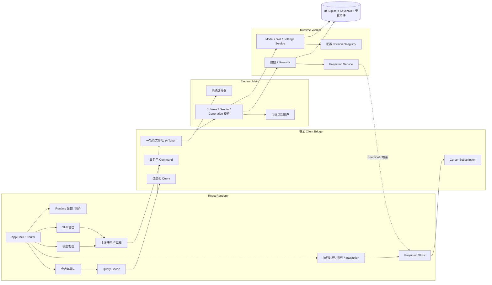
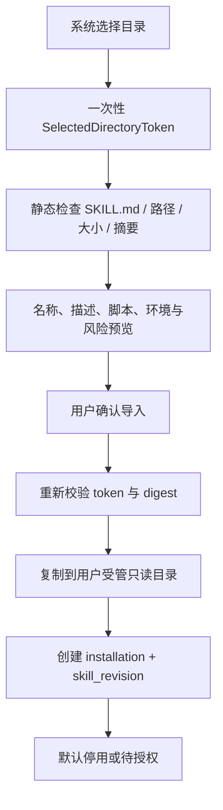

# 阶段 3：Client 产品功能开发架构设计

- 文档状态：待评审
- 所属阶段：阶段 3（Client 产品功能完整实现）
- 更新日期：2026-08-19
- 上位方案：`docs/Agent Client完整技术解决方案.md`
- 前置阶段：`docs/阶段方案/阶段2-单AgentRuntime-V1开发架构设计.md`
- 配套测试：`docs/阶段方案/阶段3-Client产品功能测试用例.md`
- 视觉参考：`reference_ui/`

## 1. 文档目的

本文档定义阶段 3 的正式 Client 产品架构、页面与功能模块、UI 数据流、模型与 Skill 管理流程、Bridge Contract 扩展、SQLite 迁移、安全边界和验收标准。

阶段 3 首次交付完整产品 UI。视觉比例、布局、色彩、间距和组件形态参考 `reference_ui`；业务状态、数据结构、错误处理和交互语义全部使用阶段 1～2 的正式 Client/Runtime Contract 重新实现。禁止迁移参考项目中的 Mock 数据、计时器、内存队列和模拟 Agent 逻辑。

## 2. 阶段目标与边界

### 2.1 阶段目标

1. 完成应用壳、导航、双用户切换和用户身份展示。
2. 完成会话列表、创建/重命名/归档、聊天、流式回答和后台运行状态。
3. 完成执行轨迹、Tool 卡片、Queue、队列项“立刻介入”、Steer、Cancel 和 Interaction。
4. 完成模型服务、模型、默认模型、凭据、连接测试和发现/手工维护页面。
5. 完成标准 Agent Skill 的本地导入、详情、预览、启停、授权、环境检测、更新和卸载页面。
6. 完成 Runtime 设置、附件导入和受控文件引用。
7. 完成 Snapshot + cursor、用户切换退订、Worker 重启和 Renderer 刷新恢复。
8. 建立设计 Token、响应式布局、键盘/焦点、空态/错误态和可访问性基线。
9. 使所有产品功能通过正式 Bridge 集成，不存在生产 Mock 分支。

### 2.2 阶段交付物

- 正式 React Client、设计 Token、通用组件与功能页面。
- 会话与 Agent 交互完整体验。
- Model Management 和 Skill Management 完整产品模块。
- Runtime Settings、附件与受控选择器。
- 阶段 3 Bridge Command/Query/Subscription 扩展。
- SQLite V3 migration 和对应 Repository/Application Service。
- UI Projection Fixture、组件测试、IPC 集成测试和 Client E2E。

### 2.3 本阶段明确不实现

- 修改阶段 2 的单 Agent、Turn/Step、Inbox、Tool Result 或恢复核心语义。
- 前端自行计算永久消息、队列、Token 或执行完成状态。
- ModelScope、ClawHub 在线市场、账号登录、远程搜索和自动更新。
- 自动安装 Node/Python、Skill 依赖或第三方包。
- 普通 Skill 注册原生常驻 Tool Plugin 或修改 Runtime 生命周期。
- 多 Agent、Subagent、Worker Agent 或结果评审链。
- 发布签名、公证、自动更新和正式安装器。

## 3. 技术架构

### 3.1 阶段架构图



### 3.2 Renderer 状态分类

| 状态类型       | 来源               | 保存位置                | 示例                                 |
| -------------- | ------------------ | ----------------------- | ------------------------------------ |
| 持久业务状态   | Runtime/Repository | SQLite/EventStore       | 消息、队列、模型、Skill、Interaction |
| 可重建投影     | Snapshot + 增量    | Worker，Renderer 仅缓存 | Chat、Trajectory、Usage              |
| Query 缓存     | Query Contract     | Renderer 缓存           | 会话页、模型列表、Skill 列表         |
| 本地交互状态   | 用户当前操作       | Renderer 内存           | 弹层开关、筛选、未提交表单、输入草稿 |
| 应用级可信状态 | Electron Main      | Main + app setting      | 活动用户、Worker generation          |

Command 成功只表示对应持久事实已接纳。UI 不因 Promise resolve 自行插入“已完成”消息；最终状态由 Projection 到达或重新 Query 决定。

### 3.3 前端技术基线

- React 19 + TypeScript strict。
- Renderer 源码独立位于顶层 `ui/`，使用不包含 Node 类型的 `tsconfig.ui.json`。
- UI 只允许导入 `@client-contracts` 和自身模块；Main、Preload、Worker、Runtime、Infrastructure 的能力一律通过 Preload 白名单桥调用。
- `src/client-contracts/` 只保存跨进程 DTO、Schema 与纯投影逻辑，不包含 Electron、Node、SQLite、Credential 或 ProcessRunner 实现。
- React Router 管理 `/sessions/:id`、`/settings/models`、`/settings/skills`、`/settings/runtime`。
- TanStack Query 管理普通 Query Snapshot、失效和 revision 冲突重取。
- 自研 `SessionProjectionStore` + `useSyncExternalStore` 消费高频有序增量。
- React Hook Form + Zod Resolver 管理复杂配置表单；Schema 复用共享 Contract。
- CSS Modules + CSS Custom Properties 实现设计 Token；Radix Primitives 只用于 Dialog、Popover、Tabs、Tooltip 等无障碍交互基础。
- Lucide 图标或经确认的本地 SVG 资源，不直接复制来源不明的参考资产。
- Vitest + React Testing Library + Playwright。

依赖最终版本在阶段 ADR 中锁定，选择不得改变安全 Bridge 和数据事实来源。

## 4. 功能模块总览

| 编号 | 模块                  | 主要交付                                                 | 实现程度 |
| ---- | --------------------- | -------------------------------------------------------- | -------- |
| M01  | App Shell 与设计系统  | 路由、导航、布局、Token、响应式与可访问性                | 完整实现 |
| M02  | 双用户切换            | 身份入口、切换事务、状态清理与重订阅                     | 完整实现 |
| M03  | 会话与聊天            | 会话 CRUD、Chat Projection、流式回答、附件               | 完整实现 |
| M04  | 执行与控制            | Trajectory、Tool、Queue/Promote/Steer/Cancel/Interaction | 完整实现 |
| M05  | Model Management      | 服务/模型/凭据/连接/发现/默认模型                        | 完整实现 |
| M06  | Skill Management      | 标准目录/ZIP 导入、详情、启停、授权、更新/卸载           | 完整实现 |
| M07  | Runtime Settings      | 预算、并行、maxSteps 等用户设置                          | 完整实现 |
| M08  | Snapshot/Subscription | cursor、断档、刷新、Worker 重启和后台 Session            | 完整实现 |
| M09  | Client Bridge 扩展    | 产品 Command/Query、文件 Token、配置增量                 | 完整实现 |
| M10  | 数据迁移与受管资源    | V3 表、附件、Skill 设置和 tombstone                      | 完整实现 |
| M11  | UI 测试与诊断         | Fixture、组件、视觉、E2E 和错误边界                      | 完整实现 |

## 5. 功能模块详细设计

### 5.1 M01 App Shell 与设计系统

#### 页面结构

```text
AppShell
├── PrimarySidebar
│   ├── ProductNavigation
│   ├── ActiveUserBadge
│   └── UserSwitcher
├── SessionWorkspace
│   ├── SessionListPane
│   └── ConversationPane
└── SettingsWorkspace
    ├── SettingsNavigation
    └── Model / Skill / Runtime 页面
```

参考 `reference_ui` 的侧栏宽度、双栏比例、聊天最大宽度、输入区高度、圆角与灰白层级，具体像素转为命名 Token：颜色、字体、间距、圆角、阴影、层级、动画时间和断点。不得在业务组件散落不可追踪的魔法值。

#### 状态要求

每个页面必须具备 loading、empty、ready、partial、error、disabled、conflict 和 offline/restarting 状态。全局 Error Boundary 只处理渲染异常；业务错误使用稳定 `ApiError` 就地展示。

### 5.2 M02 双用户切换

#### 业务流程

1. 用户从侧栏选择另一个内置用户。
2. UI 阻止同一窗口重复切换，调用 `user.switch`。
3. Main 校验目标属于固定用户目录并更新活动 User Context。
4. Main 主动终止旧用户所有 Session/Configuration 订阅。
5. Renderer 清空旧用户 Projection、选中实体、查询缓存和未提交敏感草稿。
6. 读取新用户 bootstrap、会话、模型、Skill 和设置 Snapshot。
7. 以新 cursor/revision 建立订阅后解除切换遮罩。

旧用户已接纳的 Turn 继续后台执行；用户切换不等于 Cancel。普通文本草稿可以按 `userId + sessionId` 保存在 Renderer 会话内存，但不得落入另一用户页面。

### 5.3 M03 会话与聊天

#### 会话能力

- 列表、分页/搜索、创建、选择、重命名、归档和恢复查看。
- 删除使用 tombstone 和二次确认，不由 UI 级联删除事件。
- Session 切换不取消后台执行。
- 列表状态来自 Query/Projection：idle、running、waiting_user、failed、interrupted。

#### 聊天投影

- ConversationEvent 作为同一事项分组；Exchange 表示每次用户问答。
- `assistant.chunk` 只做临时流式展示，最终以 `assistant.message` 校准。
- `assistant.reasoning.chunk/reasoning` 独立投影到“Think · 思考过程”，不得混入最终回答；工具调用输入和结果投影到“执行内容”。
- 每个 Step 展示思考区域；“执行内容”只在该 Step 已产生 Tool Call 时渲染，不显示“等待工具调用”或“本步骤未调用工具”等空区域。
- 思考、工具输入输出和最终回答统一使用安全 Markdown 实时渲染，禁用原始 HTML，远程资源继续受 CSP 限制。
- interrupted/failed/cancelled/max_output/context_budget 都有不同状态，不统一显示成功。
- 已闭合历史默认展示用户可见问答；完整工具轨迹按需查询 `execution-turn.read`。

#### 输入区

- 空闲时普通发送开启新 Turn；运行中普通发送默认“加入队列”，成为持久 `next-turn`。
- Queue 行提供“立刻介入”按钮，调用 `inbox.promote(sessionId, inboxItemId, expectedTurnId)`；它只把已有 Queue Item 提升到当前 Turn 的 `next-step`，不重复发送、不取消模型或工具。
- 如产品同时提供直接“补充当前任务”，它使用 `input.submit(mode='steer')`，与“先排队、后介入”共享相同 next-step 安全边界，但来源和轨迹应可区分。
- 本地输入草稿不是已接纳事实；Command 返回 accepted 后等待 Projection。
- 附件先通过系统选择器和 `attachment.import` 变为受控引用，再随输入提交引用 ID。

### 5.4 M04 执行与控制

执行过程卡片按 Turn → Step → Model/Tool 展示，可折叠，状态包括 running、success、error、cancelled、interrupted。Tool Args/Result 只展示经过 Projection 脱敏和大小策略允许的用户可见字段；诊断深读需要显式操作。

Queue 面板来自 InboxProjection，支持 remove/replace/promote。“立刻介入”提交后按钮进入 promoting，直到收到 `agent.inbox.spliced(reason='promote')`；成功后同一行转为“将在下一步介入”，不创建重复消息。`next-step` 默认只在当前执行上下文中显示为补充状态，不允许误拖动为 next-turn。

如果 `expectedTurnId` 已变化、Item 已被 claim 或当前 Turn 已结束，UI 保留该 Queue 行，显示“当前任务已变化，消息仍在队列”，并重取 Session Snapshot。不得自动把它介入新的 Turn。

Cancel 默认保留 next-turn、清理 next-step；按钮发送后进入 cancelling，直至 Projection 收到终态。Interaction 根据 Schema 渲染审批、单/多选或表单，提交前前端预校验，Worker 再做权威校验。

### 5.5 M05 Model Management

#### 页面组成

- 服务搜索与列表：名称、Provider、启用状态、模型数、Agent Ready。
- 服务详情：名称、Provider 类型、标准地址、Provider 参数、Credential 状态、保存/停用/归档。
- 连接测试：使用当前草稿，区分 success、auth、network、timeout、protocol、capability。
- 模型发现：显示新增/已存在/远端缺失差异，选择性 apply。
- 模型编辑：remote ID、显示名、context window、max output、Tool/视觉/流式能力、参数和状态。
- 默认模型：只允许当前用户启用且 Agent 可用的模型。

#### Credential

已保存密钥只显示 configured/missing 和可选 mask。输入框只显示当前未保存新值；保存后立即清空。mutation 明确为 `unchanged`、`replace(value)` 或 `clear`，Query 永不返回明文。

#### 保存与生效

所有写入带 `expectedRevision`。保存事务更新配置和 `model_revision`，随后发布 `configuration.changed(model)`。运行中 Step 保持旧 ModelConfigSnapshot，下一个 Step 才解析新 revision。默认模型失效时 Input Admission 明确拒绝新输入，不静默选列表第一项。

### 5.6 M06 Skill Management

#### 正式兼容形态

V1 以标准 Agent Skills 目录为输入：根目录含合法 `SKILL.md`，可选 `scripts/`、`references/`、`assets/`。不强制 `skill.json`，不要求作者将脚本发布成 Tool Plugin。

#### 导入流程



inspect 阶段不执行脚本、不 import 模块、不联网、不安装依赖。受管副本按 `userId/contentDigest` 分区，更新生成新 digest，不原地覆盖活动快照。

#### 页面能力

- 搜索、仅已启用、来源、兼容状态、环境提示和授权状态。
- `SKILL.md`、scripts/references/assets 受控树与文本预览。
- Node/Python/Shell 环境检测，但不自动修复。
- 启用/停用、脚本首次执行授权、按名称 Credential 绑定、重新扫描/更新和卸载。
- 内容变化或扩权时旧授权失效并要求重新确认。

#### Runtime 生效

启停/更新在事务中递增 `skill_revision`。运行中 Step 使用原 SkillCatalogSnapshot；新 Step 才看到新目录或状态。卸载前等待活动 snapshot/file lease 释放，随后删除用户安装记录和无引用受管副本。

### 5.7 M07 Runtime Settings

用户可配置 `maxStepsPerTurn`、最大并行 Session、Tool 并行数、模型/工具 timeout、reserved output、安全余量和压缩阈值。UI 提供合理范围和恢复默认值；保存带 `expectedRevision`，事务递增 `runtime_revision`。

危险组合由 Worker 校验。运行中 Step 使用原 RuntimeSettingsSnapshot，新设置从下一个 Step 生效。UI 不允许将安全余量设为负数、并行数设为无限或取消硬上限。

### 5.8 M08 Snapshot、订阅与恢复

会话页面加载：Query Snapshot → 初始化 Projection Store → 用 throughSeq subscribe。增量重复则忽略，断档或 schema/generation 不匹配则冻结局部交互、重新 Query 并重建订阅。

Worker `restarting` 时：保持最后已确认视图并显示不可提交状态 → 拒绝新的高影响 Command → 新 generation ready → 重新 bootstrap/Query 活动 Snapshot → 恢复订阅。迟到的旧 generation 响应全部丢弃。

配置页面以 revision 为 cursor；检测 revision 跳跃时使对应 Query cache 失效并重取完整 Snapshot。

### 5.9 M09 Client Bridge 扩展

#### Session 与 Runtime

复用阶段 2 的 `session.*`、`input.submit`、`inbox.remove/replace/promote`、`turn.*`、`interaction.resolve`、Session Query 和 Subscription。

#### Model Command/Query

| 类型    | 名称                                                                                                                    |
| ------- | ----------------------------------------------------------------------------------------------------------------------- |
| Command | `model-service.save/test/archive`、`model.discover`、`model.discovery.apply`、`model.save/archive`、`model.default.set` |
| Query   | `model-management.snapshot`、`model-service.detail`、`model.discovery.preview`                                          |

#### Skill Command/Query

| 类型    | 名称                                                                                                                            |
| ------- | ------------------------------------------------------------------------------------------------------------------------------- |
| Command | `skill.install.inspect/commit`、`skill.enable/disable`、`skill.settings.save`、`skill.update.inspect/commit`、`skill.uninstall` |
| Query   | `skill-management.snapshot`、`skill.detail`、`skill.file.preview`、`skill.environment.snapshot`                                 |

#### 其他

`runtime-settings.save/snapshot`、`attachment.import/delete`、`user.profile.update`。文件/目录选择由独立固定 Bridge 调 Main 系统 Dialog，返回短期、单次、绑定 `userId + windowId + purpose` 的 token。

### 5.10 M10 数据迁移与受管资源

#### V3 字段

```sql
ALTER TABLE sessions ADD COLUMN tombstoned_at TEXT;
ALTER TABLE model_services ADD COLUMN config_version INTEGER NOT NULL DEFAULT 1;
ALTER TABLE models ADD COLUMN config_version INTEGER NOT NULL DEFAULT 1;
ALTER TABLE skill_installations ADD COLUMN managed_root_path TEXT;
ALTER TABLE skill_installations ADD COLUMN authorization_status TEXT NOT NULL DEFAULT 'pending';
```

`root_path` 保留来源信息并在 Renderer Query 中脱敏；Runtime 执行只使用验证后的 `managed_root_path`。

#### Skill 设置与 Credential 绑定

```sql
CREATE TABLE skill_settings (
  user_id                TEXT NOT NULL,
  installation_id        TEXT NOT NULL,
  settings_json          TEXT NOT NULL CHECK (json_valid(settings_json)),
  permission_grants_json TEXT NOT NULL CHECK (json_valid(permission_grants_json)),
  content_digest         TEXT NOT NULL,
  revision               INTEGER NOT NULL DEFAULT 0,
  updated_at             TEXT NOT NULL,
  PRIMARY KEY (user_id, installation_id),
  FOREIGN KEY (user_id, installation_id)
    REFERENCES skill_installations(user_id, id)
);

CREATE TABLE skill_secret_bindings (
  user_id          TEXT NOT NULL,
  installation_id  TEXT NOT NULL,
  secret_name      TEXT NOT NULL,
  credential_ref   TEXT NOT NULL,
  created_at       TEXT NOT NULL,
  updated_at       TEXT NOT NULL,
  PRIMARY KEY (user_id, installation_id, secret_name),
  FOREIGN KEY (user_id, installation_id)
    REFERENCES skill_installations(user_id, id)
);
```

普通设置和权限只描述 Client 支持的受控能力。标准 Skill 未声明的 Credential 不会自动注入；用户显式创建的命名绑定仍需宿主命令 Tool 的 allowlist 才能使用。

#### 附件

```sql
CREATE TABLE attachments (
  id             TEXT NOT NULL,
  user_id        TEXT NOT NULL,
  session_id     TEXT,
  display_name   TEXT NOT NULL,
  media_type     TEXT NOT NULL,
  byte_size      INTEGER NOT NULL,
  content_digest TEXT NOT NULL,
  storage_key    TEXT NOT NULL,
  status         TEXT NOT NULL CHECK (status IN ('ready', 'deleted', 'missing')),
  created_at     TEXT NOT NULL,
  deleted_at     TEXT,
  PRIMARY KEY (user_id, id),
  FOREIGN KEY (user_id, session_id) REFERENCES sessions(user_id, id)
);
```

受管文件实际位于应用数据目录的用户分区；事件只保存 ID、摘要和元数据，不保存大二进制或任意源路径。

## 6. 页面与导航设计

| 路由                    | 页面             | 关键数据来源                            |
| ----------------------- | ---------------- | --------------------------------------- |
| `/sessions/:sessionId?` | 会话列表与聊天   | session.list/snapshot/subscription      |
| `/settings/models`      | 模型服务与模型   | model-management.snapshot               |
| `/settings/skills`      | Skill 列表与详情 | skill-management.snapshot/detail        |
| `/settings/runtime`     | Runtime 参数     | runtime-settings.snapshot               |
| `/diagnostics`          | 受限诊断摘要     | diagnostics.summary，默认不展示敏感正文 |

窄窗口下会话列表和内容区改为单列切换；设置页导航可折叠。所有重要操作可用键盘完成，Dialog 有焦点陷阱和关闭恢复，流式区域更新使用适当 `aria-live` 且避免每个 token 打断读屏。

## 7. 核心业务流程

### 7.1 启动与首屏

```text
Renderer mount
→ 调用 app.bootstrap
→ 获取活动用户、Worker generation、配置 revision
→ 读取 session.list 与管理摘要
→ 选择最近 Session 或显示空态
→ Query session.snapshot
→ subscribe(afterSeq)
→ 页面 ready
```

### 7.2 发送与流式回答

输入提交 → 本地按钮进入 submitting → `input.submit` 返回 accepted → 清理对应草稿 → Projection 到达 Inbox/Turn/UserMessage → 流式 chunk 展示 → AssistantMessage 校准 → TurnEnded 显示终态。任何一步断线都通过 Snapshot 恢复，不由 UI 猜测补事件。

### 7.3 模型保存与发现

编辑草稿 → 可选连接测试（不保存）→ save 带 expectedRevision → Credential mutation 与 SQLite 配置事务/补偿 → configuration.changed(model) → Query cache 失效 → 发现远端列表 → 差异预览 token → 用户选择 apply → revision 更新 → 默认模型校验。

### 7.4 Skill 导入与启用

系统选目录 → inspect token → 静态检查与风险预览 → commit 到用户受管目录 → 默认 pending/disabled → 配置环境、权限和可选 secret → enable → skill revision 更新 → 新 Step Catalog 生效。失败时暂存目录可清理，不存在半安装可执行状态。

### 7.5 用户切换竞态

切换开始后给窗口生成新的 user context generation。旧用户迟到 Query/增量即使技术上返回，也因 context generation 不匹配被丢弃；只有新用户 bootstrap 和订阅完成后解除页面遮罩。

## 8. 安全与隐私

- Renderer 保持 sandbox、无 Node、无 SQLite、无原始 IPC。
- 所有 Command/Query 输入输出由共享 Zod Schema 校验；未知方法或超大 payload 拒绝。
- Main 注入可信 userId；普通业务 payload 不允许指定 userId。
- 文件/目录 token 绑定用户、窗口、用途、摘要、过期时间和单次消费。
- Credential 明文不回读、不进 Query cache、表单默认值、日志或诊断导出。
- Skill 预览只读允许类型和大小范围，路径规范化后必须位于受管根。
- 外部链接通过受控确认在系统浏览器打开，Renderer 禁止任意导航/新窗口。
- HTML/Markdown 内容按严格 allowlist 渲染，不执行脚本、内联事件或远程资源。
- 两个内置用户是应用级隔离，不宣称能对同一 macOS 账号提供强加密隔离。

## 9. 模块实施顺序

1. M01 设计 Token、App Shell、共享 UI Contract 和正式 Fixture。
2. M08 Projection Store、Snapshot/cursor 与 M02 用户切换。
3. M03 会话聊天和 M04 执行控制。
4. M09 Bridge 扩展、M10 migration/受管文件。
5. M05 Model Management。
6. M06 Skill Management 与 M07 Runtime Settings。
7. M11 可访问性、视觉回归、Client E2E 和阶段验收。

顺序不允许引入生产 Mock；页面开发可使用与正式 Query 类型一致的静态 Fixture，但合并验收必须接通 Runtime Worker。

## 10. 阶段验收标准

### 10.1 产品功能

- 用户可完成双用户切换、会话、聊天、Queue/立刻介入/Steer/Cancel、Interaction 和执行查看。
- 模型服务—凭据—连接测试—模型发现/维护—默认模型闭环可用。
- Skill 导入—预览—配置/授权—启用—按需加载—停用—更新/卸载闭环可用。
- Runtime 参数和附件通过正式受控流程生效。

### 10.2 数据一致性

- 所有持久状态来自正式 Repository/Event/Projection，无前端永久 Mock。
- 刷新、切 Session、切用户和 Worker 重启均能从 Snapshot/cursor 恢复。
- 双用户 Session、模型、Skill、Credential、附件和增量完全隔离。
- 配置 revision 冲突不 last-write-wins，UI 能重载并保留可恢复草稿。

### 10.3 视觉与可用性

- 核心页面在目标窗口尺寸与 `reference_ui` 的关键比例、层级和密度一致。
- loading、empty、error、disabled、conflict、restarting、interrupted 全部具备正式状态。
- 键盘、焦点、读屏标签、颜色对比和缩放达到阶段测试标准。

### 10.4 质量门禁

- 阶段 1～2 全量回归、类型、Lint、格式、构建通过。
- 组件、Contract、IPC、安全、视觉和 Client E2E 全部通过。
- Renderer bundle 不包含 Node builtin、SQLite、Credential 或宿主执行实现。
- 无生产 Mock、固定延时伪成功和参考 UI 业务代码。

## 11. 阶段内需确认的 ADR

1. React Router、TanStack Query、表单与无障碍组件的最终版本。
2. 设计 Token 基线、目标窗口尺寸和视觉回归阈值。
3. 标准 Skill 本地目录或 ZIP 导入后的安全展开、受管复制与更新策略。
4. 用户命名 Skill secret 的支持范围和宿主命令注入 allowlist。
5. Session tombstone 的保留、导出与后续清理策略。

## 12. 向后续阶段提供的能力

- 完整可用的 Agent Client V1。
- 正式 UI、Bridge、Runtime 和数据闭环。
- 真实 Provider/Skill 接入所需的 Adapter 与管理入口。
- 可执行的 Client E2E、视觉基线和错误状态 Fixture。
- 阶段 4 模型能力目录、供应商预制、完整上下文管理和定向集成验证基线。
