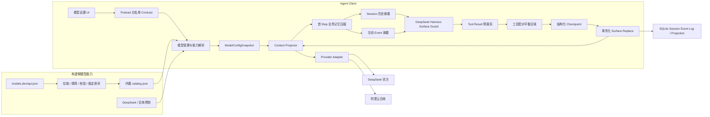
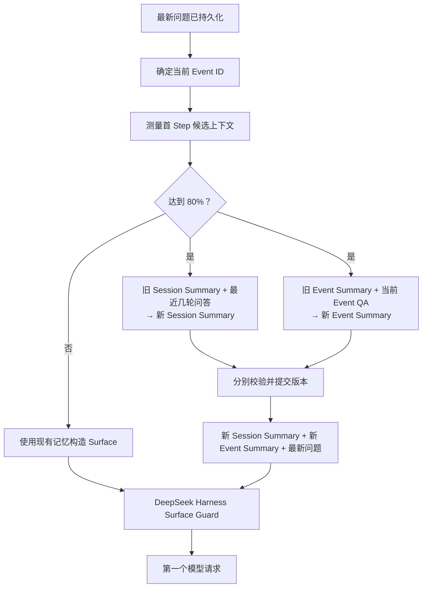

# 阶段 4：模型能力与上下文管理开发架构设计

- 文档状态：待评审
- 所属阶段：阶段 4（模型能力与上下文管理）
- 更新日期：2026-08-26
- 上位方案：`docs/Agent Client完整技术解决方案.md`
- 前置阶段：`docs/阶段方案/阶段3-Client产品功能开发架构设计.md`
- 配套测试：`docs/阶段方案/阶段4-模型能力与上下文管理测试用例.md`

## 1. 文档目的

本文档定义阶段 4 的实际开发范围：

1. 内置可审计的模型能力目录，让 Runtime 获得可解释的上下文窗口、输入和输出能力。
2. 为 DeepSeek 官方和阿里云百炼提供首批供应商预制，完成思考开关、思考强度和 Provider 参数映射。
3. 完成首 Step 前的 Session 历史摘要、当前 ConversationEvent 摘要，以及完全借鉴 DeepSeek Harness 的 Turn 内 Surface Compaction。
4. 完成上述能力所需的向前数据库迁移、Event 扩展和 Projection 重建。
5. 使用长 ConversationEvent、大 Tool Result、多 Session 和双用户后台执行验证新能力的正确性。

阶段 4 不再承担“整个 Client 的系统集成和发布候选大验收”。真实 OpenAI-compatible 模型、标准 Skill 安装与 Agent 调用、Electron 安全边界和双用户基础隔离已在前续阶段形成，本阶段只做与新功能直接相关的回归。

## 2. 阶段开始时已具备的基线

| 已有能力                   | 当前状态                                                   | 阶段 4 处理                                                      |
| -------------------------- | ---------------------------------------------------------- | ---------------------------------------------------------------- |
| OpenAI-compatible 真实模型 | 已支持流式文本、usage、Tool Calling 和结果回送             | 作为新能力的回归基线，不重新接入                                 |
| 模型管理                   | 已支持服务、模型、Credential、默认模型和基础发现           | 扩展容量来源、供应商预制和思考设置                               |
| 标准 Agent Skill           | 已支持目录/ZIP 安装、启停、`skill_load`和 `host_command`   | 不扩展通用 Skill 兼容矩阵                                        |
| 真实 Skill + Agent         | 12306 Skill 已经通过真实模型加载并执行                     | 不重复作为阶段交付目标                                           |
| Context Projector          | 已有输出预留、安全量、ConversationEvent Summary 和近期问答 | 升级为首 Step 双层业务摘要和 DeepSeek Harness Surface Compaction |
| 双用户隔离                 | Session、Model、Skill、Credential 和 Runtime 作用域已隔离  | 验证新增目录、思考配置和 Compaction 不串用户                     |

## 3. 阶段目标与边界

### 3.1 阶段目标

1. 引入构建期模型能力目录，修正模型发现后统一使用默认上下文窗口的问题，并分离模型能力上限与单次请求参数。
2. 为 DeepSeek 官方和阿里云百炼提供供应商预制，在统一模型设置中支持思考开关、思考强度及 Adapter 参数转换。
3. 完成基于模型实际容量的全链路上下文管理：首 Step 前在 80% 压力下更新 Session 历史摘要和当前 Event 摘要；随后及 Turn 内后续 Step 完整执行 DeepSeek Harness 的裁剪、Checkpoint、Surface 替换和 Provider 溢出恢复。
4. 完成模型字段、思考配置、Compaction Event 和可重建 Projection 所需的向前 migration。
5. 在长对话、大结果、多 Session 和双用户后台执行中验证新能力有界、可恢复且不串扰。

### 3.2 本阶段明确不实现

- 新增 Anthropic-compatible 真实服务接入或建立通用 Provider 兼容矩阵。
- 扩展通用 Agent Skills、Node/Python/Shell 兼容矩阵或依赖自动安装交互。
- 针对全 Client 的模型断流、Worker 崩溃、应用强退和 cursor 断档故障注入工程。
- 全面 Electron、IPC、文件、Skill、Credential、日志和依赖安全审计。
- 建立全局性能、资源、恢复、Token 和错误率水位体系。
- 阻断缺陷收敛、发布候选质量报告、签名、公证、安装器和更新渠道。
- 在 Client 运行时从 models.dev 下载数据，或开发在线模型/Skill 市场。
- 修改单 Agent Driver、Queue、Steer、Cancel 和 Tool 并发的已定语义。

不实现上述独立工作包，不等于新代码可以跳过基本安全和错误测试。本阶段仍必须对新增 IPC、用户作用域、目录文件、Provider 参数和 Compaction 事务做定向负向测试。

## 4. 总体技术架构



### 4.1 数据流动

1. 构建脚本从 models.dev 生成精简目录，Client 发布后只读内置文件。
2. 用户选择供应商预制或自定义 OpenAI-compatible，保存统一的思考和容量设置。
3. Main/Worker 将“调用服务配置”和“模型能力来源”分开解析：预制服务可直接使用预制 Provider 索引；自定义 OpenAI-compatible 不要求先识别 Provider，再按用户手工值、端点元数据、目录匹配和 fallback 生成不可变 ModelConfigSnapshot。
4. 新问题入队后先确定 ConversationEvent ID；第一个 Step 前测量完整候选上下文，达到 80% 时按需生成新的 Session 历史摘要和当前 Event 摘要。
5. 首 Step 使用“Session 历史摘要 + 当前 Event 摘要 + 最新用户问题”重新构造 Canonical Surface，再进入 DeepSeek Harness Surface Guard。
6. 首 Step Guard 和 Turn 内后续 pre-step 完全执行 Harness 语义：压力达到 80% 后先预裁剪超大 Tool Result，仍超限则压缩头部工具配对平衡区域。
7. Checkpoint 和 Surface Replace 作为仅追加 Event 提交；ConversationEvent Context 可被摘要替换，但原始 SessionLogEvent 和 Tool Result 不删除。
8. Surface 重新测量并收敛后继续；Provider 明确报 context overflow 时使用 Harness 恢复并最多重试一次。

## 5. 功能模块总览

| 编号 | 模块                    | 阶段 4 工作                                                 | 交付程度 |
| ---- | ----------------------- | ----------------------------------------------------------- | -------- |
| M01  | 模型能力目录            | 目录生成、内置资源、预制索引与 Provider 无关匹配、来源标注  | 完整实现 |
| M02  | 供应商预制与思考配置    | DeepSeek/百炼预制、设置交互、Adapter 映射、reasoning replay | 完整实现 |
| M03  | 上下文预算与 Compaction | 首 Step 双层业务摘要、Harness 裁剪、Checkpoint、溢出恢复    | 完整实现 |

## 6. M01 模型能力目录

### 6.1 构建流程

`scripts/` 中的显式构建命令执行：

1. 拉取 `https://models.dev/api.json`。
2. 只保留 `provider id`、标准化 `apiHosts`、`model id`、`context`、可选 `input` 和 `output`。
3. 剔除 `context <= 0` 或 `output <= 0` 的记录。
4. 校验 `schemaVersion`、`source`、provider、host 和 model 结构；任一非法即失败，不覆盖上一份有效目录。
5. provider、host 和 model 使用 `localeCompare` 稳定排序。
6. 写入临时文件后原子替换 Client 内置 `catalog.json`。

Client 启动、模型发现和离线使用时不得请求 models.dev。目录是可版本化的建议值，不是用户模型配置的事实源。

### 6.2 能力解析

模型调用配置和模型能力配置必须分成两个概念：

- `providerPresetId` 决定 Endpoint 建议、Credential 方式和允许发送的供应商专用参数。
- `capabilityProfileRef` 只指向 catalog 中的 `providerId + modelId` 能力记录，不改变 Endpoint、Adapter 或请求参数。

自定义 OpenAI-compatible 只表示“该服务采用 OpenAI-compatible 协议”，它可能是反向代理、统一网关、自建 vLLM 或未被 models.dev 收录的服务。无法识别其 Provider 时，模型仍然必须能够保存、测试连接和运行，catalog 只能提供能力建议，不能成为服务接入门禁。

能力取值优先级固定为：

1. 用户已保存的手工覆盖。
2. 当前 Provider `/models` 响应明确返回并通过校验的容量。
3. 用户显式选择的 `capabilityProfileRef`。
4. 供应商预制通过 `providerPresetId + Model ID` 精确匹配 catalog；Host 只用于验证预制仍然适用。
5. 自定义 OpenAI-compatible 先尝试 `API Host + Model ID` 精确匹配。
6. Host 无法识别时，在所有 Provider 中按标准化 Model ID 查找：唯一记录可使用；多条记录的 `context/input/output` 完全一致时可使用一致结果。
7. Model ID 存在多条且容量冲突时不猜测 Provider，改用明确标注的保守 fallback，并提示用户手工填写或选择能力模板。

任何自动目录结果都不得静默覆盖手工配置。匹配失败或冲突不得阻止自定义服务使用；来源、命中方式、候选冲突和 fallback 必须在 UI 与诊断 DTO 中可解释。通过 Model ID 推断出的能力不能反向启用 DeepSeek/百炼思考参数等供应商行为。

### 6.3 模型字段

| 字段                     | 含义                                                         | 用途                       |
| ------------------------ | ------------------------------------------------------------ | -------------------------- |
| `contextWindow`          | 模型总上下文容量                                             | 输入+输出的总边界          |
| `inputCapability`        | Provider 声明的可选输入上限                                  | 对有独立输入限制的模型封顶 |
| `maxOutputCapability`    | 模型理论最大输出能力                                         | UI 展示和参数校验          |
| `requestMaxOutputTokens` | Client 对单次请求的输出预算                                  | Adapter 实际发送           |
| `metadataSource`         | `manual/endpoint/catalog/fallback/legacy`                    | 来源标注和迁移解释         |
| `catalogVersion`         | 解析时使用的目录版本                                         | 历史 Snapshot 和诊断       |
| `capabilityProfileRef`   | 可选的 `providerId + modelId` 目录引用                       | 用户显式指定能力模板       |
| `capabilityMatchKind`    | `preset/host/model-unique/model-consensus/manual/unresolved` | 解释目录如何命中           |

`catalog.output` 只能进入 `maxOutputCapability`，不得直接变成每次请求的 `requestMaxOutputTokens`。

### 6.4 模型配置迁移

模型能力目录和思考配置所需的数据升级属于 M01/M02 的落地内容，不单独建立迁移模块：

- 模型服务增加可选 `providerPresetId` 和预制版本。
- 模型增加 `inputCapability`、`maxOutputCapability`、`requestMaxOutputTokens`、`metadataSource`、`catalogVersion` 和可选 `capabilityProfileRef`。
- 模型增加类型化 `thinkingMode` 和 `reasoningEffort`。
- 旧 `maxOutputTokens` 原值迁入 `requestMaxOutputTokens`，不得放大升级后的单次请求。
- 旧模型思考设置迁移为 `auto/null`，确保升级不改变请求行为。
- 无法证明容量来源的旧配置标记为 `legacy`；目录建议只有用户主动确认后才能应用。

## 7. M02 供应商预制与思考配置

### 7.1 首批预制

| `providerPresetId`  | UI 名称    | 默认 Endpoint                | Host 范围                                                    |
| ------------------- | ---------- | ---------------------------- | ------------------------------------------------------------ |
| `deepseek-official` | DeepSeek   | `https://api.deepseek.com/`  | `api.deepseek.com`                                           |
| `alibaba-bailian`   | 阿里云百炼 | 按标准百炼或 Token Plan 选择 | 已登记的 `*.dashscope.aliyuncs.com` 和 `*.maas.aliyuncs.com` |

百炼首批 Endpoint：

| 账号类型          | Endpoint                                                             |
| ----------------- | -------------------------------------------------------------------- |
| 标准百炼·华北 2   | `https://dashscope.aliyuncs.com/compatible-mode/v1`                  |
| Token Plan·华北 2 | `https://token-plan.cn-beijing.maas.aliyuncs.com/compatible-mode/v1` |
| 其他已支持区域    | 用户粘贴完整 URL，按预制 Host allowlist 校验                         |

预制是版本化 Client 资源，只描述 Endpoint、Host 匹配、已确认能力和 Adapter 映射，不包含 Credential、价格和用户状态。用户修改 Endpoint 使 Host 不再匹配时，必须切换为“自定义 OpenAI-compatible”或重新确认，不得继续静默发送供应商专用参数。

### 7.2 统一配置

```ts
type ThinkingMode = 'auto' | 'enabled' | 'disabled';
type ReasoningEffort = 'minimal' | 'low' | 'medium' | 'high' | 'xhigh' | 'max';

interface ModelThinkingSettings {
  thinkingMode: ThinkingMode;
  reasoningEffort: ReasoningEffort | null;
}
```

- `auto`：不发送开关和强度，`reasoningEffort=null`。
- `disabled`：显式关闭，`reasoningEffort=null`。
- `enabled`：显式开启，强度只允许使用当前预制和模型能力表公布的值。

| 统一配置          | DeepSeek 官方                    | 阿里云百炼               |
| ----------------- | -------------------------------- | ------------------------ |
| `auto`            | 不发送额外字段                   | 不发送额外字段           |
| `disabled`        | `thinking: { type: "disabled" }` | `enable_thinking: false` |
| `enabled`         | `thinking: { type: "enabled" }`  | `enable_thinking: true`  |
| `reasoningEffort` | 顶层 `reasoning_effort`          | 顶层 `reasoning_effort`  |

自定义 OpenAI-compatible 和 vLLM/B70 默认不展示已确认的思考档位，也不自动发送 DeepSeek/百炼专用字段。

### 7.3 交互规则

1. “添加模型服务”先选择 DeepSeek、阿里云百炼或自定义 OpenAI-compatible。
2. 预制填入建议 Endpoint，用户单独保存 Credential 并测试连接。
3. 模型列表展示“上下文容量·来源·思考能力”。
4. 模型详情中提供“跟随供应商默认/关闭/开启”；只在开启且支持多档时显示强度。
5. 从开启切换到关闭或自动时清空强度；切换模型导致档位失效时要求用户重新选择，不静默降级。
6. 运行中 Turn 使用开始时的 ModelConfigSnapshot；配置修改从下一 Turn 生效。
7. A/B 用户分别保存供应商、Credential、思考配置和展示偏好。

### 7.4 DeepSeek reasoning replay

DeepSeek 开启思考并产生 Tool Call 后，后续同一工具循环需要回传对应 assistant 消息的 `reasoning_content`：

- reasoning、assistant tool calls 和 tool results 必须能从 Event 重建。
- Context Projector 只在当前未闭合工具循环中回放必需 reasoning。
- 没有 Tool Call 的历史 reasoning 不回灌普通后续问答。
- Adapter 而非 Session Driver 负责序列化 `reasoning_content`。

## 8. M03 上下文预算与 Compaction

### 8.1 两类压缩与唯一触发边界

阶段 4 明确拆分两类语义不同的压缩：

| 类型                       | 触发位置                                                | 输入                                                    | 持久输出                                | 作用                   |
| -------------------------- | ------------------------------------------------------- | ------------------------------------------------------- | --------------------------------------- | ---------------------- |
| 首 Step 业务记忆压缩       | 新问题已确定 Event ID、第一 Step 请求前                 | 旧 Session 历史摘要、最近已闭合问答、当前 Event Context | 新 Session 历史摘要、新 Event Summary   | 形成跨 Turn 的业务记忆 |
| Harness Surface Compaction | 首 Step 业务记忆重投影后，以及 Turn 内每个后续 pre-step | 当前 Canonical Surface                                  | Runtime Checkpoint、Surface replacement | 保证当前执行能够继续   |

不在上一轮输出完成后调用摘要模型。`ConversationExchange` 完成时只持久化事实，不运行异步压缩 Hook；所有业务记忆压力判断统一延迟到下一条用户问题的第一个 Step 之前。

### 8.2 预算与测量

```text
modelInputCeiling = min(
  contextWindow - requestMaxOutputTokens,
  inputCapability ?? +Infinity
)

contextSafetyMarginTokens = min(2048, floor(modelInputCeiling * 0.10))
hardInputLimitTokens      = modelInputCeiling - contextSafetyMarginTokens
softTriggerTokens         = min(
  floor(contextWindow * 0.80),
  hardInputLimitTokens
)
runtimeRetainTokens       = min(
  floor(contextWindow * 0.16),
  softTriggerTokens - 1
)
```

80% 以 models.dev、端点或手工配置解析出的模型总上下文为基线；输出预留、独立输入上限和安全量形成更早的硬保护。Token Meter 必须测量真实请求包络：System Prompt、Tool Schema、Session Summary、Event Summary、最新问题、Checkpoint、reasoning replay、Tool Result、Steer 和请求参数。

### 8.3 首 Step 业务记忆压缩

新问题必须先经过 Input Admission 持久化，再按既定规则确定 `ConversationEvent ID` 并创建开放 Exchange。随后 Context Projector 构造未压缩的首 Step 候选：

```text
稳定 System Prompt
+ Tool Schema
+ 旧 Session 历史摘要（如果存在）
+ 最近若干轮已闭合的用户可见问答
+ 当前 Event Context
+ 最新用户问题
```

低于 `softTriggerTokens` 时不调用业务摘要模型，按原始层级继续。达到阈值后执行两个相互独立、按需启动的摘要任务：



两项都有可压缩输入时可以并行调用摘要模型；没有旧摘要或新增问答的分区不调用。摘要提交后重新构造并测量 Surface，最新用户问题始终作为独立末尾输入，不进入任何摘要。

### 8.4 Session 历史摘要

Session 历史摘要输入固定为：

```text
旧 Session 历史摘要（如果存在）
+ 旧摘要覆盖位置之后、当前首 Step 之前的最近若干轮已闭合问答
```

它描述整个 Session 的高层时间线、长期偏好、跨事项约束、近期处理过的事项及总体结论。它可以在高层提及当前 Event，但不承载当前问题的完整参数和执行细节。每次成功后原子替换旧 Session Summary，并推进 `coveredThroughSessionSeq` 和 `summaryVersion`。

### 8.5 当前 Event 摘要与持久替换

当前 Event 摘要输入固定为：

```text
该 Event 的旧 Summary（如果存在）
+ 该 Event 当前持久化 Context 中尚未被摘要覆盖的用户可见 QA
```

输出必须保留该事项的目标、精确参数、已完成动作、确认结论、未完成问题和必要资源引用。提交时以新 Event Summary 替换 `ConversationEvent Context` 中已覆盖的 QA 内容，并推进 `summaryThroughExchangeSeq`、`summaryTokens` 和 `summaryVersion`；后续新 QA 继续追加在摘要之后。

该替换只作用于业务记忆持久层和默认模型视图。用户/助手原始消息仍由仅追加 `SessionLogEvent` 保存，完整 Tool Result 仍属于 ExecutionTurn 事实；Chat 回放、崩溃恢复和 `event_read/turn_read` 不依赖已替换的 Event Context。

Session Summary 与 Event Summary 允许受控的语义重叠：前者提供全局背景，后者提供当前事项细节。Prompt 中固定冲突优先级：

```text
最新用户问题 > 当前 Event Summary > Session 历史摘要
```

即使每轮解析到不同 Event ID，也只会切换本轮加载的详细 Event Summary；Session Summary 继续维持整个会话的连续性。

### 8.6 DeepSeek Harness Surface Guard

首 Step 的业务记忆重新投影后，以及 Turn 内每个后续 Step 请求前，完整借鉴以下 Harness 语义：

- [`compaction-basic/src/index.ts`](../../../deepseek-harness/deepseek-harness/packages/compaction/compaction-basic/src/index.ts)：pre-step 压力判断、重新测量、默认一次额外收敛和 overflow retry。
- [`compaction-basic/src/region.ts`](../../../deepseek-harness/deepseek-harness/packages/compaction/compaction-basic/src/region.ts)：从 Surface 头部选择连续区域、保留近期尾部并调整 Tool Call/Result 平衡边界。
- [`compaction-basic/src/summarizer.ts`](../../../deepseek-harness/deepseek-harness/packages/compaction/compaction-basic/src/summarizer.ts)：复用原 System、Tools 和消息前缀直接摘要，保持 Provider KV Cache 可复用。
- [`compaction-tool-result-pruner/src/index.ts`](../../../deepseek-harness/deepseek-harness/packages/compaction/compaction-tool-result-pruner/src/index.ts)：压力触发的确定性工具结果裁剪。
- [`compaction/src/checkpoint.ts`](../../../deepseek-harness/deepseek-harness/packages/compaction/compaction/src/checkpoint.ts)：Checkpoint 来源和 Surface replacement 边界。

项目只适配容量来源、`userId` 作用域、现有 Event 命名、DeepSeek reasoning replay 和 UI Projection，不改变 Harness 的裁剪与收敛顺序。

### 8.7 Harness Tool Result Pruner

- 低于压力阈值时不裁剪；Provider context overflow 时无条件尝试裁剪。
- 达到压力后扫描当前 Surface 中所有 Tool Result；默认文本超过 8192 个 Unicode code point 时裁剪。
- 默认保留头部 4096、尾部 1024，中间插入固定裁剪标记；非文本 Content Block 保持原顺序。
- 每个 replacement 引用原 Event seq 并记录裁剪前后大小；可补充 digest，但不得改变 Harness 的确定性裁剪结果。
- 原始 Tool Result Event 不修改，`turn_read` 仍返回工具提交时的完整结果。
- 裁剪后立即重新测量；低于阈值就跳过摘要并继续 Step。

结构化 JSON 在本阶段也按文本执行相同头尾裁剪，并明确标记为部分内容，不额外引入语义裁剪器。

### 8.8 Harness 区域、Checkpoint 与收敛

裁剪后仍达到压力时：

1. 从 Surface 头部选择最旧连续区域，并保留最近约 16% 原始尾部。
2. 调整边界，保证 assistant Tool Call 与对应 Tool Result 不被拆开。
3. 流式消息、运行中的 Tool、未提交 Result、未闭合 Interaction 和当前必需 reasoning replay 不可进入替换区域。
4. 使用原请求的稳定 System、Tools 和选中消息前缀直接生成 Runtime Checkpoint，不进入 Agent Loop、不调用 Tool。
5. Checkpoint 必须比被替换区域更小；Surface generation 和选中范围未变化时才提交 replacement。
6. 提交后重新测量；默认 `compactionRetries=1`，即最多两次摘要压缩。
7. pre-step 压缩失败或两次仍未低于阈值时记录诊断并继续原模型请求，不直接结束 Turn。

Runtime Checkpoint 可进一步压缩 Session Summary、Event Summary 和已闭合执行内容，但只服务当前执行 Surface，不反向覆盖两个业务摘要。

持久顺序适配为：

```text
compaction.started
  → 可选 tool-result surface replacement
  → compaction.summary-updated
  → surface.replaced
  → compaction.ended
```

### 8.9 Provider 溢出恢复

只对规范化 `context_window_exceeded` 进入恢复，不将其他 400、429、认证失败或 5xx 误判为上下文溢出。恢复越过软阈值：先运行相同 Pruner，再以 `retainTokens=0` 选择最大合法平衡头部。只要 Surface generation 确实推进且用户未 Cancel，即使裁剪已提交而后续摘要失败，也允许从更小 Surface 自动重试一次；没有持久进展则保留原错误。

### 8.10 业务摘要失败与并发

- Session/Event 摘要分别使用 `userId + sessionId + coveredSeq + summaryVersion` 做乐观提交；Event 摘要额外校验 `eventId`。
- 两个摘要任务之一失败时保留该层旧摘要和未覆盖 QA，另一层成功结果仍可提交。
- 业务摘要后若完整首 Step Surface 仍超压力，由 Harness Guard 继续压缩；最终无法获得合法请求时才返回 `context_budget_exceeded`。
- Cancel、用户切换或 Driver generation 失效会取消尚未提交的摘要，不允许迟到写入。
- A/B 用户即使 Session/Event ID 相同，也必须使用不同作用域、版本和摘要记录。

### 8.11 摘要持久化与 Surface 恢复

Session 历史摘要是 M03 的业务状态，新增仅追加摘要事件，并建立可由 Event Log 重建的投影：

```sql
CREATE TABLE session_memory_summaries (
  user_id                     TEXT NOT NULL,
  session_id                  TEXT NOT NULL,
  summary                     TEXT NOT NULL,
  covered_through_session_seq INTEGER NOT NULL CHECK (covered_through_session_seq > 0),
  summary_tokens              INTEGER NOT NULL CHECK (summary_tokens > 0),
  summary_version             INTEGER NOT NULL CHECK (summary_version > 0),
  input_tokens                INTEGER NOT NULL DEFAULT 0 CHECK (input_tokens >= 0),
  output_tokens               INTEGER NOT NULL DEFAULT 0 CHECK (output_tokens >= 0),
  updated_at                  TEXT NOT NULL,
  PRIMARY KEY (user_id, session_id),
  FOREIGN KEY (user_id, session_id) REFERENCES sessions(user_id, id)
);
```

现有 `conversation-event.summary-updated` 继续承载 Event Summary、覆盖位置和版本；Projection 将已覆盖 QA 替换为摘要视图，原始用户/助手消息仍留在 `session_events`。

Harness Compaction 通过向后兼容的 `compaction.*` 和 `surface.replaced` 事件记录 `compactionId`、用户/会话/Turn 作用域、触发原因、Surface generation、替换范围、shadowed seq、压缩前后 token、Checkpoint、Provider/Model 快照、状态和错误。Checkpoint 正文和完整 Tool Result 只保存在事实事件中。

阶段 4 不新增 `session_compactions` 历史查询表。Runtime 直接从 Event Log 重建当前 Surface 和未闭合压缩状态；以后只有在出现明确的压缩历史查询或诊断 UI 需求时，才增加可丢弃、可重建的查询 Projection。

## 9. 实施顺序

1. 生成并校验 catalog，完成容量字段和来源解析。
2. 完成 DeepSeek/百炼预制、统一思考配置、UI 交互与 Adapter 映射。
3. 完成首 Step 压力判断、Session 历史摘要、Event Context 持久替换和冲突优先级。
4. 按 DeepSeek Harness 完成 Tool Result Pruner、平衡区域和 Runtime Checkpoint。
5. 完成 Surface Replace、pre-step 失败继续、崩溃恢复和 Provider overflow 重试。
6. 完成 Session/Event Summary 与 Runtime Compaction 的 migration、Upcaster 和 Projection 重建。
7. 执行长 Event、跨 Event 会话、长 Turn、大 Tool Result、多 Session 和双用户定向联合测试。

## 10. 阶段验收标准

- catalog 可重复生成、离线解析和安全回退；预制按 Provider + Model 精确解析，自定义 OpenAI-compatible 可在不识别 Provider 的情况下按 Host、唯一 Model 或一致能力匹配。
- 自定义模型存在多 Provider 容量冲突时不猜测、不阻断调用，可回退并让用户显式填写或选择能力模板。
- 模型理论输出能力和单次请求输出预算不混用，旧配置升级后不静默放大请求。
- DeepSeek/百炼预制可在现有模型管理页配置，UI 状态、Snapshot 和最终 HTTP JSON 一致。
- 自定义 OpenAI-compatible/vLLM 不会误用供应商专用思考参数。
- DeepSeek 当前工具循环的 reasoning replay 可持久化、回放并在重启后重建。
- 上一轮输出完成后不调用摘要模型；新问题确定 Event ID 后，只在首 Step 达到 80% 时更新业务摘要。
- 首 Step 可生成“新 Session 历史摘要 + 新 Event 摘要 + 最新问题”，冲突时严格按最新问题、Event、Session 顺序解释。
- Event Summary 可替换持久化 Event Context 中已覆盖 QA 的默认视图，原始 SessionLogEvent、Chat 和深读证据不丢失。
- 首 Step 业务摘要完成后以及 Turn 内每个后续 pre-step 完整执行 Harness Pruner、重新测量、平衡区域和有界收敛。
- 长 Turn 可压缩已闭合旧 Step 并继续执行，Tool Call/Result 和必需 reasoning replay 不被拆分。
- Harness Pruner 使用 8192/4096/1024 默认字符策略；原始 Tool Result 永久完整，模型 Surface replacement 可回查原 seq。
- Checkpoint 必须比被替换区域更小、事务可恢复、Projection 可重建；不收敛时有界失败。
- Provider overflow 只在 Surface 确实变小后自动重试一次。
- A/B 用户的容量来源、预制、思考配置、Checkpoint、原始结果和 UI 增量完全隔离。
- 新 migration 可从阶段 1～3 数据库向前升级，Projection 删除后可由 Event Log 完整重建。

## 11. 阶段交付物

- 模型目录生成器、校验器、内置 catalog 和容量解析器。
- DeepSeek/百炼供应商预制、思考设置 UI 和 Adapter 映射。
- 首 Step Session/Event 双层业务摘要、Event Context 替换和冲突优先级。
- DeepSeek Harness 一致的 Pruner、平衡区域、Runtime Checkpoint、Surface Replace 和 overflow recovery。
- 模型配置和 Compaction 的向前 migration、Event Schema 和可重建 Projection。
- 配套自动化测试、长上下文定向联合测试结果和已知限制。
