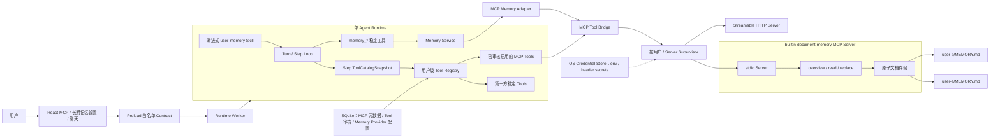
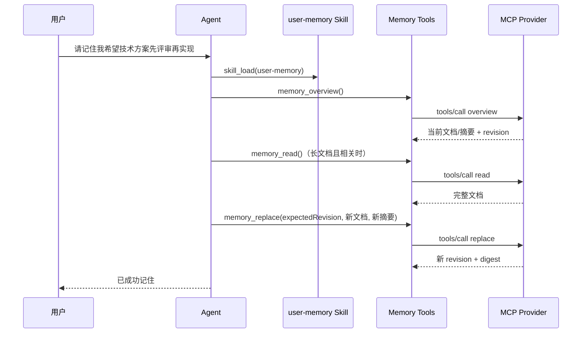

# 阶段 4.5：通用 MCP 接入与可插拔长期记忆开发架构设计

- 文档状态：待评审
- 所属阶段：阶段 4.5（通用 MCP Tool Bridge + 可插拔长期记忆 V1）
- 更新日期：2026-08-27
- 上位方案：`docs/Agent Client完整技术解决方案.md`
- 前置阶段：`docs/阶段方案/阶段4-模型能力与上下文管理开发架构设计.md`
- 后续阶段：`docs/阶段方案/阶段5-发布工程与交付开发架构设计.md`
- 配套测试：`docs/阶段方案/阶段4.5-可插拔长期记忆测试用例.md`
- 主要参考：DeepSeek Harness `packages/mcp/mcp-client/`、`examples/mcp-memory/`
- 协议参考：MCP 稳定版 Architecture、Lifecycle、Transports、Authorization；实现时固定 SDK 与协议 revision，不静默跟随 draft/RC
- 极简工具面参考：Pi Coding Agent（默认 `read`、`write`、`edit`、`bash`）

## 1. 文档目的

本文档定义阶段 4.5 的正式实现范围：在不改变单 Agent Runtime 主循环、不把长期记忆正文写入核心 SQLite 数据模型的前提下，交付生产可用的通用 MCP 工具接入面，引入可替换的 Memory Provider 边界，并交付第一个随 Client 打包的简化本地文档记忆 MCP Server。

阶段 4.5 解决以下问题：

1. 用户明确要求“记住”某项稳定信息后，新 Session 仍可按需召回。
2. 用户纠错时替换当前有效认知，不以逐条追加方式持续保留互相冲突的记忆。
3. 长期记忆与 Session Summary、ConversationEvent Summary、最近问答和 Runtime Checkpoint 明确分层。
4. Runtime、UI 和默认 Skill 不依赖记忆的具体存储方式，为后续替换 Memorix、Engram 或其他 MCP Memory Provider 保留边界。
5. 两个内置用户的长期记忆在进程、目录、配置、工具路由和 UI 中严格隔离。
6. 用户可为各自账号接入多个本地或远程 MCP Server，动态发现的工具以稳定 namespace 进入既有 Tool Registry、Tool Loop、权限、取消、持久化和 Compaction 链路。
7. MCP Server 的连接、认证、工具变化、失败重连、停用和删除具备完整生命周期，不依赖重启整个 Client，也不把外部 Server 变成可信核心组件。

阶段 4.5 的“完整 MCP 接入”特指完整、可管理、可测试的 **MCP Tool Bridge V1**，而不是宣称实现 MCP 每一种 primitive。V1 支持 stdio 与 Streamable HTTP、初始化与 capability negotiation、分页工具发现与动态刷新、工具调用、结构化结果、超时取消、认证、受控重连、用户级配置和 UI 管理。Resources、Prompts、Sampling、Roots、Elicitation、Completions、Tasks 与 MCP Apps 暂不投影到 Agent Runtime；协议层必须能识别并拒绝未声明/未支持的 capability，给后续阶段保留 Adapter 边界。

## 2. 阶段开始时已具备的基线

| 已有能力 | 当前状态 | 阶段 4.5 处理 |
| --- | --- | --- |
| Session/Event 记忆 | 已有 Session Summary、Event Summary、最近问答和显式历史读取 | 保持原语义，不把它们迁入长期记忆 |
| Turn 内上下文治理 | 已有 Tool Result Pruner、Checkpoint、Surface Replace 和 overflow recovery | 验证 Memory Tool Result 可参与既有压缩，不修改压缩算法 |
| Skill 渐进加载 | Step 初始只投影名称和描述，`skill_load` 按需读取 `SKILL.md`/资源 | 增加默认 `user-memory` Skill，并完善记忆调用规则 |
| Tool Loop | 已有持久 Tool Call/Result、并发调度、取消和错误分类 | 增加稳定 `memory_*` 包装工具并路由到 MCP Provider |
| 双用户 | Session、模型、Skill、凭据和 Runtime 已按 `userId` 隔离 | 增加 Provider 配置、MCP 进程和记忆目录隔离 |
| Client 设置 | 已有模型和 Skill 管理界面 | 增加长期记忆设置、状态、查看、编辑和清空入口 |
| 动态 Tool Registry | 当前内置工具在 Worker 启动时注册，缺少 generation/unregister | 增加按用户、按 Server 的工具 generation、原子替换和注销 |
| Credential Store | 已有模型/Skill 凭据引用 | 增加 MCP header/env secret 的独立引用命名空间；阶段 4.5 不实现 OAuth 流程 |

## 3. 核心决策

### 3.1 长期记忆不是核心数据库领域表

阶段 4.5 不创建“每条记忆一行”的 `user_memories` 表，也不在主 SQLite 中保存一整份长期记忆正文。

核心 SQLite 只保存当前用户选择的 Memory Provider 配置及其配置 revision。长期记忆正文、摘要、文档 revision 和备份由 Provider 自己管理。

该边界与 DeepSeek Harness 一致：Harness/Runtime 负责发现和调用记忆能力，具体存储、检索和迁移属于提供方。

### 3.2 第一 Provider 是随包本地 MCP Server

V1 首个 Provider 固定为：

```text
providerId: builtin-document-memory
providerKind: mcp-stdio
displayName: 内置本地记忆
transport: stdio
storageModel: 单用户规范 Markdown 文档
```

它由 Client 随包交付，不需要用户安装 Node、Python、数据库或第三方服务。Runtime Worker 通过本阶段统一的 MCP Client/Supervisor 启动并调用它，但不直接读写其 `MEMORY.md`。

### 3.3 当前有效文档，而不是记忆条目集合

每个用户只有一份“当前有效长期记忆文档”。用户纠错、忘记或更新时，Agent 先读取最新版本，再生成新的完整文档并执行带 revision 的整体替换。

该模型的重点是：

- 当前文档只保留仍然有效的信息。
- 纠错替换旧认知，不追加相反内容。
- 历史变更属于审计或备份，不进入当前模型默认记忆。
- Provider 可以被替换，Runtime 不假设所有 Provider 都使用文档模型。

### 3.4 Skill 管规则，Tool 管数据

`user-memory` Skill 只描述什么时候读取、写入、纠错、忘记以及哪些内容禁止存储。实际数据必须通过 `memory_overview`、`memory_read` 和 `memory_replace` 工具访问。

Skill 本身不保存动态记忆，MCP Server 也不向 Skill 目录回写内容。

### 3.5 通用 MCP 是动态外部工具面

Memory Provider 只是通用 MCP 基础设施的第一个内置消费者。第三方 Server 发现的工具直接以 `mcp__<serverName>__<rawName>` 注册到用户级 Tool Registry；Memory Adapter 则把内置 Server 的原始工具收敛成稳定的 `memory_*` Port，避免长期记忆语义依赖某个 Server 的命名和 Schema。

两条路径共用连接、传输、认证、超时、取消、重连、日志和健康状态，但不共用业务 Contract：

| 路径 | 模型看到的名称 | Contract 所有者 | 用途 |
| --- | --- | --- | --- |
| 通用 MCP Tool Bridge | `mcp__<serverName>__<rawName>` | 外部 Server + 本地安全包装 | 用户主动接入的动态能力 |
| 内置 Memory Provider | `memory_overview/read/replace` | Client Memory Port | 第一方长期记忆语义 |

### 3.6 Pi 的四个默认能力是 Tool，不是 Skill/MCP

Pi Coding Agent 默认给模型四个工具：`read`、`write`、`edit`、`bash`。Pi 的 Skill 遵循 Agent Skills 的渐进披露；MCP 也不是 Pi 的默认内置能力，而是可由 Extension 接入。

阶段 4.5 采用其“可信核心保持小、扩展能力走独立边界”的原则，但不机械复制 coding-agent 的四个名称：本 Client 的可信内置面继续由 `request_user_input`、历史读取、`skill_load` 和受控 `host_command` 等现有工具组成。文件读写若后续成为产品需求，应通过独立受限工具设计进入，而不能借通用 MCP 绕过工作区、审批和双用户边界。Skill 是说明与工作流，内置 Tool 是第一方执行原语，MCP Tool 是不可信外部能力，三者必须分别管理和展示。

## 4. 阶段目标与边界

### 4.1 阶段目标

1. 建立与 Runtime 核心解耦的 `MemoryProvider` Port 和用户级 Provider Snapshot。
2. 实现 MCP Tool Bridge V1：stdio 与 Streamable HTTP、初始化协商、分页工具发现、动态刷新、工具调用、结构化结果、关闭、超时、取消和有界重连。
3. 实现随包的 `builtin-document-memory` MCP Server，以及用户级 `MEMORY.md` 原子读写、revision 冲突和备份恢复。
4. 增加默认渐进式 `user-memory` Skill 和稳定 `memory_*` Tool Contract。
5. 完成明确记忆、纠错、忘记、跨 Session 召回、短记忆直接返回和长记忆摘要后按需全文读取。
6. 完成长期记忆设置 UI、Provider 状态、全文编辑、导出和清空确认。
7. 验证双用户、多 Session 并发、Worker/MCP 重启、文档损坏和阶段 4 Compaction 联动。
8. 实现可配置的通用 MCP Tool Bridge：stdio、Streamable HTTP、稳定命名、分页发现、`tools/list_changed`、结构化结果、原子 generation 切换和有界重连。
9. 实现每用户 MCP Server 管理、连接测试、工具启停/审批策略、Credential 引用、健康状态与热重载。
10. 冻结内置 Tool、Skill、通用 MCP Tool 与 Memory Port 的职责边界，任何动态 Server 都不能覆盖第一方工具。

### 4.2 本阶段明确不实现

- 不建设 MCP Server 安装市场、自动下载器或远程目录；用户只能显式创建配置，Client 不代替上游安装依赖。
- 不支持已废弃的 HTTP+SSE transport；远程连接只使用 Streamable HTTP。
- 不直接兼容 Memorix、Engram、MCP Reference Memory 的不同工具 Schema；只保留后续 Adapter 扩展点。
- 不实现 embedding、向量数据库、语义检索、自动实体抽取或知识图谱。
- 不从普通对话中静默推断并自动保存长期记忆。
- 不保存密码、API Key、Token、私钥和其他认证秘密。
- 不按单条偏好建立 CRUD 表、标签表或复杂冲突图。
- 不改变阶段 4 的 Session/Event Summary 与 Surface Compaction 触发逻辑。
- 不把 MCP Resources、Prompts、Sampling、Roots、Elicitation、Completions、Tasks 或 MCP Apps 投影到 Runtime；V1 只完整交付 Tool Bridge。
- 不允许模型、Skill 或 Renderer 直接提交原始 Credential；stdio command/cwd/env、HTTP URL/header 只能通过受控设置 Contract 保存和校验，秘密值只进入 Credential Store。

## 5. 总体技术架构



### 5.1 分层职责

| 层/组件 | 负责 | 不负责 |
| --- | --- | --- |
| MCP Management | 当前用户 Server CRUD、连接测试、Tool 审核/启停、状态与风险展示 | 直接持有密钥或绕过 Preload |
| MCP Client/Supervisor | 双 transport、握手、分页发现、动态刷新、调用、取消、重连和释放 | 自动下载 Server、自动安装依赖、继承全部宿主环境 |
| MCP Tool Catalog | 原始名称映射、Schema digest、审核状态、上下文成本估算 | 将全部已发现工具无条件送入模型 |
| 用户级 Tool Registry | 合并第一方 Tools 与当前 Step 已启用 MCP Tools，冻结不可变 Snapshot | 跨用户共享动态工具或在 Step 中热切换 |
| `user-memory` Skill | 记忆判断规则、读写顺序、纠错和安全限制 | 持久化和 Provider 生命周期 |
| `memory_*` Tools | 为模型提供稳定、与 Provider 无关的调用面 | 暴露原始路径、命令或 `userId` |
| Memory Service / Adapter | 用户作用域、Snapshot、能力校验，把 Memory Port 映射到内置 MCP | 假设所有 MCP 都是记忆 Provider |
| 文档型 MCP Server | 规范文档、摘要、revision、原子写入和备份 | Session/Event/Tool 历史 |
| 主 SQLite | MCP 元数据、Tool 审核、Provider 选择和配置 revision | 长期记忆正文、密钥明文和外部 MCP 数据 |

### 5.2 关键数据流

1. 用户保存 MCP Server 配置；秘密写入 Credential Store，SQLite 只保存引用。连接测试不等于启用，也不会自动把工具加入模型上下文。
2. Supervisor 完成 MCP initialize，分页读取 `tools/list`，规范化名称并计算 Schema digest；发现结果先进入用户级 Tool Catalog，新工具默认为未启用。
3. 用户审核并启用具体工具；新的 `mcpRevision` 发布后，下一 Step 才构造包含这些工具的 `ToolCatalogSnapshot`。同一 Step 的定义和执行解析必须来自同一 Snapshot。
4. 模型调用 `mcp__<serverName>__<toolName>` 后，Bridge 使用 Snapshot 保存的 raw name 调用对应 Server；完整结果写入 Event Log，有界文本/结构化投影进入 Surface。
5. Server 发出 `tools/list_changed` 时，Bridge 先在临时 generation 完成发现和冲突校验，再原子替换；Schema 变化的已启用工具转为 `review_required`，未经确认不再暴露。
6. 记忆路径使用同一 MCP 生命周期，但内置 Server 原始工具不直接暴露给模型；Memory Adapter 将其包装为稳定的 `memory_overview/read/replace`。
7. 新 Step 只看到 `user-memory` 的名称和描述；命中记忆意图后按需加载 Skill 和调用 Memory Tools。长记忆先 overview，再按相关性读取全文。
8. Memory Service 使用可信 `userId` 选择 Provider；Server 以 `expectedRevision` 原子替换文档，新 Session 再从同一用户 Provider 召回。

## 6. 功能模块总览

| 编号 | 模块 | 阶段 4.5 工作 | 交付程度 |
| --- | --- | --- | --- |
| M01 | Memory Domain 与 Provider Adapter | 稳定 Memory Port、用户级 Provider Snapshot、错误和配置 revision | 完整实现 |
| M02 | 默认 Memory Skill | bundled 注册、渐进加载、写入/纠错/召回规则与 Prompt 预算 | 完整实现 |
| M03 | MCP Domain、配置与 Tool Catalog | Server/Tool 类型、用户作用域、Schema digest、审核状态和 revision | 完整实现 |
| M04 | MCP Client 与 Supervisor | stdio/HTTP、协议生命周期、动态发现、调用、取消、重连和释放 | 完整实现 |
| M05 | Runtime MCP Tool Bridge | 稳定命名、generation、Step Snapshot、结果投影、权限与 Token 预算 | 完整实现 |
| M06 | MCP Client 管理交互 | Server CRUD、连接测试、Tool 审核/启停、健康状态和错误恢复 | 完整实现 |
| M07 | 文档型 Memory MCP Server | MEMORY.md、revision、原子替换、摘要阈值和备份 | 完整实现 |
| M08 | Memory Runtime 与 Tool 集成 | 稳定 `memory_*` Tools、Event、Snapshot 和 Compaction 联动 | 完整实现 |
| M09 | Memory Client 管理交互 | 查看编辑、导出、清空、状态和错误恢复 | 完整实现 |
| M10 | 安全、迁移与恢复 | 双用户隔离、Credential、环境收敛、配置迁移和故障恢复 | 完整实现 |

## 7. M01 Memory Domain 与 Provider Port

### 7.1 领域类型

```ts
type MemoryProviderId = string;

interface MemoryProviderSnapshot {
  userId: LocalUserId;
  providerId: MemoryProviderId;
  providerKind: 'mcp-stdio';
  enabled: boolean;
  configRevision: number;
  capabilities: readonly ['overview', 'read', 'replace'];
}

interface MemoryOverview {
  state: 'empty' | 'short' | 'summarized';
  documentRevision: number;
  estimatedTokens: number;
  requiresRead: boolean;
  summary?: string;
  headings: string[];
  content?: string;
  contentDigest?: string;
}

interface MemoryDocument {
  documentRevision: number;
  content: string;
  summary?: string;
  estimatedTokens: number;
  contentDigest: string;
  updatedAt: string;
}

interface MemoryReplaceInput {
  expectedRevision: number;
  content: string;
  summary?: string;
}

interface MemoryReplaceResult {
  documentRevision: number;
  contentDigest: string;
  updatedAt: string;
}

interface MemoryProvider {
  overview(signal?: AbortSignal): Promise<MemoryOverview>;
  read(signal?: AbortSignal): Promise<MemoryDocument>;
  replace(input: MemoryReplaceInput, signal?: AbortSignal): Promise<MemoryReplaceResult>;
  health(signal?: AbortSignal): Promise<MemoryProviderHealth>;
  dispose(): Promise<void>;
}
```

`MemoryProvider` 不接收 `userId`。用户作用域在创建 Provider 实例时已经绑定，防止模型参数、MCP Tool Input 或第三方 Server 自行选择其他用户。

### 7.2 配置事实与内容事实

主 SQLite 新增 Provider 配置，但不保存内容：

```sql
CREATE TABLE memory_provider_configs (
  user_id TEXT PRIMARY KEY,
  provider_id TEXT NOT NULL,
  provider_kind TEXT NOT NULL,
  enabled INTEGER NOT NULL CHECK (enabled IN (0, 1)),
  config_json TEXT NOT NULL,
  credential_ref TEXT NULL,
  created_at TEXT NOT NULL,
  updated_at TEXT NOT NULL,
  FOREIGN KEY (user_id) REFERENCES local_users(id)
);
```

`user_config_revisions` 增加 `memory_config_revision`。它只在 Provider 选择、启停或连接配置变化时递增；`MEMORY.md` 内容更新不递增 Prompt epoch，也不进入用户配置 revision。

Provider 自己维护 `documentRevision`，用于并发比较与替换。两种 revision 不得混用：

| revision | 所有者 | 变化原因 |
| --- | --- | --- |
| `memoryConfigRevision` | 主 SQLite | Provider 选择、启停、非敏感连接配置变化 |
| `documentRevision` | 当前 Provider | 长期记忆正文被替换 |

### 7.3 Provider Snapshot

- 每个 Step 开始时固定 `MemoryProviderSnapshot`，同一 Step 内不切换 Provider。
- Provider 配置在运行中变化时，当前 Step 继续使用旧 Snapshot；下一 Step 使用新 revision。
- 文档正文不是 Snapshot 内容，调用工具时按 `documentRevision` 读取 Provider 当前状态。
- Provider 停用后，新 Step 不再展示 `user-memory` Skill，也不暴露可调用的 Memory Tools。

## 8. M02 默认 `user-memory` Skill

### 8.1 安装和可见性

Skill 随应用资源发布，注册为 `sourceType=bundled`：

```text
resources/
  skills/
    user-memory/
      SKILL.md
```

两个内置用户首次升级后各获得一条安装记录，默认启用、不可卸载、可随长期记忆总开关停用。其正文仍遵循现有渐进加载：System Prompt 只出现名称和描述，模型命中后才调用 `skill_load`。

建议目录描述：

> 当用户明确要求记住、纠正或忘记稳定信息，或历史偏好可能影响当前回答时使用；通过 Memory Tools 按需读取和替换当前用户的长期记忆。

### 8.2 Skill 必须包含的规则

1. 用户明确说“记住”“以后都这样”“把之前的改成”时才写入。
2. 普通寒暄、一次性参数、当前任务临时状态和模型推测不得自动写入。
3. 密码、API Key、Token、私钥、验证码和认证材料不得写入，即使用户提出也应解释并拒绝。
4. 历史信息可能相关时先调用 `memory_overview`，长记忆只有在摘要/章节与当前问题相关时才调用 `memory_read`。
5. 更新前必须读取最新文档；纠错要删除或替换旧表述，禁止保留互相冲突的两条当前记忆。
6. 使用 `expectedRevision` 写入；冲突时重新读取并最多重试一次。
7. 文档超过摘要阈值时，写入请求必须同时提供新的要点摘要。
8. 只有 `memory_replace` 成功后才能告诉用户“已经记住”。
9. 用户要求忘记某一内容时，读取后删除对应段落并整体替换；用户要求清空全部记忆时必须先确认。
10. Provider 不可用或写入失败时必须明确说明，不得假装成功。

### 8.3 Prompt 预算

Memory Skill 正文不常驻 Prompt。稳定前缀只增加一条有长度上限的目录描述，不注入 `MEMORY.md` 或记忆摘要。

因此长期记忆不会无条件增加每轮上下文；只有命中记忆意图时，Skill 和 Memory Tool Result 才进入当前 Turn Surface。

## 9. M03 MCP Domain、配置与 Tool Catalog

### 9.1 Server 与 Tool 领域类型

```ts
type McpTransport = 'stdio' | 'streamable-http';
type McpServerStatus =
  | 'disabled'
  | 'connecting'
  | 'ready'
  | 'degraded'
  | 'reconnecting'
  | 'unavailable'
  | 'incompatible';

interface McpServerConfigSnapshot {
  id: string;
  userId: LocalUserId;
  serverName: string;
  transport: McpTransport;
  connection: StdioConnection | StreamableHttpConnection;
  enabled: boolean;
  configRevision: number;
  toolCallTimeoutMs: number;
  reconnect: { initialMs: number; maxMs: number; maxAttempts: number };
}

interface McpToolRecord {
  serverId: string;
  rawName: string;
  publicName: string;
  description: string;
  inputSchema: JsonSchema;
  outputSchema?: JsonSchema;
  schemaDigest: string;
  enabled: boolean;
  exposure: 'model' | 'service-only';
  approvalPolicy: 'never' | 'first-use' | 'always';
  status: 'available' | 'review-required' | 'missing' | 'incompatible';
}
```

`serverName` 是用户作用域内稳定、可读、不可重复的名称；修改它会改变所有公开 Tool 名，必须在 UI 中作为破坏性变更提示。`sourceType=bundled` 的内置 Server 由应用资源清单锁定 command/path，用户不能改写为其他 executable。

### 9.2 SQLite 配置模型

```sql
CREATE TABLE mcp_servers (
  id TEXT NOT NULL,
  user_id TEXT NOT NULL,
  display_name TEXT NOT NULL,
  server_name TEXT NOT NULL,
  source_type TEXT NOT NULL CHECK (source_type IN ('bundled', 'user')),
  transport TEXT NOT NULL CHECK (transport IN ('stdio', 'streamable-http')),
  command TEXT NULL,
  args_json TEXT NULL,
  cwd TEXT NULL,
  url TEXT NULL,
  env_bindings_json TEXT NOT NULL DEFAULT '{}',
  header_bindings_json TEXT NOT NULL DEFAULT '{}',
  enabled INTEGER NOT NULL CHECK (enabled IN (0, 1)),
  fail_on_startup_error INTEGER NOT NULL DEFAULT 0,
  tool_call_timeout_ms INTEGER NOT NULL,
  reconnect_json TEXT NOT NULL,
  created_at TEXT NOT NULL,
  updated_at TEXT NOT NULL,
  PRIMARY KEY (user_id, id),
  UNIQUE (user_id, server_name),
  FOREIGN KEY (user_id) REFERENCES local_users(id)
);

CREATE TABLE mcp_tools (
  user_id TEXT NOT NULL,
  server_id TEXT NOT NULL,
  raw_name TEXT NOT NULL,
  public_name TEXT NOT NULL,
  description TEXT NOT NULL,
  input_schema_json TEXT NOT NULL,
  output_schema_json TEXT NULL,
  schema_digest TEXT NOT NULL,
  enabled INTEGER NOT NULL DEFAULT 0,
  exposure TEXT NOT NULL CHECK (exposure IN ('model', 'service-only')),
  approval_policy TEXT NOT NULL,
  status TEXT NOT NULL,
  discovered_at TEXT NOT NULL,
  updated_at TEXT NOT NULL,
  PRIMARY KEY (user_id, server_id, raw_name),
  UNIQUE (user_id, public_name),
  FOREIGN KEY (user_id, server_id) REFERENCES mcp_servers(user_id, id)
);
```

`user_config_revisions` 增加 `mcp_revision`。Server 配置、Tool 启停、审批策略和 Schema 审核状态在同一事务内更新并递增 revision。`env_bindings_json` 与 `header_bindings_json` 只能保存变量名到 `credentialRef` 的映射，不保存秘密明文。

### 9.3 名称与冲突规则

公开名称固定为 `mcp__<serverName>__<rawName>`，再执行确定性规范化：

1. 非 `[a-zA-Z0-9_-]` 字符替换为 `_`，连续 `_` 合并。
2. 保留可读前缀；超过模型 Tool 名上限时截断并追加原始全名 hash。
3. 同一用户内与第一方 Tool、另一 MCP Tool 冲突时，当前 discovery generation 整体失败，不使用“后注册覆盖前注册”。
4. 调用时用 Catalog 中保存的 `rawName`，绝不从公开名称反推 Server 原名。

### 9.4 全量发现、按需暴露

MCP 的问题不在于“能否发现工具”，而在于全部 Tool Schema 常驻 Prompt 会快速消耗上下文。阶段 4.5 采用两级目录：

- **管理目录**：完整保存 Server 已发现的全部工具、Schema、digest 和状态，供 UI 审核，不进入模型 Prompt。
- **运行目录**：只包含当前用户明确启用且无需重新审核的工具，构造当前 Step `ToolCatalogSnapshot`。

新发现工具默认 `enabled=false`。已启用工具的 Schema digest 改变后自动进入 `review-required`，下一 Step 不再暴露，直到用户查看差异并确认。UI 同时展示单个工具及当前启用集合的 Schema token 估算，帮助用户控制上下文成本。

这里借鉴 Pi 的不是“不实现 MCP”，而是“小核心、能力按需加入”的约束。Pi 默认的 `read/write/edit/bash` 属于内置 Tool，其 Skills 只把名称和描述常驻上下文，完整正文按需加载；本项目将同样的预算思想应用到 MCP Tool Catalog，但保留模型原生 Tool Schema，不采用一个无类型的 `mcp_call` 万能工具。

## 10. M04 MCP Client 与 Supervisor

### 10.1 协议范围

阶段 4.5 固定 MCP SDK 版本与协议 revision，完整实现 Tool Bridge 所需链路：

- stdio 与 Streamable HTTP transport。
- `initialize`、`initialized` 与 capability negotiation。
- 带 cursor 的分页 `tools/list`。
- `notifications/tools/list_changed` 动态刷新。
- `tools/call`、结构化/非结构化结果、`isError`。
- 超时、AbortSignal、Client/Server 关闭、连接丢失和有界重连。

Server 未声明 `tools` capability 时不得调用工具接口；声明不支持的 capability 只记录为“未桥接”，不能误当作成功接入。V1 不桥接 Resources、Prompts、Sampling、Roots、Elicitation、Completions、Tasks 和 Apps。

### 10.2 Transport 配置

stdio 配置包含 `command`、参数数组、受控 `cwd` 和 env credential bindings。命令与参数按数组直接启动，不拼 Shell 字符串；Client 不自动执行 `npm install`、`pip install`、`npx -y` 或其他依赖安装。

Streamable HTTP 配置包含 URL、非敏感 header 与 header credential bindings。生产配置只允许 HTTPS；仅开发模式允许 localhost HTTP。阶段 4.5 支持静态 Bearer/API Key 等 header 注入，不实现 OAuth 授权码、刷新令牌或动态 Client Registration。

### 10.3 连接与重连状态机

```text
disabled
  → connecting
  → ready
  → degraded / reconnecting
  → ready
  → unavailable
```

- 每个 `(userId, serverId)` 拥有独立连接实例、调用表和重连计数；不同用户即使配置相同 URL 也不共享连接对象。
- 初始连接失败是否阻断应用由 `failOnStartupError` 决定；用户配置默认不阻断，随包内置记忆默认阻断其自身就绪但不阻断 Client 启动。
- 连接断开后采用有上限的指数退避，默认 `500ms → 30s`、最多 10 次；成功握手后重置计数。
- 重连期间保留最后一个已审核 generation 以维持 UI 与历史可解释性，但调用立即返回可重试的 unavailable；超过上限后注销运行目录中的工具。
- stop/delete/dispose 必须取消 pending calls、终止重连 timer、关闭 transport，并对 stdio 子进程执行有界退出。

### 10.4 两阶段动态同步

初次连接与 `tools/list_changed` 使用同一同步算法：

```text
分页拉取全部 tools
→ 校验 JSON Schema / 名称 / 数量 / 单项大小
→ 生成 publicName、schemaDigest 和候选 generation
→ 检查重复与跨 Server 冲突
→ 与旧 Catalog 做 added / changed / removed diff
→ 单事务保存管理目录和 mcpRevision
→ 原子发布运行 generation
```

拉取、校验或冲突任一步失败时，旧 generation 保持不变，不能出现“先 unregister 后失败导致工具全丢”的半更新状态。连续到达的 list_changed 通知串行合并，同一 Server 同时最多执行一次同步。

### 10.5 调用、结果与取消

- Tool Scheduler 完成现有参数校验与审批后，Bridge 再用 raw name 调用 Server。
- 每次调用记录 `userId/sessionId/turnId/stepId/toolCallId/serverId/generation/schemaDigest`，供结果校验与审计。
- `structuredContent` 存在时按 outputSchema 校验；不合法时返回协议错误，不能以“文本看起来正常”为由接受。
- 原始 MCP content 和 structuredContent 作为 Tool Result 事实完整持久；投影到模型时只保留有界文本与可安全序列化 JSON，图片/音频/资源引用使用有界占位或后续专用附件边界，不能直接无限展开。
- `isError=true` 映射为 Tool 执行错误；传输错误、超时、取消和 Schema 错误保持不同错误码。
- 用户取消或 Step 结束后忽略迟到结果，不允许重复提交 Tool Result。

## 11. M05 Runtime MCP Tool Bridge

### 11.1 用户级 Registry 与 Step Snapshot

现有全局 `toolRegistry.definitions()` 必须改为用户作用域查询：

```ts
interface ToolCatalogSnapshot {
  userId: LocalUserId;
  revision: number;
  definitions: readonly ToolDefinition[];
  routes: ReadonlyMap<string, ToolRoute>;
}

toolRegistry.snapshotForUser(userId): ToolCatalogSnapshot;
toolRegistry.execute(snapshot, publicName, args, context, signal): Promise<ToolResult>;
```

一个 Step 的模型请求定义与后续执行路由必须来自同一 Snapshot；设置变化只影响下一 Step。否则可能发生“模型按旧 Schema 生成参数，Runtime 却用新 Schema/新 Server 执行”的竞态。

### 11.2 Tool 暴露和审批

1. 第一方内置 Tool 始终按现有规则进入 Snapshot。
2. 通用 MCP Tool 只有同时满足 Server enabled、Tool enabled、status=available、exposure=model 才能进入。
3. `first-use`/`always` 审批沿用结构化 Interaction；审批对象绑定 `serverId + rawName + schemaDigest`，Schema 改变后旧授权失效。
4. 随包 Memory Server 的原始工具设置为 `service-only`，只允许 Memory Adapter 调用；模型只能看到稳定 `memory_*` 名称。
5. MCP Tool 的并发安全性默认 `exclusive`。只有本地管理员在配置中明确声明纯只读/并发安全后，才能进入有界并行池。

### 11.3 Prompt 与上下文预算

每个 Step 只序列化 Snapshot 中的 Tool 定义。Catalog UI 展示：工具数量、Schema 估算 token、启用后预计增量和当前总工具预算。超过配置预算时保存可以成功，但启用操作必须提示用户减少工具；Runtime 仍以硬上限拒绝构造超预算 Snapshot，不能静默截掉某些工具造成行为不确定。

工具执行结果沿用阶段 4 的“完整事实 + 有界 Surface”原则。MCP schema 本身是稳定前缀成本，Tool Result 是动态上下文成本，两者分别计量。

### 11.4 失败边界

MCP Server 故障只影响该 Server 的工具，不应自动结束会话或停止其他 Server。若当前任务依赖失败工具，模型获得结构化错误并决定重试、改用其他工具或向用户说明；Runtime 不把“Server 离线”误判为 Agent 已完成。

## 12. M06 MCP Client 管理交互

### 12.1 设置页信息架构

“设置 → MCP 服务”提供：

- 当前用户的 Server 列表、启停、transport、状态、最近错误、最后发现时间和工具数。
- 添加/编辑 stdio 或 Streamable HTTP 配置；秘密字段只支持设置、替换、清除和“已配置”状态。
- “测试连接”只进行临时握手和发现预览，不保存、不启用、不进入 Tool Registry。
- 保存后的 Tool 列表展示名称、说明、Schema 摘要、上下文成本、变更状态、启用开关和审批策略。
- Schema 变化时显示旧/新 digest 与字段级摘要，用户确认后才恢复暴露。
- stop、重连、删除和清除凭据均有明确影响范围；删除已被历史事件引用的 Server 只删除配置与运行连接，历史执行卡仍以快照显示。

### 12.2 配置流程

```text
选择 transport 并填写非敏感配置
→ 设置 Credential（可选）
→ 测试连接并预览工具
→ 保存 Server（仍默认 disabled 或工具全 disabled）
→ 用户逐项审核并启用 Tool
→ 递增 mcpRevision
→ 下一 Step 使用新 ToolCatalogSnapshot
```

Renderer 不接收 command 的任意执行能力：它只能提交受 Schema 约束的 MCP Server 配置命令，由 Main/Worker 的管理服务校验和保存。模型和普通 Skill 完全不能调用 Server CRUD、设置密钥或自行启用工具。

### 12.3 Pi 研究结论在本项目中的落点

Pi 所谓“四个简单能力”是默认内置 Tools：`read`、`write`、`edit`、`bash`，不是四个 Skills，也不是 MCP。Pi 的 Skills 是按需加载的能力说明；MCP 由 Extension 扩展而非核心默认提供。

本项目是桌面 Client，需要用户可视化接入外部能力，因此仍建设 MCP。但采用相同约束：可信第一方工具面保持小、动态能力必须显式启用、只把当前需要的 Schema 放入 Step Snapshot、Skill 正文继续渐进加载。不能因为“支持 MCP”就把所有 Server、所有 Tool 永久注入 Prompt。

## 13. M07 文档型 Memory MCP Server

### 13.1 数据目录

```text
app-data/
  memory/
    user-a/
      builtin-document-memory/
        MEMORY.md
        MEMORY.md.bak
    user-b/
      builtin-document-memory/
        MEMORY.md
        MEMORY.md.bak
```

目录由 Client 使用精确的 `userId` 构造并创建。MCP Server 只接受启动时绑定的单一 root，协议调用中不存在路径和用户参数。

### 13.2 文档格式

`MEMORY.md` 使用 YAML frontmatter 保存 Provider 元数据，正文保存当前有效记忆：

```markdown
---
schemaVersion: 1
documentRevision: 4
updatedAt: 2026-08-26T10:00:00.000Z
contentDigest: sha256:...
summary: |-
  - 用户希望使用中文交流。
  - 项目 UI 只参考 reference_ui，业务逻辑重新实现。
---

# 用户长期记忆

## 身份与称呼

## 稳定偏好

## 工作方式

## 长期约束

## 已纠正认知
```

frontmatter 和正文属于同一个原子文件，避免摘要与正文分别写入后产生版本不一致。`contentDigest` 对规范化正文和 summary 计算，不包含自身字段。

### 13.3 短记忆与长记忆

默认限额：

| 配置 | 默认值 | 作用 |
| --- | ---: | --- |
| `detailThresholdTokens` | 1024 | 小于等于该值时 overview 可直接返回全文 |
| `summaryMaxTokens` | 256 | 长文档要点摘要上限 |
| `maxDocumentTokens` | 8192 | V1 单文档 token 上限 |
| `maxDocumentBytes` | 65536 | UTF-8 文件硬上限 |
| `maxHeadings` | 32 | overview 返回的章节数量上限 |

`memory_overview` 行为：

- 空文档：返回 `state=empty`、revision 和空章节。
- 短文档：返回 `state=short`、完整正文、`requiresRead=false`。
- 长文档：只返回 `state=summarized`、summary、章节名、token 估算、`requiresRead=true`。

长文档执行 `memory_replace` 时必须提交非空 summary，且不得超过 `summaryMaxTokens`。Server 只验证摘要边界，不自行调用 LLM；摘要由当前 Agent 根据完整新文档同时生成，避免额外模型调用和 Provider 反向依赖。

### 13.4 原子替换

```text
读取并锁定当前文档
→ 校验 expectedRevision
→ 校验 Markdown/frontmatter/大小/summary
→ 写同目录临时文件
→ flush/fsync
→ 当前有效文件替换为 .bak
→ 临时文件原子 rename 为 MEMORY.md
→ fsync 目录
→ 返回新 revision/digest
```

同一用户的写入在 Server 内串行。不同 Session 同时修改时，后提交者收到 `MEMORY_REVISION_CONFLICT`，不得覆盖先提交的新版本。

### 13.5 损坏处理

- 主文件不存在：视为空记忆，不视为错误。
- 主文件无法解析但 `.bak` 有效：Provider 进入 `degraded`，允许显式恢复备份，不自动静默覆盖。
- 主文件和备份都损坏：停止读写，UI 提供导出损坏文件和创建空文档入口。
- digest 不匹配：按损坏处理，不把可疑正文交给模型。
- 外部直接编辑不是 V1 支持入口；用户编辑必须通过 Client UI 或 MCP Tool，以维持 revision 和 digest。

## 14. M08 Memory Runtime 与 Tool 集成

### 14.1 稳定工具

模型看到的工具名不包含 MCP Server 名称，避免 Provider 替换后 Prompt 和 Agent 行为一起变化。

#### `memory_overview`

```ts
input: {}
output: MemoryOverview
```

用于低成本判断是否存在记忆、当前记忆规模和是否需要全文读取。

#### `memory_read`

```ts
input: {}
output: MemoryDocument
```

返回当前用户完整规范文档。V1 不提供任意路径、SQL、实体 ID 或分页接口。

#### `memory_replace`

```ts
input: {
  expectedRevision: number;
  content: string;
  summary?: string;
}
output: MemoryReplaceResult
```

用于新增、纠错、删除局部内容和清空后的整体替换。Provider 不接受增量“追加一条记忆”操作，从接口上保证当前文档模型。

### 14.2 Tool 错误归一化

| 错误码 | Tool Result | Runtime 行为 |
| --- | --- | --- |
| `MEMORY_PROVIDER_DISABLED` | `fatal_error` | 不重试，提示用户在设置中启用 |
| `MEMORY_PROVIDER_UNAVAILABLE` | `retryable_error` | Supervisor 可重启一次，仍失败则继续无记忆回答 |
| `MEMORY_PROVIDER_INCOMPATIBLE` | `fatal_error` | 不发送未知数据给模型 |
| `MEMORY_REVISION_CONFLICT` | `retryable_error` | Skill 要求重新读取并最多重试一次 |
| `MEMORY_DOCUMENT_TOO_LARGE` | `fatal_error` | 要求用户精简，不裁断后保存 |
| `MEMORY_SUMMARY_REQUIRED` | `fatal_error` | 长文档补充摘要后重新调用 |
| `MEMORY_DOCUMENT_CORRUPTED` | `fatal_error` | 停止自动操作，引导设置页恢复 |
| `MEMORY_SECRET_REJECTED` | `fatal_error` | 不落盘，不回显秘密 |

Memory Tool 失败不默认终止整个 Turn。对于显式“记住”请求，最终回答必须明确写入是否成功；对于普通相关性召回失败，可以在不冒充已召回的前提下继续回答。

### 14.3 Session Event 与长期事实源

Memory Tool Call/Result 仍沿用现有 `tool.call`/`tool.result` 保存执行证据，因此某次会话可能包含当时读取或提交的文档副本；这些 Event 不是长期记忆事实源，也不用于跨 Session 召回。

当前有效长期记忆只由 Provider 返回。阶段 4 Compaction 可以从模型 Surface 中摘要或替换旧 Memory Tool Result，但不得修改 Provider 文档。

UI 默认只显示“读取长期记忆”“已更新长期记忆”和 revision，不在执行卡中展开完整长期记忆正文；完整内容只在长期记忆设置页查看。

### 14.4 与上下文压缩的顺序

```text
新问题首 Step 业务记忆压缩（阶段 4）
→ 构造 Session/Event Canonical Surface
→ 模型按 Skill 决定是否调用 memory_overview/read
→ Memory Tool Result 进入当前 Turn
→ 下一 pre-step 执行既有 Surface Guard
```

用户长期记忆不自动合并进 Session Summary 或 Event Summary。模型在当前 Turn 使用过的记忆内容可以像其他 Tool Result 一样进入 Runtime Checkpoint，但不会反向写回 Provider。

## 15. M09 Memory Client 管理交互

### 15.1 设置页

“设置 → 长期记忆”增加：

- 总开关。
- 当前 Provider：阶段 4.5 只显示“内置本地记忆（MCP）”。
- 运行状态：未启动、启动中、可用、降级、不兼容、不可用。
- 当前 document revision、更新时间、估算 token 和摘要状态。
- “查看/编辑完整记忆”。
- “导出 MEMORY.md”。
- “清空长期记忆”，必须二次确认并说明只影响当前用户。
- 错误和备份恢复入口。

不展示 MCP executable、启动参数、真实文件 root 或环境变量编辑框。

### 15.2 UI 编辑流程

```text
打开编辑器
→ Query 读取 document + revision
→ 用户编辑正文和摘要
→ Command 提交 expectedRevision
→ Memory Service 调用同一 MCP Provider
→ 成功刷新 revision
```

UI 不直接写文件。发生 revision 冲突时，不自动覆盖；显示“记忆已在其他会话更新”，提供重新加载和人工合并。

### 15.3 聊天反馈

- 读取成功通常不额外打断回答，只在执行过程显示简短工具状态。
- 写入成功可回答“已经记住”，并允许用户从设置页查看。
- 纠错成功应说明旧认知已替换，而不是说“又添加了一条”。
- 写入失败必须明确失败原因和恢复入口。
- 拒绝保存秘密时说明长期记忆不是 Credential Store。

## 16. M10 安全、迁移与恢复

### 16.1 双用户隔离

1. `userId` 只能来自 Main/Worker 的可信 Tool Context。
2. 每个用户独立 MCP Catalog、Tool Registry Snapshot、Supervisor key、连接、调用表和重连状态；相同 endpoint 也不得复用另一用户连接。
3. 每个用户独立 Memory Provider Snapshot、内置记忆子进程、stdio 通道和目录 root。
4. MCP Tool 与 Memory Tool Input 都不允许出现可信作用域字段；`userId`、server route 和 Provider 由 Step Snapshot 注入。
5. UI 查询和命令都通过当前 User Context；返回 DTO 必须携带 `userId` 并在 Renderer reducer 校验。
6. 相同 Session ID、Server 名、Tool 名、revision 和文档标题都不能跨用户解析。

### 16.2 秘密与隐私

- Default Skill 和 Runtime 输入校验共同阻止明显 Credential 字段和 PEM/Token 形态写入。
- 用户添加 stdio Server 时，command、args 与 cwd 分字段保存并显式确认；禁止 Shell 拼接、环境变量插值和隐式依赖安装。
- MCP 子进程使用最小环境，只注入该 Server 显式绑定的 Credential，不获得模型服务密钥、其他 Server 密钥或 Skill 授权变量。
- Streamable HTTP header 从 Credential 引用构造，原值不返回 Renderer、不落事件、不写日志；非 localhost 的明文 HTTP 被拒绝。
- 第三方 MCP Tool 默认关闭、默认独占、按策略审批；MCP 名称空间不能覆盖第一方 Tool。
- 普通结构化日志不记录 MEMORY.md、summary、Memory Tool 正文或 MCP 原始 JSON-RPC body。
- 诊断导出默认不包含长期记忆；用户显式选择后才可附带。
- MEMORY.md、备份和导出文件使用仅当前操作系统用户可读的权限。

模型规则不能替代确定性校验；确定性校验也只用于阻止高置信度秘密形态，不能声称覆盖所有隐私内容。

### 16.3 数据库迁移

阶段 4.5 migration：

1. 创建 `mcp_servers`、`mcp_tools` 和 `memory_provider_configs`。
2. 为 `user_config_revisions` 增加 `mcp_revision` 与 `memory_config_revision`，默认 `0`。
3. 为两个内置用户 seed `builtin-document-memory` Server 和 Memory Provider 配置；Server 来源为 bundled，原始工具标记 `service-only`。
4. 注册两个用户的 bundled `user-memory` Skill 安装记录并递增相应 Skill revision。
5. 不自动导入宿主机或其他 Agent 的 MCP 配置，不启动用户 Server，不进行网络连接。
6. 不创建 MEMORY.md；首次 overview/read 视为空，首次 replace 才写文件。

旧数据库升级不运行 MCP、不调用模型，也不扫描 Session 历史自动生成长期记忆。

### 16.4 Worker 和 Provider 恢复

- Worker 重启后不从 Session Summary 推导长期记忆，只根据配置懒启动 Provider。
- Worker 恢复时先重建用户级 MCP 管理目录，再按 enabled Server 恢复 Supervisor；运行目录只发布已审核 Tool。
- 连接恢复失败只降级对应 Server；其他 MCP、Memory、模型和会话继续工作。
- Provider 进程崩溃不会损坏已原子提交的 MEMORY.md。
- 写入成功但 Tool Result 未提交时，后续重试可能遇到 revision conflict；Runtime 重新读取，以 Provider 的新 revision 为准，禁止重复覆盖。
- 写入是否成功无法确定时，返回 `outcome_unknown` 并要求读取确认，不能盲目重放 `memory_replace`。
- 应用强退后 `.tmp` 文件在启动时校验并清理；只有完整、校验通过且 revision 可证明更新的临时文件才能人工恢复。

## 17. 核心业务流程

### 17.1 明确记住



空或短文档时 `memory_overview` 已返回全文，不再调用 `memory_read`。

### 17.2 纠错替换

```text
用户：“不是复用 reference_ui 逻辑，只参考视觉”
→ overview/read 取得当前文档
→ 删除或改写旧表述
→ 在“已纠正认知”保留当前正确结论
→ replace(expectedRevision)
→ 成功后说明旧认知已替换
```

禁止把“复用逻辑”和“不复用逻辑”同时作为当前有效记忆保留。

### 17.3 跨 Session 召回

```text
Session B 新问题
→ 稳定 Skill Catalog 告知存在 user-memory
→ 模型判断历史偏好可能相关
→ skill_load
→ memory_overview
→ 长文档摘要命中时 memory_read
→ 使用相关记忆回答
```

Session B 不复制 Session A 对话，也不查询 Session A Event；召回只来自当前用户 Provider。

### 17.4 忘记

- 忘记某一项：读取当前文档，删除对应内容，整体替换。
- 清空全部：模型必须先通过 `request_user_input` 确认，或用户在设置页二次确认后提交空模板。
- 清空只影响当前 Provider 当前用户，不删除 Session/Event 历史中的既有对话证据。

### 17.5 Provider 切换语义

阶段 4.5 开放通用 MCP Server 配置，但长期记忆页暂不把任意 MCP Server 自动认定为 Memory Provider。Memory Provider 切换遵循以下规则：

- 切换 Provider 只改变后续 Step 的路由，不删除旧 Provider 数据。
- Provider 内容不会因为切换自动迁移。
- 支持 export/import 的 Provider 可由单独迁移流程处理；不支持时允许空白开始。
- Runtime 不把一种 Provider 的实体、向量或文档 Schema强加给另一种 Provider。

## 18. 公开 Contract 与目录调整

建议新增：

```text
src/
  runtime/
    mcp/
      types.ts                 # MCP Server、Tool Catalog 与错误
      tool-bridge.ts           # ToolDefinition、路由与结果投影
      tool-catalog-snapshot.ts # 用户级不可变 Step Snapshot
    memory/
      types.ts                 # Memory Port 和错误
      memory-service.ts        # 用户作用域与稳定工具路由
  infrastructure/
    mcp/
      client.ts                # MCP SDK 包装与协议校验
      transports.ts            # stdio / Streamable HTTP
      supervisor.ts            # 按 userId/serverId 生命周期
      tool-sync.ts             # 分页发现、diff 与 generation
      result-projector.ts      # MCP Result 到 Runtime Result
    memory/
      mcp-provider.ts          # Memory Port Adapter
  worker/
    mcp-server-registry.ts
    memory-provider-registry.ts
  shared/
    contracts/
      mcp.ts                   # Renderer-safe MCP 管理 DTO/Schema
      memory.ts                # Renderer-safe DTO/Schema
resources/
  skills/user-memory/SKILL.md
  mcp/builtin-document-memory/ # 生产构建产物
ui/src/
  components/McpSettings.tsx
  components/MemorySettings.tsx
```

Renderer 白名单 API 增加：

```ts
mcp.listServers(): Promise<McpManagementSnapshot>;
mcp.testConnection(input: TestMcpConnectionCommand): Promise<McpDiscoveryPreview>;
mcp.saveServer(input: SaveMcpServerCommand): Promise<McpServerDto>;
mcp.setServerEnabled(input: RevisionedEnableCommand): Promise<void>;
mcp.setToolPolicy(input: RevisionedMcpToolPolicyCommand): Promise<void>;
mcp.reconnect(input: RevisionedMcpServerCommand): Promise<void>;
mcp.deleteServer(input: RevisionedDeleteMcpServerCommand): Promise<void>;
mcp.setCredential(input: SetMcpCredentialCommand): Promise<void>;
mcp.clearCredential(input: ClearMcpCredentialCommand): Promise<void>;
mcp.subscribe(cursor?): Subscription<McpConfigurationEvent>;

memory.getSnapshot(): Promise<MemoryManagementSnapshot>;
memory.setEnabled(input: { expectedRevision: number; enabled: boolean }): Promise<void>;
memory.readDocument(): Promise<MemoryDocumentDto>;
memory.replaceDocument(input: MemoryReplaceDocumentCommand): Promise<MemoryDocumentDto>;
memory.exportDocument(): Promise<ExportResult>;
memory.clear(input: ClearMemoryCommand): Promise<void>;
memory.subscribe(cursor?): Subscription<MemoryConfigurationEvent>;
```

所有 Schema 必须拒绝未知字段。查询 DTO 只返回安全展示字段、脱敏 Credential 状态、Schema 摘要和状态，不返回秘密、Memory 文件路径、原始 JSON-RPC body 或可直接执行的进程句柄。

## 19. 实施顺序

1. M03：冻结 MCP Server/Tool Domain、SQLite Schema、名称、审核状态和 `mcpRevision`。
2. M04：实现 stdio/Streamable HTTP Client、协议生命周期、分页发现、generation 同步、调用、取消和有界重连。
3. M05：把 Tool Registry 改为用户级 Step Snapshot，完成结果投影、权限、Token 预算与事件接线。
4. M06：完成 MCP 设置页、连接预览、Tool 审核/启停、Credential 和热更新。
5. M01：冻结 Memory Port、Provider 配置 Schema、revision 和错误码，并接到通用 MCP Supervisor。
6. M07 + M02：完成文档型 MCP Server、原子替换、损坏恢复和 bundled `user-memory` Skill。
7. M08 + M09：注册稳定 Memory Tools，完成 Memory 设置、聊天反馈和 Compaction 联动。
8. M10：完成迁移、秘密拦截、双用户/并发/崩溃恢复和阶段 1～4 回归。
9. 更新阶段 5 的打包、备份、诊断、卸载清单，使 MCP 配置与 Memory Provider 数据成为正式用户数据。

## 20. 阶段验收标准

- 当前用户可配置 stdio 和 Streamable HTTP MCP Server，完成连接预览、保存、启停、重连与删除。
- 工具分页发现、稳定命名、动态 `tools/list_changed`、两阶段 generation 和 Schema 变化重新审核均有确定行为。
- 新工具默认不进入模型；只有当前用户启用且审核通过的工具进入下一 Step Snapshot，Tool 定义与执行路由版本一致。
- MCP 原始结果完整持久，模型 Surface 有界；outputSchema、`isError`、超时、取消和迟到结果处理通过测试。
- MCP Server 故障只降级其自身，有界重连不会自旋、泄漏子进程或结束无关会话。
- 新 Session 能召回同一用户明确写入的长期记忆，不依赖旧 Session 对话。
- 纠错会替换当前有效文档中的旧认知，不产生冲突条目集合。
- 长期记忆正文不进入核心 SQLite 领域表；主库只保存 Provider 配置和配置 revision。
- 默认 `user-memory` Skill 保持渐进加载，未命中时不注入正文或用户记忆。
- 短记忆通过 overview 一次读取，长记忆先返回有界摘要，再按相关性读取全文。
- 两个用户的 MCP Catalog、连接、进程、HTTP header、root、文档、配置、工具调用和 UI 严格隔离。
- 并行 Session 写入通过 `documentRevision` 阻止丢失更新。
- MCP 崩溃、Worker 重启、写入结果未知、损坏文档和备份恢复均有确定行为。
- Memory Tool Result 可进入现有 Surface Guard，阶段 4 Compaction 不改写 Provider 内容。
- UI 可启停、查看、编辑、导出和清空当前用户记忆，Renderer 不接触文件系统或 MCP 命令。
- 秘密拦截、环境变量收敛、日志脱敏和诊断默认排除通过测试。
- 阶段 1～4 自动化基线继续通过。

## 21. 阶段交付物

- 本开发架构设计与配套测试用例。
- 通用 MCP Tool Bridge、stdio/Streamable HTTP Client、按用户/Server Supervisor 和 Tool Catalog。
- MCP 管理 UI、Tool 审核与启停、Credential 绑定、健康状态和动态刷新。
- Memory Port、Provider Snapshot、稳定工具和 Renderer Contract。
- 随包 `builtin-document-memory` MCP Server。
- bundled `user-memory` Skill。
- 长期记忆设置 UI 和管理命令。
- Schema migration、默认配置和双用户 seed。
- 自动化测试、可选真实模型跨 Session 召回记录、已知限制和阶段验收报告。

## 22. 主要风险与控制

| 风险 | 影响 | 控制 |
| --- | --- | --- |
| 模型忘记调用 Skill | 明确记忆或召回不稳定 | 有针对性的 Skill description、真实模型测试；不把全文常驻 Prompt |
| 全文替换覆盖并发更新 | 丢失另一 Session 写入 | expectedRevision、Server 串行写、冲突后重读 |
| 文档过长挤占上下文 | Memory Tool Result 触发预算失败 | 短/长阈值、summary overview、文档硬上限、阶段 4 Surface Guard |
| MCP Server 不稳定 | 外部工具或记忆暂时不可用 | 独立故障域、有界指数重连、最大次数、可靠 dispose 和明确失败反馈 |
| 文件损坏 | 长期记忆不可读 | 原子写、单代备份、digest、受控恢复 |
| 记忆中保存秘密 | 本地泄露和 Prompt 暴露 | Skill 禁止规则、确定性高置信度拦截、日志/诊断排除 |
| MCP Tool Schema 挤占上下文 | 每轮输入成本增加、可用历史减少 | 全量管理目录、逐工具启用、Schema token 估算、Snapshot 硬预算和变更重审 |
| 第三方 MCP 扩大宿主权限 | 任意命令、网络或数据泄漏 | 显式配置与确认、Credential 隔离、默认关闭/独占/审批、禁止隐式依赖安装 |
| 动态刷新造成定义/路由错位 | 模型按旧 Schema 调用新实现 | 两阶段 generation、Step Snapshot 和 schemaDigest 绑定 |
| “完整 MCP”被误解为全协议 | 阶段膨胀、边界模糊 | 明确只完整交付 Tool Bridge V1，其他 primitive 识别但不投影 |
| Provider 切换误认为自动迁移 | 用户找不到旧记忆 | 配置和 UI 明确数据归属，切换不删除、不隐式迁移 |

## 23. 阶段内冻结的决策

1. 长期记忆不属于核心 SQLite 内容模型。
2. V1 使用单用户规范文档，而不是逐条记忆表。
3. 阶段 4.5 完整交付 MCP Tool Bridge V1，支持 stdio 与 Streamable HTTP；其他 MCP primitive 不进入 Runtime。
4. 全量工具只进入管理目录，新工具默认关闭；只有已启用且审核通过的工具进入用户下一 Step Snapshot。
5. Tool 定义、publicName、rawName、Schema digest 与执行路由按同一 generation 冻结，动态刷新不得修改运行中 Step。
6. 首个 Memory 实现必须通过通用 MCP stdio 链路调用，不允许 Runtime 直接写 `MEMORY.md`；其原始工具仅供 Adapter 使用。
7. 默认 Memory Skill 渐进加载，长期记忆不常驻 Prompt。
8. 用户明确记忆/纠错才写入；不做隐式自动收集。
9. 长文档由当前 Agent 同步提供有界 summary，不增加独立摘要模型调用。
10. MCP 配置 revision、Memory Provider 配置 revision 与 Provider 文档 revision 相互分离。
11. 阶段 4.5 不自动安装 MCP Server 或其依赖，不实现 OAuth，也不把第三方 Server 自动认定为 Memory Provider。
