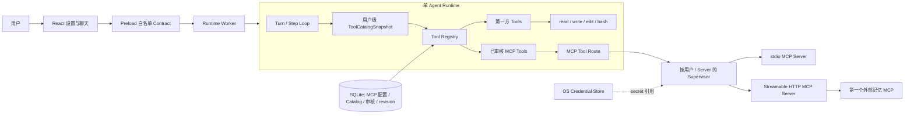

# 阶段 4.5：MCP 接入、首个记忆 MCP 与 Pi 基础工具参考

- 文档状态：待评审
- 所属阶段：阶段 4.5（通用 MCP Tool Bridge + 首个可插拔记忆 MCP）
- 更新日期：2026-08-27
- 上位方案：`docs/Agent Client完整技术解决方案.md`
- 配套测试：`docs/阶段方案/阶段4.5-可插拔长期记忆测试用例.md`
- 主要源码参考：本机 `deepseek-harness/deepseek-harness`

## 1. 文档目的

阶段 4.5 的第一目标是把 DeepSeek Harness 的 MCP 对接与使用链路完整复刻到本项目：连接外部 Server、初始化协商、发现工具、注册工具、调用工具、处理结果、动态刷新、重连和释放。Transport 同时支持 stdio 与 Streamable HTTP，但外部可插拔 MCP 以 Streamable HTTP 为主路径，stdio 主要服务本地 MCP、开发调试和协议测试。

阶段 4.5 的第二目标是在这套通用机制上接入第一个记忆 MCP。macOS arm64 版本固定打包官方 Memory MCP 并为每个本地用户预置；它仍按普通 MCP 管理、审核和调用，不在 Client 内部增加特殊 Memory Provider、特殊 Skill 或 `memory_*` 包装层。

阶段 4.5 同时参考 Pi Agent 的四个最小基础工具：`read`、`write`、`edit`、`bash`。这四个工具属于 Client 第一方内置 Tool，不属于 Skill，也不属于 MCP；它们用于形成小而稳定的基础工具面，并作为外部 MCP 接入后的对照基线。

本阶段不预先定义某一种记忆数据模型。记忆的存储、检索、更新和具体工具集合由外部记忆 MCP 自己提供，Client 只负责通用 MCP 生命周期、用户隔离、权限、结果持久化和上下文预算。

## 2. DeepSeek Harness 源码参考

实现与测试必须优先参考以下源码，而不是只参考概念描述：

| 本项目需要复刻的能力 | DeepSeek Harness 源码 | 参考重点 |
| --- | --- | --- |
| MCP 插件入口与生命周期 | `packages/mcp/mcp-client/src/index.ts` | 一个插件实例对应一个 Server；配置、注入、effect/dispose 和启动就绪 |
| MCP 连接与重连 | `packages/mcp/mcp-client/src/connection.ts` | generation、连接关闭确认、串行同步、有界指数退避、dispose |
| Transport 创建 | `packages/mcp/mcp-client/src/transport.ts` | stdio、Streamable HTTP、环境变量清理和显式覆盖 |
| 工具发现与注册 | `packages/mcp/mcp-client/src/tools.ts` | 分页 `tools/list`、公开名称、raw name 路由、两阶段替换、冲突回滚 |
| MCP Client 行为测试 | `packages/mcp/mcp-client/tests/mcp-client.spec.ts` | 名称、分页、结果、Schema、文本/媒体块、错误和取消 |
| 重连行为测试 | `packages/mcp/mcp-client/tests/reconnect.spec.ts` | 断线恢复、失败上限、关闭竞态、手动恢复和 HMR 安全 |
| MCP 真实链路测试 | `packages/mcp/mcp-client/tests/mcp-client.e2e.ts` | stdio 子进程和协议级端到端行为 |
| ToolDefinition 与执行投影 | `packages/core/tools/src/schema.ts`、`packages/core/tools/src/index.ts` | `defineTool`、output schema/render/meta、执行值校验、ToolResult、presentCall/presentResult |
| `read`、`write`、`edit` | `packages/fs/tool-fs/src/index.ts`、`read.ts`、`write.ts`、`edit.ts` | Tool 层只定义模型接口，文件能力依赖 `ctx.fs`，结果有界且可回放 |
| `bash` | `packages/shell/tool-bash/src/index.ts` | Tool 层依赖 `ctx.shell`，工作目录、超时、取消、后台和沙箱由执行器/策略提供 |
| 文件工具测试 | `packages/fs/tool-fs/tests/tools.spec.ts` | 路径、窗口、原子写、精确编辑、观察和结果展示 |
| Bash 工具测试 | `packages/shell/tool-bash/tests/tools.spec.ts`、`integration.spec.ts` | 输出、退出码、超时、取消、工作目录、环境、后台和生命周期 |
| 记忆 MCP 示例 | `examples/mcp-memory/` | 记忆 MCP 是通过通用 MCP Client 接入的外部 Server，不是 Client 内置 Provider |

### 2.1 参考资料分层

4.5 的参考资料按“协议约束 → 参考项目行为 → 本项目不变量 → 测试证据”使用，不能把任意参考项目的实现细节直接当成本项目 Contract：

| 层级 | 参考资料 | 用途 | 使用规则 |
| --- | --- | --- | --- |
| MCP 协议 | [Model Context Protocol Specification](https://modelcontextprotocol.io/specification)、[TypeScript SDK](https://github.com/modelcontextprotocol/typescript-sdk) | initialize、capability、`tools/list`、`tools/call`、通知、取消、错误和 Transport 语义 | 协议行为以规范为准；SDK 只作为实现库，不把 SDK 类型直接暴露到 Client Contract |
| dp-harness 文档 | `packages/mcp/mcp-client/README.zh.md`、`packages/fs/tool-fs/README.md`、`packages/shell/tool-bash/README.md` | 配置字段、模型可见 Schema、结果投影、限制和用户可观察行为 | 先读 README，再对照源码和测试；所有关键结论必须能落到源码或测试 |
| dp-harness 子系统文档 | `docs/subsystems/tools.zh.md`、`filesystem.zh.md`、`shell.zh.md`、`subprocess.md` | Tool Registry、文件系统边界、Shell 执行、取消、输出截断和生命周期 | 只复刻与单 Agent Client 相关的机制，不引入完整 Cordis 或其他未规划能力 |
| dp-harness 真实示例 | `examples/mcp-memory/README.zh.md`、`mcp-reference-memory.cordis.yml`、`memorix.cordis.yml`、`engram.cordis.yml` | 替代记忆 MCP 的启动方式、依赖准备、数据目录和真实工具发现 | 只作为接入样例；工具名、Schema、数据格式和语义必须以运行时 `tools/list` 为准 |
| Pi Agent | [Pi Agent / pi-mono](https://github.com/badlogic/pi-mono)，重点关注 `packages/coding-agent/src/core/tools/` 下的 `read`、`write`、`edit`、`bash` | 四个第一方基础工具的模型接口、调用体验和工具职责 | 实现时固定上游 commit；Pi 只提供工具形态参考，路径、审批、环境和事件规则以本项目为准 |
| 本项目设计 | `docs/Agent Client完整技术解决方案.md`、`docs/单Agent低上下文Runtime打造设计.md`、阶段 4/4.5 方案 | 用户隔离、Worker 边界、上下文预算、事件持久化、恢复和 UI Contract | 与外部参考冲突时，以本项目已冻结的不变量和阶段方案为准 |

### 2.2 4.5 推荐阅读顺序

1. 先阅读本文件第 4、5、10、11、12 节，确认 MCP、第一方 Tool 和外部记忆 MCP 的边界。
2. 阅读 `packages/mcp/mcp-client/README.zh.md`，建立配置、命名、同步、重连和限制的整体模型。
3. 对照 `packages/mcp/mcp-client/src/index.ts`、`connection.ts`、`transport.ts`、`tools.ts`，记录每个行为对应的实现入口。
4. 阅读 `packages/mcp/mcp-client/tests/mcp-client.spec.ts`、`reconnect.spec.ts`、`mcp-client.e2e.ts` 和 `fixture-server.ts`，把行为转换为本项目 Contract Test。
5. 阅读 `packages/fs/tool-fs/README.md`、`packages/shell/tool-bash/README.md` 及其测试，再对照 Pi Agent 上游四个工具的实现形态。
6. 最后阅读 `examples/mcp-memory/README.zh.md` 和三个配置样例，用真实 MCP 的 `tools/list` 结果完成记忆 MCP E2E。

每条实现结论至少记录一个“来源文件/测试”和一个“本项目改写点”。参考仓库使用 moving branch 时，进入实现前必须记录 commit、包版本和示例 Server 版本；不能只在文档中写“参考 dp-harness”或“参考 Pi”。

## 3. 阶段开始时已具备的基线

| 已有能力 | 当前状态 | 阶段 4.5 处理 |
| --- | --- | --- |
| 单 Agent Tool Loop | 已有 Tool Call/Result、取消、错误分类和恢复 | 接入用户级 MCP Tool Snapshot |
| 内置工具 | 已有历史读取、`skill_load` 和本项目自定义 `host_command` | 参考 Pi 确立四工具产品面，按 dp-harness 分层实现并删除模型可见 `host_command` |
| Skill | 已有标准 `SKILL.md` 目录、渐进加载和 `skill_load` | 保持 Skill 与 MCP、第一方 Tool 的职责分离 |
| 双用户 | Session、模型、Skill、Credential 已按 `userId` 隔离 | 增加 MCP Server、连接、Catalog 和运行进程隔离 |
| 配置与 Credential | 已有 SQLite 配置和 OS Credential Store | 增加 MCP Server 配置、secret 引用和 revision |
| 上下文治理 | 已有 Tool Result Pruner、Checkpoint、Surface Replace 和 overflow recovery | 验证第一方 Tool/MCP Result 接入现有预算 |
| Client Bridge | 已有白名单 Query/Command 和订阅机制 | 增加 MCP 管理、发现预览、逐工具审核和健康状态 |

## 4. 核心决策

### 4.1 先完整复刻 DeepSeek Harness MCP Tool Bridge

MCP V1 的业务基线以 `packages/mcp/mcp-client/` 为准，而不是先围绕记忆重新设计专用接口。每个 MCP Server 实例拥有独立配置、连接、工具 generation 和生命周期：

1. 支持 stdio 与 Streamable HTTP；Streamable HTTP 是外部 MCP 主路径，stdio 是本地与测试路径。
2. 完成 `initialize`、`initialized` 和 capability negotiation。
3. 分页读取 `tools/list`，并监听 `notifications/tools/list_changed`。
4. 使用 `mcp__<serverName>__<rawName>` 形式注册模型可见工具。
5. 调用时始终使用 Server 的 raw tool name，不从公开名称反推。
6. 统一处理结构化结果、文本投影、`isError`、超时、取消、连接丢失和重连。
7. 通过两阶段 generation 保证工具定义和执行路由不会半更新。
8. dispose 时停止重连、取消调用、关闭 transport、注销工具并释放 stdio 子进程。

这里的“完整”指完整交付 MCP Tool Bridge 所需的业务链路，不表示把 Resources、Prompts、Sampling、Roots、Elicitation、Completions、Tasks 或 Apps 投影进 Runtime。

### 4.2 Streamable HTTP 是外部 MCP 主路径

MCP 的 HTTP 形态不是为每个 Tool 建立 REST endpoint，而是在 Streamable HTTP Transport 上继续传输 MCP JSON-RPC：Client 通过 HTTP 发送 `initialize`、`tools/list`、`tools/call` 等请求，Server 可以返回单个 JSON 响应或 `text/event-stream` 流，并可通过服务端消息流发送通知。

本项目冻结以下主次关系：

- Streamable HTTP：外部部署、远程服务和第一个记忆 MCP 的首选接入方式。
- stdio：本地 MCP、用户自行准备的本机 Server、开发调试和 Fake/Contract Test 的必要兼容方式。
- 旧版 HTTP+SSE Transport：不作为 4.5 新实现基线，不建立第三套连接模型。

Streamable HTTP Client 必须处理协议版本、`Mcp-Session-Id`、JSON/SSE 响应、服务端通知、取消、会话失效和重建。Endpoint 允许 HTTP 或 HTTPS；显式选择“本地 MCP”时，地址仅允许 `localhost`、`127.0.0.1` 或 `[::1]`。Client 执行 URL 规范化、DNS/IP/重定向复核和 SSRF 防护；Authorization 等 Header 只能从当前用户 Credential 引用注入。若未来提供任何本地 HTTP Server/Proxy，则该服务端必须按 MCP 规范校验 `Origin`，但 Client 不把 CORS/Origin 当作远程 Server 身份认证。

### 4.3 默认记忆 MCP 仍是可插拔 MCP Server

记忆 MCP 使用与其他外部 MCP 完全相同的配置、连接、发现、审核、启停、调用、结果和错误路径。Client 随 Runtime Pack 固定打包官方 `@modelcontextprotocol/server-memory`，但它仍是独立 stdio Server，不是 Client 内置 Memory Provider，也不创建 `memory_provider_configs`、`MemoryProvider` 或 `user-memory` Skill。

默认业务验收使用固定版本的官方 Memory MCP，通过内置 Node.js 离线启动；`examples/mcp-memory/` 中的 Memorix、Engram 或远程 Server 继续作为可替换验证对象。实现不得把默认 Server 的工具名、Schema 或数据格式写死在通用 Bridge 中。实际工具发现后仍显示为 `mcp__<serverName>__<rawName>`，由用户逐项审核启用。

记忆 MCP 的数据目录、数据格式、索引方式、实体模型、搜索语义和备份策略由外部 Server 负责。Client 只负责为不同用户提供独立的配置、Credential、工作目录、进程/连接和 Tool Snapshot，并把 MCP 调用事实写入当前用户的 Session Event。

### 4.4 四个工具采用 Pi 产品面与 dp-harness 工程分层

Pi 的 `read`、`write`、`edit`、`bash` 作为本项目的四个最小基础工具参考：

| 工具 | DeepSeek Harness 参考实现 | 本项目落点 |
| --- | --- | --- |
| `read` | `packages/fs/tool-fs/src/read.ts` | 依赖文件系统 Service，返回带行号的有界 UTF-8 文本窗口 |
| `write` | `packages/fs/tool-fs/src/write.ts` | 依赖文件系统 Service，创建或整体替换文件，保留变更事实 |
| `edit` | `packages/fs/tool-fs/src/edit.ts` | 依赖文件系统 Service，按精确文本/版本约束修改文件 |
| `bash` | `packages/shell/tool-bash/src/index.ts` | 依赖 Shell Service，保留 stdout/stderr/退出状态/超时/取消事实 |

工具名称、模型接口和最小产品面参考 Pi；工程实现采用 dp-harness 的 `tool-fs`、`ctx.fs`、`tool-bash`、`ctx.shell` 分层思想。Tool 层负责 Schema、参数校验、模型投影和 UI 展示元数据；宿主能力层负责路径解析、文件版本、原子写入、Shell 规格解析和执行；基础设施层复用 Node 文件系统与现有 `ProcessRunner`。

这些工具的执行边界必须遵守本项目已有的路径 realpath、环境 allowlist、用户隔离和事件审计规则。不得因为参考 Pi 或 dp-harness 就直接放开宿主机任意路径、任意环境、后台进程或沙箱升权。

本项目自定义 `host_command` 是四工具确定前为 Skill 脚本执行建立的过渡 Tool，不属于 dp-harness 基线。阶段 4.5 删除其模型可见 Schema 和执行入口，保留底层 `ProcessRunner`，并把 Skill 脚本执行迁移到 `bash`。

### 4.5 Skill、第一方 Tool 和 MCP 不混用

- Skill 提供按需加载的规则、流程和资源说明。
- `read`、`write`、`edit`、`bash` 是 Client 第一方内置 Tool。
- MCP Server 提供由外部进程定义的动态 Tool。
- Skill 与 MCP 在能力发现层同级：`capability_search` 一次同时检索两类轻量目录，Agent 在同一结果中选择 `skill_load`、`mcp_load`、两者或都不使用；发现层不预设 Skill 优先或 MCP 优先。
- 记忆 MCP 是外部 MCP 的第一个业务使用案例，不产生独立的记忆 Tool Contract。
- `host_command` 不再作为模型工具存在；标准 Skill 通过 `skill_load` 提供指令和资源，再使用 `bash` 执行脚本。

本阶段不增加“记忆 Skill 指导模型调用 `memory_*`”的链路。若后续需要更高层的记忆使用规则，应作为独立 Skill 设计，但不能改变 MCP Bridge 的通用职责。

## 5. 阶段目标与边界

### 5.1 阶段目标

1. 复刻 DeepSeek Harness MCP Client 的 stdio/Streamable HTTP 连接、工具发现、名称映射、调用、结果投影、动态刷新、重连和释放链路，并将 Streamable HTTP 作为外部 MCP 主路径。
2. 建立用户级 MCP Server、Tool Catalog、审核状态、Credential 引用和 `mcpRevision`。
3. 按 dp-harness `defineTool` 形态升级 Runtime Tool Contract：`execute` 返回规范值，`output.schema/render/presentationMeta` 负责输出校验与投影，`presentCall/presentResult` 负责 UI Render Intent，并供第一方 Tool 与 MCP Tool 共用。
4. 实现 `read`、`write`、`edit`、`bash` 四个第一方基础工具，删除模型可见 `host_command`，并把 Skill 脚本执行迁移到 `bash`。
5. 将固定版本官方 Memory MCP 作为默认本地可插拔 MCP 接入，完成离线配置、连接、工具审核、写入、检索、更新/删除和跨 Session 业务验证；远程替代方案继续使用 Streamable HTTP。
6. 确保记忆 MCP 不需要 Client 了解其私有数据模型，通用 Bridge 不包含记忆专用分支。
7. 完成 MCP 管理 UI、连接预览、逐工具启用、Schema 变化重审、健康状态和用户切换。
8. 完成两个用户、多 Session、Worker/MCP 重启、超时取消、结果持久化和阶段 4 Compaction 联动测试。

### 5.2 本阶段明确不实现

- 不把记忆做成 Skill，不提供 bundled `user-memory` Skill。
- 不在 Client 中实现 `MemoryProvider`、`memory_*` 包装工具或记忆专用 Adapter。
- 不随 Client 打包自定义 `builtin-document-memory` Server。
- 不创建长期记忆正文、摘要、实体或向量的核心 SQLite 表。
- 除构建期固定打包默认 Memory MCP 外，运行时不自动安装 MCP Server、npm/pip/Go 依赖或运行包管理器。
- 不支持已废弃的 HTTP+SSE transport；远程连接使用 Streamable HTTP。
- 不实现 OAuth 及其他未进入 Runtime 的 MCP primitive。
- 不保留 `host_command` 作为第五个模型可见基础工具。
- `bash` V1 不交付后台 Job、交互式 TTY、持久 Shell 状态或沙箱升权；每次调用都是有界前台执行。
- 不让所有发现工具自动进入 Prompt；新工具默认关闭并需逐项审核。
- 不把第三方记忆 MCP 的 raw tool name、Schema 或返回格式硬编码为 Client 领域 Contract。

## 6. 总体技术架构



## 7. 功能模块总览

| 编号 | 模块 | 阶段 4.5 工作 | 交付程度 |
| --- | --- | --- | --- |
| M01 | 第一方基础工具 | dp-harness ToolDefinition Contract、`read/write/edit/bash`、Skill 迁移和删除 `host_command` | 完整实现 |
| M02 | MCP Domain | Server、Tool、Transport、Catalog、审批、状态和错误类型 | 完整实现 |
| M03 | MCP Client/Supervisor | initialize、stdio/HTTP、分页发现、调用、取消、重连和 dispose | 完整实现 |
| M04 | Runtime Tool Bridge | 稳定命名、generation、用户级 Snapshot、raw route 和结果投影 | 完整实现 |
| M05 | MCP 管理交互 | Server CRUD、连接测试、Tool 审核/启停、Credential 和健康状态 | 完整实现 |
| M06 | 首个记忆 MCP 接入 | 使用通用 MCP 链路接入固定版本外部记忆 MCP，完成真实使用验证 | 完整实现 |
| M07 | 安全、迁移与恢复 | 双用户隔离、配置迁移、进程恢复、日志脱敏和退出清理 | 完整实现 |

## 8. Pi 四个第一方工具

### 8.1 模型可见接口

以下接口是参考起点，最终 Schema 需要与本项目路径策略和现有 Tool Contract 对齐：

```ts
read({
  file_path: string;
  offset?: number;
  limit?: number;
});

write({
  file_path: string;
  content: string;
});

edit({
  file_path: string;
  old_string: string;
  new_string: string;
  replace_all?: boolean;
});

bash({
  command: string;
  description: string;
  timeoutMs?: number;
  workdir?: string;
});
```

这里优先沿用 DeepSeek Harness 的真实模型侧字段：`read` 使用 `file_path/offset/limit`，文件编辑使用精确替换参数，`bash` 使用 `command/description/timeoutMs/workdir`。`replace_all` 默认 `false`；未显式开启时 `old_string` 必须唯一匹配。不要凭抽象示例另造一套不兼容的字段命名。

### 8.2 工具、能力与基础设施分层

```text
Runtime Tool
├── Schema / 参数校验
├── 调用编排
├── Model Surface Renderer
└── Presentation Meta Builder
          ↓
Host Capability
├── ScopedFileSystem
└── ShellExecutor
          ↓
Infrastructure
├── Node fs
└── ProcessRunner
```

- `read/write/edit` 不直接散落调用 Node `fs`，统一依赖用户与 Session 作用域的 `ScopedFileSystem`。
- `bash` 不直接承担 cwd、环境、timeout 和进程树策略，统一依赖 `ShellExecutor`；`ShellExecutor` 复用并完善现有 `ProcessRunner`。
- Tool 层不拥有用户目录、Skill 安装目录或进程全局状态；这些信息通过执行上下文和宿主能力显式传入。
- 第一方 Tool 与 MCP Tool 使用同一个 Runtime Tool Contract，但来源、命名空间和执行路由不同。

### 8.3 文件系统能力与观察策略

- 每个调用以当前用户的 Session 工作区为默认 cwd；相对路径只在该工作区解析。
- `read` 只接受普通 UTF-8 文本文件，返回带行号的有界窗口，同时记录目标文件的版本观察。
- 创建新文件的 `write` 不要求先读；覆盖已有文件必须存在当前 Session 的成功 `read` 观察，且提交时文件版本未变化。
- `edit` 必须先成功 `read`，提交时再次校验版本；默认要求唯一字面量匹配，`replace_all=true` 时允许替换全部匹配。
- `write/edit` 使用临时文件、刷新和原子 rename/replace；失败时旧文件保持可读，临时文件不能被当作正式提交。
- 受管 Skill 安装目录是只读来源；`read` 可以按授权读取 Skill 资源，`write/edit` 不得修改已安装 Skill。
- 文件观察状态可以是 Worker 内存中的 Session 级安全状态；Worker 重启后观察失效并要求重新读取，不根据历史文本猜测文件仍未变化。

### 8.4 Bash 与 Skill 脚本迁移

- `bash` 每次调用启动一个新的前台 Shell，不保留上一调用的 cwd、变量、函数或进程状态；需要目录时显式传 `workdir`。
- 实现以 `ProcessRunner` 启动 `/bin/bash -c <command>`，保持 `shell: false`、环境 allowlist、输出上限、超时、取消和进程树清理。
- `description` 只用于模型意图说明和 UI 执行卡，不传入 Shell。
- `bash` 的规范结果保留 stdout、stderr、exitCode、signal、timedOut、cancelled 和截断状态；非零退出不能被误报为成功。
- `skill_load` 不再提示调用 `host_command`，而是返回 Skill 根、脚本入口和使用说明；模型使用 `bash` 执行 Node/Python/Shell 脚本。
- Skill 脚本来源目录与运行工作区分离：脚本可以从只读 Skill 目录加载，生成文件默认写入当前用户 Session 工作区。
- 阶段 4.5 完成迁移后，从 Tool Registry、Prompt、公开 Contract、测试 Fixture 和文档中删除 `host_command`；底层 `ProcessRunner` 继续作为基础设施使用。

macOS arm64 首个发行目标额外交付应用内 Runtime Pack：Node.js `24.20.0` 与 CPython `3.13.15` 由固定版本锁描述，构建时依次尝试国内和官方 HTTPS 地址，下载后必须通过官方 SHA-256、版本和 Mach-O arm64 校验才能进入 `extraResources`。Main 从 `process.resourcesPath/runtimes/darwin-arm64` 加载不可变 manifest 并把绝对路径传给 Worker；`ShellExecutor` 将 Runtime Pack 的 `bin` 放在 PATH 最前，模型侧仍只看到 `bash`。开发模式允许缺包时回退系统解释器，正式包缺失、路径逃逸或架构不匹配必须明确失败。

内置 Runtime 目录是随应用签名的只读代码，npm/pip 不得修改它。第三方依赖落入当前 Session/Skill 的受控工作区或独立环境，并继续受 `bash` 审批、网络策略、超时、取消和审计约束；Client 不静默安装依赖。

### 8.5 dp-harness ToolDefinition 输出与展示 Contract

阶段 4.5 不定义 `{ canonical, modelSurface, presentation }` 三字段返回对象，而是按 dp-harness 的真实结构实现：Tool 的 `execute` 只返回规范值，Runtime 中央统一校验和投影。

```ts
interface RuntimeToolDefinition<Args, Value extends JsonValue> {
  name: string;
  parameters: JsonSchema;
  output: {
    schema: JsonSchema;
    render(args: Args, value: Value): readonly ContentBlock[];
    presentationMeta?(args: Args, value: Value): JsonValue;
  };
  execute(args: Args, context: ToolExecutionContext): Promise<Value>;
  presentCall?(args: Args): ToolCallView | undefined;
  presentResult?(args: Args, result: ToolResult): ToolResultView | undefined;
}
```

Runtime 的成功路径固定为：

```text
校验模型参数
→ execute 返回 canonical value
→ output.schema 校验 canonical value
→ output.render 生成模型可见 ContentBlock[]
→ presentationMeta 可选生成可持久化展示元数据
→ 追加 Tool Result Event(content + meta + status)
→ presentResult 根据已持久化 ToolResult 生成 UI Render Intent
```

- canonical value 是 Tool 执行阶段的强类型规范值，不要求 Tool 自己同时构造模型文本和 UI DTO，也不默认把整个对象原样写入 Event。
- `output.render` 是唯一的模型结果投影入口；其输出进入 Tool Result 历史并接受阶段 4 上下文预算和 Compaction。
- `output.presentationMeta` 只能输出 Renderer-safe、JSON 可序列化且可回放的元数据；不得保存进程句柄、Credential 或依赖当前文件状态的对象。
- `presentCall/presentResult` 是无副作用纯 Presenter，读取调用参数和已持久化 ToolResult，返回 read/diff/terminal/generic 等 UI Render Intent；Presenter 失败只能回退通用卡片，不能改变执行结果。
- `write/edit` 的 execute 可以返回 before/after 供 `render` 和 `presentationMeta` 派生简短确认与 diff，但模型结果不再次包含完整文件；是否持久化完整 before/after 由 Event 数据政策决定，不由 ToolDefinition 强制。
- `bash` 的 execute 返回结构化进程结果，`render` 生成有界 stdout/stderr 与退出标记；`presentResult` 从持久内容和 meta 生成 terminal 卡片。
- MCP Bridge 也包装成同一 ToolDefinition：execute 返回 MCP canonical value，output schema 校验 `structuredContent`，render 投影文本/媒体占位，presentationMeta 只保存安全展示事实。若本项目需要额外保存原始 MCP 协议块，应写入 MCP 专用运行事实字段，不改变通用 ToolDefinition API。

有副作用的 `write`、`edit`、`bash` 默认接入现有审批策略；审批绑定用户、Session、工具名和参数摘要。

## 9. MCP Domain、配置与 Tool Catalog

### 9.1 领域类型

```ts
type McpTransport = 'stdio' | 'streamable-http';

interface McpServerConfigSnapshot {
  id: string;
  userId: LocalUserId;
  serverName: string;
  transport: McpTransport;
  enabled: boolean;
  configRevision: number;
  toolCallTimeoutMs: number;
  reconnect: {
    enabled: boolean;
    initialDelayMs: number;
    maxDelayMs: number;
    maxAttempts: number;
  };
}

interface McpToolRecord {
  userId: LocalUserId;
  serverId: string;
  rawName: string;
  publicName: string;
  description: string;
  inputSchema: JsonSchema;
  outputSchema?: JsonSchema;
  schemaDigest: string;
  enabled: boolean;
  approvalPolicy: 'never' | 'always';
  status: 'available' | 'review-required' | 'missing' | 'incompatible';
}
```

阶段 4.5 不设 `exposure=service-only` 的记忆特殊路径。所有外部 MCP Tool 都先进入管理目录；模型是否可见只由 Server 启用、Tool 启用、Schema 审核和当前 Step Snapshot 决定。

### 9.2 SQLite 配置

```sql
CREATE TABLE mcp_servers (
  id TEXT NOT NULL,
  user_id TEXT NOT NULL,
  display_name TEXT NOT NULL,
  server_name TEXT NOT NULL,
  transport TEXT NOT NULL CHECK (transport IN ('stdio', 'streamable-http')),
  command TEXT NULL,
  args_json TEXT NULL,
  cwd TEXT NULL,
  url TEXT NULL,
  env_bindings_json TEXT NOT NULL DEFAULT '{}',
  header_bindings_json TEXT NOT NULL DEFAULT '{}',
  enabled INTEGER NOT NULL CHECK (enabled IN (0, 1)),
  fail_on_startup_error INTEGER NOT NULL DEFAULT 0,
  tool_call_timeout_ms INTEGER NOT NULL,
  reconnect_json TEXT NOT NULL,
  created_at TEXT NOT NULL,
  updated_at TEXT NOT NULL,
  PRIMARY KEY (user_id, id),
  UNIQUE (user_id, server_name),
  FOREIGN KEY (user_id) REFERENCES local_users(id)
);

CREATE TABLE mcp_tools (
  user_id TEXT NOT NULL,
  server_id TEXT NOT NULL,
  raw_name TEXT NOT NULL,
  public_name TEXT NOT NULL,
  description TEXT NOT NULL,
  input_schema_json TEXT NOT NULL,
  output_schema_json TEXT NULL,
  schema_digest TEXT NOT NULL,
  enabled INTEGER NOT NULL DEFAULT 0,
  approval_policy TEXT NOT NULL,
  status TEXT NOT NULL,
  discovered_at TEXT NOT NULL,
  updated_at TEXT NOT NULL,
  PRIMARY KEY (user_id, server_id, raw_name),
  UNIQUE (user_id, public_name),
  FOREIGN KEY (user_id, server_id) REFERENCES mcp_servers(user_id, id)
);
```

普通配置进入 SQLite；env/header 只保存 Credential 引用，不保存秘密明文。Server 配置、Tool 启停、审批策略和 Schema 审核状态在同一事务中更新并递增当前用户 `mcpRevision`。

### 9.3 名称与审核

公开名称以 `mcp__<serverName>__<rawName>` 为基础，再按模型函数名限制执行确定性规范化。发生字符替换或长度截断时追加基于 `(serverName, rawName)` 的 hash，保证不同 MCP 工具不会折叠为同名工具。

发现目录保存 Server 的完整工具集合；新工具默认关闭。已启用工具的 Schema digest 变化后进入 `review-required`，下一 Step 不再暴露，直到用户重新确认。

第一方 `read`、`write`、`edit`、`bash` 使用独立名称空间，MCP 不得覆盖第一方工具名或路由。

## 10. MCP Client 与 Supervisor

### 10.1 连接生命周期

```text
disabled
  → connecting
  → ready
  → degraded / reconnecting
  → ready
  → unavailable
```

每个 `(userId, serverId)` 拥有独立 Client、transport、调用表、工具 generation 和重连计数。相同 endpoint 的两个用户不能共享进程、连接、Credential 或运行状态。

stdio 以 command、args、cwd、环境映射分字段启动，不经 Shell 拼接；Streamable HTTP 使用单一 MCP endpoint、协议 Header 和当前用户的 header Credential 引用。Client 不执行依赖安装。

Streamable HTTP 的调用路径为：

```text
HTTPS endpoint
→ POST MCP JSON-RPC request
→ application/json 或 text/event-stream response
→ 可选服务端 GET/SSE 消息流
→ Mcp-Session-Id / protocol version 绑定
→ session 失效后重新 initialize 与 tools/list
```

Client 必须把 HTTP 请求生命周期与 MCP Session 生命周期分开：单次网络请求失败不直接等同于整个 Server 永久断开；会话无效、协议不兼容或连续失败才触发有界恢复。重定向后的目标必须重新执行安全校验，不能借 30x 绕过协议、host、IP 或用户配置边界。

连接成功后等待初始 `tools/list` 完成，再发布第一代工具。连接失败只影响当前 Server；`failOnStartupError` 只决定该 Server 是否拒绝就绪，不得阻断整个 Client。

### 10.2 两阶段工具同步

```text
分页拉取 tools/list
→ 校验名称、Schema、数量和单项大小
→ 生成 publicName、schemaDigest 和候选 generation
→ 检查重复与跨 Server 冲突
→ 原子更新管理目录
→ 原子发布运行 generation
```

拉取、校验或冲突失败时保留旧 generation，禁止先注销旧工具再留下半套新工具。`tools/list_changed` 触发同一同步算法；连续通知串行合并。

### 10.3 重连和释放

连接丢失后按 `initialDelayMs` 到 `maxDelayMs` 指数退避，最多尝试 `maxAttempts` 次。重连期间调用返回明确的 unavailable，不能伪造成功。预算耗尽后注销该 Server 的运行工具并停止重连。

Worker dispose、Server 停用或删除必须取消 pending calls 和 timer，关闭 transport，等待 stdio 子进程有界退出，并注销该 Server 的所有工具。

## 11. Runtime MCP Tool Bridge

### 11.1 用户级 Step Snapshot

```ts
interface ToolCatalogSnapshot {
  userId: LocalUserId;
  revision: number;
  definitions: readonly ToolDefinition[];
  routes: ReadonlyMap<string, ToolRoute>;
}

toolRegistry.snapshotForUser(userId): ToolCatalogSnapshot;
toolRegistry.execute(snapshot, publicName, args, context, signal): Promise<ToolResult>;
```

模型请求中的 Tool Definition、执行时的 raw route、Server generation 和 Schema digest 必须来自同一 Snapshot。配置变化只影响下一 Step。

### 11.2 统一能力发现

Runtime 常驻一个 `capability_search`，其一次调用同时读取当前用户的 Skill Catalog 与 MCP Catalog，并返回结构一致、数量分别受限的轻量候选：

```text
capability_search(query)
  ├─ Skill：name / description / metadata highlights / skill_load 参数
  └─ MCP：server name / summary / 少量工具提示 / mcp_load 参数
```

两类结果显式标记为同等优先级。搜索不读取 `SKILL.md` 正文，不暴露完整 MCP Tool Schema，也不调用 MCP 业务工具。Agent 只对选中的候选执行 `skill_load` 或 `mcp_load`；`mcp_load` 后完整 Schema 从下一模型 Step 生效。

### 11.3 调用、结果与事件

- 调用前执行现有参数校验、启用检查和审批；Bridge 使用 Snapshot 中保存的 raw name。
- 每次调用记录 `userId/sessionId/turnId/stepId/toolCallId/serverId/generation/schemaDigest`。
- `structuredContent` 按已声明的 outputSchema 校验；`isError=true` 进入 Tool 执行错误路径。
- MCP execute 返回 `{ content, structuredContent? }` canonical value，Runtime 先按 output schema 校验，再由 `output.render` 生成模型可见 Tool Result content。Tool Result Event 保存 rendered content、status/error 和安全 meta；若项目的数据审计要求额外保留原始 MCP 协议块，则写入 MCP 专用执行事实，不把 canonical value 原样塞进通用 ToolResult。
- 图片、音频和资源块不直接无限进入模型上下文；使用有界占位或后续专用附件边界。
- 超时、取消、传输失败、Schema 失败和 Server 返回错误保持不同错误码。

## 12. 默认记忆 MCP

### 12.1 接入方式

1. 首次携带 Bundled Runtime 启动时，Client 为 User A 和 User B 各预置一条 `memory` stdio Server 配置；同名配置或已归档配置存在时不覆盖、不复活。
2. 默认 Server 使用应用自带 Node.js 和固定版本入口，运行时不调用 `npx`、不联网安装；每个用户使用独立受管目录和 `memory.jsonl`。
3. Client 自动连接并完成工具发现，展示实际返回的工具名、描述、Schema、风险和上下文成本。
4. 用户逐项审核并启用记忆 MCP 工具；它们先作为 MCP 轻量候选进入 `capability_search`，Agent 选中 Server 并调用 `mcp_load` 后，以 `mcp__<serverName>__<rawName>` 从下一 Step 进入当前 Turn。
5. Agent 按外部记忆 MCP 自己的工具描述完成写入、检索、更新或删除；Client 不改写工具名和参数。
6. 跨 Session 验证只检查同一用户能否通过 MCP 工具召回数据，另一用户不能访问。

### 12.2 记忆 MCP 的边界

记忆 MCP 与普通 MCP 使用同一 `mcp_servers`、`mcp_tools`、Credential、Supervisor、Tool Registry 和 Event 机制。Client 不创建记忆专用表、Skill、Adapter、文件格式或 UI Contract。

外部 Server 的长期记忆正文不应进入主 SQLite。MCP Tool Event 只保留执行事实和必要的有界结果；外部 Server 的真实记忆数据由其自己的存储负责。

如果未来需要“记忆总开关”“记忆专用编辑器”或 Provider 迁移，应在验证通用 MCP 链路后另立阶段，不能在 4.5 基线中提前引入第二套记忆业务模型。

## 13. MCP 管理交互

“设置 → MCP 服务”提供：

- 当前用户的 Server 列表、transport、启停、健康状态、最近错误、重连和删除。
- stdio/Streamable HTTP 配置编辑；界面明确标记 Streamable HTTP 为外部 MCP 推荐方式，秘密只支持设置、替换、清除和“已配置”状态。
- “测试连接”返回发现预览，不保存、不启用、不进入模型 Prompt。
- 完整 Tool Catalog 的名称、描述、Schema 摘要、上下文成本、审核状态、启用开关和审批策略。
- Schema 变化的差异预览；确认前不恢复模型暴露。
- 删除 Server 时的影响提示；历史执行卡仍使用已保存快照展示，不依赖当前连接。

Renderer 不接收可直接执行的 command、进程句柄、真实 Credential 或原始 JSON-RPC body。模型和 Skill 不能调用 MCP Server CRUD、设置凭据或启用工具。

## 14. 安全、隔离与恢复

### 14.1 第一方工具

- 所有路径通过 realpath 和受控根目录校验，阻止 `..`、符号链接和用户目录逃逸。
- `read`、`write`、`edit` 使用文本/字节/行数上限；写入失败不得破坏旧文件。
- `bash` 通过 ProcessRunner 执行，使用环境 allowlist、超时、取消、输出上限和审批。
- 工具结果与参数摘要按用户和 Session 记录，日志不记录完整敏感文件内容或环境秘密。

### 14.2 外部 MCP

- MCP Server 配置、Tool Catalog、Credential 引用、进程、连接和调用状态严格按用户隔离。
- 新 Server 和新 Tool 默认关闭；审批绑定 `userId + serverId + rawName + schemaDigest`。
- stdio 子进程只获得清理后的环境和显式绑定值，不继承模型服务密钥或其他 Server 密钥。
- Streamable HTTP endpoint 允许 HTTP 或 HTTPS；显式本地模式仅允许 loopback 地址。URL、DNS/IP、重定向和响应 Content-Type 都必须校验；link-local、云元数据地址和重定向后的危险目标直接拒绝，其他私网目标要求明确风险确认。
- `Mcp-Session-Id`、协议版本、Authorization Header 和服务端事件流都绑定当前 `(userId, serverId)`，不得跨用户或跨 Server 复用。
- Client 不自动执行 `npm install`、`pip install`、`go install`、`npx -y` 或任意安装命令。
- MCP 原始结果不会未经限制直接进入日志、诊断包或其他用户的上下文。

### 14.3 Worker 和连接恢复

- Worker 重启后从 SQLite 恢复当前用户的 MCP 配置和 Catalog，再按 enabled Server 恢复连接。
- 连接恢复失败只降级对应 Server，不结束其他 Session、第一方工具或其他 MCP。
- Worker 强退、Server 删除和应用退出都必须释放 transport、timer、子进程和调用表。
- Tool Result 提交未知时不盲目重放有副作用的 MCP 调用；后续行为遵循 Server 工具自身的查询/幂等能力并明确显示结果未知。

## 15. 数据库迁移

阶段 4.5 migration 只增加通用 MCP 配置：

1. 创建 `mcp_servers`、`mcp_tools` 及其用户级索引和复合外键。
2. 为用户配置 revision 增加 `mcp_revision`，默认值为 `0`。
3. seed 默认官方 Memory MCP 的通用 Server 配置；不 seed Memory Provider、`user-memory` Skill 或自定义包装工具。
4. 不导入宿主机其他 Agent 的 MCP 配置，不自动启动 Server，不联网。
5. 外部记忆 MCP 的数据不迁移到主 SQLite；是否迁移由外部 Server 自己负责。

旧数据库升级不能调用模型、读取历史对话生成记忆，也不能执行用户未显式配置的命令。

## 16. 核心业务流程

### 16.1 添加并使用普通 MCP

```text
设置页填写配置
→ 写入 Credential 引用
→ 测试连接并分页发现工具
→ 保存 Server，工具默认关闭
→ 用户审核并启用具体工具
→ 发布 mcpRevision
→ capability_search 与 Skill Catalog 同级返回轻量候选
→ Agent 选择 Server 并调用 mcp_load
→ 下一 Step 构造包含该 Server 完整 Schema 的 ToolCatalogSnapshot
→ 模型调用 mcp__server__tool
→ Bridge 使用 rawName 调用 MCP
→ Tool Result 持久化并有界投影
```

### 16.2 使用首个记忆 MCP

```text
用户配置记忆 MCP
→ 通用 Bridge 发现其真实工具集合
→ 用户审核记忆 MCP 工具
→ Agent 根据工具描述调用写入/检索/更新工具
→ 外部 MCP 保存或读取记忆
→ 新 Session 通过同一用户的 MCP Tool 召回
→ 另一用户使用独立 Server 配置、连接和数据范围
```

该流程不出现 `memory_overview`、`memory_read`、`memory_replace`、`MemoryProvider` 或 `user-memory` Skill。任何记忆专用名称都必须来自外部 MCP 自己的 `tools/list`。

### 16.3 使用 Pi 四个工具

```text
模型选择 read / write / edit / bash
→ Tool 层校验 Schema 与审批
→ ScopedFileSystem / ShellExecutor 执行
→ execute 返回 canonical value
→ Runtime 执行 output.schema / render / presentationMeta
→ Tool Result content + meta 持久化并返回模型
```

Skill 脚本流程统一为：

```text
skill_load 返回 SKILL.md、只读 Skill 根与脚本说明
→ 模型选择 bash
→ ShellExecutor 在当前用户 Session 工作区执行脚本
→ ProcessRunner 负责 timeout / cancel / output / process tree
```

该流程中不存在 `host_command`；兼容迁移不能把它保留为隐藏的第五个模型工具。

## 17. 公开 Contract 与目录调整

建议新增：

```text
src/
  runtime/
    first-party-tools/
      index.ts                # 四工具注册入口
      read.ts
      write.ts
      edit.ts
      bash.ts
    tool-definition.ts        # output schema/render/meta 与 presenters
    mcp/
      types.ts               # Server、Tool、Catalog 与错误
      tool-bridge.ts          # publicName、raw route、结果投影
      tool-catalog-snapshot.ts
  infrastructure/
    filesystem/
      scoped-file-system.ts   # 用户/Session 路径、版本观察与原子修改
    process/
      shell-executor.ts       # bash 请求解析，复用 ProcessRunner
    mcp/
      client.ts              # MCP SDK 包装
      transports.ts          # stdio / Streamable HTTP
      supervisor.ts           # 用户/Server 生命周期
      tool-sync.ts            # 分页发现与 generation
  worker/
    mcp-server-registry.ts
  shared/
    contracts/
      mcp.ts                 # Renderer-safe MCP 管理 DTO/Schema
```

Renderer 白名单 API 增加：

```ts
mcp.listServers(): Promise<McpManagementSnapshot>;
mcp.testConnection(input: TestMcpConnectionCommand): Promise<McpDiscoveryPreview>;
mcp.saveServer(input: SaveMcpServerCommand): Promise<McpServerDto>;
mcp.setServerEnabled(input: RevisionedEnableCommand): Promise<void>;
mcp.setToolPolicy(input: RevisionedMcpToolPolicyCommand): Promise<void>;
mcp.reconnect(input: RevisionedMcpServerCommand): Promise<void>;
mcp.deleteServer(input: RevisionedDeleteMcpServerCommand): Promise<void>;
mcp.setCredential(input: SetMcpCredentialCommand): Promise<void>;
mcp.clearCredential(input: ClearMcpCredentialCommand): Promise<void>;
mcp.subscribe(cursor?): Subscription<McpConfigurationEvent>;
```

四个第一方工具使用升级后的 Runtime Tool Contract，不通过 MCP 管理 API 注册，也不允许外部 MCP 覆盖。原 `host_command` 从模型定义和 Tool Registry 删除，`ProcessRunner` 保留为 `ShellExecutor` 的底层能力。

## 18. 实施顺序

1. M01：先按 dp-harness 升级 Runtime Tool Contract，冻结 execute、output.schema/render/presentationMeta、presentCall/presentResult 和 Event 投影边界。
2. M02：实现 ScopedFileSystem、ShellExecutor 及 `read/write/edit/bash`，迁移 Skill 脚本并删除 `host_command`。
3. M03：冻结 MCP Server/Tool Domain、SQLite Schema、名称映射、审核状态和 `mcpRevision`。
4. M04：按 DeepSeek Harness 复刻 stdio/Streamable HTTP Client；优先完成 Streamable HTTP initialize、JSON/SSE、Session ID、分页发现、调用、取消和恢复，再完成 stdio 兼容。
5. M05：把 Tool Registry 改为用户级 Snapshot，接入 generation、raw route、统一 output projection 和事件。
6. M06：完成 MCP 设置页、连接预览、Tool 审核/启停、Credential 和健康状态。
7. M07：选定并接入一个固定版本的 Streamable HTTP 外部记忆 MCP，完成真实工具发现、写入、检索、更新/删除和跨 Session 验证，并补 stdio 兼容验证。
8. M08：完成双用户、Worker 重启、失败恢复、日志脱敏、数据库迁移和阶段 1～4 回归。

## 19. 阶段验收标准

- Streamable HTTP 主路径完成 initialize、JSON/SSE 响应、Session ID、分页 tools/list、tools/call、通知、取消、会话恢复和 dispose；stdio 完成同等 Tool Bridge 语义和本地进程清理。
- MCP 公开工具名遵循稳定 `mcp__<serverName>__<rawName>` 规则，raw route、Schema digest 和 generation 保持一致。
- 新工具默认关闭；只有当前用户审核通过的工具进入下一 Step Snapshot，Schema 变化会使旧审核失效。
- `capability_search` 一次同时检索 Skill 与 MCP 两类目录，返回有界轻量候选且不预设来源优先级；未选择的候选不加载正文或完整 Schema。
- `read`、`write`、`edit`、`bash` 四个第一方工具可用，并通过路径、文件观察、原子写入、环境、权限、取消、output schema/render/meta 和 Presenter 测试；模型 Tool Catalog 不再出现 `host_command`。
- 标准 Skill 可以通过 `skill_load + bash` 执行脚本，受管 Skill 目录保持只读，底层继续复用 `ProcessRunner`。
- 默认官方 Memory MCP 通过 stdio 离线完成配置、连接、工具审核、调用和跨 Session 使用；Streamable HTTP 替代 Server 不引入第二套业务逻辑。
- Client 不包含记忆专用 `MemoryProvider`、`memory_*` 或 `user-memory` Skill；随包官方 Memory MCP 保持独立 stdio 进程和通用 Tool Contract。
- 外部记忆 MCP 的数据不进入核心 SQLite，两个用户不能互相发现、调用或读取对方的 Server 数据。
- MCP Server 故障只影响自身工具，不结束无关会话；退出时不存在残留子进程、timer 或 pending call。
- 第一方与 MCP Tool 的 execute 规范值经过 output schema 校验，render 内容有界，presentation meta 与 Presenter 可重放；阶段 4 Surface Compaction 不修改文件事实或外部 MCP 数据。
- 阶段 1～4 自动化基线继续通过。

## 20. 阶段交付物

- 通用 MCP Tool Bridge、以 Streamable HTTP 为外部主路径的 stdio/HTTP Client、Supervisor、Tool Catalog 和用户级 Snapshot。
- dp-harness 风格 Runtime ToolDefinition Contract、ScopedFileSystem、ShellExecutor，以及 `read`、`write`、`edit`、`bash` 四个第一方基础工具。
- `host_command` 删除与 Skill 脚本迁移记录，底层 `ProcessRunner` 保留并复用。
- MCP 管理 UI、连接预览、逐工具审核/启停、Credential 绑定和健康状态。
- 一个固定版本外部记忆 MCP 的接入配置、使用验证和跨 Session 证据。
- SQLite migration、双用户隔离、重连/恢复/退出清理和阶段回归测试。
- 更新后的 MCP 使用说明、已桥接与未桥接能力边界、已知限制和阶段验收报告。

## 21. 主要风险与控制

| 风险 | 影响 | 控制 |
| --- | --- | --- |
| 先做记忆专用抽象 | 与通用 MCP 重复、后续接入其他 Server 成本增加 | 先复刻 DSH MCP Client，记忆只作为第一个外部 Server 验证 |
| MCP Schema 挤占上下文 | 每轮输入变大、历史容量下降 | 全量管理目录、逐工具启用、Schema token 估算和 Snapshot 硬预算 |
| 动态刷新造成定义/路由错位 | 模型按旧 Schema 调用新实现 | 两阶段 generation、Step Snapshot、raw route 和 schemaDigest 绑定 |
| Streamable HTTP 被当作普通 REST | Session、通知、取消和恢复语义丢失 | 严格按 MCP JSON-RPC、JSON/SSE、Session ID 和协议版本实现，不创建 Tool REST endpoint |
| 远程 MCP 引入 SSRF/Credential 风险 | 访问内网或泄露用户密钥 | URL/DNS/IP/重定向/Origin 复核，Header Credential 按用户和 Server 隔离 |
| 外部 MCP 权限过大 | 任意命令、网络或数据泄漏 | 显式配置、环境收敛、Credential 隔离、默认关闭、审批和 cwd 校验 |
| 记忆 MCP 工具不稳定 | 跨 Session 记忆不可用或结果不确定 | 独立故障域、有界重连、明确失败/未知结果，不伪造成功 |
| 把 Pi 工具直接当作无限宿主权限 | 文件泄漏或命令越权 | 复用本项目路径、ProcessRunner、环境、审批和输出边界 |
| `host_command` 与 `bash` 并存 | 模型选择混乱、Schema 和权限重复 | 4.5 完成 Skill 迁移并删除模型可见 `host_command`，只保留底层 ProcessRunner |
| Tool 执行值、模型内容和 UI 展示混用 | 大文件重复进入上下文、UI 无法稳定重放 | 按 dp-harness 由 execute 返回规范值，Runtime 统一调用 output schema/render/meta 和纯 Presenter |
| “完整 MCP”被误解为全协议 | 阶段范围膨胀 | 明确完整交付 Tool Bridge，不把其他 primitive 投影进 Runtime |

## 22. 阶段内冻结的决策

1. 阶段 4.5 先完整复刻 DeepSeek Harness MCP Tool Bridge 的业务链路。
2. 默认官方 Memory MCP 是第一个可插拔 MCP，按普通 MCP 配置、发现、审核、启停和调用。
3. 记忆不做成 Skill；本阶段没有 `user-memory` Skill、`MemoryProvider` 或 `memory_*` 包装工具。
4. `read`、`write`、`edit`、`bash` 是参考 Pi 产品面的四个第一方内置 Tool，工程实现采用 dp-harness 的 Tool/能力/基础设施分层，不属于 MCP。
5. 外部 MCP 的 raw tool name、Schema、数据模型和记忆语义不写死在 Client 核心。
6. MCP 新工具默认关闭，Schema 变化使旧审核失效；运行中 Step 使用不可变 Snapshot。
7. 默认 Memory MCP 使用本地 stdio；Streamable HTTP 是其他外部 MCP 的主路径，旧 HTTP+SSE 不进入 4.5。
8. `host_command` 在 4.5 删除，Skill 通过 `skill_load + bash` 执行；`ProcessRunner` 作为底层基础设施保留。
9. 第一方与 MCP Tool 共用 dp-harness 风格 ToolDefinition Contract，不引入自定义三字段 Tool Result 对象。
10. stdio/HTTP、Credential、连接、进程、Catalog、Tool Event 和数据范围全部按用户隔离。
11. Client 仅在构建期固定打包默认 Memory MCP；运行时不自动安装其他 Server 或依赖，不实现 OAuth 和未桥接的 MCP primitive。
