# 阶段 4.7.0：Runtime（运行时）独立化开发架构设计

- 状态：待实施设计稿；本文确定目标结构与实施契约，不代表功能已经完成。
- 日期：2026-09-04。
- 项目基线：`8b42f15` 与编写时工作区源码。
- 阶段范围：独立服务、CLI（命令行客户端）、Electron（桌面客户端）同时接入；Web（浏览器客户端）和手机应用后续接入。
- 上位方案：[完整技术解决方案](../Agent%20Client完整技术解决方案.md)、[单 Agent 低上下文 Runtime 设计](../单Agent低上下文Runtime打造设计.md)。
- 相关方案：[4.5.5 权限与沙箱](阶段4.5.5-权限系统与执行沙箱开发架构设计.md)、[4.6.0 思考模式重构](阶段4.6.0-思考模式重构设计方案.md)、[阶段 5 发布工程](阶段5-发布工程与交付开发架构设计.md)。
- 编号说明：4.7.0 是阶段编号；npm（Node.js 包管理与分发系统）版本、协议版本、数据库版本分别管理，不在本次文档工作中修改 `package.json` 的版本。

阅读导航：[阶段范围](#1-决策与交付范围) · [当前拆分地图](#2-当前结构与拆分依据) · [目标架构](#3-目标逻辑架构与进程架构) · [职责边界](#4-组件能力边界) · [目录与依赖](#5-目录依赖与构建边界) · [宿主](#6-host运行宿主内部设计) · [网关](#7-gateway内置网关内部设计) · [应用服务](#8-application应用服务内部设计) · [核心](#9-runtime核心运行时内部设计) · [适配器](#10-infrastructure基础设施适配器内部设计) · [公开协议](#11-公开协议事件与一致性) · [客户端](#12-client-sdkcli-与-electron-内部设计) · [迁移](#13-数据目录迁移与兼容) · [时序图](#14-关键步骤时序图) · [交付](#15-npm-与桌面交付设计) · [实施步骤](#16-实施工作包与切换顺序) · [验收](#17-测试设计与退出门禁)。

## 1. 决策与交付范围

### 1.1 本阶段确定的方向

将“Electron 内部运行一个 Agent”调整为“独立 Agent 服务向多个客户端提供能力”。继续采用 TypeScript（带类型的 JavaScript）和 Node.js（服务执行环境），保留单 Agent（单智能体）、原生工具调用、低上下文和仅追加事件日志。

```text
agent-harness serve                  # 启动完整服务
    ├── Gateway（内置网关）
    ├── Application（应用服务）
    ├── Runtime（核心运行时）
    └── Infrastructure（基础设施适配器）
```

Host（运行宿主）负责装配上述组件、启动与关闭；Client SDK（客户端开发工具包）负责客户端的连接与协议处理。四层是代码职责，不是四个独立部署的微服务。

### 1.2 范围矩阵

| 能力             | 4.7.0 交付                                                                            | 后续阶段                                               |
| ---------------- | ------------------------------------------------------------------------------------- | ------------------------------------------------------ |
| 独立启动         | 不安装、不启动 Electron 也能运行服务                                                  | 系统开机常驻和远程运维                                 |
| CLI（命令行）    | 配置、创建会话、交互输入、单次执行、订阅、审批、取消、诊断                            | 完整终端图形界面                                       |
| Electron（桌面） | 通过同一 SDK 和服务接入，保留已有界面功能                                             | 多远程服务切换                                         |
| 多客户端         | 同一操作系统账号下，CLI 与桌面同时连接同一服务                                        | 设备配对、跨设备连接                                   |
| 多用户           | 保留两个本地用户档案，按连接选择、按数据作用域隔离                                    | 云账号、组织、多人授权                                 |
| 协议             | HTTP（超文本传输协议）命令/查询 + SSE（服务端事件流）；桌面保留内部 IPC（进程间通信） | WebSocket（双向长连接）、标准兼容协议                  |
| Web / 手机       | 预留客户端契约与平台能力边界                                                          | 独立阶段实现和验收                                     |
| 执行环境         | Local Executor（本地执行器）                                                          | Remote Executor（远程执行器）                          |
| 分发             | 可安装的服务 npm 包，含 CLI；Electron 复用同一服务构建产物                            | 独立发布 SDK，随服务分发 Web 页面                      |
| 平台             | 沿用当前 macOS 首发边界，arm64（苹果芯片架构）作为现有验证基线                        | x64（英特尔架构）按阶段 5 门禁；Windows/Linux 另行验收 |

不以“使用 Node.js”推导已支持所有平台。密钥存储、沙箱、进程组和原生数据库驱动均需平台验证。

### 1.3 必须保持的不变量

1. Session（会话）同时只有一个 Driver（执行驱动器）；不同会话允许有界并行。
2. Input（输入）先持久化，后唤醒执行；Step（执行步骤）仍对应一次模型请求及其全部工具调用。
3. Inbox（持久收件箱）、Queue（排队）、Steer（下一步补充）、Cancel（取消）的业务语义保持不变。
4. 客户端断开不取消任务；关闭服务是单独、明确的操作。
5. Session Event Log（会话事件日志）仍是运行事实源，Projection（投影读模型）可以重建。
6. 工具结果完整保存；Surface（模型可见上下文）沿用既有预算、裁剪和压缩策略。
7. 不自动重放结果未知的副作用工具；不承诺外部系统的 exactly-once（无条件恰好执行一次）。
8. 多客户端不改变单 Agent 定位；Worker（工作线程）是执行容器，不是子智能体。
9. 4.6.0 的消息用途归类与展示调整独立交付；4.7.0 不增加模型调用、不改提示词和模型结束规则。

## 2. 当前结构与拆分依据

### 2.1 当前调用链

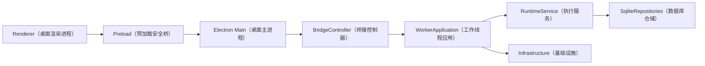

当前存在独立线程和公开契约，但服务的启动、活动用户、文件导入和事件出口依附于桌面。

### 2.2 文件级迁移地图

下表中的路径相对于仓库根目录；右侧是目标模块，不表示整文件机械移动。

| 当前文件或目录                     | 当前职责与问题                                 | 目标归属                                                    |
| ---------------------------------- | ---------------------------------------------- | ----------------------------------------------------------- |
| `src/main/index.ts`                | 窗口、数据目录、解释器、工作线程和业务接线混合 | 窗口留桌面；服务装配进 `host`（宿主）                       |
| `src/main/worker-supervisor.ts`    | 工作线程启动、重启、代次、请求分派             | `host/service-supervisor`（服务监护器）                     |
| `src/main/bridge-controller.ts`    | 校验、全局用户、订阅、业务桥接                 | 传输和订阅进网关；桌面仅保留安全桥                          |
| `src/main/skill-archive.ts`        | 桌面路径下的压缩包处理                         | 基础设施归档适配器                                          |
| `src/main/session-file.ts`         | 工作区文件解析和系统打开操作关联               | 服务校验文件引用；桌面执行系统打开                          |
| `src/worker/application.ts`        | 依赖装配、大量管理业务、活动用户               | `host/composition-root`（组合根）与分领域应用服务           |
| `src/worker/dispatcher.ts`         | 方法名映射、参数校验、直接调用业务             | 公共方法目录 + 应用层命令/查询分派                          |
| `src/worker/index.ts`              | 工作线程消息和应用启动耦合                     | `host/service-worker`（服务工作线程入口）                   |
| `src/runtime/runtime-service.ts`   | 执行、会话管理、队列、审批、恢复集中           | 运行管理、会话驱动、轮次执行、审批、恢复等模块              |
| `src/runtime/context-projector.ts` | 上下文投影及宿主文件访问                       | 算法留核心；内容读取经端口注入                              |
| `src/runtime/mcp/`                 | MCP（模型上下文协议）连接与工具适配            | 连接进基础设施；管理进应用服务；工具契约留核心              |
| `src/runtime/provider-*.ts`        | 供应商参数与能力适配                           | 供应商实现进基础设施；规范化模型类型留领域/端口             |
| `src/client-contracts/`            | 对外类型、内部事件和纯投影混放                 | 兼容导出入口 + 新 `protocol`（公开协议）与 `domain`（领域） |
| `src/shared/contracts/ipc.ts`      | 通用命令与 Electron 专属能力混放               | 通用部分进协议；IPC 通道留桌面                              |
| `ui/src/client.ts`                 | 直接获取 `window.agentClient`                  | 注入客户端门面，桌面适配器承接现有安全桥                    |

### 2.3 与 Codex 的取舍

借鉴本地 Codex 的 `app-server`（应用服务器）、`app-server-client`（共享客户端）、`ThreadManager`（会话管理器）、`ThreadStore`（会话存储接口）和 `exec-server`（执行服务器）职责划分。

采用：统一业务语义、协议与核心事件分离、独立宿主、执行环境接口。暂不采用：Rust 重写、远程执行服务、完整双向 RPC（远程过程调用）平台、复杂常驻更新器、多智能体能力。Codex 的目录不作为本项目必须复制的目录。

## 3. 目标逻辑架构与进程架构

### 3.1 逻辑结构

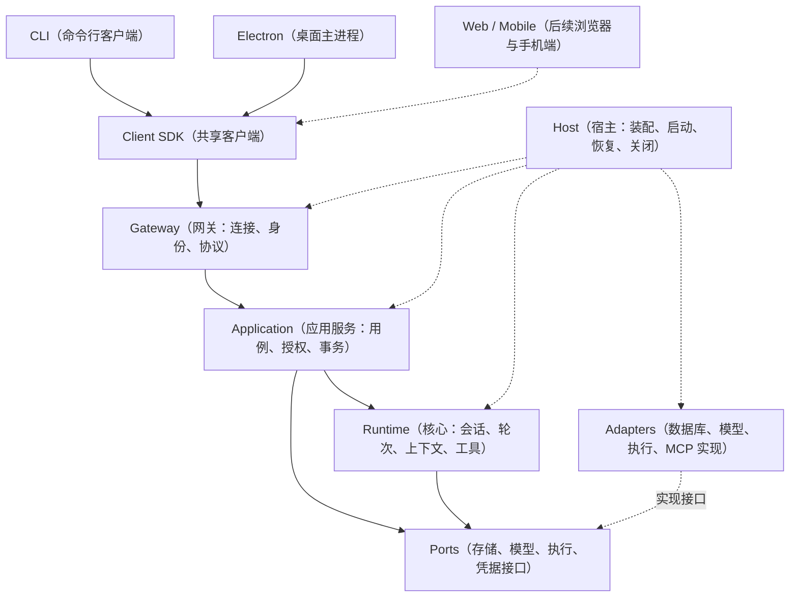

实线表达业务调用，虚线表达装配、实现或未来接入。基础设施实现由宿主注入，核心不导入具体 SQLite、Electron 或网关实现。

### 3.2 4.7.0 的部署形态

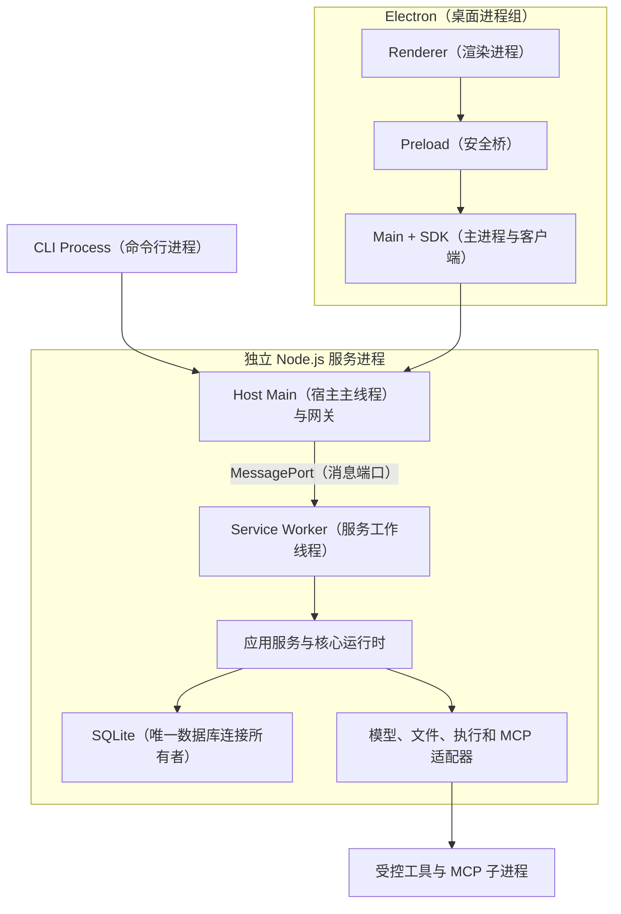

首版保留一个服务工作线程，承载应用服务、运行时和 SQLite；宿主主线程负责网关、生命周期和有界转发，避免同步数据库操作直接阻塞网络接入。工作线程不是安全沙箱，也不能隔离原生模块导致的整个进程崩溃。

Electron 不再加载数据库原生模块，也不再直接创建运行时工作线程。桌面通过随包的独立 Node.js 启动服务；npm 安装通过受支持的系统 Node.js 启动相同产物。

## 4. 组件能力边界

| 组件                           | 拥有的职责和状态                               | 对外入口                       | 禁止承担                         |
| ------------------------------ | ---------------------------------------------- | ------------------------------ | -------------------------------- |
| Host（宿主）                   | 服务实例、目录锁、启动代次、就绪和关闭状态     | 启停、健康状态、连接发现       | 会话业务决策、模型推理           |
| Gateway（网关）                | 连接身份、限流、协议解析、传输缓冲             | HTTP 命令/查询与 SSE           | 直接写业务库、决定工具是否执行   |
| Application（应用服务）        | 业务用例、资源授权、幂等回执、配置事务         | 命令、查询、订阅准备           | 模型循环、客户端组件状态         |
| Runtime（核心）                | 驱动器、执行轮次、上下文、工具审批与恢复       | 接纳输入、取消、交互、运行控制 | HTTP、Electron、具体数据库类     |
| Infrastructure（基础设施）     | 数据库连接、网络连接、受控进程、文件和凭据实现 | 实现领域端口                   | 自行决定业务权限或改变执行状态机 |
| Client SDK（客户端开发工具包） | 连接、协议协商、请求、游标与重连               | 客户端门面                     | 直接读取数据库、自动批准工具     |
| CLI / Electron（客户端）       | 展示、输入、本地偏好、平台交互                 | 用户操作                       | 成为持久执行事实源               |

“状态归属”不等于状态全部在内存里。审批、输入、配置和运行事实必须持久化；驱动器对象、连接和缓冲区可以重建。

## 5. 目录、依赖与构建边界

### 5.1 目标目录

保留单仓库、单源码包开发方式，不引入多包工作区管理系统；用独立构建入口生成服务、桌面及后续 SDK 发布物。

```text
src/
  domain/                         # 领域类型与纯投影，不含宿主能力
    session/                      # 会话、收件箱、轮次、事件
    configuration/                # 模型、技能、MCP 配置类型
    permission/                   # 权限、审批身份和状态
    projection/                   # 从事实生成运行与展示读模型
  ports/                          # 由使用方要求、由适配器实现的接口
    runtime-store.ts              # 运行存储与事务
    model.ts                      # 规范化模型调用
    execution-environment.ts      # 执行环境
    capability-content.ts         # 技能与上下文内容读取
    credential-store.ts           # 凭据存取
    clock.ts                      # 时间接口
  protocol/                       # 客户端公开协议
    methods/                      # 方法、参数与结果模式
    events/                       # 可订阅事件和游标信封
    schemas/                      # 边界校验
    errors.ts                     # 稳定错误码
    compatibility.ts              # 协议协商
  runtime/                        # 核心执行引擎
    manager/                      # 运行中的会话与并行配额
    admission/                    # 输入接纳和收件箱操作
    session/                      # 单会话驱动器
    turn/                         # 轮次和步骤执行
    context/                      # 上下文投影、预算、压缩
    tools/                        # 工具定义、调度、顺序提交
    permission/                   # 执行前决策与审批协调
    recovery/                     # 中断修复
  application/                    # 应用用例
    dispatch/                     # 命令/查询目录与调用分派
    sessions/                     # 会话管理和执行入口
    configurations/               # 模型和运行配置管理
    skills/                       # 技能安装和目录服务
    mcp/                          # MCP 配置、目录和刷新
    artifacts/                    # 附件、产物与导入
    subscriptions/                # 快照、追赶和公开事件映射
    security/                     # 用户作用域与资源授权
    diagnostics/                  # 用量和诊断查询
  gateway/                        # 网络与连接边界
    http/                         # 请求路由与响应
    sse/                          # 事件流与背压
    auth/                         # 本地凭据验证和连接身份
    connections/                  # 连接会话、用户档案、过期
  host/                           # 独立运行宿主
    serve.ts                      # 服务入口
    composition-root.ts           # 工作线程内依赖装配
    service-worker.ts             # 工作线程入口
    service-supervisor.ts         # 工作线程监护
    worker-protocol.ts            # 内部消息，不对客户端公开
    instance-lock.ts              # 单实例锁
    discovery.ts                  # 发现记录
    lifecycle.ts                  # 启动、关闭、重启
    managed-installation.ts        # 脱离客户端的稳定服务目录
  infrastructure/                 # 数据库、模型、文件、进程等实现
    sqlite/ llm/ credential/      # 存储、模型、凭据
    execution/ filesystem/        # 本地执行环境、路径约束
    mcp/ skills/ logging/         # MCP 连接、技能读取、日志
    runtime/                      # Node/Python 工具环境解析
  client-sdk/                     # 客户端连接与命令门面
    core/                         # 无平台依赖的请求和重连语义
    transports/                   # HTTP 与 SSE 传输实现
    local/                        # 仅 Node 客户端使用的发现和启动
  cli/                            # 参数、交互、输出和退出码
  main/                           # Electron 窗口、安全桥、平台能力
  preload/                        # 固定 IPC 白名单
  client-contracts/               # 迁移期兼容导出，完成后逐步收敛
ui/                               # React 桌面界面，后续可加浏览器入口
packaging/                        # 各发布物清单，不是独立源码包
scripts/                          # 构建、依赖边界、打包验证
```

目录只随实现创建，不能为了满足结构图先生成大量空目录。一个小模块可先用单文件承载；按职责拆分，不按每个方法拆文件。

### 5.2 依赖方向

| 模块                            | 允许依赖                       | 自动检查的禁止项                      |
| ------------------------------- | ------------------------------ | ------------------------------------- |
| `domain`（领域）                | 纯类型、纯函数、必要校验       | Node 系统能力、UI、存储、网络         |
| `ports`（端口）                 | 领域类型                       | 具体适配器、客户端公开协议            |
| `runtime`（核心）               | 领域、端口                     | Electron、HTTP、SQLite 类、客户端 SDK |
| `application`（应用服务）       | 领域、端口、核心、公开协议映射 | Electron、具体存储装配                |
| `gateway`（网关）               | 公开协议、服务调用端口         | 直接导入 RuntimeService 或业务数据库  |
| `infrastructure`（基础设施）    | 领域、端口、外部实现库         | UI、网关、应用服务反向调用            |
| `host`（宿主）                  | 所有服务模块的公开装配接口     | UI 业务                               |
| `client-sdk/core`（客户端核心） | 公开协议、必要纯投影           | Node 文件/进程、服务实现              |
| `main` / `cli`（桌面/命令行）   | SDK、公开协议、平台能力        | Runtime、数据库仓储                   |
| `ui`（界面）                    | 公开协议、客户端门面、界面模块 | 服务实现、Node、Electron 模块         |

迁移期 `client-contracts` 可以重新导出新类型，但新核心不再反向导入这个兼容入口。增加 `check:architecture`（架构边界检查）扫描静态导入、动态导入和构建依赖图；不得仅靠命名约定。

## 6. Host（运行宿主）内部设计

### 6.1 技术组件

| 技术组件                           | 职责与持有资源                                                 |
| ---------------------------------- | -------------------------------------------------------------- |
| HostConfigLoader（宿主配置加载器） | 合并命令行、环境变量、配置文件、默认值；解释数据目录与资源目录 |
| InstanceLock（实例锁）             | 确保规范化数据目录只有一个服务所有者                           |
| ServiceSupervisor（服务监护器）    | 创建工作线程，管理代次、超时、有限重启和待响应请求             |
| CompositionRoot（组合根）          | 在工作线程内构造数据库、适配器、应用服务和核心                 |
| ReadinessGate（就绪门）            | 初始化与恢复完成前拒绝业务写入                                 |
| DiscoveryWriter（发现记录写入器）  | 原子发布实例 ID、地址、版本、状态和凭据文件位置                |
| ProcessContainment（进程约束器）   | 登记工具进程组、监控所属代次、确认退出后允许重启               |
| ShutdownCoordinator（关闭协调器）  | 停止接纳、取消执行、回收工具、关闭存储、释放锁                 |

### 6.2 实例与启动策略

- 默认数据根目录为 `~/.agent-harness`；命令行 `--data-dir`（数据目录）可显式覆盖。
- CLI 和 Electron 使用相同的发现逻辑；工作目录不决定服务实例，数据目录才决定实例。
- `serve` 在前台运行，重复启动同目录返回 `INSTANCE_ALREADY_RUNNING`（实例已运行），不启动第二个数据库写入者。
- `server start`（启动后台服务）及桌面自动连接入口采用“发现 → 协商 → 连接；不存在才启动”的幂等流程。
- 单实例锁采用规范化本地目录上的原子创建锁目录；记录实例随机标识、进程 ID、启动时间和进程身份信息。心跳只用于诊断，不能仅因超时就抢锁。
- 发现锁存在但服务不可达时，不自动删除锁或清理会话租约。`doctor unlock`（诊断并清理失效锁）必须确认原进程退出；无法证明时返回人工处理信息。
- 4.7.0 不支持网络文件系统上的共享数据目录。实例锁防止正常新版实例竞争，不是阻止旧版本或恶意同账号进程写库的安全沙箱。
- 发现文件只在服务就绪后发布，包含 `instanceId`（实例标识）和启动信息；客户端不能只按进程 ID 或端口认为服务可信。

### 6.3 生命周期

状态为 `starting`（启动中）→ `recovering`（恢复中）→ `ready`（就绪）→ `draining`（停止接纳）→ `stopped`（已停止）；异常可进入 `restarting`（重启中）或 `failed`（失败）。

`instanceId` 每次完整服务启动重新生成；`generation`（工作线程代次）在工作线程重建时递增；两者都不替代持久事件序号。旧代次响应不得匹配到新代次请求。

就绪要求数据库、身份、核心、方法目录和恢复完成；未配置模型、缺少 Python 或某个可选 MCP 不可用只形成能力降级，不阻止用户进入配置和诊断。恢复过程拆成 `repair`（修复事实）与 `resumeQueuedWork`（唤醒合法队列）两步，发布就绪后才开放队列执行，避免在恢复校验尚未结束时开始新工具调用。

客户端退出默认只断开连接。后台服务不随 Electron 退出而停止；桌面必须提供明确的服务状态与“停止本地服务”入口。`serve` 的终端收到中断信号则执行服务关闭流程。

自动重启工作线程前必须确认旧线程和其本地进程组停止。无法确认时进入失败状态，不启动新驱动器。网络侧 MCP 已发出的调用不能通过本机进程终止证明已取消，按未知副作用修复。

会话租约所有者使用实例标识与工作线程代次组合。每次事实追加和执行前复核当前租约，丢失所有权后停止驱动；不能仅通过旧进程退出后的时间差推断当前持有权。完整服务异常退出后若遗留锁，后续启动明确报告失效锁诊断，不按心跳超时自动夺取所有权。

### 6.4 服务身份与安装位置

后台服务不能长期依赖会被替换的 `.app` 内文件或 `npx` 临时缓存。客户端启动后台服务前，将版本化服务产物、其原生依赖和必要执行资源准备到受管目录；验证清单和摘要后再启动，运行中版本目录不可原地覆盖。

前台 `serve` 可直接使用已安装包；后台入口固定使用受管版本目录。更新只增加新版本，停止旧实例后切换，不静默重启其他客户端正在使用的服务。服务运行版本与客户端版本不一致时先协商兼容性，不按“桌面版本较新”直接替换。

## 7. Gateway（内置网关）内部设计

### 7.1 组件结构

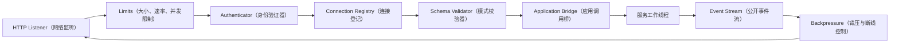

首版使用 Node.js 内置 `node:http`（HTTP 服务）、流接口和已有 Zod（运行时模式校验库），不引入通用业务 Web 框架。业务分派来自统一方法目录，不允许路由直接调用数据库。

### 7.2 传输与端点

| 端点                                     | 用途                 | 行为                                         |
| ---------------------------------------- | -------------------- | -------------------------------------------- |
| `POST /v1/connections`                   | 建立已认证连接上下文 | 协商协议、选择本地用户、返回连接令牌         |
| `DELETE /v1/connections/current`         | 断开当前连接         | 撤销令牌与订阅，不取消会话                   |
| `POST /v1/commands`                      | 提交状态变更命令     | 返回持久接纳结果或明确错误                   |
| `POST /v1/queries`                       | 读取快照/分页数据    | 不把私有参数放入 URL                         |
| `GET /v1/sessions/:id/events?afterSeq=N` | 会话事件流           | 从指定持久序号追赶并持续订阅                 |
| `GET /v1/lifecycle/events`               | 服务和配置变化通知   | 非持久通知；重连重新查询权威快照             |
| `POST /v1/uploads`                       | 二进制上传           | 返回当前用户所属的上传引用                   |
| `GET /v1/artifacts/:id/content`          | 受控文件下载         | 校验所属用户和文件引用                       |
| `GET /healthz` / `GET /readyz`           | 存活/就绪检查        | 未认证仅返回最小状态，不暴露路径、用户或配置 |

HTTP 不是模型供应商协议；网关 SSE 也与模型适配器读取供应商 SSE 相互独立。

### 7.3 身份与本地访问

4.7.0 只绑定 `127.0.0.1`（本机回环地址），默认选择空闲端口并通过发现文件公布。不提供 `0.0.0.0`（所有网卡监听）开关，远程开放属于后续完整能力。

服务首次启动生成高熵引导令牌，存放于仅当前操作系统用户可读的文件；目录权限为 `0700`，令牌文件为 `0600`。令牌不得出现在 URL、日志、命令行参数或 Renderer 内。SDK 的 Node 本地模块和 Electron 主进程读取令牌并换取短期连接令牌。

每条逻辑连接绑定固定的 `userId`（本地用户标识）、客户端类型与能力。连接令牌可授权多个 HTTP 请求和事件流，不等同于某条 TCP（传输控制协议）连接。令牌续期在原连接有效时进行；完整服务重启后重新握手。

两个本地用户仍是同一操作系统账号下的应用档案，不声称构成强账号认证。持有本地引导凭据的用户可建立任一合法档案的连接；普通命令中的 `userId` 不被接受为授权依据。

首版拒绝带浏览器 `Origin`（请求来源）头的业务请求，校验 `Host`（目标主机）为实际回环地址/端口，关闭 CORS（跨来源资源共享），每个业务端点仍要求令牌。这样本地网页不能因服务只监听回环地址就自动获得执行权限。后续 Web 接入必须另行实现浏览器认证与来源策略。

### 7.4 背压与限制

| 配置项                     | 设计初值                                        | 超限语义                                   |
| -------------------------- | ----------------------------------------------- | ------------------------------------------ |
| 逻辑连接数                 | 每实例 32                                       | 拒绝新连接                                 |
| 普通请求体                 | 1 MiB（约一百万字节）；业务字段仍受各自上限限制 | HTTP 413（请求过大）                       |
| 等待进入工作线程的普通请求 | 每实例 256                                      | HTTP 503 + `SERVER_OVERLOADED`（服务繁忙） |
| 控制命令保留队列           | 32；仅取消、审批、关闭控制等                    | 有界排队，不绕过校验和授权                 |
| 单连接事件输出缓冲         | 2 MiB                                           | 发送重同步提示后关闭；无法发送时直接关闭   |
| 事件页                     | 最多 100 个且有字节上限                         | 分页读取                                   |
| SSE 心跳                   | 15 秒                                           | 仅探测连接，不消耗持久序号                 |
| 普通命令应答超时           | 30 秒                                           | 返回结果未知；不能推断执行未发生           |
| 上传                       | 默认 64 MiB，可配置                             | 流式计数，超限停止并清理暂存               |

工作线程消息端口本身不提供本项目的业务队列上限，宿主必须显式计数和控制发送。大历史事件通过受权分页/分块传输，不允许一条巨大事件绕过缓冲上限；原始事实保留在存储，传输上限不改变模型 Surface 策略。

## 8. Application（应用服务）内部设计

### 8.1 用例组件

| 服务                             | 内部组件                                   | 输入/输出与边界                                |
| -------------------------------- | ------------------------------------------ | ---------------------------------------------- |
| SessionService（会话服务）       | 会话目录、资源授权、输入接纳门面、取消入口 | 创建/查询会话，调用核心推进执行                |
| ConfigurationService（配置服务） | 模型管理、配置版本、快照解析               | 配置事务成功后发变更通知，不修改运行中步骤快照 |
| SkillService（技能服务）         | 导入计划、包校验、受管安装、目录快照       | 将上传内容变成受管技能；不执行模型循环         |
| McpService（MCP 服务）           | 配置管理、目录刷新、启停、实例代次         | 经适配器建立连接，输出工具目录                 |
| ArtifactService（产物服务）      | 上传登记、附件关联、下载授权               | 对外使用引用，不信任客户端路径                 |
| InteractionService（交互服务）   | 待处理交互查询、回复授权                   | 普通问答和系统审批分别路由到核心               |
| SubscriptionService（订阅服务）  | 快照、事件分页、公开映射、追赶水位         | 提供连续流，不将内存通知当作事实源             |
| DiagnosticsService（诊断服务）   | 用量投影、依赖健康、错误摘要               | 返回脱敏诊断，不回读已保存密钥                 |

### 8.2 分派与事务

MethodCatalog（方法目录）记录方法名、参数模式、结果模式、权限类型、是否修改状态、幂等策略和能力版本。桌面、CLI、HTTP 和内部工作线程使用同一份目录，不维护几份不同的字符串分支。

ApplicationDispatcher（应用分派器）执行：边界校验 → 资源授权 → 幂等检查 → 用例 → 返回回执。网关已经校验不代表工作线程可以省略信任边界检查；内部消息同样具有版本、代次和严格参数模式。

事务由业务拥有者定义。输入的幂等回执必须和 Inbox 及接纳事件在同一数据库事务提交；不能先在应用层记录“完成”，再调用核心写输入。配置命令的回执与配置版本在同一事务提交。应用分派器不使用一个跨模型/网络调用的长事务包住整个用例。

### 8.3 用户作用域

`RequestContext`（可信请求上下文）由网关构造并通过内部端口传递：

```ts
interface RequestContext {
  requestId: string; // 本次传输请求标识
  connectionId: string; // 已认证逻辑连接标识
  principalId: string; // 本机安装授权主体标识
  userId: string; // 本次连接选定的本地用户
  clientKind: 'cli' | 'electron'; // 命令行或桌面客户端
  instanceId: string; // 服务实例标识
  generation: number; // 服务工作线程代次
}
```

不存在服务级 `activeUserId`（全局活动用户）。桌面切换档案时创建新连接并撤销该窗口的旧连接；其他窗口和 CLI 连接不受影响。已接纳命令保留接纳时身份，撤销连接不撤销任务。

所有会话、事件、审批、上传、技能与配置查询都携带作用域；不仅写入要校验，快照、历史、错误信息和订阅也必须防止跨用户读取。

服务级启动、停止、失效锁处理与工作线程重试属于本机管理能力，不能由任意业务方法名隐式触发。网关在引导握手中授予明确的管理能力标记；Renderer 只能通过固定桌面操作发起，不能自行声明标记。

### 8.4 现有命令迁移规则

| 现有命令/查询                                                | 4.7.0 对应位置与语义                                               |
| ------------------------------------------------------------ | ------------------------------------------------------------------ |
| `app.bootstrap`（应用初始化）                                | 连接握手后读取当前连接用户的初始化快照，不返回全局活动用户         |
| `user.switch`（用户切换）                                    | 仅由旧桌面兼容门面转换为替换该窗口连接；不再分派为服务全局业务命令 |
| `runtime.retry`（运行时重试）                                | 映射到受管理权限保护的工作线程重试；先确认旧线程与进程停止         |
| `session.*`（会话操作）                                      | 保留业务方法与现有 ID，进入会话应用服务                            |
| `input.* / inbox.* / turn.*`（输入、收件箱、轮次）           | 保留既有接纳、提升、取消等语义，经核心门面执行                     |
| `approval.resolve / interaction.resolve`（审批/问答回复）    | 保留独立请求类型，增加跨连接回执和原子竞争处理                     |
| `model* / skill* / mcp*`（模型/技能/MCP）                    | 管理用例进入分领域服务；参数与结果版本化，不因换传输改业务含义     |
| `capability-category.*`（能力分类）                          | 保留现有分类管理与用户配置版本                                     |
| `model-call-statistics.query`（模型调用统计）                | 进入诊断服务，沿用真实用量来源                                     |
| `selectAndInstallSkill / openSessionFile`（选技能/打开文件） | 拆为平台交互和上传、安装、产物读取业务                             |

实施 P0 工作包必须从当前方法类型、分派器与桌面调用点生成完整覆盖清单；每个现有入口标记“保留、兼容映射、内部化”之一，不允许因本表使用通配归组而漏迁功能。

## 9. Runtime（核心运行时）内部设计

### 9.1 结构与状态所有权

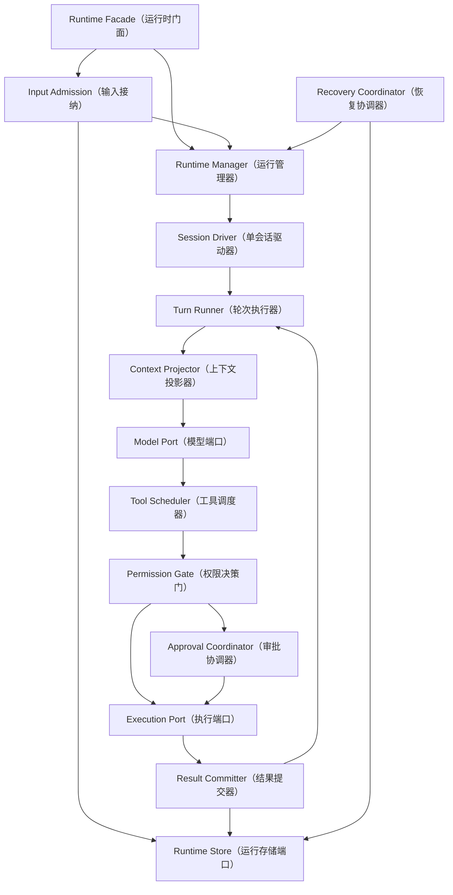

| 核心模块                          | 负责的机制                                 | 内存状态与持久状态                       |
| --------------------------------- | ------------------------------------------ | ---------------------------------------- |
| RuntimeManager（运行管理器）      | 驱动器唯一性、会话并行额度、唤醒、全局关闭 | 内存维护运行实例；租约及运行事实持久化   |
| InputAdmission（输入接纳）        | 输入去重、入队、替换、提升、取消后排队     | 收件箱及对应事件同事务提交               |
| SessionDriver（会话驱动器）       | 单会话串行、租约续期、领取输入             | 驱动器内存化；租约有所有者代次           |
| TurnRunner（轮次执行器）          | 步骤循环、配置快照、结束检查               | 活动模型请求在内存；轮次和步骤事件持久化 |
| ContextProjector（上下文投影器）  | 历史选择、预算、压缩、工具配对             | 缓存可丢弃，输入可由日志和内容端口重建   |
| ToolScheduler（工具调度器）       | 有界并行、独占屏障、调用顺序               | 待执行集合在内存；调用和结果是事实       |
| PermissionGate（权限决策门）      | 根据预设、工具身份和参数判定允许/拒绝/询问 | 不采信模型自述作为授权依据               |
| ApprovalCoordinator（审批协调器） | 挂起、解决、取消审批                       | 等待句柄在内存；审批请求和决议持久化     |
| ResultCommitter（结果提交器）     | 按模型调用序号保存完整结果                 | 不按异步返回顺序乱序提交                 |
| RecoveryCoordinator（恢复协调器） | 重建投影、结束中断轮次、处理未知副作用     | 通过追加修复事件记录，不改写旧日志       |

### 9.2 核心端口

| 端口                                      | 最小语义要求                                                                   |
| ----------------------------------------- | ------------------------------------------------------------------------------ |
| RuntimeStore（运行存储）                  | 原子接纳输入、事件追加、收件箱领取、版本检查、租约和投影读取；不暴露 SQL       |
| ModelPort（模型调用）                     | 接收不可变快照、消息和工具定义；返回规范化文本、推理、工具调用、用量、结束原因 |
| ExecutionEnvironment（执行环境）          | 受控文件、进程、取消、输出及平台能力；禁止把本机路径解析散落在驱动器中         |
| CapabilityContentReader（能力内容读取器） | 读取当前用户被允许的技能、历史内容和必要资源                                   |
| ConfigurationResolver（配置解析器）       | 在既有安全边界生成用户配置与工具目录快照                                       |
| Clock / IdProvider（时钟/标识生成器）     | 可注入时间、随机标识，用于确定性测试                                           |

存储接口采用有业务意义的原子操作，不把通用 `query(sql)`（任意 SQL 查询）伪装成抽象接口。核心计算使用同步纯函数；存储与模型、内容读取等端口采用异步调用，以容纳后续替换。SQLite 实现只在短同步事务内执行必要数据库写入，不跨 `await`（异步等待）持有事务。

### 9.3 断线与恢复的不同语义

- 仅客户端断开：原驱动器仍运行；待审批保持可查询，任何有权客户端可以回复。
- 工作线程重启：原等待句柄已丢失，沿用当前恢复策略，将原审批标为不可用、轮次标为中断；不能恢复一个内存 Promise（异步等待对象）就假装继续原调用。
- 整个服务重启：取得独占所有权后执行同样的事实恢复，客户端重新认证并追赶。
- 旧步骤的补充输入沿用当前恢复规则转入合法的下一轮队列；未解决工具调用记录未知副作用，不自动执行。
- 无客户端在线不影响普通任务；需要交互时可以持续等待。`serve` 不因为订阅数为零而关闭 Runtime。

## 10. Infrastructure（基础设施适配器）内部设计

### 10.1 数据库与存储

```text
RuntimeStore / ConfigurationStore（运行/配置存储接口）
    → SQLite Unit of Work（SQLite 事务单元）
        → 现有 Session / Projection / Model / Skill / MCP 仓储
        → 幂等回执与上传登记等新增仓储
        → 唯一 SQLite 连接、迁移与一致性备份
```

继续使用 `better-sqlite3`（SQLite 原生驱动），保留同库同表 `user_id`（用户字段）隔离和复合外键。只有服务工作线程访问业务数据库；客户端、网关和诊断命令不得通过第二条直连路径绕过服务。

持久化新增需求以编写迁移时的实际最新版本为前置，不预占数据库版本号：

| 逻辑对象                             | 主键/唯一约束        | 用途                                         |
| ------------------------------------ | -------------------- | -------------------------------------------- |
| CommandReceipt（命令回执）           | 用户 + 方法 + 幂等键 | 记录请求摘要、结果引用、状态和创建时间       |
| ClientPreference（客户端偏好）       | 客户端安装标识       | 保存最近用户选择；可优先保存在客户端本地文件 |
| UploadRecord（上传记录）             | 用户 + 上传标识      | 保存暂存状态、摘要、大小、到期和消费状态     |
| InstallationJournal（安装日志）      | 用户 + 安装操作标识  | 对账文件系统安装与数据库登记                 |
| RuntimeCompatibility（运行兼容记录） | 数据目录实例         | 最低可读写格式和迁移来源                     |

命令回执不是第二份会话事件日志。新请求回执尽量引用已持久化输入、审批或配置版本；既有输入幂等记录需要兼容读取，避免迁移后旧请求被重复接纳。

### 10.2 模型与凭据

模型适配器负责供应商参数转换、HTTP/流解析、错误归一化和用量，不拥有会话循环。模型网络重试必须服从既有策略，不因 SDK 重连而重发模型请求。

凭据继续默认使用 macOS Keychain（系统钥匙串），保持已有服务名与用户命名空间。CLI 的交互配置使用隐藏输入；非交互配置从受控标准输入或进程环境引用读取，避免把密钥放进命令参数和 shell（命令解释器）历史。

无人值守场景可提供只读 EnvironmentCredentialStore（环境凭据存储）适配器：配置保存环境变量名，不保存值；环境缺失时明确失败，不降级为明文文件或 FakeCredentialStore（测试凭据存储）。服务启动后环境来源固定，客户端后续改变自己的环境不会修改运行服务的环境。

### 10.3 本地执行环境

```text
LocalExecutionEnvironment（本地执行环境）
    ├── ScopedFileSystem（受限文件系统）
    ├── ProcessRunner（进程运行器）
    ├── ShellExecutor（命令执行器）
    ├── SandboxProvider（系统沙箱提供器）
    ├── ProcessRegistry（进程登记与回收）
    └── RuntimeResolver（Node/Python 解释器解析器）
```

执行请求绑定 `environmentId`（环境标识）、用户、工作区、轮次、工具调用标识和生效权限。4.7.0 唯一环境标识为 `local`（本地），但核心调用不依赖客户端所在设备。

执行器必须保留真实路径、符号链接、工作区、环境变量、超时、输出上限、进程组终止等约束。独立 Node 服务不使用 Electron 的渲染沙箱代替工具沙箱。

服务工作线程创建子进程时，进程登记/看护必须先于允许执行实际工具载荷；工作线程失去响应时由宿主触发回收。整个服务异常退出时使用独立看护机制监测父进程存活并回收登记的本地进程组；若平台不能证明旧进程已停止，则受影响会话进入人工处理状态。不得仅记录 PID（进程编号）后盲目终止可能复用该编号的新进程。

首版看护实现使用 `ProcessGuard`（进程看护包装器）：包装器先与宿主建立专用生命期管道并登记随机调用标识，收到宿主确认才创建工具进程组；管道关闭时终止自己拥有的进程组并等待退出。宿主掌握独立于工作线程的管道和回收回执。包装器必须位于工具可写范围之外，不能仅在工具本身内部实现自我看护。强制退出或系统故障仍可能留下未知状态，按恢复协议处理。

### 10.4 MCP 与 Skill（技能）

- MCP 连接管理器按用户、服务和配置代次建立独立连接，保留已有工具名称、模式摘要、审批与有界重连。
- 默认 Memory MCP（记忆协议服务）仍是普通外部 MCP，不改造成核心记忆数据库。
- 技能解析、资源读取、压缩包校验、发布目录和生成技能的写入归属适配器；目录和安装业务归属应用服务。
- 上传与安装采用“暂存 → 校验 → 原子放入版本目录 → 数据库登记 → 发布目录快照”。文件系统与数据库不假装处于同一事务，安装日志负责失败补偿与启动对账。
- 不允许压缩包绝对路径、目录穿越、越界链接、无界解压或上传内容覆盖服务代码。

## 11. 公开协议、事件与一致性

### 11.1 三类版本

| 字段                              | 中文含义         | 兼容规则                                     |
| --------------------------------- | ---------------- | -------------------------------------------- |
| `serverVersion`                   | 服务软件版本     | 表示发布物，不作为唯一协议兼容依据           |
| `protocolMajor` / `protocolMinor` | 协议主/次版本    | 主版本不兼容则拒绝；新增可选能力通过协商     |
| `eventSchemaVersion`              | 持久事件模式版本 | 使用既有事件升级读取机制                     |
| `databaseSchemaVersion`           | 数据库结构版本   | 独立迁移；旧服务不能写入更高版本数据库       |
| `capabilities`                    | 能力声明         | 声明审批、上传、队列、消息归类等实际支持能力 |

握手返回服务状态、实例、代次、协商协议和连接所属用户；不返回模型密钥。客户端先检查协议再决定可用功能，不能通过读取服务源码版本猜能力。

### 11.2 请求与响应信封

```ts
interface CommandEnvelope {
  protocolMajor: 1; // 协议主版本
  requestId: string; // 单次传输请求标识
  method: string; // 已登记命令名，例如 input.submit（提交输入）
  idempotencyKey: string; // 同一逻辑操作在重试时保持不变
  params: unknown; // 必须经方法模式校验的输入
}

type CommandResponse =
  | { ok: true; requestId: string; result: unknown }
  | {
      ok: false;
      requestId: string;
      error: { code: string; message: string; outcome: 'notAccepted' | 'unknown' };
    };
// notAccepted：确认未接纳；unknown：可能已经接纳，需要查询回执。
```

此处是协议形状示意；实现必须从方法目录生成精确参数与返回类型，不能把 `unknown`（未知类型）扩散进业务代码。当前输入参数内部的幂等键由兼容适配器映射到信封；若两处同时存在且不同，拒绝请求。

已接纳表示输入或业务状态已提交，不表示轮次完成。`requestId` 只用于跟踪；客户端重试可以使用新请求标识，但必须保留原逻辑幂等键。提供 `command.receipt`（查询命令回执）查询，查询作用域仍绑定用户和方法。

### 11.3 幂等与并发控制

- 所有状态变更命令采用稳定幂等键；同用户、同方法、同键、相同规范化参数返回原结果，不再次修改状态。
- 同键不同参数返回 `IDEMPOTENCY_CONFLICT`（幂等冲突）。摘要排除传输请求标识，包含规范化业务参数。
- 核心已有输入去重不能移除后只换成网关内存缓存。回执必须跨连接和工作线程重启可查询。
- 配置和重命名仍使用 `expectedRevision`（预期配置版本）或 `expectedVersion`（预期实体版本）。版本冲突由客户端刷新并重新确认，不自动覆盖。
- 取消绑定具体 `turnId`（轮次标识），不能取消用户点击之后才启动的新轮次。
- 副作用类管理操作使用持久操作日志，崩溃后进入可查询的待对账状态；不能因为回执缺失就重复安装、覆盖密钥或启动第二个进程。
- 4.7.0 不自动清理已完成变更命令的去重标识；大回执可压缩成对象引用，但保留键和摘要。未来定义明确重试保留期后才允许回收。

### 11.4 内部事件与公开事件

| 类型                               | 示例及中文含义                           | 持久与重放                 |
| ---------------------------------- | ---------------------------------------- | -------------------------- |
| RuntimeEvent（内部执行事件）       | 工具参数、结果、上下文压缩、租约相关事实 | 完整持久化，核心恢复使用   |
| SessionClientEvent（公开会话事件） | 消息、工具展示、收件箱、审批、轮次状态   | 按会话序号映射和重放       |
| LifecycleEvent（生命周期事件）     | 工作线程重启、服务即将关闭               | 瞬时；重连以健康快照为准   |
| ConfigurationChanged（配置变化）   | 配置域和新版本号                         | 瞬时提示；重连查询配置快照 |

客户端订阅信封包含 `sessionId`（会话标识）、`fromSeq` / `toSeq`（覆盖起止序号）、`events`（公开事件）。内部事件不适合公开时仍推进覆盖序号，允许公开事件数组为空，避免客户端误判序号断档。一个内部事实映射多个公开项时，公开项使用事件 ID 和项序号去重，批次游标在整批应用后推进。

客户端需要的长文本通过受控事件详情或产物引用加载；公开映射隐藏凭据和内部秘密字段，不删改内部事实，也不向其他用户暴露内容。

### 11.5 无丢失订阅算法

1. 在数据库一致性读取中返回 Snapshot（快照）及其对应的 `cursor`（水位）。
2. 客户端订阅 `afterSeq=cursor`（从快照之后开始）。服务先登记有界实时唤醒，再读取当前持久高水位 H。
3. 按页从存储补发 `(cursor, H]`，然后继续读取新高水位；内存通知只表示“可能有新数据”。
4. 定时检查有活动订阅会话的持久高水位，补偿“事务已提交但通知未送出”的窗口；通知丢失不能造成永久漏事件。
5. 客户端按覆盖序号和事件标识去重；允许至少一次投递，不承诺网络恰好一次。
6. 工作线程重建、游标超出有效范围、映射版本不兼容或缓冲溢出时要求重新读取快照。

配置通知不使用会话游标。配置发生变化但提示丢失时，通过定期版本核对和重连快照恢复。审批是否待处理取自持久投影，不取决于某条事件是否刚好被某端收到。

## 12. Client SDK、CLI 与 Electron 内部设计

### 12.1 共享客户端

```text
ClientFacade（客户端门面）
    ├── ProtocolNegotiator（协议协商器）
    ├── RequestClient（请求与结果校验）
    ├── ReceiptResolver（未知结果回执查询）
    ├── SubscriptionClient（事件订阅与追赶）
    ├── ReconnectController（重连控制器）
    └── Transport（传输接口）

NodeLocalConnector（仅 Node 使用的本地连接器）
    ├── DiscoveryReader（发现记录读取）
    ├── ServiceLauncher（后台服务启动）
    └── CredentialBootstrap（引导凭据读取）
```

SDK 核心只依赖公开协议及注入的传输和时钟，不导入文件系统。`local`（本地）入口单独承载 Node 能力。未来浏览器 SDK 不导出读取本机凭据或启动进程的方法。

重连使用有上限的指数退避与随机抖动。查询可重试；变更命令先查回执或用原幂等键重试；不得生成新键掩盖未知结果。关闭一个订阅只取消该流，不向 Runtime 发取消命令。

### 12.2 CLI（命令行）

| 命令示例                                          | 中文说明                             |
| ------------------------------------------------- | ------------------------------------ |
| `agent-harness serve`                             | 前台启动完整服务                     |
| `agent-harness server start/status/stop`          | 启动、查询、停止后台服务             |
| `agent-harness setup`                             | 交互配置模型服务与凭据               |
| `agent-harness chat --user user-a`                | 选择用户并开始交互会话               |
| `agent-harness run "分析项目" --session ID`       | 向指定会话提交一次输入并等待结果     |
| `agent-harness session list/show`                 | 列出会话、查看快照                   |
| `agent-harness events --session ID --after-seq N` | 从指定序号跟随会话事件               |
| `agent-harness cancel --session ID --turn ID`     | 取消明确轮次                         |
| `agent-harness approval list/resolve`             | 查询、解决系统审批                   |
| `agent-harness interaction list/resolve`          | 查询、回答普通业务问题               |
| `agent-harness model/skill/mcp`                   | 配置管理命令组，使用对应应用服务     |
| `agent-harness doctor`                            | 查询版本、连接、数据库与工具环境诊断 |

内部使用 ArgumentParser（参数解析器）→ CommandController（命令控制器）→ SDK → OutputRenderer（输出渲染器）。首版采用 Node 内置参数解析和 `readline`（逐行交互），不引入终端 UI 框架。

- `--json`（结构化输出）返回明确记录；流式输出采用 JSONL（每行一条 JSON），日志写标准错误，不能混入标准输出。
- `--user`（用户档案）、`--session`（会话）、`--turn`（轮次）、`--data-dir`（数据目录）、`--after-seq`（起始序号）均进行模式校验。
- `chat` 或 `run` 无服务时可启动受管后台服务；连接已有服务不取得关闭其他客户端任务的隐含权限。
- 非交互运行遇到审批或问答，输出请求标识和恢复命令，以退出码 3 表示“等待用户”；任务保持等待，不自动批准、不判为成功。
- 首次 `Ctrl+C`（终端中断）只对本命令跟随的明确轮次提交取消；再次中断可退出客户端。无法确认取消时报告结果未知，不能声称任务已停止。
- 退出码：0 成功；1 执行失败；2 参数/配置/连接错误；3 等待用户；130 用户中断。仅提交模式必须输出“已接纳”及输入 ID，不伪装任务完成。

### 12.3 Electron（桌面）

保留 Renderer（渲染进程）→ Preload（安全桥）→ Main（主进程）的现有安全边界；将 Main 后面的工作线程直连替换为 SDK。

桌面主进程负责窗口、托盘、文件选择器、系统打开、主题和本地服务连接。渲染进程不能获取网关令牌、指定任意网络地址、调用通用命令执行接口或读取数据库。

将当前混合 API 分成：

- AgentClient（业务客户端）：命令、查询、订阅、交互。
- PlatformClient（平台客户端）：选择文件、保存文件、打开已验证产物、窗口操作。

`selectAndInstallSkill`（选择并安装技能）可保留为界面组合动作，但实现是“平台选择 → 主进程读取并上传 → 业务安装”。`openSessionFile`（打开会话文件）改为“服务解析受控引用 → 主进程下载/核对 → 系统打开”。不把任意服务器路径当作桌面本机路径。

桌面服务状态显示“连接中、可用、恢复中、服务已停止、版本不兼容”等中文信息。服务停止影响所有客户端时，操作前展示活动任务数量及影响范围，不通过窗口关闭隐式执行。

## 13. 数据目录、迁移与兼容

### 13.1 新安装目录

```text
~/.agent-harness/
  discovery.json                  # 服务地址、实例和版本，无令牌正文
  auth/bootstrap-token            # 仅本机用户可读的引导凭据
  service.lock/                   # 独占运行锁与身份记录
  host/versions/<version>/        # 受管服务产物及匹配的原生依赖
  database/                      # 沿用已有数据库文件名和表结构
  users/                         # 按当前实现保留用户工作区/技能/记忆布局
  attachments/                   # 附件资源，按用户隔离
  staging/                       # 上传和安装暂存
  logs/                          # 脱敏服务与工作线程日志
  backups/                       # 一致性备份与迁移清单
```

图中用户资源分类是逻辑布局，迁移不能依据图示猜测现有实际路径。实施时从现有路径解析函数生成迁移清单，保留绝对引用和外部 MCP 存储位置的可解释映射。

### 13.2 现有桌面用户升级

1. 旧版本退出并停止工作线程和 MCP 后，新版本才接管数据；旧版本没有新锁协议，不能靠新锁推断旧版未运行。
2. 第一次升级保留现有 Electron 数据目录，写入当前用户的发现配置；CLI 通过同一配置连接此目录。新安装才采用新默认目录。
3. 用户显式执行迁移时，取得维护独占权，使用数据库备份接口生成一致性快照，盘点附件、技能、工作区和外部记忆文件。
4. 数据库前向升级，不更改用户 ID、会话 ID、事件 ID 和事件序号，不重新种入重复的默认 MCP。
5. 钥匙串命名空间保持原值；明文密钥不导出到备份。外部记忆正文仍由其服务负责，迁移只处理已声明的本地数据位置。
6. 校验新目录后原子切换发现配置；原数据保留为回退备份。迁移失败继续使用原目录，不能留下两个可同时写入的活动副本。

4.7.0 必须提供对旧版本误启动的诊断说明；不能宣称新版锁能约束不认识它的旧程序。升级程序需要确认旧进程退出，旧安装不应作为同时运行的客户端。

### 13.3 升级与回退

客户端遇到不兼容服务时返回明确错误，不能在同一数据目录另启一个兼容版本。数据库版本高于服务写入能力时拒绝启动。回退使用升级前一致性备份，明确会丢失备份后的新变更；不执行自动逆向结构迁移。

## 14. 关键步骤时序图

以下图中的组件为逻辑角色；网关和工作线程之间的消息转发在部分图中省略，实际进程分布以第 3.2 节为准。

Mermaid（文本绘图语法）渲染的分支标签中，`loop` 表示循环，`opt` 表示可选分支，`par` 表示并行，`alt` / `else` 表示条件分支/否则；各分支后均附中文条件说明。

### 14.1 CLI 与 Electron 同时启动

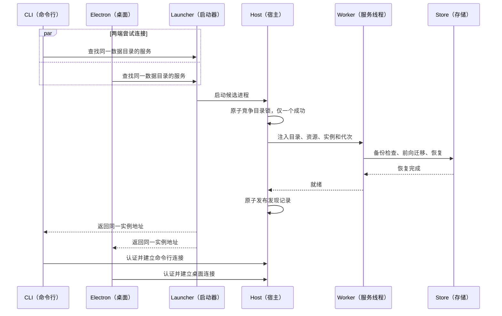

解释：两个客户端可以触发竞争，但只有取得目录锁的服务能打开业务数据库。失败候选进程退出，启动器等待获胜实例就绪。端口可监听不等于业务就绪；恢复完成才发布可连接记录。

### 14.2 提交输入、执行工具并同步两端

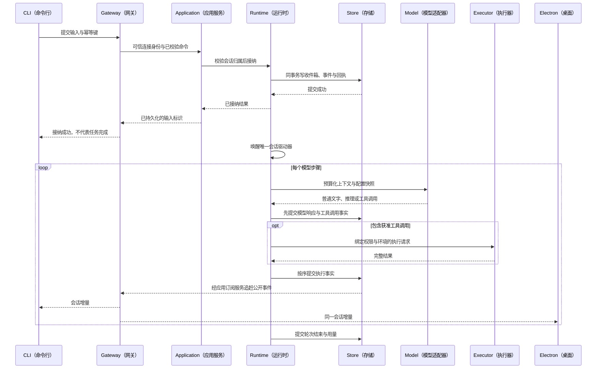

解释：命令回执、事件通知可能先后交错，客户端不能依赖固定到达顺序；使用输入标识、轮次标识和序号关联。持久提交之后通知丢失，由追赶算法补齐。

### 14.3 桌面断线后由 CLI 审批

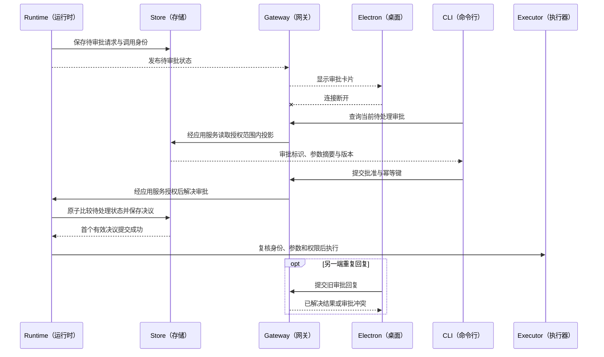

解释：审批不绑定首次展示它的客户端。两个不同回复竞争时只有一个从待处理状态转移成功；相同幂等请求返回原回执，另一个冲突回复不覆盖。若工作线程已经重启，原审批不可用，不继续旧工具调用。

### 14.4 快照、断线与事件追赶

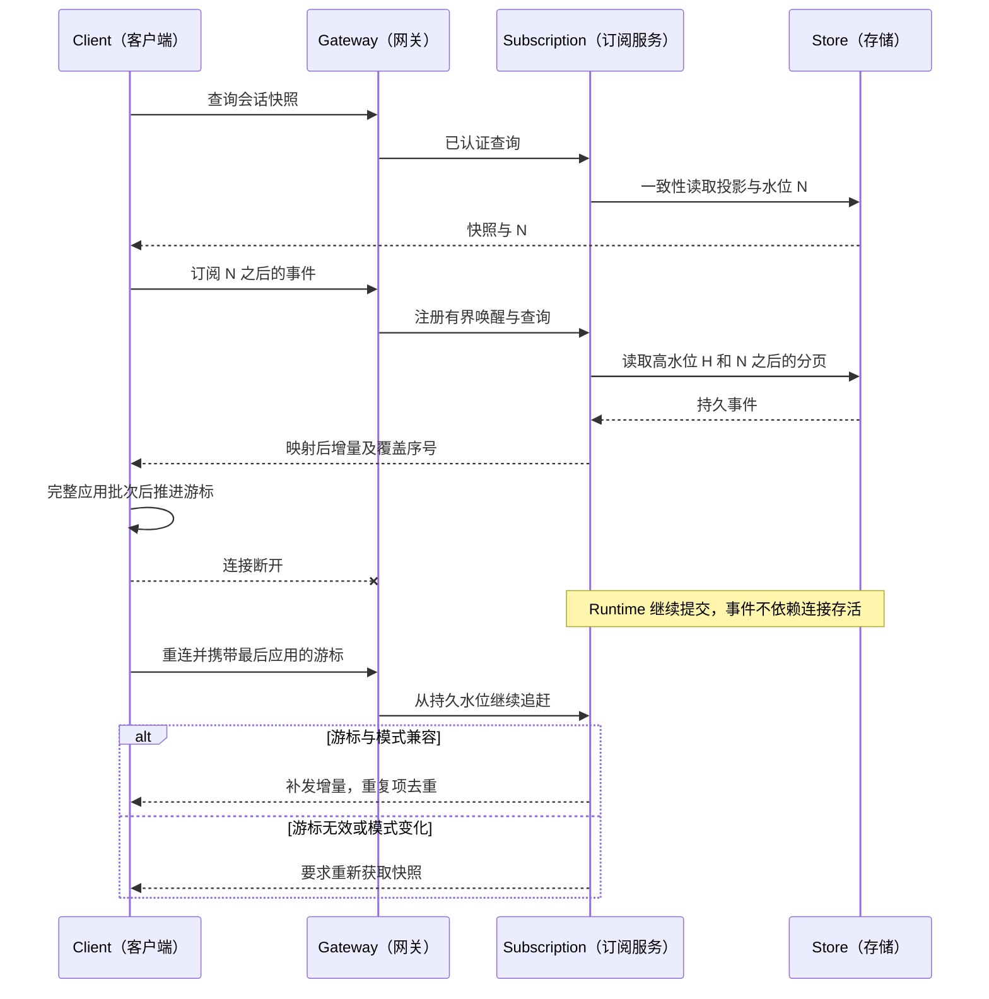

解释：快照与订阅之间产生的新事件由存储补发；仅在订阅内存事件后开始监听会漏掉这个窗口。客户端保存的是“已应用”游标，不是“已经收到但尚未应用”游标。

### 14.5 单个客户端切换用户

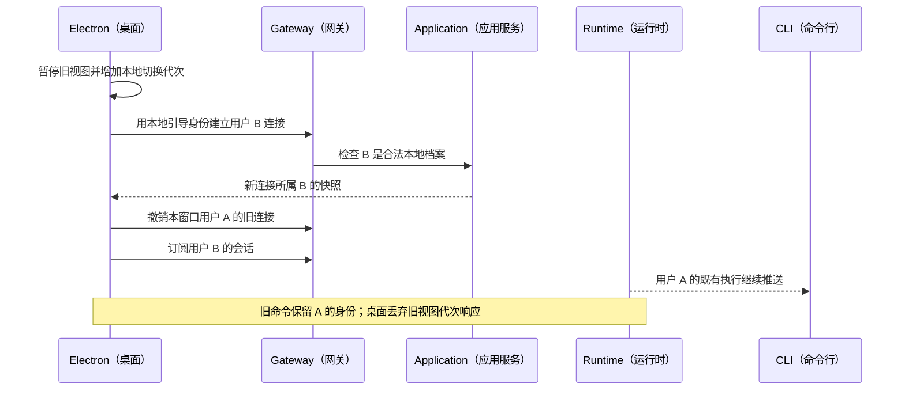

解释：服务不存在一个所有客户端共同修改的“当前用户”。用户选择属于连接；界面切换代次只防展示竞态，不撤回已持久接纳的请求。

### 14.6 工作线程异常与未知副作用

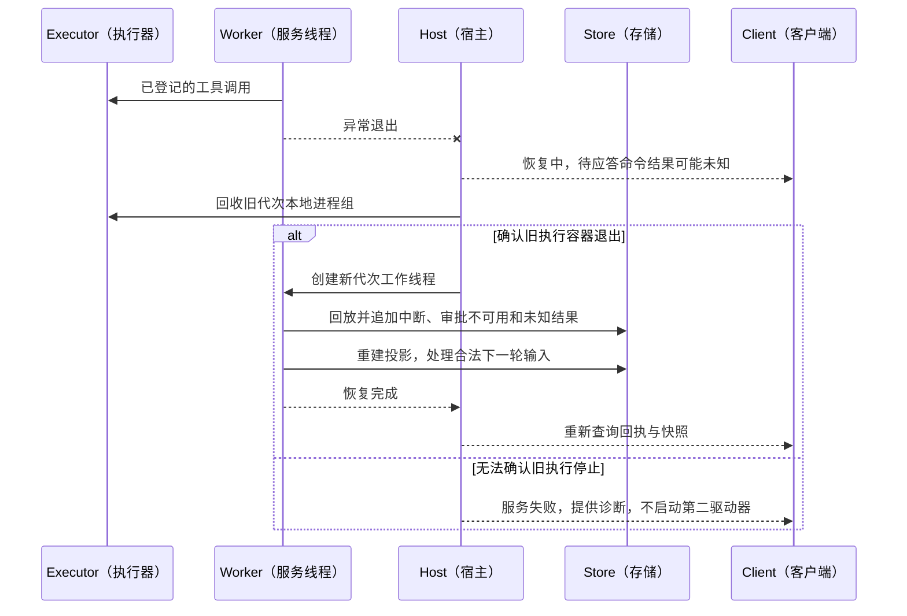

解释：本地进程退出不能证明远程请求没有生效。对于已发出但没有结果的 MCP 写入、网络发送等，恢复只能记录未知状态，不能自动重放以“补结果”。

### 14.7 技能导入与平台能力分离

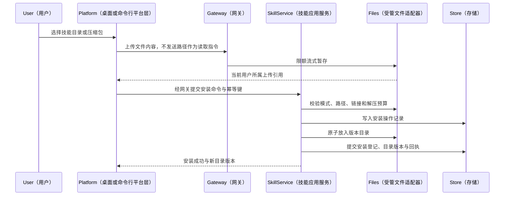

解释：未来 Web 和手机只需替换文件获取方式，服务端安装流程无需重写。任一步骤失败按安装日志补偿或对账，未完成登记的文件不能进入可用技能目录。

### 14.8 服务关闭与客户端关闭

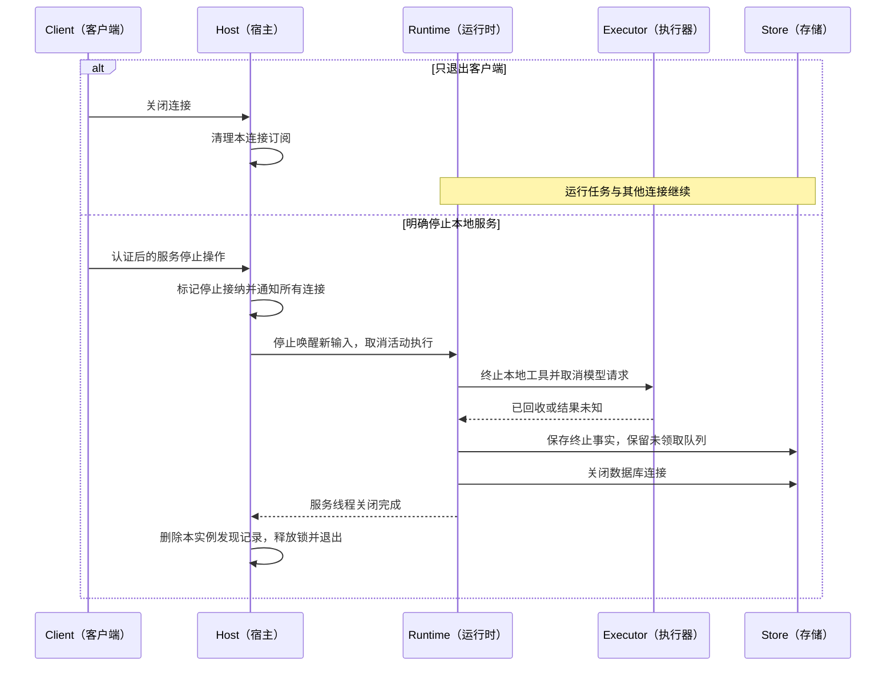

解释：关闭有明确宽限期，设计初值为 15 秒；超时必须记录诊断并进入异常关闭，下一次启动按恢复规则处理。客户端不得把收到“正在关闭”通知当成所有工具已停止的证明。

## 15. npm 与桌面交付设计

### 15.1 发布物

拟用包名 `@agent-harness/server`（Agent 服务包）；命名空间是否可用在正式发布时确认。

```text
服务 npm 包
  bin/agent-harness.cjs             # 命令入口
  dist/host/serve.cjs               # 独立服务入口
  dist/host/service-worker.cjs      # 服务线程入口
  dist/cli/                        # 命令行实现
  resources/                       # 模型目录、提示词、默认技能与默认 MCP
  package.json                     # 服务专属生产依赖清单
  LICENSE / THIRD_PARTY_NOTICES     # 许可证与第三方声明
```

服务包不包含 Electron、React、Vite、桌面图标、参考界面或用户数据。CLI 与服务首版同包；SDK 先在仓库内共享和独立构建，不强制本阶段公开发布第三个包。

`npm install -g @agent-harness/server`（全局安装）与 `npx @agent-harness/server serve`（下载后前台启动）是目标使用方式，本阶段文档不表示包已经发布。

### 15.2 Node 版本与原生模块

以仓库 Runtime Pack（工具运行环境包）已采用的 Node 24 系列作为首版服务主版本基线；正式补丁版本由现有资源锁定清单与安装测试共同决定。服务包的 `engines`（运行版本要求）限制为经过验证的范围，不宽泛声明所有更高版本都兼容。

SQLite 原生驱动必须针对服务使用的 Node ABI（应用二进制接口）构建。Electron 主进程不再加载此模块，因此服务与测试不应继续反复切换同一份模块到 Electron ABI。桌面打包复制独立服务依赖目录，不能使用桌面默认原生重建流程覆盖它。

如果现有驱动版本不能在所选 Node 版本和架构安装/加载，实施包必须升级并锁定兼容版本，完成迁移回归后再冻结发布；不能仅凭 TypeScript 编译通过宣称开箱即用。

### 15.3 运行依赖与默认能力

| 资源                    | npm 安装                               | Electron 安装      |
| ----------------------- | -------------------------------------- | ------------------ |
| 服务 Node.js            | 用户已安装的受支持版本                 | 随包独立 Node.js   |
| 默认 Memory MCP         | 服务资源中固定打包，运行时无需在线下载 | 同一服务资源       |
| 模型调用                | 需要配置模型与凭据                     | 同左               |
| Python（Python 解释器） | 按需使用已配置的系统解释器；缺少时提示 | 使用已有随包解释器 |
| Git / 浏览器等工具      | 环境检测后使用，不承诺自动安装         | 沿用已配置环境     |

“开箱即用”要求安装后可启动、配置、管理会话并在配置模型后完成基础任务；不表示自动拥有所有第三方工具。后台运行的默认 MCP 不能依赖临时 npm 缓存路径。

### 15.4 构建链路

保留 esbuild（服务代码打包器）和 Vite（界面构建器）。新增 `build:server`（构建服务）、`build:cli`（构建命令行）、`pack:server`（生成服务安装包）和 `check:architecture`（架构检查）入口；名称是设计目标，实施后才加入真实脚本。

打包脚本从根依赖锁定信息生成独立服务清单，审核 `files`（文件白名单）和 `bin`（命令入口），使用 `npm pack --dry-run`（检查打包清单）与干净目录实际安装包验证。仅源码运行成功不能替代安装包验证。

## 16. 实施工作包与切换顺序

| 顺序 | 工作包               | 具体改动                                                 | 完成证据                                  |
| ---- | -------------------- | -------------------------------------------------------- | ----------------------------------------- |
| P0   | 基线冻结与协议盘点   | 记录命令、事件、数据库、资源路径；核对 4.6.0 实际状态    | 当前桌面和核心关键场景可重复执行          |
| P1   | 领域、端口与公开协议 | 提取纯领域类型、存储/模型/执行端口、方法目录；兼容导出   | 核心无 Electron/数据库类/公开 UI 协议依赖 |
| P2   | 应用服务与运行宿主   | 拆组合根、管理服务、独立 Node 入口与监护                 | 关闭 Electron 后服务仍可启动并恢复数据    |
| P3   | 网关、身份和订阅     | HTTP/SSE、连接档案、回执、追赶、背压                     | 两个合成客户端并发操作同实例且不串用户    |
| P4   | SDK 与 CLI           | 发现、启动、握手、命令、交互、输出、退出码               | 独立安装后通过 CLI 完成模型配置与工具任务 |
| P5   | Electron 接入        | Main 改用 SDK，分离平台能力，移除主进程内 Runtime 所有权 | CLI 发起、桌面观察/审批；桌面退出任务继续 |
| P6   | 数据与发布迁移       | 旧目录接管、受管版本、Node 原生驱动、默认资源、回退      | 干净 npm 安装和桌面升级均通过             |
| P7   | 全链路验收与清理     | 删除旧业务分派和全局用户路径，更新发布门禁               | 无双运行后端，无客户端直接读库路径        |

每个工作包形成可审查的代码和测试。过渡期间允许单个开发实例选择旧后端或新后端，但不能同时针对一个数据目录运行；4.7.0 交付时删除生产环境旧后端开关。

核心内部拆分可在 P1/P2 分批进行，不能把所有模块移动与行为修改混成一个提交。4.6.0 并行修改涉及的模型响应类型和投影，在对应提交合入后统一对齐；不复制或覆盖另一阶段未提交的修改。

## 17. 测试设计与退出门禁

### 17.1 必须覆盖的行为

| 用例编号 | 场景           | 可观察的通过标准                                                  |
| -------- | -------------- | ----------------------------------------------------------------- |
| R47-01   | 独立安装与启动 | 干净环境安装服务包，不存在 Electron 也能启动并查询就绪            |
| R47-02   | 同时启动       | CLI 与桌面竞争启动同目录，只有一个服务与写库工作线程              |
| R47-03   | 多端同会话     | 一端提交，另一端按序看到消息、工具、用量和终止事实                |
| R47-04   | 用户隔离       | A/B 分别连接，快照、事件、审批、配置、上传和错误均不串用          |
| R47-05   | 局部用户切换   | 桌面切用户不改变 CLI 身份，旧请求仍保留接纳作用域                 |
| R47-06   | 断线继续       | 桌面退出或事件连接中断，原任务继续；重连状态等于存储投影          |
| R47-07   | 快照竞争窗口   | 在返回快照和订阅之间写事件，仍连续补齐，无永久丢失                |
| R47-08   | 提交后通知丢失 | 人为丢弃工作线程事件通知，周期追赶仍补齐                          |
| R47-09   | 回执丢失       | 提交已落库但响应断开，原键重试只产生一次输入接纳                  |
| R47-10   | 同键异参       | 重复键携带不同参数，明确冲突且无新副作用                          |
| R47-11   | 两端审批       | 同一待处理请求并发批准/拒绝，只有一个决议生效                     |
| R47-12   | 非交互审批     | CLI 返回等待用户状态和退出码 3，工具未执行                        |
| R47-13   | 精确取消       | 旧轮次的取消不能中断后来启动的新轮次                              |
| R47-14   | 工作线程崩溃   | 旧进程组先回收，审批不可用、轮次中断、未知工具不重放              |
| R47-15   | 整个服务崩溃   | 重启前确认独占和旧进程；保留事件序号与原输入去重                  |
| R47-16   | 慢客户端       | 缓冲达到上限主动断开，其他客户端和 Runtime 继续运行               |
| R47-17   | 版本不兼容     | 握手拒绝；不另启第二服务、不自动迁移降级数据库                    |
| R47-18   | 上传安全       | 越权引用、路径穿越、越界链接、解压炸弹与半安装都被处理            |
| R47-19   | 服务关闭       | 停止接纳、工具回收、事实提交、队列保留、锁释放可证明              |
| R47-20   | 原生驱动交付   | 桌面和 npm 中的驱动均由实际服务 Node 加载成功                     |
| R47-21   | 升级/回退      | 旧数据、附件、Skill、默认记忆及 Keychain 引用完整，失败不切换目录 |
| R47-22   | 本地入口安全   | 无令牌、伪造来源/主机、旧连接令牌、渲染进程索要令牌均失败         |
| R47-23   | 长事件传输     | 超大结果可分块/详情查询，公开流不无界缓冲，原始事实不被裁剪       |
| R47-24   | 安装副作用恢复 | 文件已落盘但登记未提交时按安装日志对账，不重复覆盖                |

### 17.2 测试层次

- 单元测试：作用域、兼容协商、去重摘要、状态转移、游标映射、错误分类。
- 集成测试：真实本地 HTTP/SSE、真实临时 SQLite、脚本模型、受控工具与 MCP 测试服务。
- 故障注入：提交后断连、通知丢失、审批竞争、线程崩溃、旧进程未退出、锁持有但服务不可达。
- 客户端端到端：真实 CLI 子进程和 Electron 同时连接；不能只用两个内存 Mock（模拟对象）替代。
- 安装包测试：从生成的压缩包全新安装，验证资源清单、原生驱动、默认 MCP 和卸载保留数据。

保留现有单 Agent、Queue/Steer、权限、上下文、MCP 和恢复回归。新测试验证跨组件行为，不为静态目录、固定常量或简单转发包装编写镜像测试。

### 17.3 阶段退出标准

必须同时满足：独立服务可交付、两端可同时操作、客户端关闭不终止任务、按连接用户隔离、事件与命令可恢复、审批无双执行、安装包实际可用、现有桌面功能无退化。

Web、手机、远程执行、组织账号、系统常驻更新器不属于本阶段完成条件。不能把“接口预留”列为这些客户端已支持的证据。

## 18. 后续扩展路线

| 后续能力                | 需要增加的模块                                              | 可复用部分                                     |
| ----------------------- | ----------------------------------------------------------- | ---------------------------------------------- |
| Web（浏览器）           | 浏览器认证、来源/跨站请求防护、静态页面服务、浏览器平台能力 | 应用服务、核心、协议、SDK 核心、上传           |
| 手机应用                | 设备配对、远程安全连接、后台断线/推送、移动文件选择         | 会话协议、审批、持久查询、事件追赶             |
| WebSocket（双向长连接） | 新传输适配器、连接流控与协议一致性测试                      | 方法目录、可信上下文、命令回执、公开事件       |
| 远程执行                | 环境注册、身份认证、文件/进程远程协议、执行保留与恢复       | 执行环境端口、核心权限与调用身份               |
| 多人服务                | 主体认证、资源授权、凭据与执行环境隔离、配额                | 请求上下文结构；不能直接复用本地双档案信任假设 |
| SDK 独立分发            | 独立发布清单、兼容矩阵和文档                                | 已分离的客户端核心与协议                       |

后续远程服务必须明确：客户端、Runtime 与执行环境可能位于不同设备；文件选择、模型凭据和 Shell 执行分别归属不同主体。不得通过简单放开监听地址把本地服务宣称为安全多用户平台。

## 19. 技术决策记录

| 决策         | 采用方案                                | 原因与代价                                     |
| ------------ | --------------------------------------- | ---------------------------------------------- |
| 实现语言     | TypeScript + Node.js                    | 复用现有核心与生态；不借架构迁移重写语言       |
| 交付单位     | 一个服务 npm 包含 CLI；桌面复用服务产物 | 用户安装简单；发布脚本需严格区分依赖           |
| 源码组织     | 单源码包、多构建入口                    | 保持当前开发方式，边界由检查器保障             |
| 服务进程     | 独立 Node 进程，内部一个服务工作线程    | 网络不被同步 SQLite 直接阻塞；不是故障完全隔离 |
| 首版传输     | 本机 HTTP + SSE，桌面内部 IPC           | CLI/Electron 共用协议；浏览器安全入口后续增加  |
| 本地身份     | 操作系统账号授权 + 按连接选择双用户档案 | 保留产品语义，消除全局用户竞态                 |
| 任务生命周期 | 服务拥有任务，客户端只拥有连接          | 支持多端交接；用户需看见后台服务状态           |
| 执行环境     | 端口独立、首版仅本地                    | 为远程预留真实边界，不提前开发远程平台         |
| 持久化       | 现有 SQLite + 明确业务存储端口          | 保留事件与迁移；接口必须保留事务和租约语义     |
| 崩溃恢复     | 中断修复、不重放未知副作用              | 与当前实现一致，不承诺恢复内存等待对象         |

## 20. 术语与依据

### 20.1 术语表

| 英文                              | 中文解释                                                  |
| --------------------------------- | --------------------------------------------------------- |
| Agent / Runtime / Harness         | 智能体 / 核心执行运行时 / 承载执行、工具与恢复的完整系统  |
| Host / Composition Root           | 运行宿主 / 集中创建并注入依赖的组合根                     |
| Gateway / Application             | 连接与协议网关 / 产品业务用例层                           |
| Port / Adapter                    | 使用方定义的能力接口 / 具体技术实现                       |
| Session / Turn / Step             | 持久会话 / 一次完整执行轮次 / 一次模型请求与其工具调用    |
| Driver / Scheduler                | 会话执行驱动器 / 调度器                                   |
| Inbox / Queue / Steer             | 持久收件箱 / 下一轮排队 / 下一步补充                      |
| Event Log / Projection / Snapshot | 仅追加事件日志 / 可重建投影 / 某一水位的状态快照          |
| Cursor / Sequence / Revision      | 消费水位 / 递增序号 / 实体或配置版本                      |
| Idempotency / Receipt             | 重复提交不重复改变状态 / 持久命令回执                     |
| Backpressure / Replay             | 消费不足时限制生产与缓冲 / 从持久记录重放                 |
| Approval / Interaction            | 系统执行审批 / 普通用户交互                               |
| DTO / Schema / SDK                | 数据传输对象 / 结构与校验规则 / 客户端开发工具包          |
| HTTP / SSE / IPC / RPC            | 超文本传输协议 / 服务端事件流 / 进程间通信 / 远程过程调用 |
| MCP / Provider / Credential       | 模型上下文协议 / 模型供应商 / 密钥等凭据                  |
| Worker / Daemon / Process         | 工作线程 / 后台常驻服务 / 操作系统进程                    |
| ABI / npm / JSONL                 | 应用二进制接口 / Node 包管理分发系统 / 每行一条 JSON 数据 |
| CORS / Origin / Host              | 跨来源共享规则 / 请求来源 / 请求目标主机                  |
| Ready / Drain / Recovery          | 已就绪 / 停止接纳并收尾 / 故障恢复                        |

### 20.2 源码依据

- 本项目：[主进程启动](../../src/main/index.ts)、[工作线程监护](../../src/main/worker-supervisor.ts)、[应用组装](../../src/worker/application.ts)、[核心执行](../../src/runtime/runtime-service.ts)、[当前协议](../../src/shared/contracts/ipc.ts)、[数据库连接](../../src/infrastructure/sqlite/connection.ts)。
- 本地 Codex 参考目录：`/Users/codedan/local/project/codex-main`。检查了 `codex-rs/app-server/README.md`（应用服务器协议）、`app-server-client/README.md`（共享客户端）、`app-server-daemon/README.md`（常驻生命周期）、`core/src/thread_manager.rs`（会话管理）、`thread-store/src/store.rs`（存储接口）、`exec-server/README.md`（执行环境服务）。该目录没有可读取的 Git 元数据，本方案不虚构参考提交号。
- Node 官方 [工作线程说明](https://nodejs.org/api/worker_threads.html)：用于确认工作线程与进程不同；本方案保留线程是隔离同步存储和复用执行容器，不是声称线程可加速模型网络请求。
- Node 官方 [HTTP 接口](https://nodejs.org/api/http.html)：作为内置网关与流式响应技术依据；项目仍锁定自己的服务 Node 主版本，不随文档默认版本自动升级。
- npm 官方 [包清单说明](https://docs.npmjs.com/cli/v11/configuring-npm/package-json/)：命令入口、文件白名单、运行版本要求与生产依赖分发依据。

以上源码定位描述当前实现；新增模块、端点、限制和迁移步骤属于 4.7.0 设计决策，须在实施与测试完成后更新状态。
