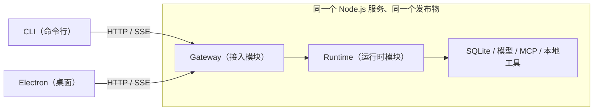
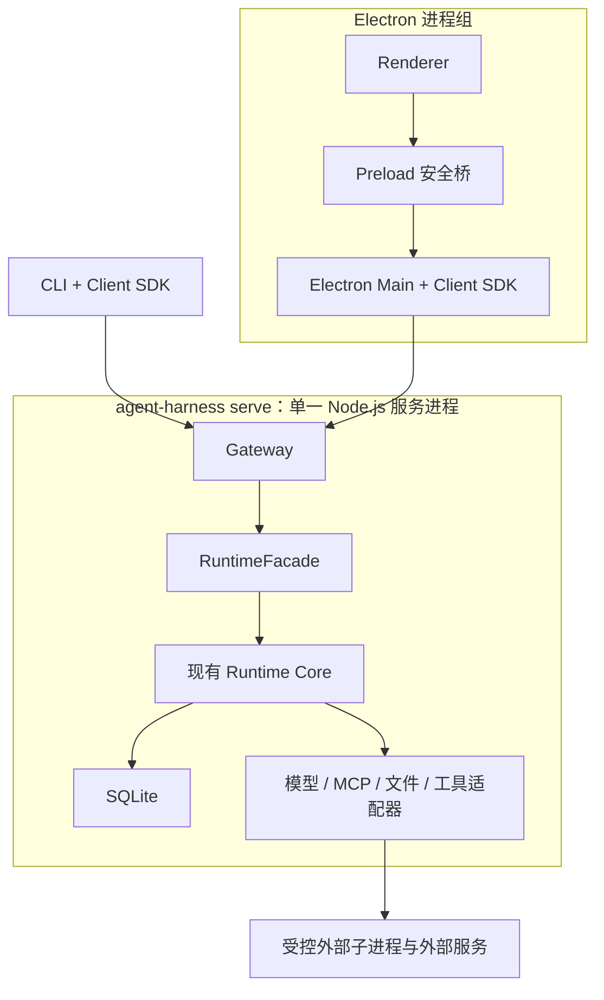
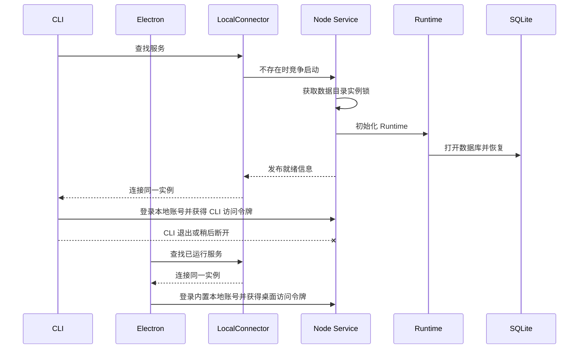
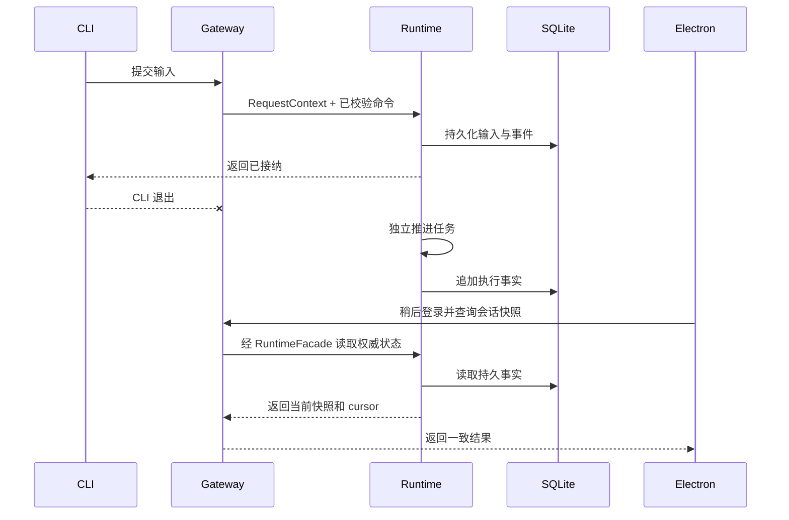
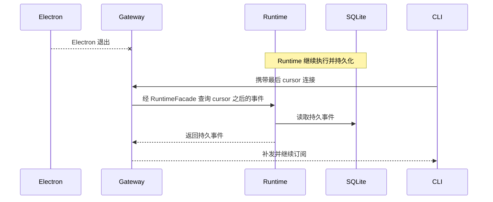

# 阶段 4.7.0：Runtime 独立化与 CLI/Electron 双端接入

- 状态：待实施设计稿；本文确定 4.7.0 的最小交付边界，不代表功能已经完成。
- 日期：2026-09-06。
- 项目基线：当前工作区源码。
- 核心决策：Gateway 与 Runtime 代码分层，但运行、打包和发布仍是一个整体。
- 首批客户端：CLI（命令行）与 Electron（桌面）。
- 后续客户端：Web（浏览器）与手机应用，本阶段不实现、不验收。
- 上位方案：[完整技术解决方案](../Agent%20Client完整技术解决方案.md)、[单 Agent 低上下文 Runtime 设计](../单Agent低上下文Runtime打造设计.md)。
- 相关方案：[4.5.5 权限与沙箱](阶段4.5.5-权限系统与执行沙箱开发架构设计.md)、[4.6.0 思考模式重构](阶段4.6.0-思考模式重构设计方案.md)、[阶段 5 发布工程](阶段5-发布工程与交付开发架构设计.md)。
- 配套测试：[4.7.0 Runtime 独立化测试用例](阶段4.7.0-Runtime独立化测试用例.md)。

## 1. 阶段目标

### 1.1 一句话目标

把当前依附于 Electron 生命周期的 Runtime 提取为可独立启动的本地 Node.js 服务，使 CLI 与 Electron 都能连接、操作和观察同一个 Runtime。



本阶段的成功标准是 Runtime 所有权迁移和双端接入成功，不是一次性建成通用 Agent 平台。

### 1.2 已确定的架构决策

| 决策         | 4.7.0 采用方案                                                        |
| ------------ | --------------------------------------------------------------------- |
| 架构形态     | 模块化单体服务                                                        |
| 运行单元     | 默认一个 Node.js 进程                                                 |
| 代码边界     | Gateway 与 Runtime 分层，通过 TypeScript 接口直接调用                 |
| 内部通信     | 不引入内部 HTTP、RPC、服务发现或消息总线                              |
| 交付单位     | 一个 npm 包、一个服务入口、一个版本                                   |
| 数据所有权   | 服务是 SQLite 和 Runtime 任务的唯一所有者                             |
| 客户端       | CLI 与 Electron 共用同一协议和轻量客户端                              |
| 网络范围     | 仅本机回环地址，不开放远程访问                                        |
| 用户认证     | Gateway 提供本地注册与登录；预置两个账号；登录会话绑定用户数据域      |
| Runtime 语义 | 保持现有单 Agent、Inbox、Queue、Steer、Cancel、权限、上下文和恢复语义 |

代码分层不等于部署拆分。4.7.0 不把 Gateway、Runtime、存储或执行环境做成微服务。

### 1.3 必须交付

1. 不安装或不启动 Electron，也能启动服务并通过 CLI 运行 Agent。
2. CLI 与 Electron 分别使用时连接同一个服务实例和同一个数据库；允许偶然连接重叠，但不建设实时协同体验。
3. 一端提交输入或审批后退出，另一端稍后进入时能通过权威快照和持久事件看到一致结果。
4. 关闭客户端只断开连接，不终止已经接纳的 Runtime 任务。
5. Gateway 提供本地注册、登录、当前用户和退出接口，并预置两个可直接登录的账号。
6. CLI 与 Electron 均提供账号文本输入的注册和登录交互，登录后的用户身份绑定到客户端连接。
7. 取消服务级全局活动用户，客户端不能在普通业务请求中自行声明 userId。
8. 同一数据目录只有一个服务实例能够写入数据库。
9. 客户端断线重连后可以从现有持久事件序号继续追赶。
10. Electron 不再直接创建 Runtime 或打开业务数据库。
11. 服务与 CLI 可以作为同一个 Node.js 包构建并完成干净安装冒烟验证。

### 1.4 本阶段不做

- 不拆分 Gateway 与 Runtime 为独立进程或微服务。
- 注册与登录只面向本机应用账号；不建设云账号、组织账号、第三方登录、找回密码或远程身份平台。
- 不建设远程 Runtime、远程执行或云端多租户。
- 不实现 Web 和手机客户端；只避免把 Electron 类型泄漏到公开契约。
- 不建立通用 RPC 平台、消息总线或多服务编排器。
- 不因为独立化而重写 Runtime 主循环、提示词、模型结束规则或事件模型。
- 不强制一次性建立完整 Domain / Ports / Application / Infrastructure 目录体系。
- 不实现多版本后台服务管理、自动更新、签名、公证、完整升级和回退；这些属于阶段 5。
- 不扩充成完整终端产品；CLI 只覆盖独立运行和双端协作所需能力。
- 不建设多端 Presence、共享草稿、主客户端租约、操作来源展示或实时协同冲突界面。
- 不以未来可能需要为理由预先实现 Worker、daemon、exec-server 或浏览器 SDK。

## 2. 当前基线与迁移原则

### 2.1 当前调用链


当前已经存在 Runtime Worker、业务分派、公开类型和事件订阅，但启动、活动用户、订阅出口和任务生命周期仍依附于 Electron。

### 2.2 最短迁移路径

4.7.0 优先移动 Runtime 的所有权，不同时重写 Runtime 内部：

1. 以现有 WorkerApplication / Dispatcher 为基础形成 RuntimeFacade（运行时门面）。
2. 将 RequestContext（请求上下文）显式传入门面，消除全局 activeUserId。
3. 在门面外增加本机 Gateway，把 HTTP/SSE 映射到现有命令、查询和事件能力。
4. 提供共用 Client SDK，CLI 和 Electron Main 均通过它接入。
5. Electron 切换完成后删除旧的桌面内 Runtime 所有权路径。
6. RuntimeService 内部拆分另行渐进实施，不作为独立化的前置条件。

迁移期间允许用兼容适配器复用现有契约；不允许同一数据目录同时运行旧后端和新服务。

### 2.3 对 Codex 源码设计的参考

本方案继续参考本地 Codex 源码的职责划分，但只吸收与当前阶段目标直接相关的部分。

| Codex 参考                  | 本项目采用                                   | 本阶段不复制                        |
| --------------------------- | -------------------------------------------- | ----------------------------------- |
| app-server                  | 将稳定业务语义放在客户端之外，由服务统一拥有 | 完整通用 RPC 平台和全部协议能力     |
| app-server-client           | CLI 与桌面共用客户端实现                     | 为所有平台提前发布独立 SDK 产品     |
| ThreadManager / ThreadStore | 明确会话运行所有权和存储边界                 | 借独立化重写现有 Runtime            |
| app-server-daemon           | 参考服务启动、发现和关闭问题                 | 多版本 daemon、常驻更新器和复杂监督 |
| exec-server                 | 参考执行环境应有清晰能力边界                 | 独立执行微服务和远程执行协议        |

采用 Codex 的设计原则，不等于复制 Codex 的语言、目录、进程拓扑或发布体系。Codex 用于帮助确认职责边界；本项目的产品范围、现有实现和阶段目标决定最终形态。

## 3. 目标架构

### 3.1 进程架构



首版不在服务内部再创建 Service Worker。独立 Node.js 进程已经把 Runtime 与 Electron UI 隔离；短 SQLite 事务、上下文计算或事件发送是否需要额外 Worker，必须由测量结果决定。

如果后续压测证明单进程会持续阻塞健康检查、取消或 SSE，再在不改变公开协议的前提下将 RuntimeFacade 的实现移动到 Worker 或独立进程。这个优化不是 4.7.0 的完成条件。

### 3.2 代码模块

建议只建立完成迁移所需的模块，不先生成大量空目录：

```text
src/
  server/
    serve.ts                 # 单一服务入口
    gateway.ts               # HTTP/SSE、认证、连接和边界校验
    lifecycle.ts             # 启动、就绪、关闭和实例锁
  runtime/
    runtime-facade.ts        # Gateway 调用的稳定业务门面
    ...                      # 保留并渐进整理现有 Runtime
  client/
    agent-client.ts          # CLI/Electron 共用客户端
    local-connector.ts       # 本机发现、认证和连接
  cli/
    index.ts                 # 最小 CLI
  main/
    ...                      # Electron 窗口与平台能力
  infrastructure/
    ...                      # 延续现有数据库、模型、MCP、文件和进程实现
```

目录名称可在实施中结合现有构建结构调整；职责边界比目录命名更重要。

### 3.3 依赖方向

```text
CLI / Electron Main
        ↓
Client SDK
        ↓ HTTP/SSE
Gateway
        ↓ 直接 TypeScript 调用
RuntimeFacade
        ↓
Runtime Core
        ↓
现有基础设施适配器
```

约束：

- Gateway 不直接访问 SQLite、模型、MCP 或工具执行器。
- Runtime 不依赖 Electron、HTTP 路由或 CLI 参数。
- Renderer 不获得服务引导令牌，不直接访问 Runtime 或数据库。
- Client SDK 不包含业务状态机，不把客户端内存状态当作运行事实。

## 4. 组件职责

| 组件           | 必须负责                                                             | 明确不负责                             |
| -------------- | -------------------------------------------------------------------- | -------------------------------------- |
| Service Host   | 配置、监听、实例锁、就绪、优雅关闭                                   | 会话业务决策、Worker 热重启平台        |
| Gateway        | 本地注册/登录、认证会话、连接上下文、Schema 校验、HTTP/SSE、基本流控 | 模型循环、直接写业务数据、工具权限决策 |
| RuntimeFacade  | 统一命令、查询、订阅入口；资源归属校验；调用现有 Runtime             | 网络协议、Electron 窗口、CLI 输出      |
| Runtime Core   | 会话驱动、Turn/Step、上下文、工具、审批、取消、恢复                  | HTTP、客户端生命周期                   |
| Infrastructure | SQLite、模型、凭据、MCP、文件和进程的具体实现                        | 自行改变 Runtime 状态机                |
| Client SDK     | 注册、登录、连接、请求、事件流、重连                                 | 直接读库、自动批准、服务端业务缓存     |
| CLI / Electron | 输入、展示和本地平台交互                                             | 持有 Runtime 任务、成为事实源          |

RuntimeFacade 可以先由现有 WorkerApplication 和 Dispatcher 演进而来。4.7.0 不要求把每个管理能力拆成单独 Service 类。

## 5. 本机协议与多端一致性

### 5.1 最小端点

| 端点                                   | 用途                           |
| -------------------------------------- | ------------------------------ |
| GET /healthz                           | 查询服务是否存活及最小版本信息 |
| POST /v1/auth/register                 | 输入账号和密码创建本地用户     |
| POST /v1/auth/login                    | 校验本地凭据并建立登录会话     |
| GET /v1/auth/me                        | 查询当前登录用户和会话信息     |
| POST /v1/auth/logout                   | 撤销当前登录会话，不取消任务   |
| POST /v1/commands                      | 提交现有状态变更命令           |
| POST /v1/queries                       | 执行现有查询                   |
| GET /v1/sessions/:id/events?afterSeq=N | 追赶并持续订阅会话事件         |

是否增加独立上传、产物下载或生命周期事件端点，由当前 CLI/Electron 必需用例决定；不为未来 Web 提前建设完整文件传输平台。

### 5.2 注册、预置账号与登录

注册和登录是本机应用账号能力，不是云账号系统。服务初始预置以下两个账号：

| 登录名   | 对应稳定数据域 | 默认密码 |
| -------- | -------------- | -------- |
| `user_a` | `user-a`       | `123456` |
| `user_b` | `user-b`       | `123456` |

```ts
interface RegisterRequest {
  loginName: string;
  password: string;
}

interface LoginRequest {
  loginName: string;
  password: string;
  clientKind: 'cli' | 'electron';
}

interface AuthResult {
  accessToken: string;
  expiresAt: string;
  user: {
    id: LocalUserId;
    loginName: string;
    displayName: string;
  };
}
```

- 服务启动时幂等检查两个内置账号；缺失或与固定凭据不一致时，重建对应的登录凭据，但保留稳定 userId 和全部用户数据。
- 注册时直接输入账号名和密码，不再选择或暴露“本地用户档案”；成功后创建新的稳定 userId、完整用户数据域和登录会话。
- login 接收登录名和密码，成功后返回不透明的短期访问令牌以及脱敏用户信息。
- logout 只撤销当前访问令牌，不取消该用户已经提交的 Runtime 任务。
- 4.7.0 不提供第三方登录、邮件/短信验证、远程找回密码或跨设备刷新令牌。
- 密码只保存带独立随机盐的抗暴力破解摘要，不保存明文或可逆密文；比较时避免通过明显时序差异泄露结果。
- 登录失败统一返回认证失败，不区分“用户不存在”和“密码错误”；Gateway 对登录实施简单的有界速率限制。

登录会话可以先保存在服务内存中；服务重启后客户端重新登录。若用户选择“记住登录”，访问令牌只由 CLI 的受限本地存储或 Electron Main 的系统凭据存储保存，Renderer 不接触令牌。

### 5.3 连接身份

Gateway 在登录成功后创建可信请求上下文：

```ts
interface RequestContext {
  requestId: string;
  connectionId: string;
  authSessionId: string;
  userId: LocalUserId;
  clientKind: 'cli' | 'electron';
}
```

- 服务不存在全局 activeUserId。
- userId 来自 Gateway 已验证的登录会话，普通命令参数中的 userId 不作为授权依据。
- Electron 切换用户等同于退出当前登录会话并登录另一个本地账号，不影响 CLI 或其他窗口。
- 已经接纳的命令保留接纳时的 userId。
- 会话、事件、审批、配置和附件的读写都按请求上下文校验归属。

全部本地用户仍是同一操作系统账号下的应用档案，不声称是强多租户安全边界。

### 5.4 本机访问安全

- 服务只监听 127.0.0.1，不提供 0.0.0.0 开关。
- 本机引导凭据只用于服务停止等受限生命周期操作，普通业务访问使用登录令牌。
- 令牌不进入 URL、日志、Renderer 或普通 CLI 参数。
- 业务请求必须认证；仅监听回环地址不能替代认证。
- 拒绝不符合本机策略的浏览器 Origin，请求不默认开放 CORS。

具体引导凭据权限、密码摘要格式和发现文件格式在实现时形成小型契约测试，不扩展为远程身份平台。

### 5.5 命令结果与幂等

复用现有输入幂等和版本检查。只对重复执行会造成明显业务或外部副作用的关键命令补充持久回执：

- 输入提交。
- 审批决议。
- 明确取消。
- 安装或其他不可安全重复的管理操作（仅在本阶段实际开放时）。

普通查询可以安全重试。简单配置命令沿用实体 revision / version 冲突控制，不要求 4.7.0 为所有状态变更建设永久命令回执平台。

### 5.6 事件与重连

继续以现有 Session Event Log 为运行事实源：

1. 客户端读取快照和对应 cursor。
2. 订阅 cursor 之后的持久事件。
3. 断线重连时携带最后已经应用的序号。
4. 服务从存储补发遗漏事件，再继续实时推送。
5. 允许重复投递，由事件标识和序号去重；不承诺网络恰好一次。

内存通知只用于降低延迟，不能成为唯一事实源。SSE 输出必须有基本缓冲上限；慢客户端断开后可重新读取快照，不影响 Runtime 执行。

## 6. 生命周期与故障边界

### 6.1 服务生命周期

最小状态为 starting → ready → draining → stopped；启动或运行失败进入 failed。

- ready 表示数据库、Runtime 和 Gateway 已可接受业务请求。
- 客户端退出只关闭自身连接。
- 明确停止服务时停止接纳新命令、取消活动执行、关闭数据库并释放实例锁。
- 服务异常退出后，下一次启动沿用现有 Runtime 恢复和未知副作用规则。

### 6.2 单实例

- 数据目录决定服务实例，同一规范化目录只允许一个写入服务。
- CLI 与 Electron 均执行“发现已有服务；不存在才启动”的流程。
- 实例锁用于防止正常并发启动，不被描述成恶意同账号进程的安全沙箱。
- 发现异常锁时返回明确诊断；4.7.0 不建设复杂 daemon 选主或分布式租约。

### 6.3 工具子进程

继续执行 4.5.5 已定义的工作区、权限、进程组、取消、超时和未知副作用规则。本阶段只把这些能力的父级所有者从 Electron Worker 迁移到独立服务。

4.7.0 不新增 ProcessGuard、跨进程看护器或远程执行协议。若现有进程回收在独立服务退出场景存在明确缺陷，先修复直接缺陷并增加回归测试；更强的崩溃看护作为后续可靠性增强单独设计。

## 7. Client SDK、CLI 与 Electron

### 7.1 共用客户端

Client SDK 保持轻量，只负责：

- 本机服务发现和连接。
- 注册、登录、查询当前用户和退出。
- 安全保存或清除客户端自己的登录状态，不向业务参数注入可伪造的 userId。
- 请求/响应 Schema 校验。
- 命令、查询和 SSE 订阅。
- 有界重连和从 cursor 继续。
- 将连接错误、协议错误和 Runtime 错误明确区分。

首版直接实现本机 HTTP/SSE，不为了 Web 或其他传输提前建立插件系统。

### 7.2 最小 CLI

| 命令                                | 目的                                 |
| ----------------------------------- | ------------------------------------ |
| agent-harness serve                 | 前台启动服务                         |
| agent-harness server status/stop    | 查询或明确停止本机服务               |
| agent-harness register              | 输入账号和密码创建本地账号           |
| agent-harness login                 | 登录并保存当前 CLI 登录状态          |
| agent-harness logout / whoami       | 退出登录或查看当前登录用户           |
| agent-harness setup                 | 完成独立运行所需的最小模型与凭据配置 |
| agent-harness chat                  | 交互式提交和跟随一个会话             |
| agent-harness run                   | 提交一次任务并跟随结果               |
| agent-harness session list/show     | 查询已有会话和快照                   |
| agent-harness approval list/resolve | 在桌面离线时处理审批                 |

Skill、MCP、诊断、完整事件工具、终端图形界面和更多管理命令，只有在上述验收被阻塞时才进入 4.7.0；否则后续迭代。

### 7.3 Electron

- Renderer → Preload → Electron Main 的安全边界保持不变。
- Electron Main 使用与 CLI 相同的 Client SDK。
- 未登录时显示账号文本输入以及注册/登录入口；登录成功后再加载当前用户的会话和配置。
- 登录名和密码由受限表单收集，密码不写入日志、URL、Renderer 持久存储或普通配置文件。
- 访问令牌由 Electron Main 持有；Renderer 只能调用固定的注册、登录、退出和业务方法。
- Electron Main 继续负责文件选择、系统打开、窗口和托盘等平台能力。
- Electron 不再创建 Runtime Worker，不再直接打开业务数据库。
- 关闭窗口或退出 Electron 不隐式停止服务。

现有 selectAndInstallSkill、openSessionFile 等组合操作可以保留兼容门面；只拆开完成独立服务所必需的平台调用，不在本阶段重做通用上传和产物系统。

## 8. 数据与交付

### 8.1 数据目录

- 保留现有数据库 Schema、用户 ID、会话 ID、事件 ID 和事件序号。
- 增加最小本地登录凭据记录：userId、规范化登录名、密码摘要、随机盐、摘要参数和更新时间；登录名唯一，密码明文永不落库。
- 登录会话首版保存在服务内存中，不进入 Session Event Log；服务重启后令牌失效并要求重新登录。
- 现有桌面用户优先沿用原数据目录，不因 4.7.0 自动搬迁全部用户文件。
- 新的纯 CLI 安装使用明确的默认数据目录，可通过 --data-dir 覆盖。
- Electron 与 CLI 必须解析到同一数据目录，才能共享同一服务。
- 只允许服务进程访问业务数据库。

现有两个本地用户数据域升级后保持原 userId 和全部数据，服务启动时幂等写入固定登录凭据。除这项认证记录外，只增加独立化必需的最小迁移。完整目录搬迁、升级备份和回滚属于阶段 5。

### 8.2 单一发布物

```text
@agent-harness/server
  bin/agent-harness.cjs
  dist/server/
  dist/runtime/
  dist/client/
  dist/cli/
  resources/
  package.json
```

- Gateway 与 Runtime 位于同一个包、同一个版本和同一个服务进程。
- CLI 与服务同包发布；Electron 复用同一服务构建产物。
- 4.7.0 完成 npm pack 清单检查和干净目录安装冒烟。
- better-sqlite3 等原生依赖必须由实际服务 Node.js 成功加载。
- 签名、公证、正式升级、受管多版本目录、备份和回退由阶段 5 完成。

npx 适合前台 serve 和体验验证；长期后台运行使用已安装或随 Electron 复制的稳定产物，不在 4.7.0 建设复杂版本管理器。

## 9. 文件级迁移地图

| 当前位置                       | 4.7.0 处理方式                                                            |
| ------------------------------ | ------------------------------------------------------------------------- |
| src/main/index.ts              | 保留窗口和平台能力；移除 Runtime/SQLite 所有权                            |
| src/main/worker-supervisor.ts  | 不直接升级为新微服务监护器；独立服务首版不需要内部 Worker 时逐步退出      |
| src/main/bridge-controller.ts  | 协议映射和订阅逻辑迁入 Gateway；删除全局活动用户                          |
| src/worker/application.ts      | 作为 RuntimeFacade 的主要迁移基础，先改请求上下文，不强制一次拆成多个服务 |
| src/worker/dispatcher.ts       | 复用现有方法映射与 Schema，成为 Gateway 后的内部分派                      |
| src/runtime/runtime-service.ts | 保持运行语义，独立化期间只做必要接口调整                                  |
| src/shared/contracts/ipc.ts    | 将通用业务 DTO 与 Electron 专属 IPC 通道最小分离                          |
| ui/src/client.ts               | 继续依赖注入客户端门面，不感知服务实现                                    |
| src/infrastructure/*           | 迁入服务组合根，保持具体适配器实现                                        |

不得为匹配目标图先机械移动全部文件。每次迁移都应形成可运行、可测试的纵向切片。

## 10. 关键时序

### 10.1 CLI 与 Electron 先后连接同一服务



### 10.2 一端提交、另一端稍后观察



### 10.3 客户端退出与重连



## 11. 实施工作包

| 顺序 | 工作包                                                              | 完成证据                               |
| ---- | ------------------------------------------------------------------- | -------------------------------------- |
| P0   | 冻结现有 Runtime、命令、查询和事件基线                              | 现有关键回归可重复运行                 |
| P1   | 建立 RuntimeFacade、RequestContext 和本地凭据存储，移除全局活动用户 | 两个登录会话可独立绑定用户             |
| P2   | 增加单进程服务入口、实例锁和带注册/登录的最小 Gateway               | 注册或登录后可调用查询和提交输入       |
| P3   | 增加共用 Client SDK 和最小 CLI                                      | CLI 可注册、登录、运行、跟随和审批     |
| P4   | Electron Main 改用 SDK 并增加注册/登录界面                          | 两种客户端均可独立使用；退出后任务继续 |
| P5   | 删除旧 Runtime 所有权路径并完成包冒烟                               | 无双后端、无客户端直连数据库           |

每个工作包都以可运行行为为边界。Runtime 内部大规模重构、服务 Worker 化和发布系统建设不得混入以上工作包。

## 12. 测试与退出门禁

### 12.1 必须覆盖

| 编号   | 场景          | 通过标准                                                          |
| ------ | ------------- | ----------------------------------------------------------------- |
| R47-01 | 独立启动      | 不存在 Electron 时服务可启动并完成基础任务                        |
| R47-02 | 双端接入      | CLI 与 Electron 分别使用时连接同一 instance 和数据目录            |
| R47-03 | 单一写入者    | 同目录并发启动只有一个服务打开业务数据库                          |
| R47-04 | 顺序切换      | 一端提交后退出，另一端稍后进入可从快照和 cursor 看到一致结果      |
| R47-05 | 客户端退出    | Electron 退出后任务继续，CLI 可观察和操作                         |
| R47-06 | 本地注册      | 账号文本输入可注册；预置账号可用；密码明文不落库、不进入日志      |
| R47-07 | 登录与退出    | 正确凭据获得绑定用户的令牌；错误凭据失败；退出后旧令牌不可再使用  |
| R47-08 | 连接级用户    | 两种客户端分别登录不同账号时均只能访问所属数据                    |
| R47-09 | 事件重连      | 断线期间事件可由 cursor 补齐，允许去重但不永久丢失                |
| R47-10 | 审批恢复      | 一个客户端退出后，另一个稍后登录同账号可查询并解决持久待审批请求  |
| R47-11 | 输入重试      | 已持久化输入在连接失败后重试不会重复接纳                          |
| R47-12 | 服务恢复      | 服务重启沿用现有中断修复，未知副作用不自动重放                    |
| R47-13 | Electron 边界 | Electron 不创建 Runtime、不打开业务数据库、不向 Renderer 暴露令牌 |
| R47-14 | npm 冒烟      | 干净目录安装后 Node 可加载原生依赖并通过 CLI 启动服务             |

### 12.2 阶段退出标准

以下条件必须同时成立：

1. CLI 与 Electron 都能完成本地注册、登录和退出，预置账号也可直接登录。
2. CLI 可以在登录后独立使用 Runtime。
3. CLI 与 Electron 均能使用同一 Runtime；偶然连接重叠不损坏状态，但实时协同不作为验收条件。
4. 任一客户端退出不终止服务任务。
5. 多端登录身份和会话事件不串用、不永久丢失。
6. Electron 内不存在生产 Runtime 所有权或数据库直连。
7. 服务和 CLI 由一个 Node.js 包、一个入口和一个版本交付。

Web、手机、远程执行、完整 CLI、微服务拆分、daemon、自动升级和正式发布不是本阶段退出条件。

## 13. 后续演进

| 条件                             | 后续优化                                         |
| -------------------------------- | ------------------------------------------------ |
| 实测发现同步工作持续阻塞 Gateway | 将 RuntimeFacade 实现移动到 Worker，外部协议不变 |
| 需要公网或跨设备接入             | 增加远程认证、TLS、设备配对和浏览器来源策略      |
| 单机需要多个 Runtime 实例        | 再设计 Gateway 路由、资源配额和实例调度          |
| 执行环境需要独立故障域           | 参考 Codex exec-server 拆分执行服务              |
| CLI 成为正式独立产品             | 扩充完整管理命令、结构化输出和独立 SDK 发布      |
| 进入稳定发布                     | 阶段 5 完成签名、公证、安装、升级、备份和回退    |

优化必须由真实约束或测量结果触发。保持接口边界，不预先实现尚未发生的部署形态。

## 14. 技术决策摘要

| 决策     | 结论                                                                                               |
| -------- | -------------------------------------------------------------------------------------------------- |
| 参考架构 | 继续参考 Codex app-server、app-server-client、ThreadManager、ThreadStore 和 exec-server 的职责划分 |
| 实现语言 | TypeScript + Node.js，复用现有核心                                                                 |
| 服务形态 | Gateway + Runtime 模块化单体                                                                       |
| 进程数量 | 首版一个服务进程；Worker 由实测决定                                                                |
| 传输     | 本机 HTTP 命令/查询 + SSE 事件                                                                     |
| 调用方式 | Gateway 通过 RuntimeFacade 直接调用，不走内部网络                                                  |
| 数据     | 服务独占现有 SQLite                                                                                |
| 身份     | Gateway 提供本地注册/登录并预置 `user_a`、`user_b`；访问令牌绑定对应本地用户数据域                 |
| 发布     | 一个 npm 包包含服务与 CLI；Electron 复用同一产物                                                   |
| 演进原则 | 先完成 Runtime 所有权迁移，再按证据优化内部结构                                                    |

## 15. 源码依据

- 本项目：[主进程启动](../../src/main/index.ts)、[工作线程监护](../../src/main/worker-supervisor.ts)、[桥接控制器](../../src/main/bridge-controller.ts)、[应用组装](../../src/worker/application.ts)、[业务分派](../../src/worker/dispatcher.ts)、[核心执行](../../src/runtime/runtime-service.ts)、[当前 IPC 契约](../../src/shared/contracts/ipc.ts)、[数据库连接](../../src/infrastructure/sqlite/connection.ts)。
- 本地 Codex 参考目录：/Users/codedan/local/project/codex-main。重点参考 codex-rs/app-server、app-server-client、app-server-daemon、core/src/thread_manager.rs、thread-store/src/store.rs 和 exec-server 的职责划分。
- Codex 源码是架构参考，不是本阶段必须复制的目录、语言、协议或进程拓扑。

以上新增服务、Gateway、Client SDK 与 CLI 均为待实施设计；实施和测试完成后再更新本文状态。
