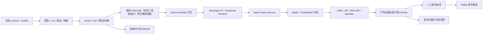

# 阶段 5：发布工程与交付开发架构设计

- 文档状态：待评审
- 所属阶段：阶段 5（发布工程与交付）
- 更新日期：2026-09-04
- 上位方案：`docs/Agent Client完整技术解决方案.md`
- 前置阶段：[阶段 4.7.0：Runtime（运行时）独立化](阶段4.7.0-Runtime独立化开发架构设计.md)
- 配套测试：`docs/阶段方案/阶段5-发布工程与交付测试用例.md`
- 平台决策：`docs/设计文档/ADR/0005-阶段1技术选型.md`

## 1. 文档目的

本文档定义第一稳定版 Agent Client 的版本、构建、打包、签名、公证、安装、受控升级、数据库备份与恢复、回滚、发布物、安全供应链和交付文档方案。

阶段 5 不再开发产品功能。输入是阶段 1～4.7.0 功能和数据升级测试通过的独立服务、CLI（命令行）与 Electron（桌面）代码；阶段 5 负责建立并冻结 Release Candidate，输出可验证、可安装、可升级、可诊断和可回滚的 macOS 稳定版。

### 1.1 阶段 4.7.0 带来的发布增量

本阶段同时验收服务 npm（Node 包分发）包与 Electron（桌面）安装包；服务包包含 CLI（命令行），不包含 Electron/React 或用户数据。桌面复用同一服务产物和独立 Node.js 资源。详细包结构与兼容范围以 [4.7.0 方案第 15 节](阶段4.7.0-Runtime独立化开发架构设计.md#15-npm-与桌面交付设计)为准。

新增发布门禁：从安装包实际安装并独立启动；CLI/桌面同时连接；关闭桌面后任务继续；服务升级前确认旧实例退出；数据库、附件、技能、默认记忆与凭据引用迁移完整。新服务不能依赖临时 npm 缓存或被覆盖的桌面安装目录。Web（浏览器）和手机应用不属于本阶段发布物。

## 2. 阶段目标与边界

### 2.1 阶段目标

1. 形成可重复的 macOS arm64/x64 正式构建和可追溯发布产物。
2. 完成 Developer ID 签名、Hardened Runtime、公证和 staple。
3. 完成 DMG 安装包与 ZIP 归档包，明确安装和卸载行为。
4. 建立 SemVer、应用/数据库兼容范围和稳定发布渠道。
5. 完成受控覆盖升级、升级前备份、失败恢复和回滚预案。
6. 完成全新安装、覆盖升级、异常升级和真实设备检查。
7. 完成许可证、隐私提示、诊断说明、用户指南、已知问题和发布检查表。
8. 确保签名密钥、Provider Credential 和用户数据不进入构建产物或日志。

### 2.2 首发决策

- 首发操作系统：macOS。
- 架构：`arm64` 和 `x64` 分架构产物；是否额外生成 universal 包由体积和原生模块验证结果决定，不作为首发阻断。
- 分发：Developer ID 签名、公证的 DMG；ZIP 用于受控归档/替换，不作为默认用户入口。
- 渠道：第一版只有 `stable`。
- 更新：V1 采用受控手工覆盖升级，不引入后台自动更新或静默下载安装。
- 数据：升级前自动创建一致性备份；不执行破坏性 down migration。
- 卸载：移除 `.app` 不自动删除用户 SQLite、附件、Skill、外部 MCP 数据和 Keychain；完整数据清理通过明确说明或应用内受控操作完成。

### 2.3 本阶段明确不实现

- Windows/Linux 包、Mac App Store、企业 MDM 和多渠道灰度。
- 后台自动更新、强制更新、差分包和静默安装。
- 新 Runtime、UI、Provider、Skill 或业务功能。
- 自动降级数据库或在用户不知情时删除数据/Keychain。
- 自建代码签名、证书或更新签名基础设施。

## 3. 发布架构

### 3.1 总体流程



### 3.2 组件职责

| 组件                | 职责                                           | 禁止事项                                 |
| ------------------- | ---------------------------------------------- | ---------------------------------------- |
| Release CI          | 校验、构建、签名、公证、产物与证据             | 输出证书/API 密钥、使用未锁依赖          |
| electron-builder    | macOS bundle、DMG/ZIP、asar 与原生模块         | 隐式下载运行时代码、遗漏 Worker/原生模块 |
| Release Manifest    | 版本、架构、hash、大小、DB 范围、来源 commit   | 包含 secret 或用户数据                   |
| Upgrade Coordinator | 启动兼容检查、备份、migration、恢复提示        | 静默破坏性降级                           |
| Backup Service      | WAL checkpoint、一致性 DB 备份、manifest、保留 | 备份 Credential 明文                     |
| Diagnostic Export   | 用户确认后的脱敏支持包                         | 默认导出会话正文/Prompt/Tool Result      |
| Release Owner       | 双人批准、渠道发布、回滚决策                   | 绕过阻断检查                             |

## 4. 功能模块总览

| 编号 | 模块               | 阶段 5 交付                                    |
| ---- | ------------------ | ---------------------------------------------- |
| M01  | 版本与兼容策略     | SemVer、build metadata、DB/Client 支持范围     |
| M02  | macOS 构建与打包   | arm64/x64、asar、资源、DMG/ZIP                 |
| M03  | 签名与公证         | entitlements、Hardened Runtime、notary、staple |
| M04  | 发布 CI 与供应链   | secret、锁依赖、hash、SBOM、许可证、证据       |
| M05  | 安装、升级与备份   | 全新安装、覆盖升级、启动协调和备份保留         |
| M06  | 回滚与异常恢复     | 应用回滚、DB 备份恢复、兼容拒绝和支持流程      |
| M07  | 卸载与数据生命周期 | 应用、用户数据、Keychain 的明确独立策略        |
| M08  | 诊断、文档与交付   | 用户指南、隐私、诊断、已知问题、检查表         |
| M09  | 发布批准与应急     | Go/No-Go、撤回、回滚触发和沟通模板             |

## 5. 模块详细设计

### 5.1 M01 版本与兼容策略

应用使用 SemVer：

- `MAJOR`：用户数据/产品契约不兼容的大版本。
- `MINOR`：向后兼容功能版本。
- `PATCH`：兼容修复和安全更新。

正式显示版本为 `appVersion + buildNumber + gitCommit`。每个产物 Manifest 包含：productName、appId、version、buildNumber、commit、构建时间、Electron/Node 版本、架构、artifact hash/size、最低 macOS、包含的 DB migration、可读取 DB schema 范围和发布渠道。

启动时先读取轻量 DB schema 元数据：

- 低于最小版本：进入 Upgrade Coordinator。
- 在支持范围：正常启动。
- 高于当前应用可读上限：拒绝用旧应用打开，提示选择正确版本或恢复对应备份。
- checksum 异常：停止启动并提供诊断，不擅自重写。

### 5.2 M02 macOS 构建与打包

#### 产物

```text
Agent-Harness-<version>-mac-arm64.dmg
Agent-Harness-<version>-mac-arm64.zip
Agent-Harness-<version>-mac-x64.dmg
Agent-Harness-<version>-mac-x64.zip
checksums.txt
release-manifest.json
THIRD_PARTY_NOTICES.txt
sbom.spdx.json
```

#### Bundle 要求

- `dist/main`（桌面主进程）、`dist/preload`（安全桥）、`dist/renderer`（界面）与独立服务的 `dist/host`（宿主和服务线程）、`dist/cli`（命令行）全部来自同一 commit（提交）。
- `better-sqlite3` 按独立服务 Node.js 的 ABI（应用二进制接口）和目标架构构建，放入服务独立依赖目录；Electron 主进程不加载此模块，桌面构建不得把服务模块重建成 Electron ABI。
- macOS arm64 产物把固定 Node.js 24.20.0 与 CPython 3.13.15 Runtime Pack 放入 `Contents/Resources/runtimes/darwin-arm64`；下载双源、官方摘要、manifest、版本和 Mach-O 架构全部进入构建证据。
- Runtime Pack 不进入 ASAR，不从移动版本地址下载，不包含用户依赖环境；Node、Python、动态库和扩展模块与 `.app` 一起签名、公证。
- 应用图标、Info.plist、版本、隐私用途描述和 entitlements 明确配置。
- source map 不默认打入公开包；如用于错误定位，单独受控保存并按版本索引。
- 不打包测试 Fixture、开发 Credential、`.env`、用户数据、参考 UI 源码和无关文档。
- 构建环境执行洁净安装并校验 lockfile，不从开发机 `node_modules` 直接封包。

### 5.3 M03 签名与公证

- 使用 Apple Developer ID Application 证书签署应用内所有可执行代码、Helper、Worker 依赖和原生模块。
- 启用 Hardened Runtime，只授予实际需要的 entitlements；禁用不必要的 JIT、调试、动态库例外。
- 上传 Apple Notary Service，等待成功结果；失败保存脱敏日志并阻断发布。
- 对 `.app`/DMG staple，执行 `codesign --verify --deep --strict`、`spctl --assess` 和 Gatekeeper 干净机验证。
- 签名证书和 App Store Connect API 凭据只存在 CI secret store；日志屏蔽值，Fork/不受信构建不可访问。

### 5.4 M04 发布 CI 与供应链

发布仅由受保护 tag `vX.Y.Z` 触发。流水线：校验 tag/package version → clean install → 全量质量门禁 → 双架构构建 → 原生模块检查 → 签名/公证 → 计算 hash → SBOM/许可证 → 干净机 smoke → 人工批准 → 发布。

质量证据至少保留：commit、lockfile hash、构建 runner image、命令、测试报告、签名 identity 摘要、公证 request ID、artifact hash、安装/升级结果和批准人。产物一经发布不可原地替换；修复发布新 patch version。

### 5.5 M05 安装、升级与备份

#### 全新安装

用户打开公证 DMG → 拖入 Applications → 首次启动 Gatekeeper 通过 → 创建应用数据目录 → SQLite migration/双用户 seed → 校验应用内置资源和 MCP 配置能力 → Keychain 在首次保存 Credential 时授权。首次启动不要求联网，除非用户主动配置模型或远程 MCP。

#### 受控覆盖升级

1. 用户退出旧版本并下载官方新 DMG。
2. 用新 `.app` 覆盖旧应用。
3. 新版本启动读取 DB schema 和磁盘空间。
4. 请求旧 Worker/SQLite 正常关闭，执行 WAL checkpoint。
5. 复制数据库到 `backups/<oldVersion>-<timestamp>/`，写 backup manifest 和 SHA-256。
6. 在事务/明确步骤内执行 migration。
7. 执行 `integrity_check`、`foreign_key_check`、关键 Repository Smoke 和 Projection checkpoint 校验。
8. 成功后启动 Runtime；失败则停止并展示恢复路径，不用半迁移数据库继续运行。

备份默认保留最近 3 个成功升级点，并受总大小上限控制；清理前不得删除当前版本唯一可用的回滚点。附件、受管 Skill 和 Client 管理的 MCP 配置使用稳定路径，备份 Manifest 记录其引用、digest 和是否纳入本次备份；外部 MCP 数据由对应 Server 按自己的备份能力负责，Client 不复制未知数据格式。Keychain secret 不复制，MCP env/header 与模型/Skill Credential 的原 ref 在同一 macOS 账号继续有效。

### 5.6 M06 回滚与异常恢复

回滚分两类：

- **应用回滚且 DB 仍兼容**：安装旧 `.app`，启动兼容检查通过后直接运行。
- **DB 已向前迁移且旧应用不兼容**：退出应用，保留失败后现库副本，验证备份 hash，将对应升级前 DB 恢复到正式路径，再安装旧 `.app`。

禁止旧应用直接尝试读取超出支持范围的 DB，也禁止自动执行 down migration。恢复操作必须记录来源版本、目标版本、备份 hash、原数据库留存位置和结果。若备份也损坏，停止自动操作并生成不含正文的诊断信息供支持处理。

### 5.7 M07 卸载与数据生命周期

macOS 删除 `.app` 只卸载应用二进制，默认保留：

- SQLite/WAL、附件、Skills、MCP 配置、日志、缓存和备份；外部 MCP 数据只记录其配置和数据归属说明。
- Keychain 中按应用/user namespace 保存的 Credential。

用户文档必须明确区分“卸载应用”和“彻底删除本地数据”。彻底删除属于破坏性操作：在应用内二次确认、显示范围、要求所有 Worker/数据库关闭，然后删除精确应用数据根并逐项删除本应用 Keychain namespace；不可使用宽泛路径或通配 key。阶段 5 若不提供应用内入口，则交付经验证的人工清理文档，不提供危险脚本。

### 5.8 M08 诊断、文档与交付

交付文档：

- 快速开始、模型配置、Skill 导入/授权、MCP Server/Tool 审核、长期记忆、双用户与会话使用。
- 安装、升级、回滚、卸载和彻底清理。
- 数据位置、备份、Credential/Keychain 和隐私说明。
- 诊断导出、常见错误、无默认模型、解释器缺失和恢复流程。
- 支持的 macOS/架构/Provider/Skill 范围。
- 已知问题、限制、开源许可证和第三方声明。

诊断包沿用既有日志、Bridge 和 Credential 脱敏规则，并由阶段 5 冻结发布诊断范围。用户指南不得声称 Skill 脚本运行在安全沙箱，也不得把两个内置用户描述为不同操作系统账号之间的强隔离。

### 5.9 M09 发布批准与应急

Go/No-Go 至少由发布负责人和技术负责人双人确认。以下任一条件 No-Go：

- artifact hash/sign/notary/Gatekeeper 失败。
- 阶段 1～5 P0/P1 失败或存在 Blocker/Critical。
- 全新安装、覆盖升级、回滚或 DB 恢复未通过。
- secret/用户数据进入产物、日志、诊断或 CI artifact。
- Release Manifest、许可证、隐私或已知问题不完整。

发布后如发现 Blocker：停止分发 → 保留原产物/证据 → 发布安全告知和绕行 → 决定撤回、patch 或回滚 → 不原地替换同版本文件。

## 6. 发布配置要求

### 6.1 electron-builder

阶段 5 将当前 `mac.target: dir` 扩展为 `dmg` 和 `zip`，分别构建 `arm64`/`x64`。`appId` 发布后不可随意变化，否则 Keychain namespace、数据目录和系统权限行为会改变。

### 6.2 Entitlements 最小化

只启用 Electron/签名运行实际需要的权限。应用内 Node/Python 与宿主 Shell 都是用户主动触发的外部进程，不通过放宽 Renderer sandbox 或通用 dynamic library entitlement 实现；Runtime Pack 的嵌套 Mach-O 必须使用同一发布身份签名。

### 6.3 环境变量

构建与公证变量使用发布前缀并只在 CI secret context 提供。应用运行时不依赖开发 `.env`。CI 在输出前注册脱敏并禁止执行会打印完整环境的调试命令。

## 7. 核心发布流程

### 7.1 候选生成

阶段 1～4.7.0 功能基线 → 版本/锁文件校验 → 全量测试 → 创建阶段 5 RC tag → 双架构生产构建 → 签名/公证/staple → hash/manifest/SBOM → 干净机验证 → 生成候选发布记录。

### 7.2 升级失败

```text
启动新版本
→ 创建并校验升级前备份
→ migration 失败
→ 当前进程停止，不启动 Runtime
→ 保留失败数据库副本与脱敏日志
→ 验证备份 hash
→ 引导恢复备份或联系支持
→ 恢复后使用兼容应用版本启动
```

### 7.3 发布与撤回

双人批准 → 上传不可变产物及 checksums → 发布版本说明/已知问题 → 验证公开下载 hash 和 Gatekeeper → 观察首批反馈。撤回只停止新下载并发布说明，不删除审计证据或覆盖同名产物。

## 8. 数据与安全边界

- 签名、公证和发布 Credential 不进入仓库、应用包或普通 CI 日志。
- Provider/Skill/MCP Credential 不参与构建，不进入迁移备份。
- Release artifact 不包含本地数据库、WAL、日志、缓存、附件、用户 Skills、MCP 用户配置、Credential 或任何用户记忆数据；随包包含固定版本的官方 Memory MCP 可执行资源，但不包含其运行后 JSONL，也不自动安装其他外部 MCP。
- 升级备份目录权限仅当前 macOS 用户可读；备份不上传。
- 诊断导出必须经用户明确操作和内容确认。
- 安装包与 release manifest 通过 SHA-256 关联；下载后可独立验证。
- 不允许未签名插件、远程脚本或更新包改变应用代码。

## 9. 实施顺序

1. M01 版本/兼容范围和 M04 发布 CI 骨架。
2. M02 双架构打包和原生模块验证。
3. M03 签名、公证、staple 和干净机 Gatekeeper。
4. M05 升级备份、M06 回滚恢复、M07 卸载数据策略。
5. M08 文档/SBOM/许可证/诊断，M09 发布批准演练。
6. 最终全量测试、候选签署和 stable 发布。

## 10. 阶段验收标准

- arm64/x64 DMG/ZIP 从冻结 commit 可重复生成，文件结构和 hash 可追踪。
- `.app`、Helper、原生模块和 DMG 签名有效，公证成功并 staple，干净机 Gatekeeper 通过。
- 全新安装、首次启动、覆盖升级、升级失败恢复、应用/DB 回滚和卸载说明通过验证。
- 已发布的用户数据、Credential ref、附件、Skill、MCP 配置/Tool 审核状态和外部 MCP 数据归属在支持升级路径中保持一致；不改写外部 Server 的私有数据。
- 旧应用面对超前 DB 明确拒绝，不尝试破坏性降级。
- CI/产物/日志/SBOM/诊断无签名 secret、Provider secret 或用户数据。
- 阶段 1～5 全量 P0/P1 通过，无 Blocker/Critical。
- Release Manifest、checksums、许可证、隐私、用户指南、已知问题、回滚和检查表齐全。

## 11. 阶段内需确认的 ADR

1. arm64/x64 分包与 optional universal 包的最终选择。
2. 最低支持 macOS 和 Electron 对应系统范围。
3. Developer ID/notary CI 服务和 secret 管理方式。
4. 升级备份保留数量、总大小和用户可见管理方式。
5. V1 受控手工更新后的未来自动更新演进接口，但不在本阶段实现。

## 12. 最终交付清单

- 签名、公证、staple 的 arm64/x64 DMG 与 ZIP。
- `checksums.txt`、`release-manifest.json`、SBOM、许可证与第三方声明。
- 全新安装、升级、回滚、卸载、数据清理和诊断文档。
- 正式支持范围、产物安全扫描、升级与恢复验证报告。
- 发布检查表、批准记录、已知问题和应急撤回预案。
- 与产物完全对应的源码 tag、lockfile 和 CI 构建证据。
